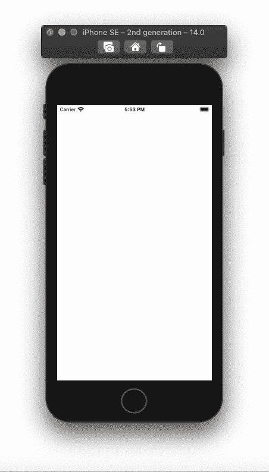
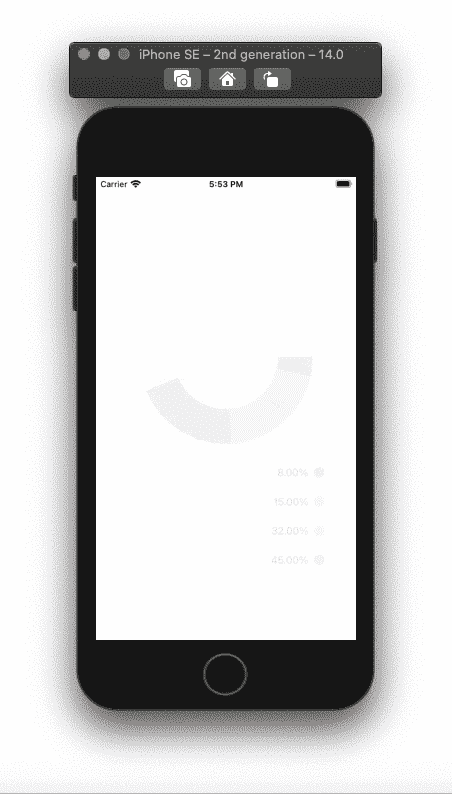

# 在 SwiftUI 中构建动画饼图和圆环图

> 原文：<https://betterprogramming.pub/build-animated-pie-and-donut-charts-in-swiftui-9b74b95f8b39>

## 创建饼图和甜甜圈切片并制作动画


SwiftUI 中的饼图和圆环图

要开始创建形状并制作动画，我们首先需要从构建图表所需的数据开始。

# 图表数据

为图表数据创建一个`struct`。我们需要的数据是百分比、颜色和当前百分比之前的百分比总和。当我们使用修饰符`.trim`从最后一个百分比值开始修剪时，我们将需要总和。

现在，我们需要创建一个可观察的对象。添加图表数据的已发布数组，并用数据填充它。测试时确保你的百分比加起来是 100。将所有图表数据的值赋为 0。我们希望当值从 0 变化到它将具有的任何值时，饼图切片能够显示动画。

示例:

```
ChartData(color: Color.red, percent: 8, **value: 0**)
```

在该类中，创建一个函数，为我们计算数组中以前的百分比。如果您不希望图表是动画，创建一个运行我们的`calc()`函数的`init()`。

# 圆形分格统计图表

添加一个`ChatDataContainer`类型的观察对象变量，然后遍历它的数组。对于饼图切片，我们将在一个`ZStack`内堆叠圆圈。对图表数据值使用`.trim()`修饰符。这些值将决定每次修剪的起点和终点。将聊天数据值除以 100，因为`trim()`修饰符只适用于 0.0 到 1.0 之间的值。

为了让动画效果更好，我们需要一个`stroke()`而不是一个`fill()`修改器。您可以在两者之间切换，以查看不同之处。描边的线条宽度需要与饼图的宽度相匹配。下面，饼图宽度为 100，线条宽度为 100。

为了在视图出现在屏幕上时开始动画，我们可以使用`.onAppear()`修改器并让`calc()`函数在其中运行。您还可以给饼图扇区添加缩放效果。当我们的变量`indexOfTappedSlice`改变时，比例效果将被激活。

我们将在我们的`VStack`中添加另一个`ForEach`循环，以添加一个包含颜色和百分比的描述。您可以添加更多的文本元素来解释您的图表。在`Text`视图中，添加`onTapGesture()`修饰符，它将把我们的`indexOfTappedSlice`值更改为点击文本的索引，或者当文本被点击两次时为-1。

最后，您可以将`PieChart`添加到您的`ContentView`中并运行应用程序。



# 圆环图

圆环形状要求您更改以下内容:

*   框架宽度从 100 到 200。
*   框架高度从 200 到 250。
*   线宽从 100 到 50。
*   添加`onTapGesture()`修改器。

像我们对饼图所做的那样，在`VStack`中添加描述循环。

最后，在我们的`ContentView`中添加`DonutChart`视图并运行应用程序。



全部完成！感谢阅读。