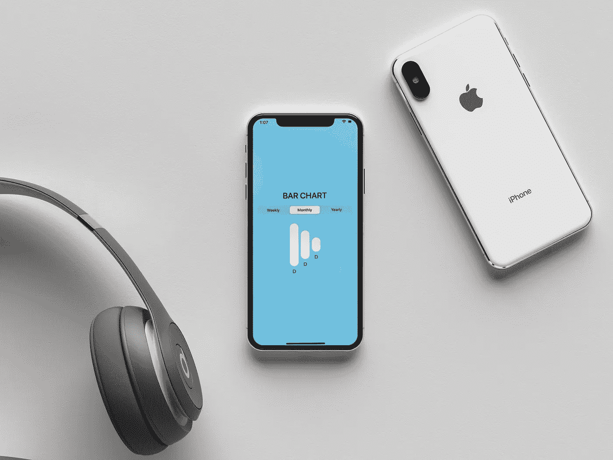
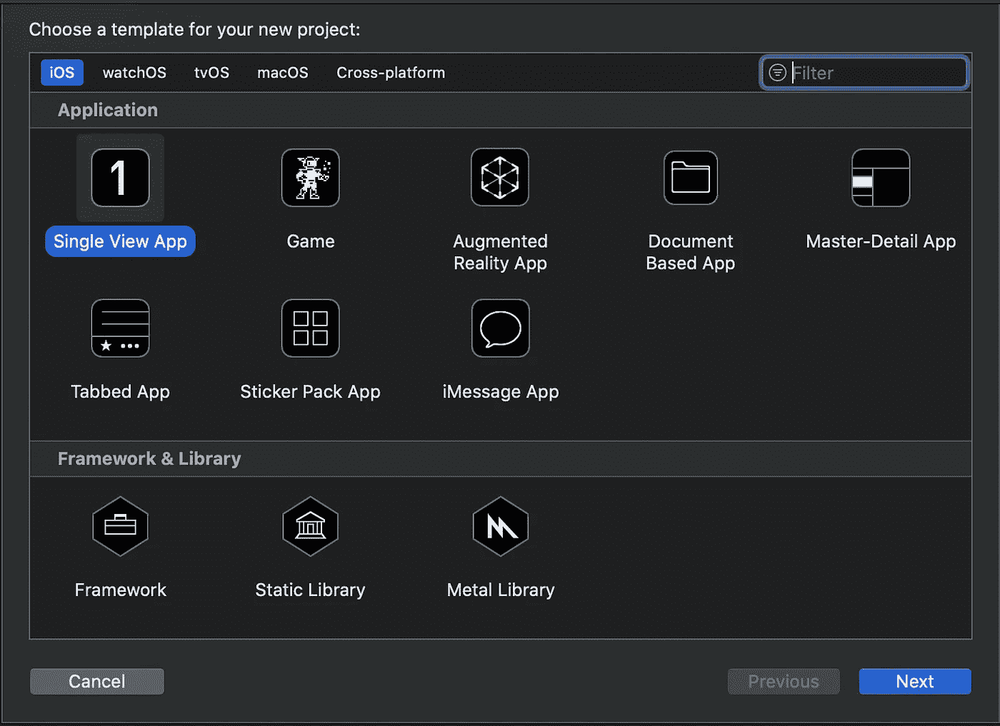
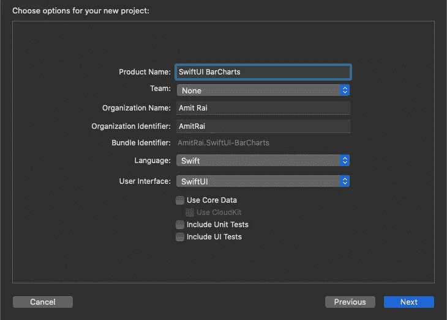
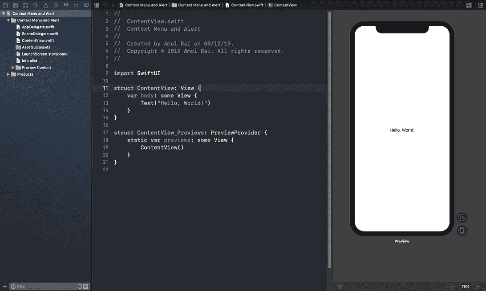
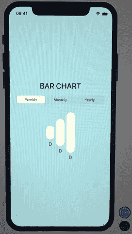

# 在 SwiftUI 中构建条形图

> 原文：<https://betterprogramming.pub/build-bar-charts-in-swiftui-372322eea420>

## 只有几行代码的漂亮的条形图



由[样机](https://mockuper.net)生成的样机

[SwiftUI](https://developer.apple.com/xcode/swiftui/) 是一种创新的、极其简单的方式，利用 Swift 的力量在所有苹果平台上构建用户界面。只使用一套工具和 API 为任何苹果设备构建用户界面。

SwiftUI 具有易于阅读和自然书写的声明性 Swift 语法，可与新的 Xcode 设计工具无缝协作，使您的代码和设计完美同步。

SwiftUI 使用声明性语法，因此您可以简单地说明您的用户界面应该做什么。您的第一行 SwiftUI 代码已经是您编写过的最强大的 UI 代码。

这篇文章旨在用 SwiftUI 构建条形图。我们将使用分段选择器视图来绑定不同的条形图形状。

> ***如果你正在准备你的技术编码面试，或者你想学习递归来提高你解决问题的技能，那么你应该查看这个 udemy 课程*** [**递归大师班，从 C++**](https://www.udemy.com/course/master-the-recursion-from-beginner-to-advance-level/?referralCode=75F57675BDABF6D104C0) ***的初级到高级水平，或者你可以在***[***Skillshare***](https://skl.sh/3PTOCns)***上查看这个递归课程。***
> 
> **如果你想从初学者到专家水平学习 ARKit 3，那么点击** [**这里**](https://www.udemy.com/course/ios-13-swift-5-the-complete-arkit-3-course/?couponCode=FORCREATOR) **获得课程，你还将获得 97%的折扣。**
> 
> **如果你对学习 iOS 移动开发充满热情，并希望将你的 iOS 开发技能提升到一个新的水平，那么使用 CloudKit framework 的核心数据应该是你的首选。点击** [**此处**](https://www.udemy.com/course/mastering-coredata-with-cloudkit-in-swift-5-for-ios/?couponCode=FORDEVS) **获取课程，您还将获得 97%的折扣。**
> 
> **从头开始学习 SwiftUI 点击** [**此处**](https://www.udemy.com/course/swiftui-the-complete-course-building-real-world-apps/?couponCode=FORCODERS) **获取课程，因为在本课程中，我们将使用 SwiftUI 构建许多应用，如脸书克隆、新闻应用、笔记应用等等。**

# 入门指南

打开 [Xcode，](https://developer.apple.com/xcode/)创建一个新的 Xcode 项目。在 iOS 模板部分选择单视图应用程序，然后单击下一步。



输入您的产品名称，并选择 SwiftUI 作为用户界面。单击下一步，并在桌面上创建它。

这是你完成设置后看到的。



默认情况下，SwiftUI 视图文件声明两个结构。第一个结构符合`View`协议，描述了视图的内容和布局。第二个结构声明了该视图的预览。

在 SwiftUI 中实现条形图之前，我们先来看看什么是属性包装器。

## 什么是状态属性包装？

SwiftUI 使用`@State`属性包装器来允许我们修改结构内部的值，这通常是不允许的，因为结构是值类型。当我们将`@State`放在一个属性之前时，我们有效地将其存储从我们的结构中移出，并移入由 SwiftUI 管理的共享存储。

这意味着 SwiftUI 可以在任何需要的时候销毁和重新创建我们的结构(这可能会经常发生),而不会丢失它所存储的状态。

# 履行

首先按 Command+N 创建一个新的 SwiftUI `View`文件。调用文件`BarView`，并将下面的代码粘贴到`BarView.`

```
**struct** BarView: View {**var** value: CGFloat = 0
**var** week: String = ""**var** body: **some** View {VStack {ZStack(alignment: .bottom) {Capsule().frame(width: 30, height: value).foregroundColor(Color( colorLiteral(red: 0.6666070223, green: 0.6667048931, blue: 0.6665855646, alpha: 1)))Capsule().frame(width: 30, height: value)
.foregroundColor(Color(.white))
}Text(week) }
  }
}
```

在上面的代码中，我们有两个变量:`value`和`week`。第一个变量跟踪`Capsule()`的高度，第二个变量显示星期。

然后我们构建了一个`VStack`来添加一个垂直的视图。然后，我们有一个`ZStack` ——一个覆盖其子视图的视图，在两个轴上对齐它们。在`ZStack`中，我们有两个胶囊(一个`Capsule()`是一个`struct`，其形状与包含它的视图的框架对齐)来显示条形图。

回到你的`contentview .swift`文件，粘贴下面的代码。

```
**struct** ContentView: View {@State **private** **var** pickerSelectedItem = 0
@State **private** **var** dataPoints: [[CGFloat]] = [[50, 100, 150],
[150, 100, 50],
[100, 50, 150]]**var** body: **some** View {ZStack {Color.blue.edgesIgnoringSafeArea(.all)VStack {Text("BAR CHART").font(.system(size: 28))
.fontWeight(.medium)Picker(selection: $pickerSelectedItem, label: Text("")) {Text("Weekly").tag(0)
Text("Monthly").tag(1)
Text("Yearly").tag(2)}.pickerStyle(SegmentedPickerStyle())
.padding(.horizontal, 24)HStack(spacing: 8) {BarView(value: dataPoints[pickerSelectedItem][0], week: "D")
BarView(value: dataPoints[pickerSelectedItem][1], week: "D")
BarView(value: dataPoints[pickerSelectedItem][2], week: "D")}.padding(.top, 24)
.animation(.default) }
    }
  }
}**struct** ContentView_Previews: PreviewProvider {**static** **var** previews: **some** View {ContentView() }
}
```

在上面的代码中，我们有两个`@State`变量:`pickerSelectedItem`和`dataPoints`。利用这些变量，我们调整了条形图。

然后我们在`ZStack`里面建一个`ZStack`，在那里我们有一个`VStack`。在`VStack`中，我们设置了`Text`、`Picker`、`BarView`，以及`BarView.`上的一些默认动画

# 构建并运行



最终的结果看起来是这样的

# 结论

这件作品到此为止。我希望你喜欢这篇文章，并且你已经学会了如何在 SwiftUI 中构建动画条形图。

> ***如果你正在准备你的技术编码面试，或者你想学习递归来提高你解决问题的技能，那么你应该查看这个 udemy 课程*** [**递归大师班，从 C++**](https://www.udemy.com/course/master-the-recursion-from-beginner-to-advance-level/?referralCode=75F57675BDABF6D104C0) ***的初级到高级水平，或者你可以在***[***Skillshare***](https://skl.sh/3PTOCns)***上查看这个递归课程。***

# 额外资源

> **如果你想从初学者到专家水平学习 ARKit 3，那么点击** [**这里**](https://www.udemy.com/course/ios-13-swift-5-the-complete-arkit-3-course/?couponCode=FORCREATOR) **获得课程，你还将获得 97%的折扣。**
> 
> **如果你对学习 iOS 移动开发充满热情，并希望将你的 iOS 开发技能提升到一个新的水平，那么使用 CloudKit framework 的核心数据应该是你的首选。点击** [**此处**](https://www.udemy.com/course/mastering-coredata-with-cloudkit-in-swift-5-for-ios/?couponCode=FORDEVS) **获取课程，你还将获得 97%的折扣。**
> 
> **从头开始学习 SwiftUI 点击** [**此处**](https://www.udemy.com/course/swiftui-the-complete-course-building-real-world-apps/?couponCode=FORCODERS) **获取课程，因为在本课程中，我们将使用 SwiftUI 构建许多应用，如脸书克隆、新闻应用、笔记应用等等。**