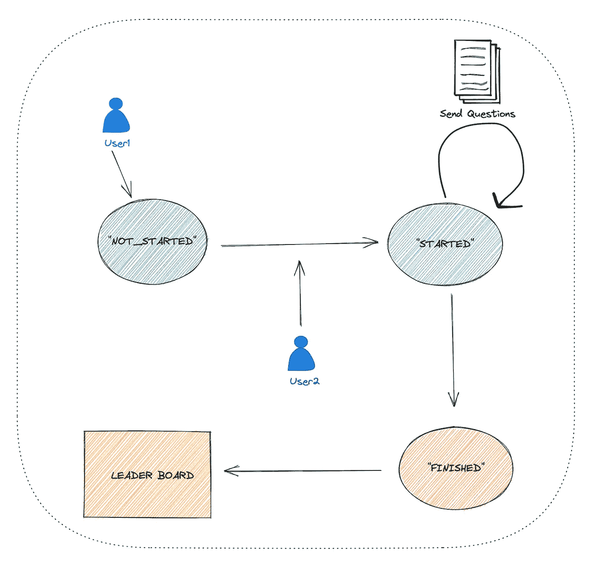
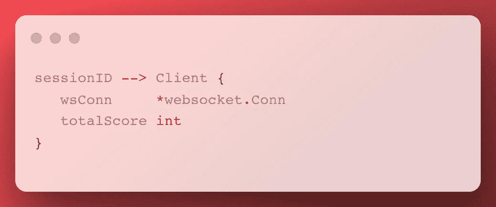
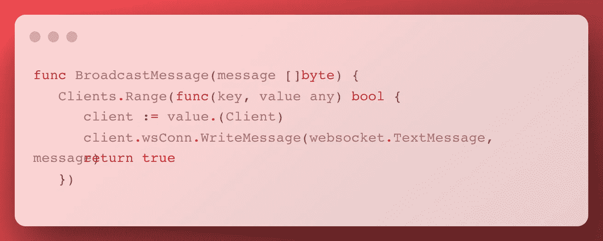
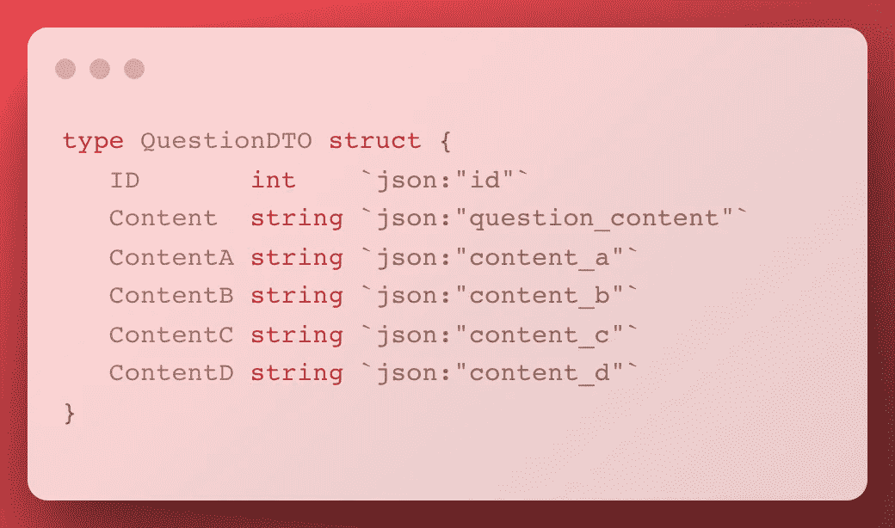

# 用 Go 构建一个基本的实时比赛 App

> 原文：<https://betterprogramming.pub/build-basic-real-time-competition-app-with-go-96c2ca0d35bf>

## 端到端实施

照片由 [Dimon Blr](https://unsplash.com/@dimonblr?utm_source=medium&utm_medium=referral) 在 [Unsplash](https://unsplash.com?utm_source=medium&utm_medium=referral) 上拍摄

我们大多数人都喜欢知识竞赛，对吗？通过让我们回答来自不同职业的问题，有许多应用程序可以解渴。

在这篇文章中，我将解释我是如何用 Golang 实现一个实时比赛 app 的。

# **申请流程**

图:架构流程

需要遵循一些商业规则。

*   当连接用户数达到两个时，比赛将在 3 秒内自动开始**。**
*   我们的比赛有三个州。这些是`**NOT_STARTED**`、`**STARTED**`、`**FINISHED**`。
*   问题有四个选项，用户必须在 10 秒内回答一个问题**。**
*   比赛结束后，排行榜会显示给用户看比赛结果。

# **我的架构决策**

在这一部分，我将试着解释为什么我做了一些决定，并试着在我们开始之前对我们的项目提出一些观点。这部分会像电影剧透一样。🎥

*   [**Websocket**](https://datatracker.ietf.org/doc/html/rfc6455) 是实现实时应用的必备协议。它提供了客户端和服务器之间的双向通信。有很多技术文章介绍它的概念，我就不赘述了。我用它来发送问题，并获得连接用户的答案。
*   我为每个连接的用户使用一个唯一的 id(比如 session-id)。这样做，我可以很容易区分用户。在我们的例子中，我们存储用户及其会话 id，服务器使用它们管理读写操作。
*   为了支持并发读写操作，我使用了`[sync.Map](https://pkg.go.dev/sync)`。我使用 sessionID 作为键，使用 Client struct 作为值，如下所示。客户端结构由两个字段组成:一个用于读写的客户端`WebSocket`连接和一个用于计算排行榜的总得分。

图:客户端地图模型

*   [广播](https://en.wikipedia.org/wiki/Broadcasting_(networking)#:~:text=In%20computer%20networking%2C%20broadcasting%20refers,limited%20to%20a%20broadcast%20domain.)是一个专用术语，表示同时向所有接收者传递消息的方法。可惜[大猩猩/websocket](https://github.com/gorilla/websocket) 中没有广播方法；因此，我们将使用我们的自定义广播方法向所有用户发送消息。

图:广播方法

*   为了向我们的用户发送问题，我们需要定义一个模型。在我们的应用程序中，我不想使用`Question`结构，因为它有`correct_answer`字段。我想对连接的用户隐藏这些信息，所以我创建了另一个名为`[QuestionDTO](https://martinfowler.com/eaaCatalog/dataTransferObject.html)`的模型，如下所示。

图:质疑 DTO

# 竞争流程

我曾经用`RunCompetition()`的方法管理过比赛流程，如下图所示。

我通过创建一个 goroutine 在应用程序的主流程中调用这个函数。

图:比赛流程

`RunCompetition()`方法中有三个`CompetitionState`。

*   `**CompetitionNotStartedState**`:要开始比赛，必须有两个用户。当`numberOfClients`等于 2 时，状态变为`CompetitionStartedState`。
*   `**CompetitionStartedState**`:在这种状态下，我们每 10 秒向所有连接的用户发送一次问题。

当发送问题时，我们将我们的问题结构转换为`questionDTO`以对连接的用户隐藏`correct_answer`来防止作弊。

10 秒钟后，我们将`IsTimeout`改为 true，因为给出问题的时间到了。

*   `CompetitionFinish` *:* 所有问题发出后，`CompetitionState`改为`CompetitionFinish`。当比赛结束时，我们必须创建并发送`LeaderBoard`给所有连接的用户。

# 处理客户端回答流

我们需要从用户那里得到答案来检查和计算他们的分数。

用户在规定的时间间隔内答对问题，可以获得一个分数(+10)。

这里有一些要点:

*   `IsTimeout` *:* 指定的时间间隔
*   *比较* `question.ID` *和* `ClientMsg.QuestionId` *:* 确定是否是被问问题
*   *比较* `ClientMsg.Answer` *和* `question.CorrectAnswer` *:* 判断用户是否给出正确答案。

满足这些条件后，使用`sessionID`将用户的分数存储在地图上。我们在我们的`ws()`方法中调用这个函数。

为了保持我们的应用程序简单，竞争将从两个用户开始。如果用户的数量大于两个，我们的应用程序将发送`http.StatusBadRequest`给用户。

# 源代码

[https://github.com/dilaragorum/real-time-competation-go](https://github.com/dilaragorum/real-time-competation-go)

感谢您的阅读。如果你想看我以前的文章，你可以在下面找到他们的链接。

*   [*让我们使用 Go*](/lets-build-a-movie-api-with-clean-architecture-ef1f555b563d) 构建一个具有分离分层架构的电影 API
*   [*GoLang 初学者单元测试教程*](https://medium.com/towardsdev/golang-beginner-unit-testing-tutorial-98d700d40679)