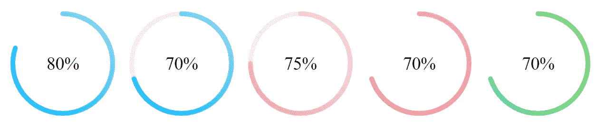

# 在 React 中创建漂亮的、支持渐变的圆形进度条

> 原文：<https://betterprogramming.pub/build-beautiful-gradient-enabled-circular-progress-bars-in-react-d0a746deed0>

## 进度条用渐变更好看，我们来建一个吧！



React 中漂亮的渐变进度条

让我们同意这一点——进度条看起来像没有渐变的老派。但是，创建一个带有渐变的圆形进度条可能会很棘手。因此，这里有一个包，让你更简单。

我知道 React 有很多圆形进度条，但我个人很难找到一个可以接受进度条颜色渐变的进度条，所以我决定创建一个。带有渐变的进度条看起来很漂亮。

# **安装**

为此，我们将使用一个名为`[react-gradient-progress](https://www.npmjs.com/package/react-gradient-progress)`的库。它是一个非常小的 React 组件，提供了支持渐变的圆形进度条组件。

```
$ npm i -s react-gradient-progress
```

# 使用

现在我们已经安装了这个包，让我们导入并使用它:

```
import {CircleProgress} from 'react-gradient-progress' <CircleProgress percentage={70} strokeWidth={8} secondaryColor="#f0f0f0" />
```

注意`percentage`是一个必需的属性。所有其他选项都是可选的。

# 小道具

*   `percentage` —数字(必填)
*   `width` —数量(默认为 200)
*   `strokeWidth` —数字(默认:5)
*   `primaryColor` —数组(默认:['#00BBFF '，' #92d7f1'])
*   `secondaryColor` —字符串(默认为:“透明”)
*   `fill` —字符串(默认为:“透明”)
*   `fontSize` —字符串(默认为:“30px”)
*   `fontColor` —字符串(默认为:“继承”)
*   `fontFamily` —字符串(默认为:“继承”)

# npm

[https://www.npmjs.com/package/react-gradient-progress](https://www.npmjs.com/package/react-gradient-progress)

这是我的第一个开源贡献。希望你们喜欢。谢谢！