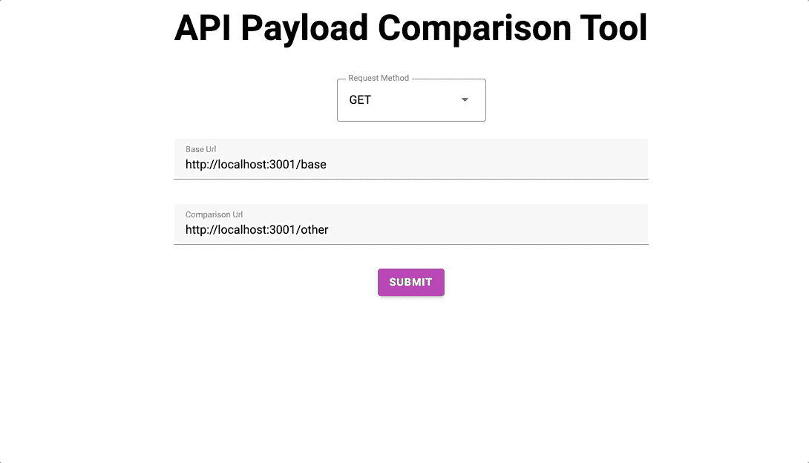
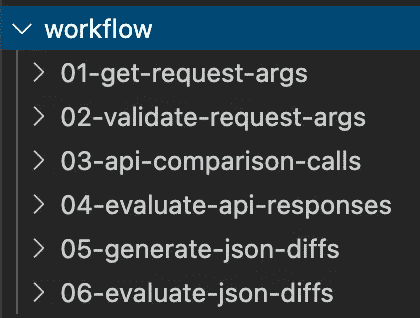
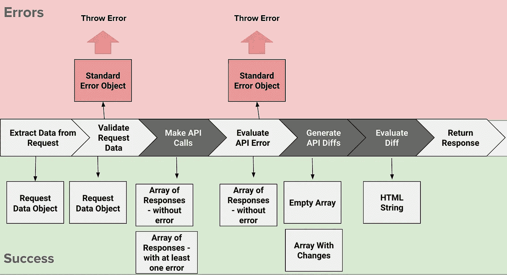
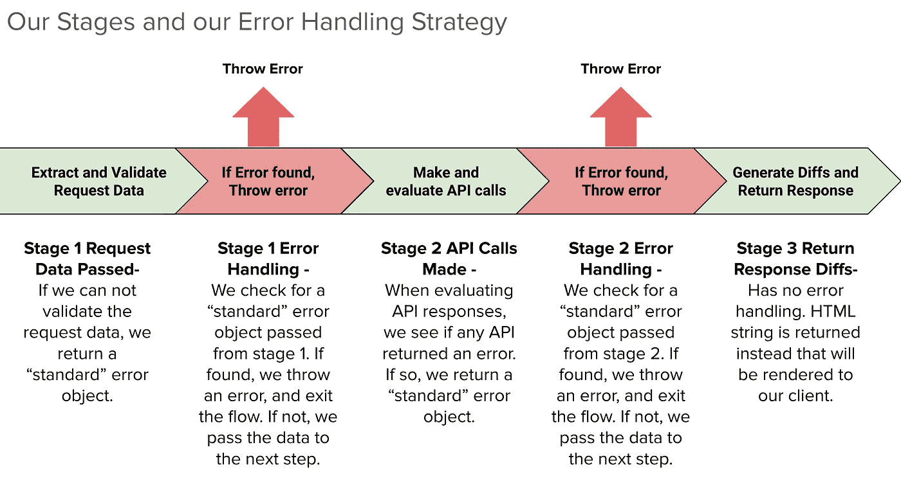

# 构建漂亮的 JavaScript APIs

> 原文：<https://betterprogramming.pub/build-beautiful-javascript-apis-15b4afd4b1ba>

## 使用函数式编程概念编写出色的 API

照片由[在](https://unsplash.com/@pinadventuremap?utm_source=medium&utm_medium=referral) [Unsplash](https://unsplash.com?utm_source=medium&utm_medium=referral) 上钉冒险地图

我最近写了一封[情书](https://medium.com/better-programming/write-delightful-declarative-javascript-a83c91111e12)，讲述如何利用函数式编程概念来编写更多的声明性代码。当我对这个话题了解得更多的时候，我注意到了一些奇怪的事情。我注意到缺乏将这些概念应用于 API 的内容。所以我开始了一段旅程，试图尽可能地编写最具声明性的 web API。

我对最终结果很满意，并想分享我的方法和一些经验教训。在本文中，我将向您介绍使我能够编写更具声明性的 API 的技术方法，并展示一些库来帮助我们。

在我们开始之前，让我们谈一谈我构建的项目。我将向你们展示最终的结果，这样我们就有了做出某些决定的背景。

# 快速浏览一下这个项目

对于我的项目，我想解决我在工作中遇到的一个棘手问题。我们将遗留 API 重写为 AWS Lambda，并希望确保新旧服务之间的一致响应。这是一个手动的比较过程。因此，我想构建一个工具，允许我们向两个端点发送相同的请求并比较响应。

这是我完成的工具的一个例子。

我的 API 比较工具正在使用中

**注意**:客户端是使用[苗条](https://svelte.dev/)“消失的框架”构建的。这真的是很酷的技术，我建议去看看。我期待看到它的生态系统走向成熟。

当构建这个 API 时，我有一些指导原则和我想使用的特性的愿望列表。这些是主要的。

*   尽可能多地以声明方式编写代码。
*   应该使用对承诺和异步/等待有内置支持的库。
*   如果适用，优先考虑新的库。
*   我想在服务器上使用最新的 JavaScript，包括导入。

由于这个项目的目的主要是学习和探索新技术，我做了一些新颖的决定，可能对你也有用。

让我们首先浏览我的最终代码，然后浏览帮助我编写这个声明性代码的库和概念。

# 从结尾开始

由[安东·舒瓦洛夫](https://unsplash.com/@a8ka?utm_source=medium&utm_medium=referral)在 [Unsplash](https://unsplash.com?utm_source=medium&utm_medium=referral) 拍摄

让我们看看服务的最终处理程序的代码。该处理程序负责以下工作:

*   从我们的客户那里接收关于我们两个请求的数据
*   向两个不同的端点发出相同的请求
*   比较返回的 API 响应的差异
*   为我们的回答中的差异生成 HTML
*   把它送回给我们的客户

下面是我们的主处理程序文件代码的样子。

我们最终的比较处理程序文件。

如您所见，它看起来可能与您过去见过的其他 API 有所不同。我想强调几件事:

*   我们有一个主函数和一些函数调用。我们这样做是为了帮助区分纯函数和不纯函数。
*   我们有一个函数，如果在流程中的预定点发现错误，它会抛出错误，而不是在我们的函数中抛出。我们将在后面解释为什么我们做出这个选择。
*   我们有两个使用`pipe`定义的函数。这有助于我们将功能链接在一起。没有参数显示为传递给这些函数，因为它们是隐式的。这些是无点函数。

接下来让我们看看我们的文件结构。我们有一个工作流文件夹，其中包含了组成每一步逻辑的所有功能。

我发现这种组织对于组织构成文件逻辑的构件非常有用。下面是我们评估 API 响应的一个 step 文件的修改示例。

下面是一个带有注释的简洁的 step 文件示例。

正如您所看到的，它们由更小的函数组成，我们将这些函数组合起来构建抽象。

现在我们已经看到了我们的最终状态，让我们来看看我们是如何配置我们的应用程序的。

# 配置我们的应用

照片由[费伦茨·阿尔马西](https://unsplash.com/@flowforfrank?utm_source=medium&utm_medium=referral)在 [Unsplash](https://unsplash.com?utm_source=medium&utm_medium=referral) 上拍摄

## 在服务器上使用现代 JavaScript

我的一个愿望是利用 JavaScript 最新最棒的特性。这主要是因为我讨厌护栏。

我研究了几种不同的方法来实现这一点。我利用 [Babel](https://babeljs.io/) 进行了评估，但是那需要我处理太多的配置和插件。结果，我最终采用了另一种方法， [TypeScript](https://www.typescriptlang.org/) 。

这种方法有很多好处。TypeScript 编译器允许我们通过它的编译器运行整个项目(包括普通的 JavaScript 文件),并获得 ES5 JavaScript。将来能够在我的应用程序中添加打字功能也是一个不错的选择。设置也非常简单。它涉及:

1.  将我的入口点改为一个`.ts`文件(尽管这不是必需的)。
2.  确保`allowJS`选项设置为`true`。这也允许我们通过编译器运行 JavaScript 文件。
3.  为我编译的服务器代码添加编译观察脚本和节点观察脚本。

这是我在这个项目中使用的`tsconfig`文件。

瞧——我们现在可以使用导入语句、可选链接等。世界现在是我们的了！

现在我们已经找到了编译 JS 的方法，让我们看看一些我认为有用的库。

## 语法优美的库

我的愿望清单中有一项是我想要支持声明性编码的库。这包括有一个干净的接口和支持的特性，比如 promises 和 async/await。经过一些研究，我偶然发现了一些我以前从未使用过的库，我现在很喜欢它们！

*   [**【Fastify(Express/Koa 替代)**](https://www.fastify.io/)**——**我选择这个主要是因为它内置了对承诺和异步/等待的支持，以及它令人敬畏的语法。另外，这是目前最快的节点 web 框架之一，估计比 Express 快 20%。肯定推荐。下面是帮助说服我的[文章](https://blog.logrocket.com/forget-express-js-opt-for-these-alternatives-instead/)。下面是我的服务器代码。****

****Fastify 有一个很棒的语法和智能默认值，可以使代码更加清晰。****

*   ****[**Superagent(Axios/fetch alternative**](https://visionmedia.github.io/superagent/#test-documentation)**)**—**看到语法就爱上了。它支持 async/await，并承诺。它的链接语法极大地增加了可读性。这个库没有大的配置选项。非常适合我的使用案例！******

******Superagent 链接正在运行。它的链接在不牺牲可读性的情况下考虑到了复杂性。******

*   ******[**Ramda**](https://ramdajs.com/)**——**Ramda 是 JavaScript 中最知名的函数式编程库之一。这个库最初是 Lodash T10 的一个分支，它将有助于使我们的逻辑尽可能具有可读性。它具有一些有用的特性，如自动套用、不变性和数据持续功能。这将在我们的项目中广泛使用。**********

******既然我们已经看了库，我想谈谈一些帮助我更好地组织代码和指导我的方法的设计原则。******

# ******设计可读的 API******

******当我开始构建 API 并迭代开发声明式 API 时，我遇到了许多障碍。******

************

******照片由[本威克斯](https://unsplash.com/@profwicks?utm_source=medium&utm_medium=referral)在 [Unsplash](https://unsplash.com?utm_source=medium&utm_medium=referral) 上拍摄******

******浏览了一些之后，我注意到这些问题中有一些反复出现的主题。通过整体考虑我的应用程序，并根据我的应用程序需要执行的步骤进行规划，我能够解决这些困难。最后，我注意到四个主要的设计选择帮助我解决了大部分问题。他们是:******

*   ********尽可能保持它的纯净**——将我们不纯净的代码与纯净的代码隔离开来。******
*   ******不要碰运气** — 了解我们的数据在每一步的潜在状态。****
*   ******传递太多数据没关系(故意)** —通常被认为是一种反模式，传递不必要的数据实际上可以实现有效的函数组合。****
*   ******构建安全出口**——在应用程序中小心处理错误。****

****本质上，这些原则都围绕着使我们的应用程序的行为尽可能可预测。正如您将看到的，这些原则并不是孤立存在的。他们一起帮助我们构建健壮的、可读的软件。我们将看到这些原则如何转化为代码。****

## ****保持纯净——隔离不纯净的代码****

*****不纯代码*指的是如果你传递相同的参数，可能会得到不同结果的代码。不纯函数依赖于其范围之外的上下文。这包括像`console.log`和抛出错误这样的动作。****

****API 调用是不纯函数的典型例子。您可以用相同的参数调用它，它可以失败并返回一个错误，也可以成功并返回一个有效的响应。这种杂质使得我们更难控制我们的逻辑流程和决定我们的应用程序的行为。****

****在我们的项目中，不可能避免副作用及其带来的杂质。因此，虽然避免它们是不可能的，但我们可以尽最大努力将它们从我们的纯代码中分离出来。因此，我们决定将不纯的代码隔离到其各自的步骤中。这允许我们更好地测试我们的功能，并保持我们的行为一致。****

********

****我们的过程用纯的和不纯的步骤表示****

****在我们的应用中，代码中有三个主要的杂质来源:****

*   ******API 调用** —我们进行了两次 API 调用。如前所述，不确定 API 调用是否会引发错误。我们可以通过我们剩下的原则来减轻这一点。****
*   ******第三方库** —我们利用第三方库 [jsondiffpatch](https://github.com/benjamine/jsondiffpatch) ，来评估我们响应中的差异并生成 HTML。这是杂质的一大来源。通过使用第三方库，我们有可能在没有通知的情况下改变底层库的功能。我们可以通过在我们的`package.json`中使用精确的版本安装在一定程度上减轻这种情况，或者我们可以手动将代码复制到我们的 repo 中。****
*   ******抛出错误** —我们的应用程序中不可避免地抛出错误，这使得识别故障点变得更加困难。我们将看到我们将来如何处理这个问题。****

## ****不要碰运气——一路上了解自己的状态****

****我们的下一个原则是，当我们浏览每一步时，我们要考虑数据的结构。让我们再次看看我们的应用程序流。这一次，我们将看看每一步的潜在回报。****

********

****我们的流程以及每一步的潜在回报****

****您可能会注意到一些事情:****

*   ******不是每一步都返回错误。**只有两个步骤返回标准数据对象并最终抛出错误。我们将在以后的章节中更详细地讨论这一点。****
*   ******除了负责返回“错误”的评估步骤，我们总是返回相同类型的值。这增加了我们应用程序行为的可预测性。我们再也不用担心下一步在试图对一个布尔值运行数组`filter`时会抛出异常。******

****以上所有这些步骤都由不同数量的函数组成。一些步骤涉及单个函数调用，而另一个步骤由多达九个函数组成。无论如何，通过关注潜在的返回值，我们不仅可以对当前步骤的行为有信心，还可以对流程中使用这些数据的下一步的行为有信心。根据下一步需要什么来考虑你的回报是很重要的。因此，您可能需要传递比当前步骤所需更多的数据。****

****在下一节中，我们将讨论在编写声明性 API 时传递太多数据实际上是一件好事。****

## ****(故意)传递太多数据是可以的——如果你有所收获的话****

****一般来说，最好的做法是只传递函数所需的数据。然而，有效地使用函数组合通常意味着使用一个公共数据结构并将其传递给各种不同的函数。函数可以有许多不同的用途，从验证到控制流再到转换，那么如何使它们易于阅读，同时利用通用的数据结构呢？在 JavaScript 中，我们有一个秘密武器——析构。让我们看看这在实践中是如何工作的。****

****首先，让我们看一下这个例子的公共数据结构:****

****我们将使用一个学生对象作为例子。****

****在这个场景中，我们将编写一系列函数来查看某人是否满足毕业要求。下面是我们如何写的，我们只传递我们需要的数据。****

****只传递我们需要的数据的例子。****

****上面的例子没有错。在许多情况下，这是首选方法。现在让我们看看如何使用一个通用的数据结构和析构来编写相同的逻辑。****

****将通用数据结构传递给函数的示例****

****在这个例子中，我们将公共数据结构传递给每个函数。这些函数然后析构对象来接收它需要的数据。这是否使我们的代码更具可读性还有待商榷，但它给了我们工具箱中的另一种方法。使用像 Ramda 这样的库，我们可以将这种模式和它的无点函数结合起来，取得很好的效果。让我们看一个例子:****

****Ramda 让我们通过使用一个公共的数据结构来编写一个无点函数。****

****如您所见，这要简洁得多。在我看来，功能也更容易阅读。它声明“如果所有的检查都通过了，返回祝贺文本，否则返回尚未文本。”为了提高可读性，传递多余数据(以通用数据结构的形式)的代价是值得的。****

****最后，我们将总结一下应用程序中的错误处理。****

## ****少试抓？建造一个逃生出口****

****我们将讨论的最后一件事是应用程序中的错误处理。在大多数 JavaScript 应用程序中，我们使用 try-catch 块来处理我们导致的任何错误。虽然我们无法在应用程序中完全避免这种情况，但我们之前的设计决策允许我们采取更微妙的方法。但是首先，用一个简单的比喻来帮助我们理解我们的方法。****

********

****在 [Unsplash](https://unsplash.com?utm_source=medium&utm_medium=referral) 上由 [Samuel Sianipar](https://unsplash.com/@samthewam24?utm_source=medium&utm_medium=referral) 拍照****

****把我们的应用程序想象成一个蒸汽管。我们以(steam)的形式获取数据，并一路传输。当我们遇到一个错误，压力在我们的蒸汽管中积累，它就会破裂。然后我们必须控制住蒸汽，确保没有人受伤。这是一个普通的尝试-捕捉方法的样子。****

****我们的方法更像是带有泄压阀的蒸汽管。我们的压力可能会开始在管道中积聚，但是我们可以识别压力在哪里积聚。因此，我们可以在途中需要时打开预定义的压力阀。这允许多余的蒸汽(我们的错误)逸出，而不会导致灾难性的故障。这是我们将在应用程序中采用的方法。我们将在应用程序的某些点上为这些错误提供逃生舱口，而不是让我们的应用程序泄漏将被捕获的错误。这种方法允许对我们的错误行为进行更细粒度的控制。例如，如果我们愿意，我们可以重试失败的 API 调用，或者如果我们遇到任何丢失的数据，我们可以用默认值继续我们的应用程序。****

****让我们来看两个允许我们这样做的快速函数。第一个返回一个“标准的”错误对象。这只是一个带有`error:true`属性的普通 JavaScript 对象。****

****我们的“标准”错误对象。****

****在我们的方法中，我们的函数不会直接抛出错误，而是返回这个对象。然后，我们的 escape hatch 函数将检查它是否作为数据传递给了我们的“标准”错误对象。如果是这样，它将抛出一个错误。如果没有，它什么也不做，程序继续。下面是我们的逃生舱功能:****

****这种模式允许我们在应用程序的设定点抛出错误。****

****综上所述，我们在应用程序中确定了两个合适的位置:1)从客户端请求中提取初始数据之后，2)评估两个 API 调用的响应之后。下面说明了它在我们的应用程序中是如何工作的:****

********

****我们应用程序的错误处理策略****

****如前所述，我们专注于了解每一步的潜在回报，这使我们能够有效地使用这种方法。****

# ****调试组合函数或管道函数****

****基于这些概念，您有望更好地了解如何开始构建一些更可写的代码。你甚至可以开始利用 Ramda 的`pipe`或`compose`函数。你可以在我前面提到的文章中了解更多。****

****简而言之，`pipe`和`compose`函数获取上一个函数的返回，并将其作为参数传递给下一个函数(就像水在管道中流动一样)。如果使用得当，这是非常强大的。当使用这些函数时，知道每个步骤返回什么是很重要的。因此，我发现编写一个函数来控制上一步的返回非常有用，尤其是在我的应用程序中使用 Ramda 时。这是我的实现，尽管肯定还有更好的实现。****

****调试合成和管道函数的函数。****

****基本概念是记录传递的数据，然后返回数据。这样,`pipe`或`compose`不会因为你不小心将`undefined`作为参数传递给下一步而中断。****

# ******最后的想法******

****希望您已经对一些概念有了更好的理解，在构建 API 时，您可以利用这些概念来提高它们的可读性。我相信，当你需要新的开发人员或快速解决问题时，编写声明性代码的努力是有回报的。你可以在 GitHub 上查看我的应用程序的[完成代码。如果您有任何反馈，请联系我们。为更可读的代码干杯！](https://github.com/alzateja/compare-api-tool)****