# 用艾斯特用户界面创建漂亮的用户界面

> 原文：<https://betterprogramming.pub/build-beautiful-uis-in-react-with-geist-ui-58d67edbff03>

## 为您的 web 应用程序构建干净的界面


由 [Samantha Gades](https://unsplash.com/@srosinger3997?utm_source=medium&utm_medium=referral) 在 [Unsplash](https://unsplash.com?utm_source=medium&utm_medium=referral) 上拍摄的照片。

Next.js 网站最棒的一点是，他们的设计本质上是干净和极简的。这使得零混乱，一切都很容易导航。

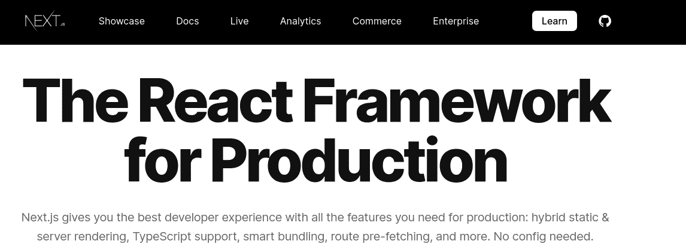

[Next.js 首页](https://nextjs.org/)

但是复制他们的审美是一项巨大的努力。您需要为样式和响应设计编写大量代码。

这就是艾斯特 UI 进入场景的地方。它提供了一组受 Vercel 设计启发的组件。除此之外，它还允许你用少量代码切换主题。

在本文中，您将学习如何使用艾斯特 UI 包。这将是结果:

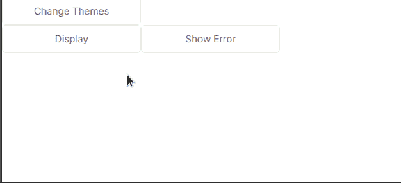

本文的结果

我们开始吧！

# 入门指南

## 项目初始化

要搭建 React 项目，请编写以下终端命令:

```
npx create-react-app geist-tutorial
```

现在让我们安装该应用程序所需的依赖项。

## 模块安装

我们需要以下包:

*   `@geist-ui/react`:本项目的核心依赖。
*   `@geist-ui/react-icons`:获取他们的图标包。

要获取这些依赖项，请运行以下命令:

```
npm i @geist-ui/react @geist-ui/react-icons
```

# 通用组件

## 文本

`Text`组件允许您显示标准文本并为其附加样式。

在你的`src`文件夹中，创建一个名为`TextExample.js`的文件。在这里，编写以下代码:

*   第 6 行:创建一个没有样式的标准`Text`元素。
*   第 7 行:`h1`道具告诉 React 渲染一个`h1`标题。
*   第 8 行:将文本大小增加到`2em`。
*   第 11 行:`type`道具改变了`Text`的颜色。

作为最后一步，我们必须向 DOM 显示`TextExample`。为此，导航至`App.js`并编写以下代码:

*   第 6 行:用`GeistProvider`标签包装我们的定制组件。这会将主题和样式应用到页面。
*   第 7 行:`CSSBaseline`元素将规范化样式。
*   第 8 行:最后，显示我们的`TextExample`组件。

这将是输出:

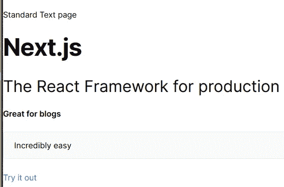

代码的输出

这看起来真不错！

在下一节中，您将了解按钮。

## 纽扣

在你的`src`文件夹中，创建一个名为`ButtonExample.js`的文件。在这里，编写以下代码:

*   第 8 行:显示`number`钩子的值。
*   第 9-13 行:渲染一个`small`大小的`Button`组件并改变它的颜色。点击时，增加`number`变量的值。
*   第 16-21 行:渲染一个`large`大小的`Button`元素并改变它的颜色。点击时，减小`number`的值。

这将是输出:

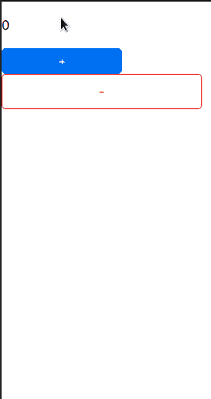

此代码的输出

太好了！我们的代码有效。您甚至可以使用`disabled`道具禁用按钮的点击功能:

```
<Button disabled> Click me</Button>
```

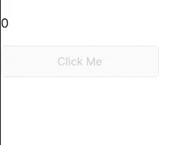

此代码的输出

现在让我们编写一些显示图像的代码。

## 形象

若要显示图像，请编写以下代码:

*   第 8-9 行:`width`和`height`道具改变图像的尺寸。

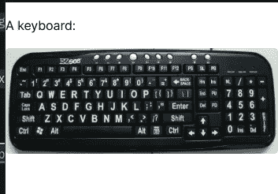

此代码的输出

默认情况下，如果图像加载时间过长，React 将显示一个“骨架”占位符。我们可以用[延迟](http://www.deelay.me/)来模拟一个节流互联网连接。

*   第 7 行:三秒钟后显示图像。

这将是代码的输出:

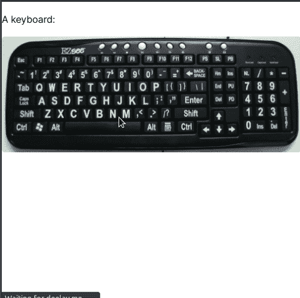

此代码的输出

你甚至可以选择通过`[Display](https://react.geist-ui.dev/en-us/components/display)`组件给你的图片添加标题。

*   第 7 行:用`caption`道具添加我们的标题。

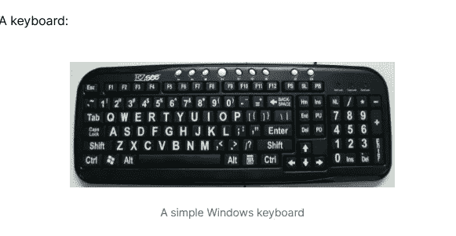

此代码的输出

太好了！我们的代码有效。

此外，您甚至可以在图像上添加浏览器样式的边框，如下所示:

`Image.Browser`中的`url`属性告诉 React，如果客户端点击图像，那么将它们重定向到指定的 URL。

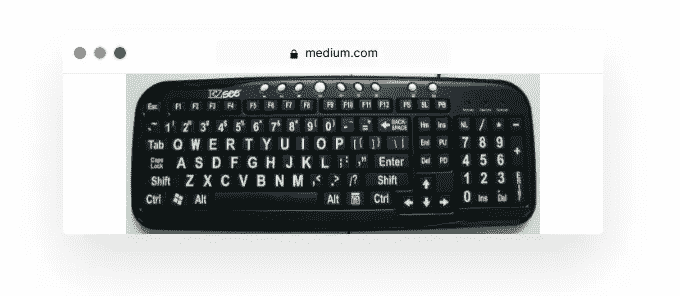

代码的输出

毫无疑问，这看起来太棒了！

在下一部分，我们将学习图标。

## 核标准情报中心

艾斯特的`Icon`组件显示 SVG 图形。这对于数据反馈来说很方便。

若要呈现简单的图标，请编写以下代码:

*   第 8 行:渲染`ArrowDown`图标，并将其大小增加到`8em`。
*   第 9 行:渲染`ArrowUp`图标，并将其颜色改为`blue`。

这将是代码的输出:

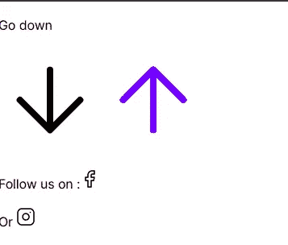

代码的输出

你甚至可以使用`icon`道具在`Button`中渲染你的图标:

```
<Button icon={<Icon.ArrowUp />} type="success">
  Go up
</Button>
```

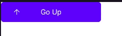

代码的输出

## 纺纱机

向用户显示“正在加载”图标。这有助于通知用户正在加载一些数据。

在你的`src`文件夹中，创建一个名为`SpinnerExample.js`的文件。在这里，编写以下代码:

*   第 7 行:两秒钟后，将`loading`挂钩设置到`false`。
*   第 11 行:使用条件渲染。如果`loading`是`true`，那么渲染`Spinner`图标。否则，告诉用户应用程序已经完成加载。
    [Mehdi Aoussiad](https://medium.com/u/3e9a7f5d2e89?source=post_page-----58d67edbff03--------------------------------) 写了一篇文章，详细介绍了[中的条件渲染](https://javascript.plainenglish.io/conditional-rendering-in-react-with-examples-eb6ae6ac981e)。

这将是代码的输出:

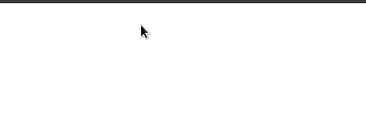

代码的输出

这一部分现在完成了！现在让我们使用艾斯特来构建响应界面。

# 响应式布局

使用响应式网页设计，您可以构建适应设备的网页。如果配置正确，它们在移动设备、平板电脑和桌面设备上看起来会很棒。

我们先来了解一下`Grid`元素。

## 网格容器

这与 CSS 中的`grid`属性相同。创建一个名为`GridExample.js`的文件，并在此处编写以下代码:

*   第 14 行:我们的`Grid`中的项目之间将有三个单位的间隔。`justify`支架会将物品对齐中央。
*   第 15 行:在小屏幕和更大的屏幕上(`sm`断点)，我们的元素应该有六个单位大。否则，如果设备特别小(`xs`断点)，则将其缩小到两个单元。
*   第 16 行:在我们的`Grid`容器中呈现`MockComponent`。


代码的输出

太好了！我们的代码有效。

如果您想要一个流畅的布局，只需几行代码就可以实现:

*   第 13 行:我们将`xs`属性留空。这将自动填充剩余空间。

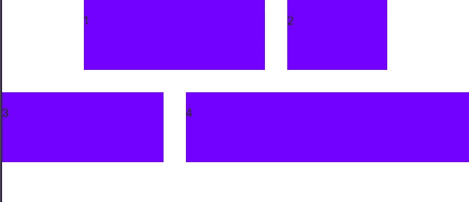

代码的输出

在下一节中，我们将深入研究`Spacer`组件。

## 逆电流器

看看下面这段代码:

这里，我们展示了两个不同颜色的`Buttons`。

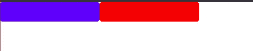

代码的输出

如果它们在不同的排上会更好看。为了解决这个问题，我们可以像这样使用`Spacer`组件:

*   第 7 行:组件之间在`y`轴上应该有四个单位的距离。


代码的输出

您甚至可以通过在`Container`标签之间换行来获得水平间距:

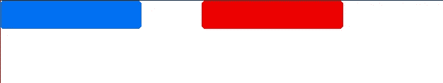

代码的输出

# 杂项功能

## 可折叠文本

`Collapse`组件允许您在折叠部分显示大量文本。要呈现一个简单的`Collapse`元素，请编写以下代码:

*   第 6 行:显示 a `Collapse.Group`。我们将在这里整合我们所有的手风琴。
*   第 7 行:渲染我们的第一个`Collapse`，并通过`title`属性指定它的标题。

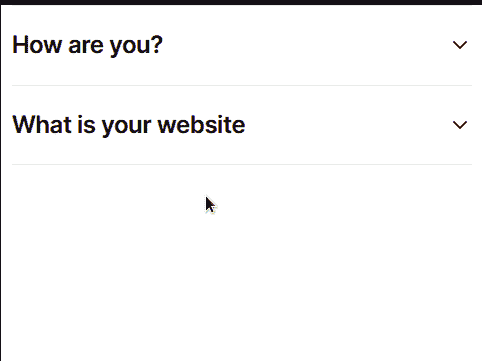

代码的输出

你甚至可以像这样添加字幕:

*   第 4 行和第 10 行:使用`subtitle`属性指定我们的副标题。

这将是输出:

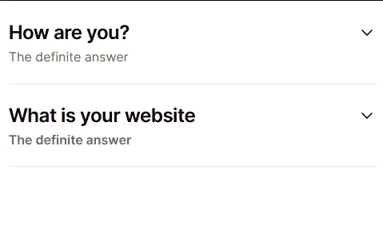

代码的输出

## 显示 toast 消息

通过`useToasts`挂钩，Toast 消息成为可能。

*   第 12 行:单击时，调用`click`方法。这将显示烤面包。

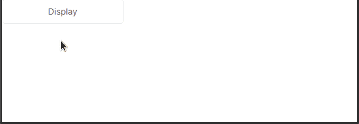

代码的输出

我们甚至可以像这样改变它们的颜色:

*   第 12 行:呈现类型`secondary`的 toast。
*   第 13 行:单击时，显示类型为`error`的消息。

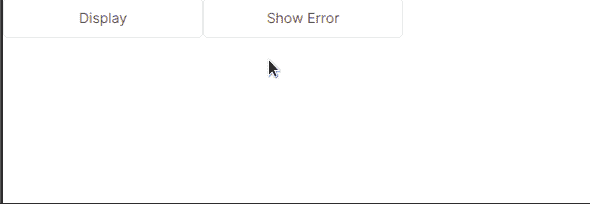

代码的输出

## 改变主题

艾斯特允许你相对容易地改变主题。在这篇文章中，你将学习如何在光明和黑暗主题之间切换。

在`App.js`中，编写以下代码:

*   第 6 行:创建一个`theme`状态。它的初始值将是`light`。
*   第 8-10 行:如果`theme`的当前值为`dark`，则改为`light`。否则做成`dark`。
*   第 15 行:单击时，调用`changeTheme`方法。这将切换主题。

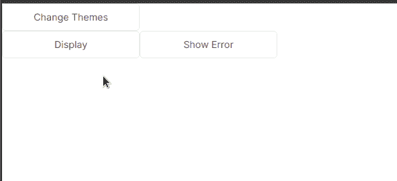

代码的输出

我们完事了。

# 额外资源

## GitHub 代码

[这个演示的代码](https://github.com/HussainArif12/Geist-tutorial)。

## 进一步阅读

[艾斯特 UI 的文档](https://react.geist-ui.dev/en-us/guide/introduction)。

# 结论

如果您想要一组看起来很棒的 UI 组件，同时又不消耗资源，那么就别再找了。艾斯特用户界面非常适合你的网络应用。除此之外，最棒的是你不需要写很多代码来切换主题。

非常感谢您坚持到本文结束！