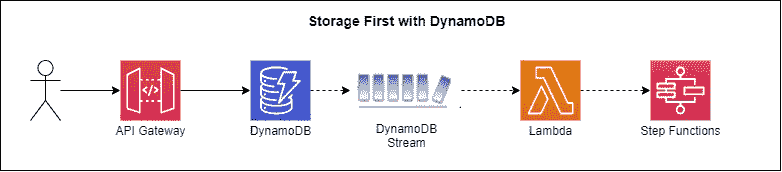
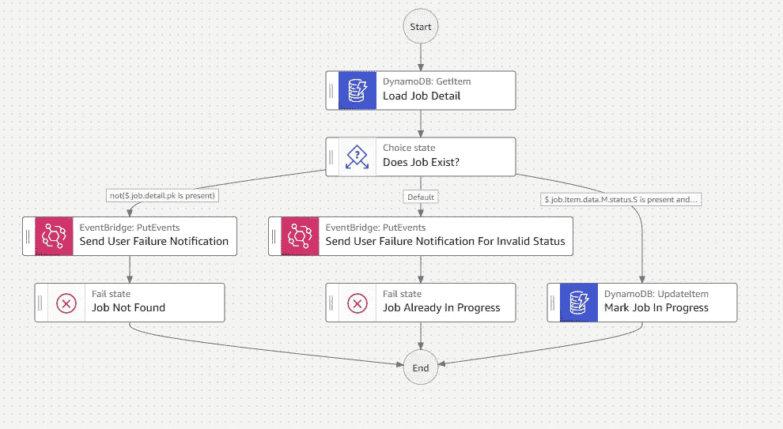
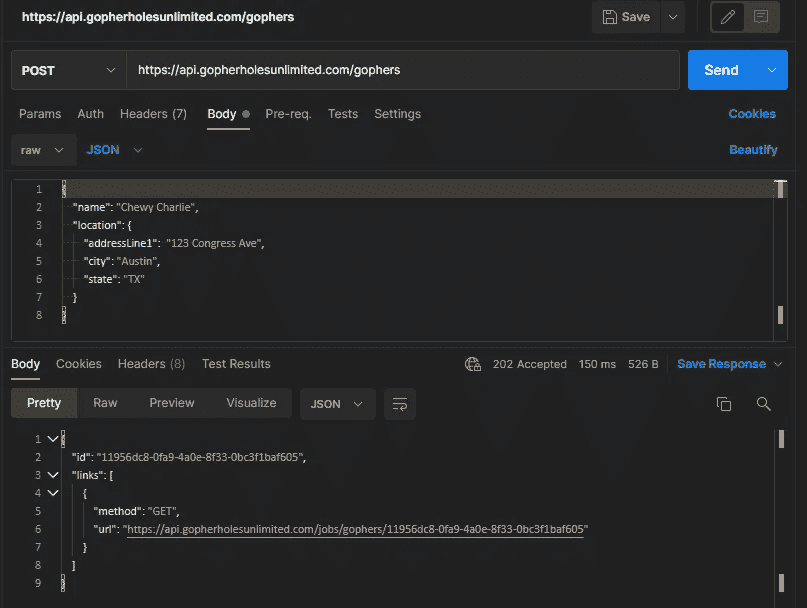
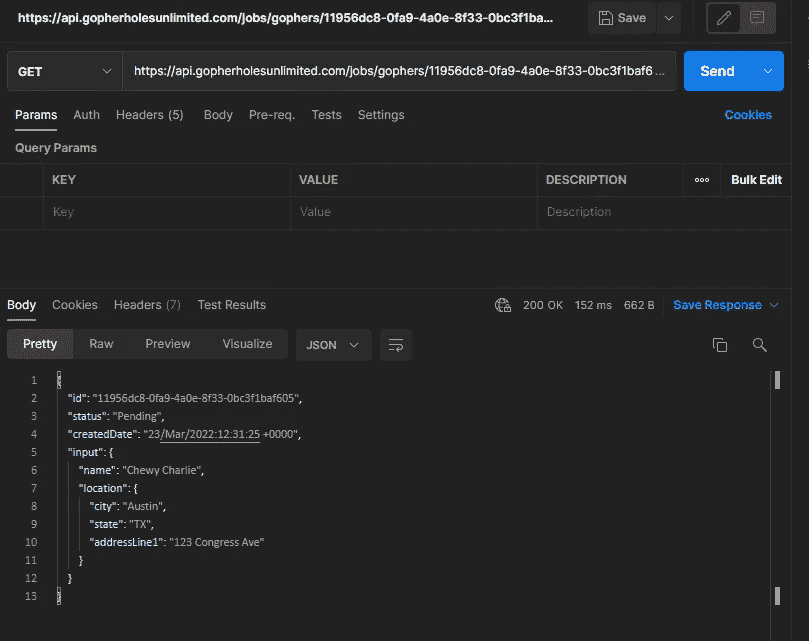
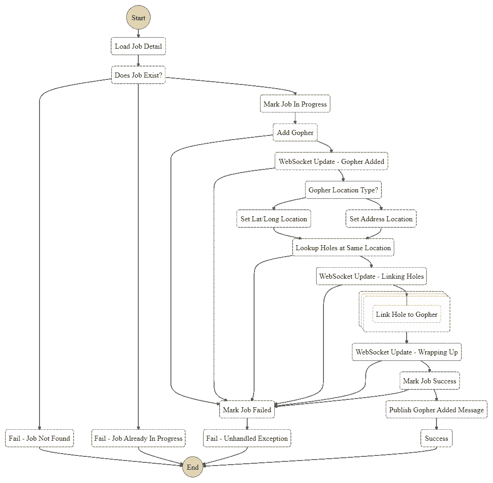

# 从存储开始，构建更好的无服务器 API

> 原文：<https://betterprogramming.pub/build-better-serverless-apis-by-going-storage-first-597784f8f399>

## 谈到 API 设计，Serverless 提供了许多选项。存储优先是一种正在改变游戏规则的异步模式

照片由 [Lia Trevarthen](https://unsplash.com/@melodi2?utm_source=unsplash&utm_medium=referral&utm_content=creditCopyText) 在 [Unsplash](https://unsplash.com/s/photos/storage?utm_source=unsplash&utm_medium=referral&utm_content=creditCopyText) 上拍摄

上周，我的团队进行了一场激烈的辩论。他们在谈论 VTL 专用于原料药的[用法。](https://www.andmore.dev/blog/build-serverless-api-with-no-lambda/)

争论的一方认为它能使你的 API 获得最快的响应时间。另一方认为，如果集成中出现错误，几乎不可能排除故障。数据丢失了，您被迫依赖于 [API 网关日志](https://www.alexdebrie.com/posts/api-gateway-access-logs/)(这有点像寻宝一样的设置)。

双方都提出了很好的论点。但总得有个折中的办法。您希望尽可能低的 API 延迟，但是您绝对不希望丢失任何数据。

好消息，*有妥协*。

[埃里克·约翰逊](https://www.twitter.com/edjgeek)多年来一直是*存储优先*模式的倡导者。[存储优先](https://www.youtube.com/watch?v=eyjxZK-YHIk)指的是一组无服务器设计模式，在运行计算之前将您的数据放在某个地方。这样，如果出现问题，您可以重试或发送到死信队列，以便将来进行手动处理。

2022 年是[异步](/and-the-2022-word-of-the-year-for-programmers-is-3605dc1bd698)年。通过在我们的应用程序中采用异步架构和模式，我们正把注意力放在开发更快、更可靠、等幂的 API 上。通过首先进行存储，我们朝着这个方向迈出了一大步。

# 从直接扑救开始

存储优先模式的第一步是将传入数据保存到一个持久位置。有了 AWS，有[许多选项可以从](https://aws.amazon.com/blogs/compute/building-storage-first-applications-with-http-apis-service-integrations/)中选择。你可以直接去 DynamoDB，亚马逊 Kinesis，SQS，甚至 EventBridge。这些服务中的每一个都可以保留一个传入事件的记录，因此如果出现问题，您可以重放它。

我们今天的例子是直接保存到 DynamoDB。该保存将触发一个[流](https://docs.aws.amazon.com/amazondynamodb/latest/developerguide/Streams.html)，该流将启动一个步进功能。

*使用 DynamoDB 的存储优先工作流*

通过访问 DynamoDB，我们知道我们的数据不会丢失。它通过直接从 API 网关代理到 Dynamo，直接进入存储。不幸的是，这确实使用了 VTL，但只是一点点。一旦 HTTP APIs 支持与 Dynamo 的直接集成，那将彻底消除 VTL。

依靠流，我们为自己提供了一个缓冲。我们可以通过[事件源映射](https://docs.aws.amazon.com/lambda/latest/dg/with-ddb.html#services-dynamodb-api)控制批处理大小、等待时间以及如何处理错误，这允许我们微调高吞吐量端点所需的任何节流。

# 用作业处理数据

作业是一种简单的说法*异步流程*。它在后台运行，进行一些处理，并在完成时返回一个结果。

这就是我们想要为我们的 API 所做的。当我们直接保存到 Dynamo 时，我们希望保存工作参数。DynamoDB 流将识别一个新作业，并将其发送给 Step 函数。

我不喜欢只提供理论而不实践。所以我修改了我的 [Gopher Holes Unlimited 应用程序](https://github.com/allenheltondev/gopher-holes-unlimited)来展示如何设置和处理作业的细节。

在这个 repo 中，当我们将一个 gopher 添加到系统中时，我们创建一个作业来添加 gopher，在相同的位置搜索 gopher 漏洞，并自动链接它们。

作业应该代表创建或处理数据的工作。不是数据本身。如果我查找某个作业的详细信息，我希望看到作业状态、元数据(如作业的创建时间)、输入和最终结果(成功/失败)。

我们挑选新任务的状态机必须知道如何处理不同状态下的任务，以解决等幂问题。从 [add-gopher 状态机](https://github.com/allenheltondev/gopher-holes-unlimited/blob/master/state-machines/add-gopher/add-gopher.asl.json)中取出以下流程。

*通过 Step 函数直接 sdk 集成处理作业*

通过首先保存我们的工作信息，我们立即提供了获取工作状态的能力。在等待 DynamoDB 流处理新输入时，我们将作业细节保存在一个`Pending`状态。

状态机完全了解各种作业状态，并知道如何做出相应的响应和更新。

# 在 API 中返回正确的数据

通过首先移动存储，您承诺将 API 响应返回给调用者，而不处理他们的数据。您可以运行的唯一一种验证是通过您的[开放 API 规范](https://www.openapis.org/)进行的[模式验证](https://docs.aws.amazon.com/apigateway/latest/developerguide/api-gateway-method-request-validation.html)。

一旦我们将原始输入保存为一个新的作业，我们就可以返回一个 [202 Accepted](https://developer.mozilla.org/en-US/docs/Web/HTTP/Status/202) 状态代码以及下面的有效负载来通知调用者作业已经保存，并给他们一个检查进度的方法。

*来自我们存储第一端点的有效负载和响应*

响应提供了一个作业标识符，我们也将其用作 gopher 标识符。它还提供了到一个端点的链接，该端点可以获取我们的作业状态。

调用者可以使用该端点来轮询和获取我们长期运行的作业的状态。这类似于 AWS SDK 如何处理大型 API 调用，如 [StartTextDetection](https://docs.aws.amazon.com/AWSJavaScriptSDK/v3/latest/clients/client-rekognition/classes/starttextdetectioncommand.html) 和 [GetTextDetection](https://docs.aws.amazon.com/AWSJavaScriptSDK/v3/latest/clients/client-rekognition/classes/gettextdetectioncommand.html) 命令。

如果我们调用响应中的链接，我们可以获得关于我们刚刚排队的作业状态的即时反馈。

*我们刚刚排队的作业的挂起状态*

一旦作业完成，终端用户将能够调用`GET gopher`端点来加载通过这个异步过程创建的 gopher 的详细信息。

在这项工作中，我们需要进行两种状态更新:**工作状态**和**工作进度**。

*作业状态*更新是作业当前所处生命周期的高级表示。这些状态包括*未决*、*进行中*、*失败*和*成功*。状态机负责在处理过程中更新*作业状态*。

对于长时间运行的作业，通知用户正在进行某项操作是非常有用的。没有人喜欢坐着等待，希望工作完成。为此，我们通过在 WebSocket 教程中创建的 [WebSocket 微服务](https://github.com/allenheltondev/serverless-websockets)提供推送通知。

*带有推送通知的工作流程图*

通过提供推送通知，我们让用户知道正在发生的事情。随着流程的完成，他们可以在粒度级别上一窥究竟。您所需要做的就是在状态机中包含一个 EventBridge 推送通知。你可以在上图中看到，我们在处理`add-gopher`作业时向用户发送了三种不同的推送。

# 结论

无服务器 API 的存储优先方法有几个移动部分:

*   直接保存到持久存储服务(如 DynamoDB、SQS、EventBridge 或 Kinesis)
*   工作创造和工作流程管理
*   API 更新以返回一个*已接受的*状态代码和*发现*链接
*   状态更新

从表面上看，这比做所有事情的同步 lambda 调用开销要大得多。从表面上看，这是正确的。但是存储优先和异步有很多好处。

*   更快的响应时间
*   用户未被阻止等待响应
*   作业完成后，用户会立即收到通知
*   云成本下降是因为你不用为长时间运行的 lambda 函数付费
*   数据可追溯性飙升，因为你总是有数据的记录

在构建产品代码时，这是显而易见的。如果你正在建立一个[快速和肮脏的概念验证](/4-reasons-you-should-never-use-proof-of-concepts-in-production-ca54432e52b9)，权衡你的选择。看着它更快地工作可能比看着它“正确”地工作更有成效。

存储优先正在席卷无服务器世界。随着我们作为一个社区的成熟，可观察性和可追溯性越来越成为一等公民，需要在你的设计中提前考虑。从一开始就保存数据有助于确保您永远不会丢失那些无用的数据。

编码快乐！