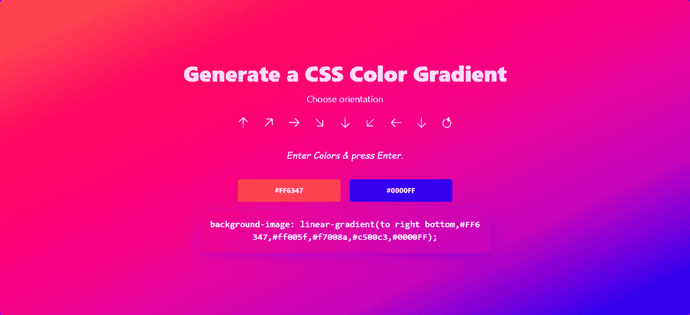
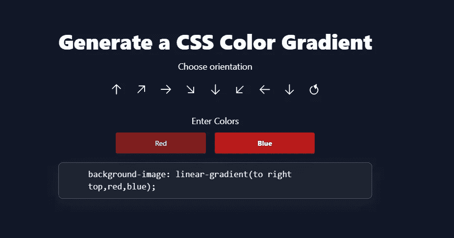
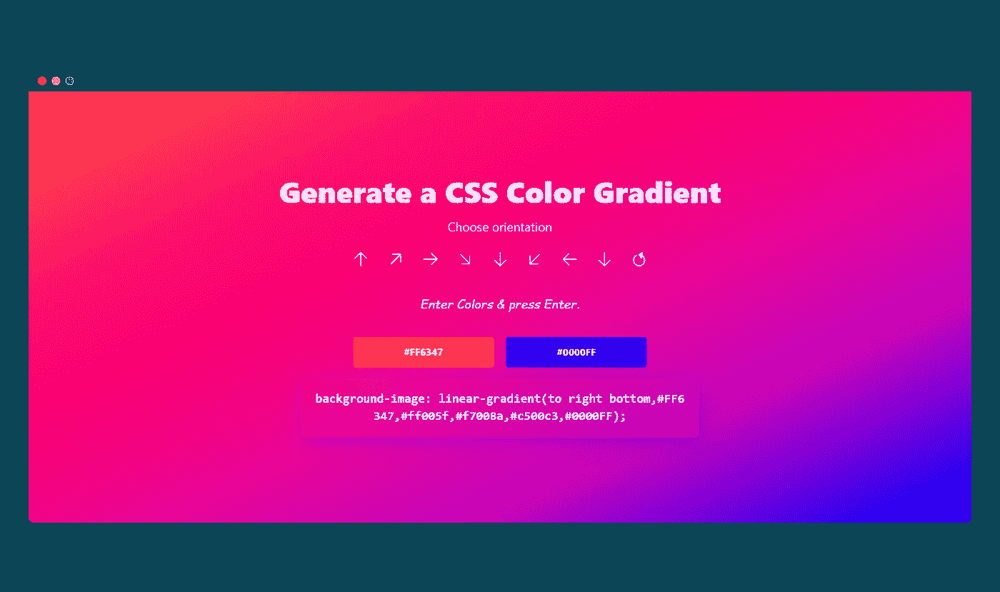

# 使用 React 和 Chroma.js 构建动态渐变生成器

> 原文：<https://betterprogramming.pub/build-dynamic-gradient-generator-using-react-and-chroma-js-ace95aba2263>

## 使用 React 从头开始创建一个简单的渐变功能



作者图片[萨希尔·帕特尔](https://sahilpatel09.github.io/)

梯度发生器似乎很有趣。我主要使用 https://mycolor.space/网站来生成不同格式的渐变。在周末，我决定制作我的渐变生成器，我已经制作了一个类似的“mycolor space”网站。

你可以在这里找到项目的[源代码](https://github.com/sahilpatel09/Gradient-Generator-using-React.js)，在这里找到[现场演示](https://gradient-generator-react.netlify.app/)。

渐变发生器有改变方向和颜色的选项。它接受颜色的参数，并生成它们之间最相关的 3 种颜色。

# 准备好环境

首先使用 create-react-app 创建一个 react app，并添加对 Tailwind CSS 的支持。

```
npx create-react-app color-generator-react
cd color-generator-react
```

现在，将 cd 放入项目中，添加唯一的依赖项 Chroma-js。

```
yarn add chroma-js
OR
npm install chroma-js
```

# 添加顺风 CSS

```
yarn add -D tailwindcss postcss autoprefixer
OR
npm install -D tailwindcss postcss autoprefixer 
```

下面的代码创建了一个`tailwindcss.config.js`文件。由于我们已经传递了`-p`标志，它还创建了一个带有默认配置的`postcss.config.js`文件，用于 Tailwind CSS。

```
npx tailwindcss init -p
```

现在，让我们在 assets 文件夹中创建一个`tailwind.css`文件。

```
mkdir assets
cd assets
touch tailwind.css // Linux
OR 
echo. > tailwind.css // Windows
```

在创建的`tailwind.css`文件中，添加下面的顺风指令。

```
@tailwind base;
@tailwind components;
@tailwind utilities;
```

恭喜，顺风 CSS 成功添加到项目中。

一旦添加完毕，我们就可以开始这个项目了。不过在此之前，我们先来稍微介绍一下 [Chroma.js](https://gka.github.io/chroma.js/) 。

# 色度简介. js

Chroma.js 是一款出色的色彩处理、转换和缩放软件。它拥有你所需要的一切，从变暗或变亮到色调调整。它也给你不同颜色空间的结果。它可以读取、转换、分析和处理不同格式的颜色。

我们将使用色度从实际给定的 2 个参数中再生成 3 种颜色，并创建 5 种颜色的渐变。

# 让我们建立布局

为了简单起见，只有一个主要组件。下面的标记使用 flexbox 属性使`div`之间的任何内容居中。

```
<div className="flex items-center bg-gray-900 justify-center md:fixed h-screen inset-0 px-10">
    /* All the content is centered. */
    </div>
```

要创建控件来改变颜色扩展的方向，请将以下代码添加到`App.js`文件中。

要使其中一些旋转，将这个 CSS 添加到`App.css`文件中。

```
.rotate-135 {
    transform: rotate(135deg);
}.rotate-225 {
    transform: rotate(225deg);
}
button:focus{
    border: 2px solid white;
    border-radius:50%;
    outline: none;
    transition: all 220ms ease-in;
}
```

它现在应该看起来像这样。

现在让我们添加两个按钮来接受用户的颜色输入，并在下面添加一个 CSS 代码框。

```
.font-cursive {
    font-family: cursive;
}.box{
    background: rgba( 255, 254, 254, 0.05 );
    box-shadow: 0 8px 32px 0 rgba( 31, 38, 135, 0.37 );
    backdrop-filter: blur( 9.5px );
    -webkit-backdrop-filter: blur( 9.5px );
    border-radius: 10px;
    border: 1px solid rgba( 255, 255, 255, 0.18 );
}
```

一旦添加了标记和 CSS，看起来应该是这样的。此时此刻，我们已经完成了应用程序的基本布局。



图片作者:Sahil Patel

# 添加功能

首先，我们必须声明颜色和按钮的所有变量和引用。为了使用 React 功能组件中的状态，我将使用“useState”钩子。

现在，当箭头按钮被选中时，函数`changeOrientation`被触发，方向字符串如下所示传入。

```
<button title="to right" onClick={() => changeOrientation("to right") }>
              
</button>
```

为了处理这个函数，我们将编写下面的函数:

```
const changeOrientation = function (ori){ //condition to check if the passed in string is circle
    //if circle the radial gradient is generated
    //else linear gradient if(ori === "circle"){
          //setting the direction variable & orientation
            setDirection("radial-gradient")
            setOrientation(ori)
        }else{
            setDirection("linear-gradient")
            setOrientation(ori)
        } }
```

现在，当背景颜色是任何颜色时，我们必须根据背景颜色动态地将输入框的颜色设置为暗或亮。同样，我们将不得不从用户的输入生成 3 种动态颜色。为了处理这个问题，我们有以下函数:

动态颜色生成器功能。

现在，每当有人输入颜色并按下 Enter 按钮时，就会触发一个名为`doJob(e)`的函数，事件通过参数传递。

# 完整的 App.js 代码

使用`yarn start or npm run start`运行应用程序，您应该在 localhost:3000 处看到应用程序的输出。



最终结果—作者提供的图片

感谢您阅读文章。