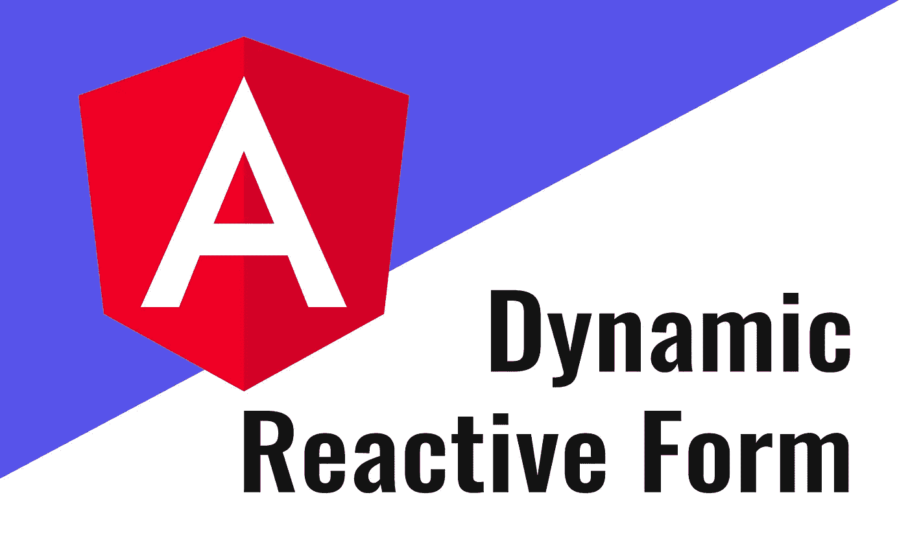
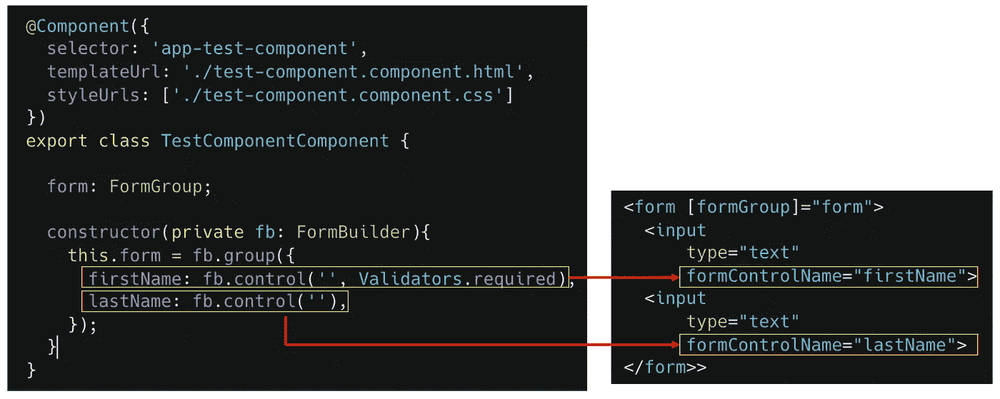
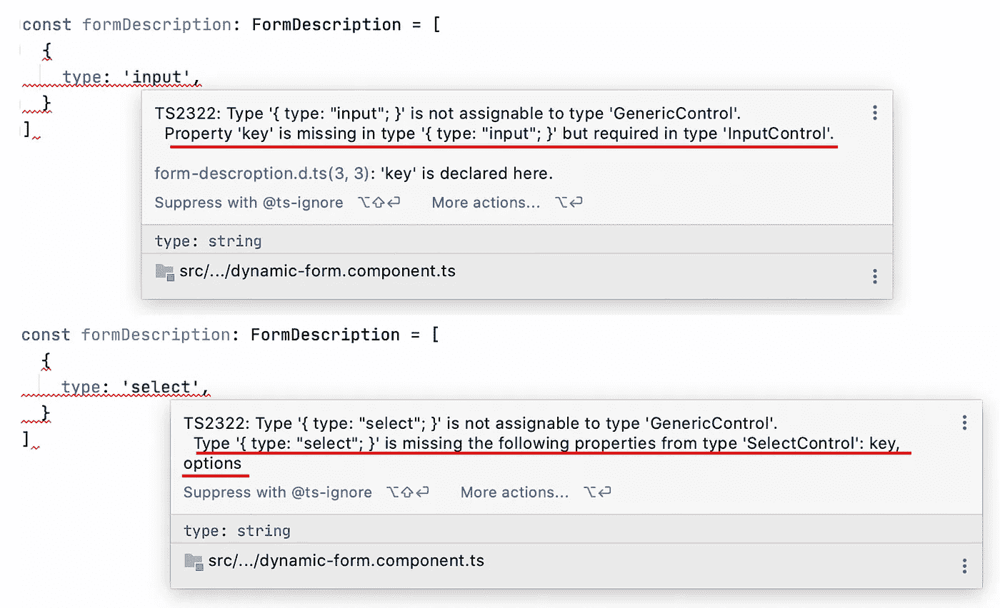

# 使用角度构建动态反应表单

> 原文：<https://betterprogramming.pub/build-dynamic-reactive-forms-using-angular-47664c42774f>

## 在 Angular 中实现简单动态表单



作者图片

在 Angular 中有两种构建表单的方法——模板驱动和反应式方法。在这里，我们将重点关注反应式方法。反应式方法被认为是一个两步过程。首先，我们需要以编程方式创建一个模型，然后使用模板中的指令将 HTML 元素链接到该模型。这是一项繁琐且相当重复的任务，任何后续更改都需要我们在两个地方进行更改。



开发一些动态表单组件来简化这个过程是有意义的。当然，你可能会找到任何外部库(例如， [Angular Formly](https://formly.dev/) )，但是有时候想一想如何自己构建它会很有趣。我们将经历这个过程并实现最简单的动态表单。

# 表单描述模型

因为我们试图简化反应式表单创建的两步过程，所以我们需要找到一种方法来描述每个控件元素，并在一个地方定义它在模型和 HTML 模板中的外观。它可以在简单的 JS-object 中定义，看起来可能是这样的:

```
[
   { 
      type: 'input',
      key: 'firstName',
      defaultValue: 'Ivan'
   },
   {
      type: 'select',
      key: 'gender',
      options: ['male', 'female']
    }
]
```

其中`type`描述了应该在模板中使用哪个 HTML 元素，`key`描述了如何通过模型使用这个控件。注意，这里你也可以定义像`validators`这样的字段，但是为了简单起见，我在这里省略了。

# **类型定义**

首先，让我们为描述表单内容的对象定义一个 TypeScript 类型。或许，你可能想到的第一个想法是，我们可以把所有可能的字段都集中在一个类型中(这里提供了几乎相同的方法[https://angular.io/guide/dynamic-form](https://angular.io/guide/dynamic-form)):

```
type Control = {
   type: 'input' | 'select',
   fieldName: string,
   defaultValue?: string,
   options?: string[]
}type FormDescription = Control[];
```

这里的问题实际上是，我们将`options`字段定义为可选的，但是对于类型为`select`的控件来说，它应该是必需的。另一方面，我们可以根据需要定义`options`字段，但是它对类型为`input`的控件有意义吗？我不这么认为。

有没有更好的解决办法？答案是——是的。我们将使用一种在 Typescript 中被称为“*标记联合*或“*区别联合*”的模式。为此，让我们分别为所有控件定义所有可能的类型:

```
type InputControl = {
   type: 'input',
   key: string,
   defaultValue?: string
}type SelectControl = {
   type: 'select',
   key: string,
   options: string[],
   defaultOptions?: string
}type GenericControl = InputControl | SelectControl;type FormDescription = GenericControl[];
```

请注意，对于`type`字段，我们没有将类型定义为`string`，而是使用了字符串的特定值，该值可能被视为标签。

它给我们带来了什么好处？一旦我们为字段`type`定义了特定的类型(标签), TypesScript 就会推断出哪些字段可用于这个特定的类型，是`InputControl`类型还是`SelectControl`类型。

例如，当我们将`type`字段定义为`input`时，它会警告我们`key`是必填字段，还会告诉我们它使用`InputControl`类型进行推断。当我们将`type`定义为`select`时，情况也是如此。它显示有两个必填字段:`key`和`options`:



到目前为止一切顺利。

# 2.角度控制器实现

为了简单起见，当我们需要从服务器请求一个表单描述时，我跳过了这一部分。Angular 有两种处理表单的方法:模板驱动或反应式方法。毫无疑问，在我们的案例中，我们采用反应式方法，因为它更灵活。

第一步是基于`ngOnInit`方法中的表单描述构建`FormGroup`形状，这并不困难——我们只需遍历数组项并为每个字段创建`FormControl`实例:

在模板中，我们需要遍历`this.formDescription`项，并根据控件类型构建布局:

# 结论

我们已经实现了第一个动态表单。我们留下了很大的改进余地。例如，我们可以添加:

*   字段验证并将用户友好的消息放入模板中；
*   在 UI 上添加`label`组件的机会；
*   添加另一种类型的控件，如单选按钮、复选框

但肯定的是，这不是一个你想用于生产的决定。我们的同事已经为相同的提议实现了一个灵活的外部库，例如 [Angular Formly](https://formly.dev/) 。