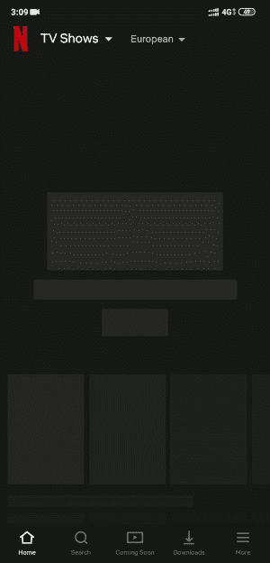
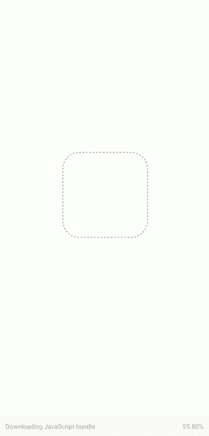

# 在 React Native 中构建类似脸书的占位符加载器

> 原文：<https://betterprogramming.pub/build-facebook-like-placeholder-loaders-in-react-native-674a5498ca7f>

## 使用 rn-placeholder 在 React 本机应用程序中使用占位符加载器


卡斯帕·卡米尔·鲁宾在 [Unsplash](https://unsplash.com/?utm_source=unsplash&utm_medium=referral&utm_content=creditCopyText) 上的照片

良好的用户体验是一款优秀应用与普通应用的区别。用户希望他们的应用程序非常快，因为没有人喜欢等待。在构建移动应用程序时，我们经常使用加载器、进度条和加载指示器来告诉用户某件事情正在发生或正在加载。

最新的趋势是将占位符/框架屏幕显示为加载器。这种使用占位符的模式改善了用户在等待加载时的感知体验。你可能在脸书和网飞这样的应用中见过这种加载器。



网飞装载机应用程序

# React Native 中的加载程序

在大多数情况下，使用好的 ol' `[ActivityIndicator](https://facebook.github.io/react-native/docs/activityindicator)`和 [React Native](https://facebook.github.io/react-native/) 模态就足够了。然而，作为一个用户和开发者，我发现它们太平凡和过时了。

为了让这些加载器变得有趣，我创建了一个 React 原生包，它使用 Airbnb 的 [Lottie](https://airbnb.io/lottie/) 和`[Modals](https://facebook.github.io/react-native/docs/modal#docsNav)`来创建漂亮的动画加载器。如果你想了解更多关于如何使用它的信息，请阅读这篇文章。

在本文中，我们将学习如何使用`[rn-placeholder](https://github.com/mfrachet/rn-placeholder)`库实现占位符屏幕。我们还将使用 [Google Books API](https://developers.google.com/books) 来获取一些图书数据。

# 先决条件

要学习本教程，请确保您在本地开发环境中安装了以下软件，并且能够访问下面提到的服务:

*   [Node.js](https://nodejs.org/en/) ( > =8.x.x)安装了 npm/Yarn。
*   世博景观 ( > =3.0.4)

如果你有一段时间没有更新`expo-cli`，请确保更新，因为`expo`版本很快就会过时。

# 入门指南

让我们使用 expo-cli 建立一个新的 Expo 项目。

```
$ expo init placeholderLoading
```

1.  选择空白模板，点击`Enter`。
2.  然后它会要求你命名项目，输入`PlaceholderLoading`并再次点击`Enter`。
3.  最后，它会要求您按下`Y`来安装与`yarn`的依赖关系，或者按下`n`来安装与`npm`的依赖关系。按下`y`。

这将使用 expo-cli 创建一个新的 React 本机应用程序。

# 运行应用程序并安装依赖项

进入我们刚刚创建的项目目录:

```
$ cd placeholderLoading
```

要运行项目类型:

```
$ yarn start
```

按`i`运行 iOS 模拟器。这将自动运行 iOS 模拟器，即使它没有打开。

按`a`运行 Android 模拟器。注意，在输入`a`之前，模拟器必须已经安装并启动，否则它将在终端中抛出一个错误。

您也可以从 App Store 安装`expo`应用程序，然后扫描二维码，在您的设备中运行该应用程序。

现在，安装`rn-placeholder`和`react-native-responsive-dimensions`包。

```
$ yarn add rn-placeholder react-native-responsive-dimensions
```

在呈现我们的文本或媒体内容之前，`rn-placeholder`将帮助我们显示一些占位符。

并且，`react-native-responsive-dimensions`将为我们提供一个响应高度和宽度，它将根据设备的屏幕大小自动调整。

# 创建组件

现在我们将创建两个组件，`BookCardComponent`和`BookCardPlaceholderComponent`。

以下是`BookCardComponent`的代码:

BookCardComponent

`BookCardPlaceholderComponent`的代码:

最初将呈现`BookCardPlaceholderComponent`,直到我们从 Google Books API 接收数据，在接收数据后，我们将使用`BookCardComponent`来呈现图书数据。

# 更新 App.js

我们将在本教程中使用 React [钩子](https://reactjs.org/docs/hooks-intro.html),但是你可以很容易地将其转换成类。

将以下代码添加到您的`App.js`中:

首先，我们使用`useState`钩子设置一些初始状态。

在`books`状态中，我们将更新从 API 接收到的所有书籍，对于初始状态，我们创建了一个由十个空对象组成的数组。

我们还初始化了`isDataFetched`状态，并将其初始值设置为`false`。它将用于跟踪从 API 接收的数据的状态。当我们接收到数据并完成数据操作后，我们将使用`setDataFetched`将其值设置为`true`。

下一步，我们将使用`useEffect`钩子来调用 Google Books API，并用收到的数据更新我们各自的状态。

现在，在返回时，我们将利用`isDataFetched`状态有条件地呈现组件。

在`renderX()`中，我们将返回一个`FlatList`，它将使用`renderBookComponent`呈现图书列表。

在`renderPlaceholders()`中，我们将使用贴图功能渲染`BookCardPlaceholder`。这是用户在数据获取期间将看到的内容。

所以在取数据时，`BookCardPlaceholder`会被渲染，当数据取成功后，`FlatList`会渲染`BookCardComponent`。

这是最终应用程序的样子:



占位符加载器

# 结论

我们已经成功创建了一个 React 原生应用程序，它使用`rn-placeholder`在数据获取期间将占位符显示为加载器，就像脸书、网飞和其他流行的应用程序一样。

这只是占位符屏幕作为加载器的一个简单实现。您可以根据自己的需求或应用程序主题自定义这些占位符组件。

*   在 GitHub repo 中找到源代码[。](https://github.com/vikrantnegi/react-native-placeholder-loading)
*   我还创建了一个开源的图书搜索 React 原生应用程序，其中我使用了这些占位符组件作为加载器。在 GitHub 上随意看看它的源代码[。](https://github.com/vikrantnegi/RN-Book-Search)