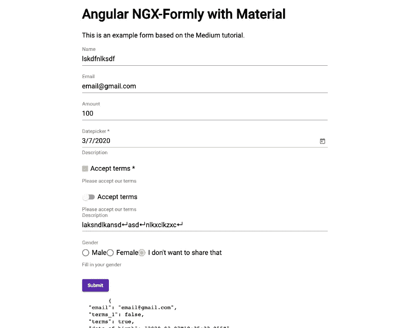

# 使用 Ngx Formly 在 Angular 上构建快速的、基于 JSON 的表单

> 原文：<https://betterprogramming.pub/build-fast-json-powered-forms-on-angular-with-ngx-formly-b7a00733e66e>

## 表格可能是一场噩梦——让我们把它们变得更好


由[凯利·西克玛](https://unsplash.com/@kellysikkema?utm_source=unsplash&utm_medium=referral&utm_content=creditCopyText)在 [Unsplash](https://unsplash.com/s/photos/forms?utm_source=unsplash&utm_medium=referral&utm_content=creditCopyText) 上拍摄的照片

在本文中，我将向您展示如何使用 [Ngx Formly](https://formly.dev/) 在 Angular 中构建基于 JSON 的表单。之后，您将能够比平时更快地创建表单。

我们将深入探讨我们可以使用什么类型的输入字段，以及我们如何将 Formly 与一个 UI 框架集成，如 Material、Bootstrap、Ionic、PrimeNG、Kendo 和 NativeScript。在这篇文章中，我将使用角材料的集成。

## 表单是开发人员最可怕的噩梦

每个使用 Angular 构建很酷的 web 应用程序的开发人员都知道表单是最常构建的东西之一。我们用 Angular 给我们的所有工具手工建造。

但是说实话，我认为我们都在构建表单、验证、条件字段等方面花费了太多时间。

我想向您介绍 Ngx Formly，它帮助我的团队在几分钟内而不是几小时内构建 Angular 中的高级表单。

本文非常感谢团队将 Ngx 构建成一个开源工具。他们让我们构建那些耗时的表单变得超级简单。

这篇文章是名为“Angular 上基于 JSON 的表单”的两部分系列文章的第一部分。

```
**Part 1
1\.** [**What’s Ngx Formly?**](https://medium.com/@devbyrayray/b7a00733e66e#3d0d) **2\.** [**Install Dependencies**](https://medium.com/@devbyrayray/b7a00733e66e#8175) **3\.** [**Set Up an Angular Project**](https://medium.com/@devbyrayray/b7a00733e66e#0e6c) **4\.** [**Add Ngx Formly and Your UI Framework**](https://medium.com/@devbyrayray/b7a00733e66e#8521) **5\.** [**Create a Simple Form**](https://medium.com/@devbyrayray/b7a00733e66e#1778) **6\.** [**Check the Data From the Form**](https://medium.com/@devbyrayray/b7a00733e66e#ded9)**Part 2**
1\. [Validation](https://medium.com/@devbyrayray/77aeed406f73)
2\. [Repeating Sections](https://medium.com/@devbyrayray/77aeed406f73)
3\. [Conditional Fields](https://medium.com/@devbyrayray/77aeed406f73)
4\. [Reset Form](https://medium.com/@devbyrayray/77aeed406f73)
5\. [Submit Form](https://medium.com/@devbyrayray/77aeed406f73)
```

## 1.Ngx Formly 是什么？

NGX Formly 是作为开源项目构建的，你可以在 [GitHub](https://github.com/ngx-formly/ngx-formly) 上找到。该工具允许您基于 JSON 结构创建表单。这使得构建小型和高级表单变得非常容易和快速。

用 Angular 搭配 Material，Bootstrap，Ionic，PrimeNG，Kendo，NativeScript 都没问题。他们都有一个插件。

## 2.安装依赖项

为了建立一个 Angular 项目，我们需要一些依赖项。

1.  安装 Node.js(如果你在 Mac 上工作，我推荐[通过 nvm](https://github.com/nijicha/install_nodejs_and_yarn_homebrew) 安装)
2.  安装类型脚本:`npm install -g typescript`
3.  安装角度 CLI: `npm install -g @angular/cli`

当所有依赖项都安装在您的计算机上时，您必须检查 Angular CLI 是否在您的计算机上工作。有了`ng --version`，你可以做到这一点。如果您的终端没有出现错误，您就可以开始了。

## 3.建立一个角度项目

在您的终端中，导航到您放置所有项目的目录。

运行`ng new project-name`，Angular 会问你几个问题。你可以按键盘上的箭头来选择。

我选择了以下答案:

*   "您想添加角度路由吗？"**是的。**
*   "您想使用哪种样式表格式？" **SCSS。**

完成 CLI 后，导航到您的项目文件夹并打开您的 IDE。我个人是 [Visual Studio 代码](https://code.visualstudio.com/)的忠实粉丝。

## 4.添加 Ngx 表单和你的 UI 框架

让我们将 Ngx Formly 添加到我们的 Angular 项目中，看看用它构建表单有多简单。

## 4.1 用你的 UI 框架安装 Ngx Formly

如果你开始了一个空白的 Angular 项目，我假设你还没有安装 UI 框架。使用下面的命令，您可以将 Ngx 与 UI 框架一起安装。

```
ng add @ngx-formly/schematics --ui-theme={material|bootstrap|etc}
```

## 4.2 将模块添加到“AppModule”

如果您将 Ngx 与 UI 框架一起安装，那么您可以跳过这一步，因为该命令已经将所需的模块添加到您的`AppModule`中。

如果你安装 Ngx 的方式不同，你必须确保模块被添加到`AppModule`。

```
import { AppComponent } from './app.component';
import { ReactiveFormsModule } from '@angular/forms';
import { FormlyModule } from '@ngx-formly/core';
import { Formly{uiFramework}Module } from '@ngx-formly/{uiframework}';@NgModule({
  imports: [
    BrowserModule
    ReactiveFormsModule,
    FormlyModule.forRoot(),
    Formly{uiFramework}Module
  ],
  ...
})
export class AppModule { }
```

Ngx Formly 是建立在角反应形态之上的，所以我们有了`FormlyModule`和`Formly{uiFramework}Module`。(用您选择的框架名称替换`{uiFramework}`和`{uiframework}`。)

现在，我建议通过运行`npm start`来启动你的 Angular 应用程序，检查你是否有任何错误，以及是否一切都安装正确。

让我们在下一步中构建一个表单。

## 4.3 添加您的 UI 框架

如果您正在处理一个现有的项目，您可以跳过这一步。

现在，我们将把 UI 框架添加到我们的 Angular 项目中。因为我使用的是有角的材质，所以我可以运行这个命令。如果你正在使用另一个 UI 框架，那么你需要在那个框架的文档中检查它。

```
ng add @angular/material
```

接下来，我们需要将样式添加到`style.scss`文件。

```
@import '@angular/material/prebuilt-themes/deeppurple-amber.css';
```

在`index.html`文件中，我们可以加载素材字体。

```
<head>
        <meta charset="utf-8" />
        <title>AngularNgxFormlyMaterial</title>
        <base href="/" />
        <meta name="viewport" content="width=device-width, initial-scale=1" />
        <link rel="icon" type="image/x-icon" href="favicon.ico" />
        <link href="https://fonts.googleapis.com/css?family=Roboto:300,400,500&display=swap" rel="stylesheet" />
        <link href="https://fonts.googleapis.com/icon?family=Material+Icons" rel="stylesheet" />
    </head>
```

要使用来自 Angular Material 的表单组件，我们需要将它们添加到`app.module.ts`中的`import`数组。从 Angular 9 开始，建议只导入自己需要的。

```
import { BrowserAnimationsModule } from '@angular/platform-browser/animations'
import { BrowserModule } from '@angular/platform-browser'
import { NgModule } from '@angular/core'import { AppRoutingModule } from './app-routing.module'
import { AppComponent } from './app.component'
import { ReactiveFormsModule } from '@angular/forms'
import { FormlyModule } from '@ngx-formly/core'
import { FormlyMaterialModule } from '@ngx-formly/material'
import { FormlyMatDatepickerModule } from '@ngx-formly/material/datepicker';
import { FormlyMatToggleModule } from '@ngx-formly/material/toggle';import { MatDatepickerModule } from '@angular/material/datepicker'
import { MatDialogModule } from '@angular/material/dialog'
import { MatFormFieldModule } from '@angular/material/form-field'
import { MatInputModule } from '@angular/material/input'
import { MatRadioModule } from '@angular/material/radio'
import { MatSelectModule } from '@angular/material/select'
import { MatButtonModule } from '@angular/material/button'
import { MatCheckboxModule } from '@angular/material/checkbox'
import { MatNativeDateModule } from '@angular/material/core'@NgModule({
    declarations: [AppComponent],
    imports: [
        BrowserModule,
        AppRoutingModule,
        BrowserAnimationsModule, ReactiveFormsModule,
        MatCheckboxModule,
        MatButtonModule,
        MatDatepickerModule,
        MatDialogModule,
        MatFormFieldModule,
        MatInputModule,
        MatRadioModule,
        MatSelectModule,

        MatNativeDateModule,
        FormlyMatDatepickerModule,
        FormlyMatToggleModule, FormlyModule.forRoot(),
        FormlyMaterialModule,
    ],
    providers: [],
    bootstrap: [AppComponent],
})
export class AppModule {}
```

**运行应用程序时出错？**

如果您因为终端出错而无法运行应用程序，这就意味着您缺少了一些依赖项。

运行`npm install @angular/material @angular/cdk --save`。我也有一些问题。

## 5.创建简单的表单

现在，我们可以创建一个包含各种输入字段的表单。

*   线
*   数字
*   检验盒
*   收音机
*   选择和多选
*   日期
*   文本区域

## 5.1 向组件添加表单

现在，我们将使用任何可能的输入类型构建一个表单，看看它是如何工作的。

让我们将表单添加到`AppComponent`中，或者如果您希望您的表单位于任何其他位置，请这样做。

```
import {Component} from '@angular/core';
import {FormGroup} from '@angular/forms';
import {FormlyFieldConfig} from '@ngx-formly/core';@Component({
  selector: 'app',
  template: `
    <form [formGroup]="form" (ngSubmit)="onSubmit(model)">
      <formly-form [form]="form" [fields]="fields" [model]="model"></formly-form>
      <button type="submit" class="btn btn-default">Submit</button>
    </form>
  `,
})
export class AppComponent {
}
```

在我们的`AppComponent`类中，我们将声明一些构建表单所需的属性。

```
export class AppComponent {
  form = new FormGroup({});
  model = { email: 'email@gmail.com' };
  fields: FormlyFieldConfig[] = [
    {
      key: 'email',
      type: 'input',
      templateOptions: {
        label: 'Email address',
        placeholder: 'Enter email',
        required: true,
      }
    }
  ]; onSubmit() {
    console.log(this.model);
  }
}
```

让我们分解一下，来理解为什么我们要定义所有的属性和方法。

1.  `form = new FormGroup({})` : Ngx Formly 建立在 Angular 中的反应式表单之上。所以我们必须定义一个`FormGroup`来给表单添加字段。
2.  `model = { email: 'email@gmail.com' }`:在模型中，我们希望将所有需要的信息都作为表单中的值。在下一步中，您将在`email`字段中看到值将会是`'email@gmail.com'`。
3.  `fields: FormlyFieldConfig[] = []`:在`FormlyFieldConfig[]`的`Array`中，我们将添加代表我们表单的对象。在这些对象中，我们定义了键、类型、标签、占位符和表单所需的其他信息。

## 5.2 让我们添加更多的输入字段

在大多数情况下，我们应用程序中的表单会有很多输入字段类型。因此，让我们添加一些输入类型，以便我们可以看到哪些是受支持的。

## 添加文本字段

```
{
    key: 'name',
    type: 'input',
    templateOptions: {
      label: 'Name',
      placeholder: 'Enter name',
    }
  },
```

## 添加电子邮件字段

```
 {
    key: 'email',
    type: 'input',
    templateOptions: {
            type: 'email',
      label: 'Email',
      placeholder: 'Enter email',
    }
  },
```

## 5.2.3 添加编号字段

```
 {
    key: 'amount',
    type: 'input',
    templateOptions: {
            type: 'number',
      label: 'Amount',
      placeholder: 'Enter amount',
    }
  },
```

## 添加日期字段

```
 {
    key: 'date_of_birth',
    type: 'datepicker',
        templateOptions: {
      label: 'Datepicker',
      placeholder: 'Placeholder',
      description: 'Description',
      required: true,
    },
  },
```

对于您的 UI 框架，您必须确保支持这种类型。我知道 Angular Material 在安装了 Ngx Formly UI 框架特定插件后确实支持这个。

## 添加复选框字段

```
 {
    key: 'terms',
        type: 'checkbox',
    templateOptions: {
      label: 'Accept terms',
      description: 'Please accept our terms',
      required: true,
    },
  },
```

## 添加切换字段

```
 {
    key: 'terms',
    type: 'toggle',
    templateOptions: {
      label: 'Accept terms',
      description: 'Please accept our terms',
      required: true,
    },
  },
```

## 添加文本区域字段

```
 {
    key: 'description',
    type: 'textarea',
    templateOptions: {
      label: 'Description',
      placeholder: 'Enter description',
    }
  },
```

## 添加单选按钮

```
 {
    key: 'gender',
    type: 'radio',
    templateOptions: {
      label: 'Gender',
      placeholder: 'Placeholder',
      description: 'Fill in your gender',
      options: [
        { value: 1, label: 'Male' },
        { value: 2, label: 'Femail' },
        { value: 3, label: 'I don\'t want to share that' },
      ],
    },
  },
```

## 5.2.10 添加选择或多选字段

我们可以手动或通过定义的`enum`给选择选项。为了从 enum 获取所有信息，我们必须将它们存储在从`enum`输出一个`Array`的`ProductTypeNames`中。

```
export enum ProductType {
  PRODUCT_A,
  PRODUCT_B,
  PRODUCT_C,
}export const ProductTypeNames: any[] = Object.keys(ProductType)
   .map((x) => {
      if (new RegExp(/[0-9]/g).test(x)) {
        return ProductType[x].toLowerCase()
      }
   }).filter((x) => x !== undefined)
```

**字段配置** 在字段配置中，我们可以选择使用枚举或手动定义选项。

```
{
  key: 'product_type',
  type: 'select',
  templateOptions: {
    label: 'Product type',
    placeholder: 'Product type',
    description: 'Select the product type',
    required: true,
    options: [
      { value: 'single', label: 'Single product'  },
      { value: 'bulk', label: 'Bulk product'  },
    ],
  },
},// Or data from the enum
{
  key: 'product_type',
  type: 'select',
  templateOptions: {
    label: 'Product type',
    placeholder: 'Product type',
    description: 'Select the product type',
    required: true,
    options: ProductTypeNames.map((value, index) => {
      return {
         value: index,
         label: value,
       }
     }),
   },
},{
  key: 'product_types',
  type: 'select',
  templateOptions: {
    label: 'Product type',
    placeholder: 'Product type',
    description: 'Select the product type',
    required: true,
    multiple: true,
    selectAllOption: 'Select All',
    options: [
      { value: 'single', label: 'Single product'  },
      { value: 'bulk', label: 'Bulk product'  },
    ],
  },
},
```

## 5.3 组合所有类型的字段

现在我们知道了所有可用的输入类型，我们可以用所有的输入对象填充数组。

这是我的`fields`数组的样子:

```
fields: FormlyFieldConfig[] = [
    {
      key: 'name',
      type: 'input',
      templateOptions: {
        label: 'Name',
        placeholder: 'Enter name',
      }
    },
    {
      key: 'email',
      type: 'input',
      templateOptions: {
        type: 'email',
        label: 'Email',
        placeholder: 'Enter email',
      }
    },
    {
      key: 'amount',
      type: 'input',
      templateOptions: {
        type: 'number',
        label: 'Amount',
        placeholder: 'Enter amount',
      }
    },
    {
      key: 'date_of_birth',
      type: 'datepicker',
      templateOptions: {
        label: 'Datepicker',
        placeholder: 'Placeholder',
        description: 'Description',
        required: true,
      },
    },
    {
      key: 'terms',
      type: 'checkbox',
      templateOptions: {
        label: 'Accept terms',
        description: 'Please accept our terms',
        required: true,
      },
    },
    {
      key: 'terms_1',
      type: 'toggle',
      templateOptions: {
        label: 'Accept terms',
        description: 'Please accept our terms',
        required: true,
      },
    },
    {
      key: 'description',
      type: 'textarea',
      templateOptions: {
        label: 'Description',
        placeholder: 'Enter description',
      }
    },
    {
      key: 'gender',
      type: 'radio',
      templateOptions: {
        label: 'Gender',
        placeholder: 'Placeholder',
        description: 'Fill in your gender',
        options: [
          { value: 1, label: 'Male' },
          { value: 2, label: 'Femail' },
          { value: 3, label: 'I don\'t want to share that' },
        ],
      },
    },
]
```

将此数组粘贴到您的应用程序组件或您已放入表单的组件中。保存后，检查您的浏览器，您将看到如下表单:



你也可以看看[我的演示](https://angular-ngx-formly.netlify.app/)。或者查看 [GitHub](https://github.com/raymonschouwenaar/angular-ngx-formly-material-example) 上的代码。

## 6.检查表单中的数据

现在我们已经准备好了表单，我们希望能够看到表单字段中有什么数据。

当您单击提交按钮时，您可以在浏览器的控制台中看到数据是什么。

但是由于这些数据是实时更新的，我们也可以在我们的应用程序中显示出来。

```
<pre>{{model | json}}</pre>
```

将它添加到组件的 HTML 中，您可以看到它实时更新。

## 继续第 2 部分

[](https://medium.com/better-programming/how-to-build-fast-advanced-json-powered-forms-on-angular-with-ngx-formly-77aeed406f73) [## 如何使用 ngx-formly 在 Angular 上构建快速、高级的 JSON 表单

### 验证、可重复部分、条件字段，以及将表单提交给 API

medium.com](https://medium.com/better-programming/how-to-build-fast-advanced-json-powered-forms-on-angular-with-ngx-formly-77aeed406f73) 

> 我希望你喜欢这个教程。感谢您跟随本教程到目前为止。你也可以看看我创建的 [Github repo](https://github.com/raymonschouwenaar/angular-ngx-formly-material-example) 作为这篇文章的参考。

# 谢谢！


读完这个故事后，我希望你学到了一些新的东西，或者受到启发去创造一些新的东西！🤗

如果我给你留下了问题或一些要说的话作为回应，向下滚动并给我键入一条消息。如果你想保密，请在 Twitter @DevByRayRay 上给我发一条 [DM。我的 DM 永远是开放的😁](https://twitter.com/@devbyrayray)

## [通过电子邮件获取我的文章点击这里](https://byrayray.medium.com/subscribe) | [购买 5 美元的中等会员资格](https://byrayray.medium.com/subscribe)

# 阅读更多


[雷雷](https://byrayray.medium.com/?source=post_page-----b7a00733e66e--------------------------------)

## 荒诞的故事

[View list](https://byrayray.medium.com/list/angular-stories-24674407532a?source=post_page-----b7a00733e66e--------------------------------)6 stories

[雷雷](https://byrayray.medium.com/?source=post_page-----b7a00733e66e--------------------------------)

## 最新的 JavaScript 和 TypeScript 故事

[View list](https://byrayray.medium.com/list/latest-javascript-typescript-stories-0358ad941491?source=post_page-----b7a00733e66e--------------------------------)14 stories