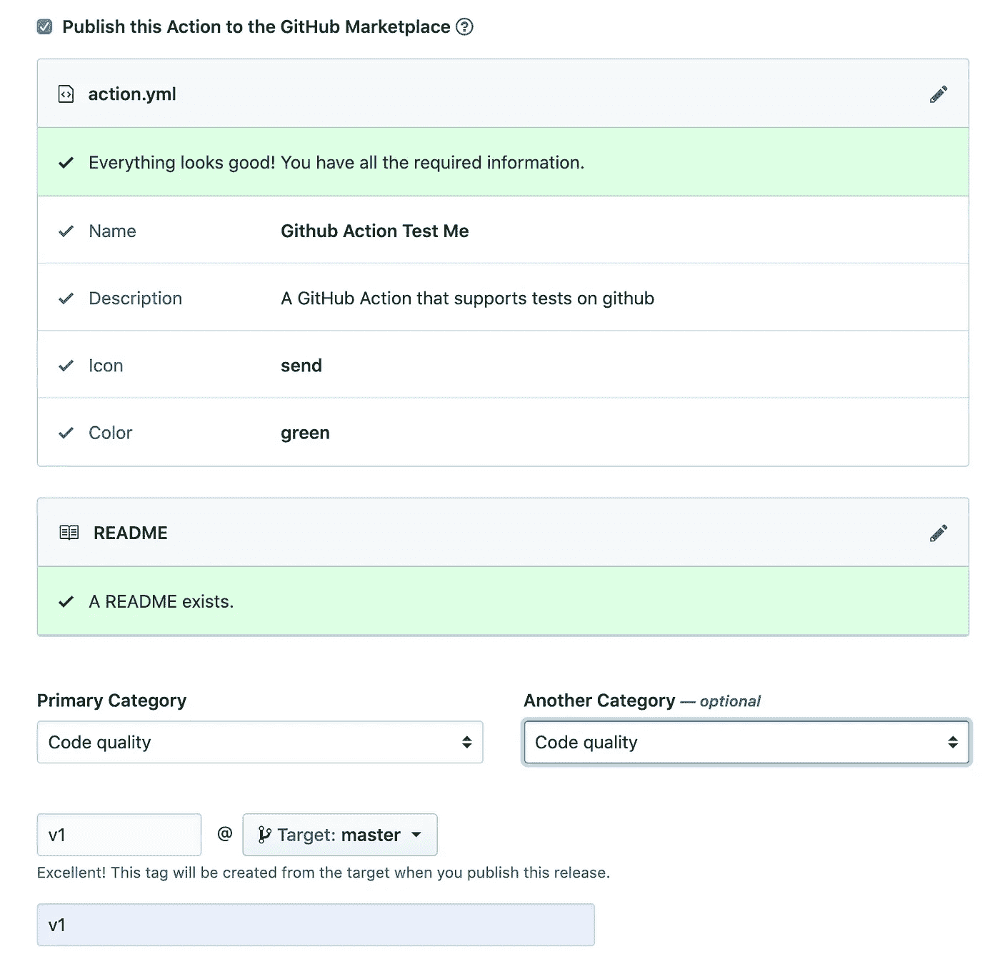

# 使用 Docker 容器构建 GitHub 动作

> 原文：<https://betterprogramming.pub/build-github-actions-using-docker-containers-c57a97be60e2>

## 构建 GitHub 动作并将其部署到 GitHub 市场

由[莱昂纳多·叶](https://unsplash.com/@yipleonardo?utm_source=unsplash&utm_medium=referral&utm_content=creditCopyText)在 [Unsplash](https://unsplash.com/s/photos/picture-frame?utm_source=unsplash&utm_medium=referral&utm_content=creditCopyText) 上拍摄的照片

GitHub 支持几个第三方的持续集成和持续部署工具，比如 Travis CI 和 Circle CI。另一方面，GitHub 提供自己的 CI 服务，即 [GitGub workflows](https://help.github.com/en/actions/configuring-and-managing-workflows) 。

可以创建工作流来实现几个目标，比如构建 docker 映像、运行单元测试，甚至部署到远程服务器。工作流可以基于 [GitHub 事件](https://help.github.com/en/actions/reference/events-that-trigger-workflows)以及[外部事件](https://help.github.com/en/actions/reference/events-that-trigger-workflows#external-events-repository_dispatch)触发。例如，可以创建一个工作流，一旦您在存储库上创建了一个新的版本，这个工作流就会被执行。此外，相同的工作流可以配置为由外部 API 调用触发。

工作流的结构包括使用几个 [GitHub 动作](https://help.github.com/en/actions/building-actions/about-actions)来实现工作流目标。操作是完成 CI 工作流所需的任务。例如，[签出](https://github.com/marketplace/actions/checkout)动作将签出 runner 机器上的 GitHub 存储库。GitHub 行动的完整列表可以在 GitHub [市场](https://github.com/marketplace?type=actions)上查看。

动作不仅仅是 GitHub 开发的；事实上，开发 actions 是对公众开放的，许多知名公司甚至个人都开发了自己的 actions 并发布到 GitHub 市场。

有两种类型的操作可以与 GitHub 工作流一起使用和集成:

*   [Docker 容器动作](https://help.github.com/en/actions/building-actions/about-actions#docker-container-actions):这种类型允许你将动作所需的所有依赖项打包到 Docker 镜像中，它们将在执行动作之前在 runner 机器上构建。
*   [JavaScript 动作](https://help.github.com/en/actions/building-actions/about-actions#javascript-actions):这些动作直接在 runner 机器上运行，因此比 docker 动作快得多。动作必须用纯 javascript 编写，不使用任何二进制文件。

在这篇文章中，我将解释创建和发布 docker GitHub 操作的必要步骤。

构建 docker GitHub 动作非常简单和容易。下面是需要包含在操作存储库中的文件列表。

**action.yml:** 这个文件使用 YAML 语法，用来定义描述动作的动作元数据。以下是最需要的物品的简要说明:

*   name:GitHub 操作的名称。
*   描述:操作的简短描述。
*   运行:配置用于操作的 docker 图像。您可以提供公共 docker 映像或 docker 文件来构建 docker 映像。

还有其他可选项目，如动作输入参数和输出。所有配置项目的完整列表可在[这里](https://help.github.com/en/actions/building-actions/metadata-syntax-for-github-actions)找到。下面是一个动作文件示例:

**dockerfile:** 构建 GitHub 动作的 docker 可以通过提供一个公共的 docker 映像来完成，也可以通过引入一个 Docker 文件来描述应该如何构建动作的 Docker 映像来完成。GitHub 提供了为动作构建 docker 图像的标准和建议。例如，用户和工作目录 Docker 指令不应在 Docker 文件中用于操作。[在这里](https://help.github.com/en/actions/building-actions/dockerfile-support-for-github-actions)，你可以找到用 Docker 容器构建动作所需的完整建议列表。下面是一个 GitHub 动作的 Docker 文件的例子。

`**docker-entrypoint.sh**`**:**docker 入口点是封装动作逻辑的 shell 文件。例如，如果操作应该通过 SSH 连接到远程服务器，这个文件将利用所需的 SSH 命令连接到远程服务器并执行定义的任务。

`**README.md**` **:** 这个文件包含了使用动作和理解动作所需的所有信息。机密、必需的和可选的输入、输出和环境变量需要记录在这个文件中，这样其他人就很容易理解这些操作并能够使用它。

一旦动作存储库被创建并推送到 GitHub，就可以将动作发布到 GitHub marketplace，并开始在 GitHub 工作流中使用它。

在 GitHub marketplace 上发布动作的第一步是访问 GitHub 上的动作存储库，并点击存储库页面顶部的“Draft a release”按钮，如下图所示。

下一步是用所有需要的信息填充发布表单，最重要的是选中“将此操作发布到 GitHub Marketplace”复选框，如下图所示。

一旦您点击“发布发布”按钮，该操作将被发布到市场，并且可以使用创建的发布标签在 GitHub 工作流中使用。

# **结论**

执行持续集成和持续交付任务并不局限于 CI 应用程序，比如 Travis CI 和 Cercle CI。如果源代码托管在 GitHub 上，工作流和操作可以用来以更简单直接的方式完成相同的任务。

工作流最重要的优势之一是你可以基于 GitHub 内部事件来触发它们，而不会有任何麻烦或者使用 webhooks。