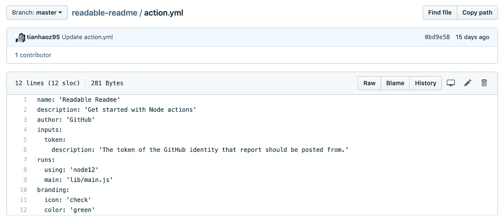
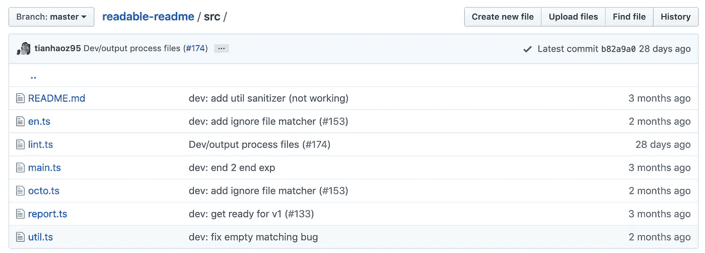
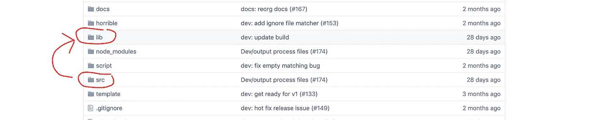
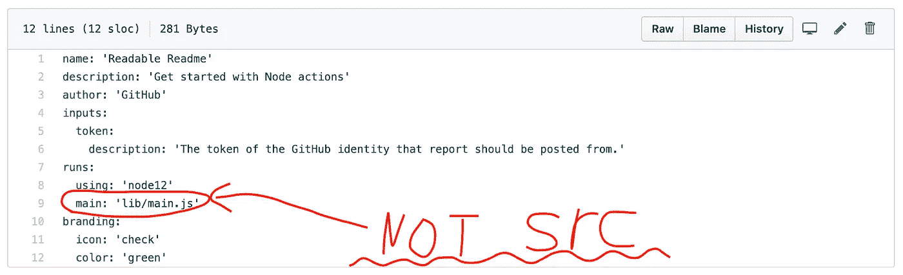
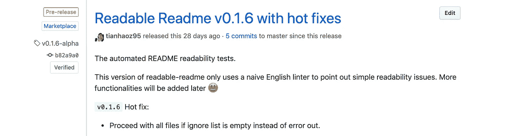
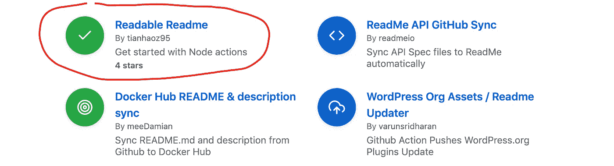
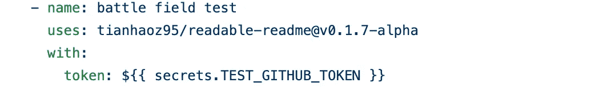
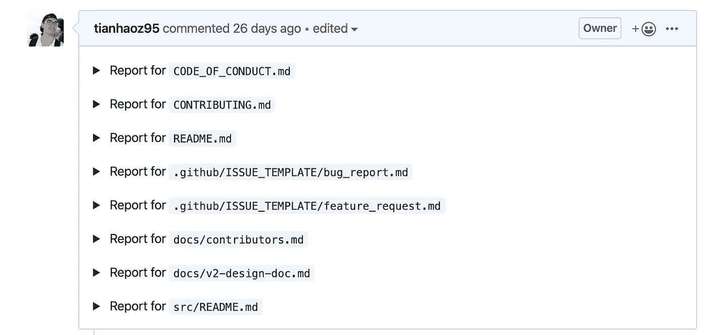

# 用 Typescript 构建 GitHub 操作

> 原文：<https://betterprogramming.pub/build-github-actions-with-typescript-bc0442572825>

## 它们跑得很快，到处都是

来自 [Pexels](https://www.pexels.com/photo/black-cat-holding-persons-arm-1049764/?utm_content=attributionCopyText&utm_medium=referral&utm_source=pexels) 的 [Ruca Souza](https://www.pexels.com/@ruca-souza-32753?utm_content=attributionCopyText&utm_medium=referral&utm_source=pexels) 拍摄的照片

## GitHub Actions 是一个 CI/CD 平台

GitHub 动作(至于其他 [CI/CD](https://www.atlassian.com/continuous-delivery/continuous-integration) 服务/平台):

*   事件的触发器
*   准备环境
*   运行工作流
*   报告结果

## GitHub 动作可以是 docker 文件或 Javascript

在 [Dockerfile](https://docs.docker.com/engine/reference/builder/) 动作中:

*   环境由[容器层](https://medium.com/@jessgreb01/digging-into-docker-layers-c22f948ed612)定义
*   工作流是由入口点 bash 脚本定义的

在 JavaScript 操作中:

*   在`[package.json](https://docs.npmjs.com/files/package.json)`中，环境被定义为 NPM 模块
*   工作流由 JavaScript/TypeScript 代码定义

## JavaScript 动作更快、更稳定

与 [Dockerfile](https://docs.docker.com/engine/reference/builder/) 动作相比，JavaScript 动作的优势在于:

*   大多数 web/移动/后端开发人员熟悉的语法
*   随处运行(JavaScript 比 Docker 限制更少)
*   跳过容器构建和虚拟机预热，运行速度更快。

*注:让我们善待自己，用*[*TypeScript*](https://www.typescriptlang.org/)*代替 JavaScript 吧！*

# 步骤 1:配置操作

该配置将让 GitHub 知道如何运行该操作，以及如何将其列在 GitHub marketplace 上。

该配置由一个`yaml`文件`action.yml`定义，该文件包含:

*   动作的名称
*   动作的参数
*   运行操作的入口点

致谢:GitHub 动作配置示例来自 [readable-readme](https://github.com/tianhaoz95/readable-readme)

# 步骤 2:实现微服务

1.  为您的神奇动作编写源代码:

2.编译成 JavaScript 代码，并将它们添加到源代码控制中。

3.指向编译后的 JavaScript 代码的动作入口点。

# 步骤 3:发布操作

发布您的操作意味着在您的存储库中发布！

1.  给它一个版本号([语义版本化](https://semver.org/)首选。)
2.  留下一个简短的发布描述。

3.放松一下，喝杯咖啡。

# 第四步:开始使用动作

1.将已发布的操作添加到工作流程中。

2.看结果，再来一杯咖啡！

3.此操作链接文档并生成报告:

用于此演示的代码可在此处找到:

 [## 天昊 95/可读-自述

### 如果 README 不可读，那么其他任何东西都不可读。我们经常发现一个伟大的项目，但仅仅 5 分钟后就放弃了…

github.com](https://github.com/tianhaoz95/readable-readme)