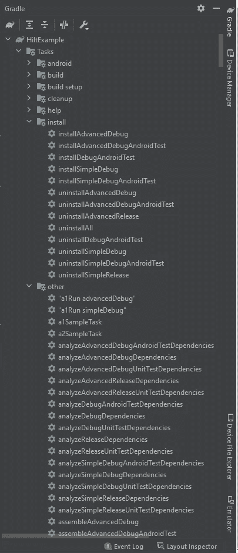

# build.gradle:我曾经忽略的源文件

> 原文：<https://betterprogramming.pub/build-gradle-the-source-file-we-tend-to-neglect-b05d728b42c4>

## 了解 build.gradle 的基础知识

照片由[đức trịnh](https://unsplash.com/es/@duc154?utm_source=medium&utm_medium=referral)在 [Unsplash](https://unsplash.com?utm_source=medium&utm_medium=referral) 上拍摄

这篇文章不会包含关于 Gradle 和 Groovy/Kotlin 的扩展信息。主要目的是为 Android 开发者的日常任务提供基本的“提示和技巧”。

还有什么比忽视一个`**build.gradle**`文件更糟糕的呢？忽略了两个`**build.gradle**`文件！事情还会更糟吗？当然，你可以在你的应用程序中添加更多的模块，这样你就可以忽略更多的构建文件了！

# 这些文件有什么区别？

有一个顶级的 Gradle 文件。在 Android Studio 中，你会看到它是`build.gradle (Project: project_name)`和每个模块的另一个构建文件`build.gradle (Module: project_name.module_name)`。
顶层构建文件通过`buildscript`为 Gradle 本身提供配置，通过`allprojects`为项目的所有模块提供配置。
模块的构建文件提供了其所属模块的配置和执行细节。

# 在 Android Studio 中查看所有 Gradle 任务

在 Android Studio 中，你可以在 IDE 的这一部分看到所有 Gradle 任务。

如果你没有看到`Tasks`文件夹，我不能给你更多关于如何让它工作的信息…但是*莱米特*绝对可以给你[指路](https://stackoverflow.com/a/67406955)。
现在已经显示了`Tasks`，你可以双击运行其中的任何一个。

# 让我们编码

对于这个例子，我们假设我们的项目有两种风格(`simple`、`advanced`)。

# 从公共回购插入库

插入库的通常方法是转到每个模块的构建文件的`dependencies`部分，并编写`implementation 'androidx.appcompat:appcompat:1.2.0'`。

# 每种口味的依赖性

我们可以为每种风格添加一个新的库依赖。这可以通过编写`simpleImplementation 'androidx.appcompat:appcompat:1.2.0'`为我们的应用程序的`simple`风格添加一个依赖项来实现。

# 为本地文件夹或存储库插入库

在某些特殊情况下，我们可能需要从本地文件夹添加依赖项。通常我们将库添加到将要使用的模块的`libs`文件夹中。

> 对于我们的例子，假设我们有一个本地图书馆“balloon.aar”。
> 这个库是 [skydoves/Balloon](https://github.com/skydoves/Balloon) ，我下载它是为了演示。

如果你想在你的`libs`文件夹下添加所有风格的库，你可以把`implementation fileTree(dir: 'libs', include:['*.aar'])`写到每个模块的构建文件的`dependencies`部分。

**除了添加一个像文件一样的库，你还可以让一个文件夹的行为像一个仓库**。我们应该在顶层编译文件中编写`flatDir { dirs “repo" }`,如下所示:

现在，我们已经准备好添加库，放在`repo`文件夹下，通过将`implementation (name:"balloon", ext:"aar")`写到每个模块的构建文件的`dependencies`部分。

# 梯度阶段

Gradle 有 3 个不同的[构建阶段](https://docs.gradle.org/current/userguide/build_lifecycle.html#sec:build_phases)。在本节中，我们将看到如何为**配置**和**执行**阶段编写构建指令。

`doFirst`和`doLast`将进入**执行**阶段，但这两个程序块之外的任何程序块都将在**配置**期间执行。
假设您想要运行一个名为`anotherTask`的任务，您将在运行控制台输出中看到`a1SampleTask`的行`A1 -> Configuration phase`。无论您选择执行哪个任务，任务的配置都会一直发生。

# 结合任务

假设您有两个任务(`a1SampleTask`、`a2SampleTask`)，您希望在它们之间建立一些联系。
如果你想执行`a2SampleTask`但是`a1SampleTask`应该总是在前面运行，你可以通过彼此依赖来绑定它们(`a2SampleTask.dependsOn(a1SampleTask)`)。
一个轻得多的键合是`a2SampleTask.mustRunAfter(a1SampleTask)`。当你单独执行`a2SampleTask`时，它不会运行`a1SampleTask`。但是，如果你想同时执行`a2SampleTask`和`a1SampleTask`，它总是在`a2SampleTask`之前执行`a1SampleTask`。

# 动态任务

有些任务依赖于从一开始就不存在的任务。有些任务和属性是稍后创建的，例如应用程序变体。
你不能像我们之前看到的那样创建一个任务，并使用像`simpleDebugSampleTask`这样的变体。如果您想在安装应用程序后运行它(这使您依赖于应用程序变体)，您应该创建一个动态任务，如下所示:

在本例中，您必须在创建自己的任务之前检查`variant`及其`install`任务，该任务也是动态的。

# 插件实现

我们有两种方法为 Gradle 编写插件(**二进制插件**和**脚本插件**)。在本例中，我们将创建一个动态任务来修改导出的 apk 文件的名称。
在`app`模块中新建一个文件`outputFilesHandling.gradle`，并在其中创建一个动态任务(用于重命名导出的 apk 文件)。

然后你可以去你的`app`模块，应用这个任务(`apply from: outputFilesHandling.gradle"`)。确保使用`apply from`而不是`apply plugin`。

脚本插件足以应对我们的大多数挑战。如果你想进一步实现并公开分享你的插件，你必须使用二进制插件。沙鲁克可以[帮你](https://proandroiddev.com/gradlepluginandroidsdk-8a2494cbd238)做这个！

# 本指南的项目

如果你想看到以上所有内容和更多的 Android 属性，请访问我的示例项目。