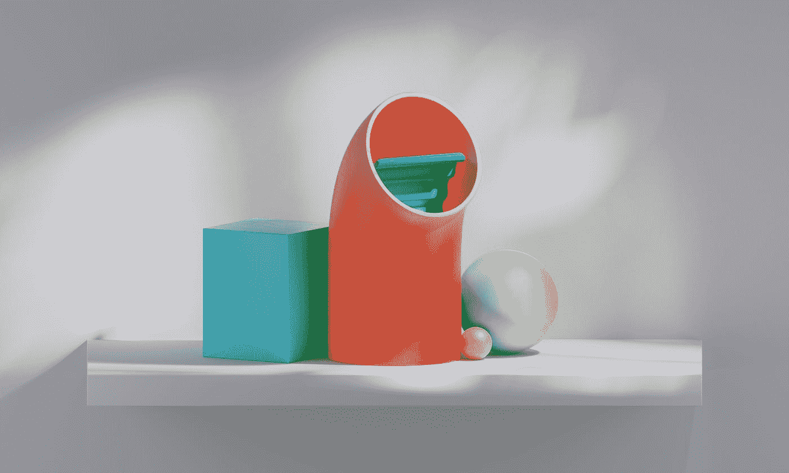
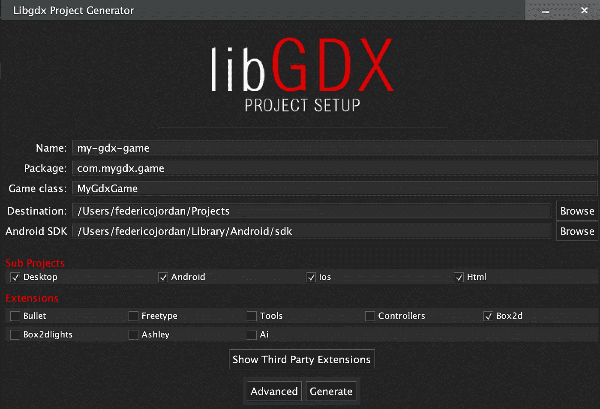
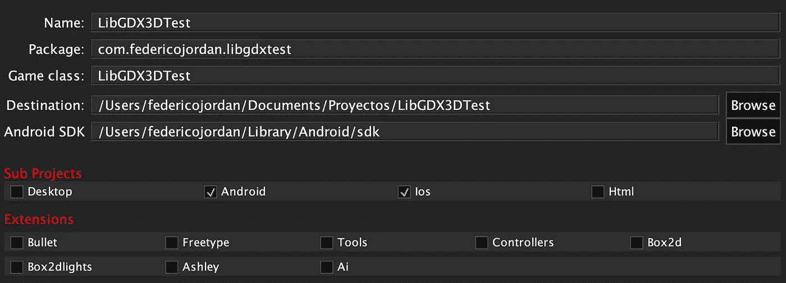
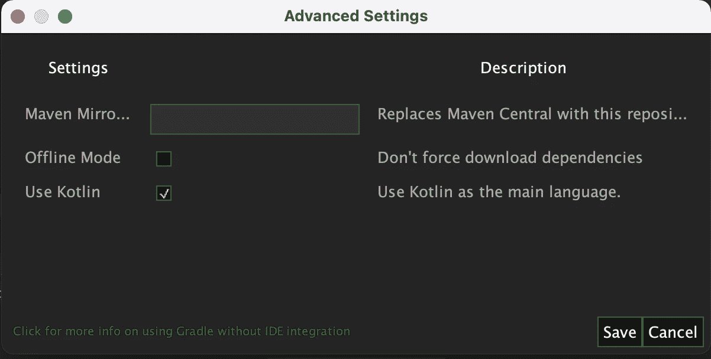
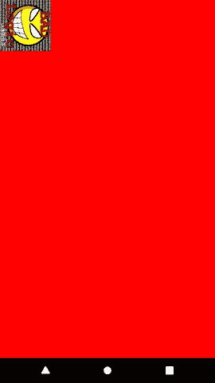
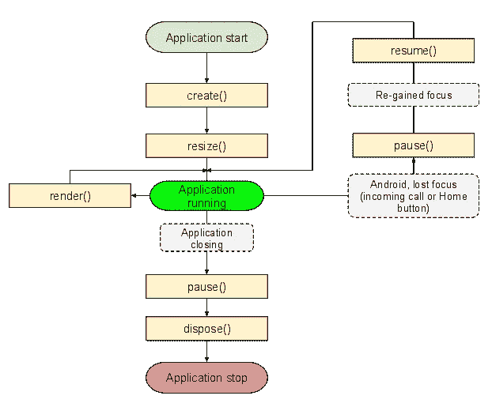
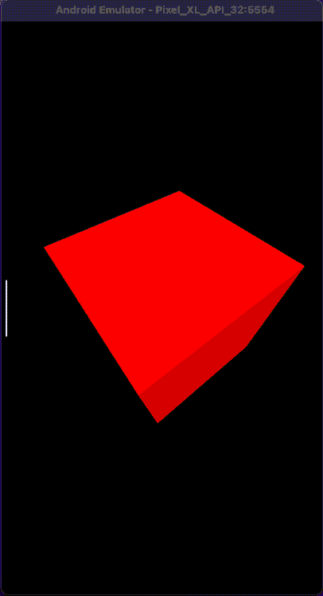
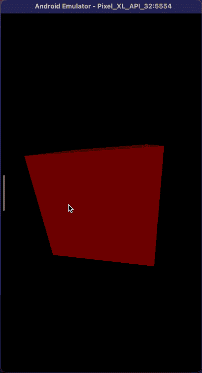
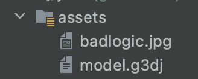
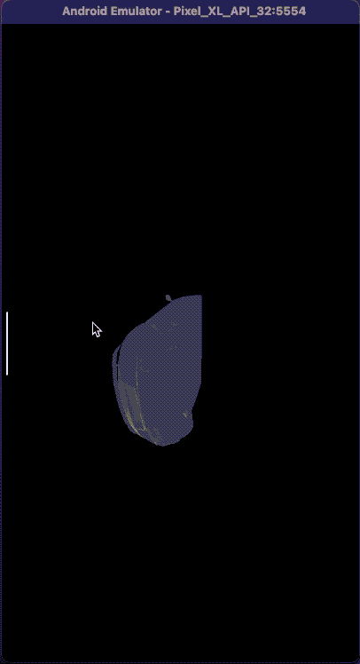

# 使用 Kotlin 中的 LibGDX 为 Android 构建 3D 版本

> 原文：<https://betterprogramming.pub/build-in-3d-for-android-using-libgdx-in-kotlin-1cbf496cae2e>

## 进入 3D 空间的第一步



由[阿莫克兰·艾特-卡茨](https://unsplash.com/@amokraneaitk?utm_source=medium&utm_medium=referral)在 [Unsplash](https://unsplash.com?utm_source=medium&utm_medium=referral) 拍摄的照片

你有没有想过用 3D 技术为手机制作一些东西？

做 it 多平台怎么样？

当然，我们知道有许多本地替代方案。例如，如果你想在 iOS 上使用 [SceneKit](https://developer.apple.com/documentation/scenekit/) ，或者在 Android 上使用 [Vulkan](https://developer.android.com/ndk/guides/graphics) 。但是我们的想法是构建一次，然后部署两个目标。此外，桌面或网络，如果我们想要的。

# 关于 LibGDX

我选择用来玩 2d 或 3d 图形的框架是 [LibGDX](https://libgdx.com/) 。那到底是什么？它只是围绕 [OpenGL](https://www.google.com/url?sa=t&rct=j&q=&esrc=s&source=web&cd=&cad=rja&uact=8&ved=2ahUKEwil-OWn57vzAhWCHLkGHagcC5wQFnoECAMQAQ&url=https%3A%2F%2Fopengl.org%2F&usg=AOvVaw3RZRi5yeacEaeWok1WYv1h) 低级 API 的一个包装器。它有一个很棒的社区，并且有许多关于网络的文章和教程。

其他图形多平台工具呢？好吧，在我看来，我更喜欢 LibGDX，因为你在代码中有它。我知道还有其他的选择，但是你可以把一种脚本和一个非可选的 GUI 系统结合起来。也许你可以通过代码来完成，但这不是这里的想法。使用 LibGDX，您必须通过代码来完成所有工作，我认为您会学到更多的东西，并对您想要做的事情有更多的控制

# 创建项目

要启动一个新的 LibGDX 项目，我们必须转到[项目生成页面](https://libgdx.com/dev/project-generation/)并下载稳定版安装程序。

在写这篇文章的时候，稳定版将安装 LibGDX 1.10.0

这将下载一个`gdx-setup_latest.jar`文件。点击它

(如果您使用的是 macOS，并且在打开文件时遇到问题，只需从“系统偏好设置”->“安全与隐私”中允许即可)

如果您打开该工具，您将看到如下对话框:



LibGDX 安装工具

让我们完成信息:

*   名称:项目的名称。在我的例子中是 LibGDX3DTest
*   包:这将是 Android 中的包名或 iOS 中的包标识符
*   游戏类:LibGDX 应用程序的主类和起始点
*   目的地:项目所在的位置
*   Android SDK:Android SDK 的默认目标
*   子项目:在这里，我们现在只使用 Android 和 iOS
*   扩展:暂时没有人。如果我们想在未来模拟物理，如果是 2d 项目，我们将需要 [Box2d](https://box2d.org/) 或者 3D 项目的 [Bullet](https://github.com/bulletphysics/bullet3) 。这些是 LibGDX 包装器，以避免与原始 SDK 混淆。



最终设置

另一件事是，我们需要让 Kotlin 在这个项目中使用它。否则会生成只是为了用 Java。点击高级，出现设置:



启用“使用 Kotlin”并点击保存

让我们点击 Generate，它将在所需的文件夹中创建项目。

关于生成 LibGDX 项目的更多信息[在这里](https://libgdx.com/wiki/start/project-generation)

现在我们需要在 Android Studio 中打开项目。我目前使用的是 AS 2020.3.1，但使用新版本应该没有问题。

在 Android Studio 中运行项目。它应该显示以下屏幕:



LibGDX 应用的第一个屏幕

该应用程序将显示一个红色屏幕，上面有 LibGDX 旧所有者的原始徽标， [BadLogicGames](https://www.badlogicgames.com/) 。

我们可以在`AndroidManifest.xml`文件的`android:screenOrientation`属性中更改应用程序方向，将其设置为`portrait`而不是`landscape`:

```
...
android:screenOrientation="portrait"
...
```


“纵向”模式下的屏幕

# 学习基础知识

在开始在我们的屏幕上绘制一个基本的立方体之前，我们将去掉`LibGDX3DTest.kt`文件中的所有代码:

LibGDX 安装程序创建了一个 Java 文件，但是因为我们将使用 Kotlin，所以我们删除了`LibGDX3DTest.java`文件并用这个`LibGDX3DTest.kt`文件替换。

LibGDX 应用程序通常使用`ApplicationListener`接口的实现来运行，但在这种情况下，我们将使用一个名为`ApplicationAdapter`的类，它实现了`ApplicationListener`接口，并让我们摆脱一些未使用的方法。这就是为什么我们只覆盖我们需要的方法。

这个基本示例包含三个 LibGDX 生命周期方法:

*   `create()`:创建应用程序时调用一次的方法。用于为我们的应用程序/游戏创建整个环境
*   `render()`:每次渲染时游戏循环从应用程序调用的方法。游戏逻辑更新通常也用这种方法进行。
*   `dispose()`:应用程序销毁时调用。



LibGDX 应用程序生命周期的完整流程图

在 LibGDX 应用程序运行中调用了其他方法。关于完整生命周期的更多信息[请点击此处](https://libgdx.com/wiki/app/the-life-cycle)

在这个最小的例子中，我们在我们的`LibGDX3DTest`类中创建了两个变量:

*   `lateinit var batch: SpriteBatch`
*   `lateinit var img: Texture`

## SpriteBatch

由于 OpenGL 的工作方式，最好将调用分组或“批量”绘制在一起，以获得最佳性能。一个`SpriteBatch`是一个`Batch`，用于绘制精灵。更具体地说，它在 OpenGL 中处理在四边形上绘制一堆纹理。

这种分组就是为什么你在没有首先调用`batch.begin()`的情况下试图绘制到`Batch`会得到一个错误，因为这标志着批处理开始分组绘制调用的工作。当你在批处理上调用`draw()`时，它还没有完成绘图工作，它只是组织你给它的数据。它将等待绘制到屏幕，直到`batch.end()`被调用。

最后，我们调用`batch.dispose()`来释放分配给特定资源的内存。

参考`SpriteBatch.java`源代码[此处](https://github.com/libgdx/libgdx/blob/master/gdx/src/com/badlogic/gdx/graphics/g2d/SpriteBatch.java)

## 纹理

一个纹理包装了一个标准的 OpenGL ES 纹理。纹理是可以管理的。如果 OpenGL 上下文丢失，所有托管纹理都将失效。当用户切换到另一个应用程序或收到来电时，就会发生这种情况。托管纹理会自动重新加载。

在我们的例子中，我们使用了一个名为`badlogic.jpg`的文件中的 LibGDX 纹理，它被分配到内存中，在`batch`中使用，并最终在生命周期结束时被释放。

参考`Texture.java`源代码[这里](https://github.com/libgdx/libgdx/blob/master/gdx/src/com/badlogic/gdx/graphics/Texture.java)

## ScreenUtils

在我们的例子中，我们使用`ScreenUtils.clear`方法清除整个屏幕，背景为红色。如果我们改变这个方法的值，我们可以改变它的颜色。目前，也许没有必要这样做，但是如果我们想要一个动画精灵，我们需要清空屏幕以避免看到之前的动画帧。

此处引用 ScreenUtils 源代码[。](https://github.com/libgdx/libgdx/blob/master/gdx/src/com/badlogic/gdx/utils/ScreenUtils.java)

现在我们已经了解了 LibGDX 应用程序的基础，我们将继续 3D 绘图。

# 渲染立方体

我们将用以下内容更新`LibGDX3DTest.kt`文件:

这个特定的代码将为我们提供以下屏幕:



让我们看看这段代码是如何工作的。我用方法组织了代码，使其更容易理解。

首先，我们将回顾一下我们现在使用的新组件:

*   `PerspectiveCamera`:会给我们 3D 场景的视觉。我们可以调整位置、方向和范围。此处参考。
*   `ModelBatch`:和`SpriteBatch`一样，但是是 3D 渲染。参考[此处](https://github.com/libgdx/libgdx/blob/master/gdx/src/com/badlogic/gdx/graphics/g3d/ModelBatch.java)
*   `Model`:这是对我们想要渲染的特定模型的引用。包含有关顶点数据、纹理映射等的信息。这里引用。
*   `ModelInstance`:使用一个`Model`引用创建一个具有特定数据的实际实例。在我们的例子中，如果我们想要创建许多立方体，我们将使用一个`Model`和许多`ModelInstance`实例。此处参考。
*   它帮助我们设置灯光，以便更好地看到 3D 世界。此处参考。

呈现该立方体的过程很容易用这些方法的名称来解释:

## 创建()

1.  我们创建`PerspectiveCamera`并调整位置和视野范围
2.  然后我们创建`ModelBatch`、`Model`和`ModelInstance`，它们将使用那个`Model`
3.  最后，我们用特定的灯光类型创建`Environment`，用各自的位置、方向和颜色创建`DirectionalLight`。

## 渲染()

1.  首先，我们用黑色清空屏幕
2.  每次执行渲染时(FPS 速率取决于硬件)，我们以随机的方向旋转相机
3.  我们需要为每个渲染帧更新摄像机的位置
4.  对于给定的`ModelInstance`和`Environment`，最重要的部分是在屏幕上呈现`ModelBatch`的内容

## 处置()

在这里，我们最终为`ModelBatch`和立方体`Model`释放内存资源

# 移动立方体

我们将在我们的项目中添加以下与`CameraInputController`相关的代码，并移除`spinCamera()`方法来停止自动移动:

```
class LibGDX3DTest: ApplicationAdapter() {
    ...
    private lateinit var cameraInputController: CameraInputController
    ...
override fun create() {
    ...
    createCameraInput()
    ...
}
...
private fun updateCamera() {
    camera.update()
    cameraInputController.update()
}
...
```

以下是完整的代码:

一个`CameraInputController`将把相机移动委托给用户在屏幕上的触摸/滑动手势。就这么简单。这就是为什么我们现在可以在应用程序中随意移动立方体。在本例中，我们使用光标进行操作，因为我们使用的是 Android 模拟器:



# 画一个搅拌机模型

现在我们知道了使用 LibGDX 进行 3D 渲染的基础，我们可以继续下一步:绘制一个 Blender 模型。

## 搅拌机是什么？

[Blender](https://www.blender.org/) 是一款免费开源的 3D 创作软件。它支持整个 3D 管道——建模、装配、动画、模拟、渲染、合成和运动跟踪，甚至视频编辑和游戏创作。

我们将使用 Blender 制作的模型来获得 LibGDX 支持呈现的格式。我已经从本页中选择了一款车型。我们需要下载的文件是`R8 Low Poly Model.fbx`。

这个特殊的文件需要用[这个特殊的工具](https://github.com/libgdx/fbx-conv)转换成`.g3dj`文件。命令应该是这样的:

```
./fbx-conv -v ../model.fbx model.g3dj
```

这将创建一个准备在我们的 LibGDX 应用程序中使用的`.g3dj`文件。

在我们的项目中，我们需要替换这一行:

```
cubeModel = modelBuilder.createBox(2f, 2f, 2f, material, attributes)
```

用那个:

```
carModel = G3dModelLoader(JsonReader()).loadModel(Gdx.*files*.internal("model.g3dj"))
```

所以我们可以从`.g3dj`文件生成`Model`数据。该文件将被添加到`assets`文件夹中:



我们还调整相机，以充分看到汽车模型。

最终的代码将是这样的:

这是汽车渲染的演示:



糟糕的分辨率是因为我使用的 MOV 到 GIF 转换工具:P

这个项目的完整源代码可以在[这里](https://github.com/fedejordan/LibGDX3DTest)找到

# 结论

将 LibGDX 与 Kotlin 结合使用是一种试验 2D 和 3D 渲染的简单方法。只需几行代码，我们就可以开始以一种简单的方式在手机屏幕上呈现对象。

在以后的文章中，我将展示如何在 iOS 设备上编译，如何使用 Box2D 模拟物理，等等。

感谢阅读！

# 来源

*   https://xoppa.github.io/blog/basic-3d-using-libgdx/
*   【https://libgdx.com/wiki/app/the-life-cycle 
*   [https://gamedev.stackexchange.com/a/121340](https://gamedev.stackexchange.com/a/121340)
*   [https://gamefromscratch.com/libgdx-minimal-3d-app/](https://gamefromscratch.com/libgdx-minimal-3d-app/)
*   [https://medium . com/swlh/3d-game-programming-with-Java-and-libgdx-setting-a-model-with-blender-1 eadab 56d 45d](https://medium.com/swlh/3d-game-programming-with-java-and-libgdx-setting-up-a-model-with-blender-1eadab56d45d)
*   [https://libgdx . com/wiki/graphics/3d/importing-blender-models-in-libgdx](https://libgdx.com/wiki/graphics/3d/importing-blender-models-in-libgdx)