# 使用 LibGDX 和 Kotlin 为 iOS 构建 3D

> 原文：<https://betterprogramming.pub/build-in-3d-for-ios-using-libgdx-and-kotlin-e509fb6ce7fd>

## iOS 进入 3D 空间的第一步

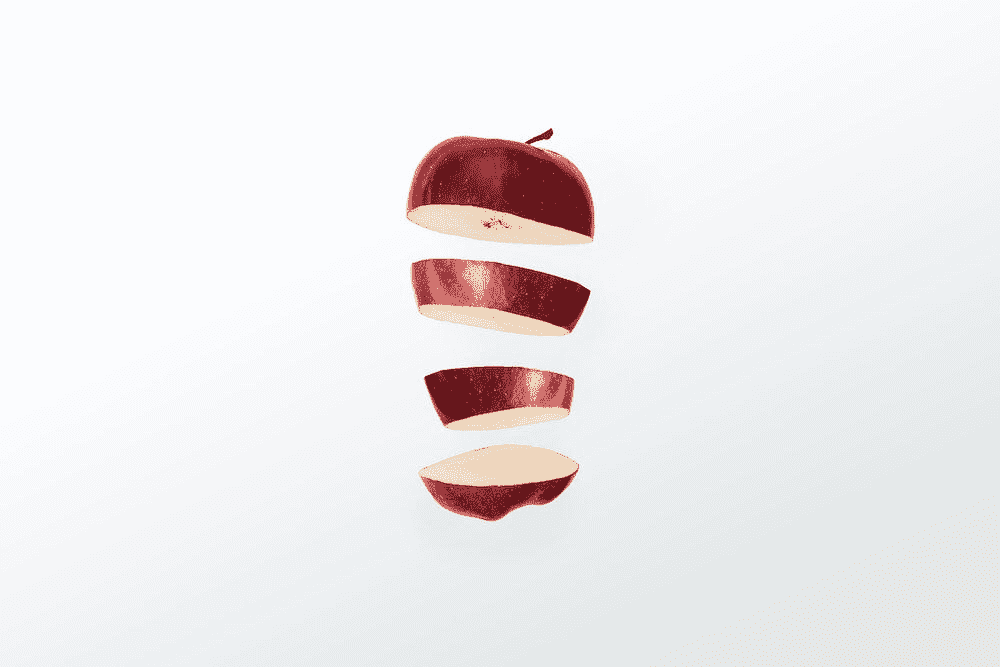

尼古拉·切尔尼琴科在 [Unsplash](https://unsplash.com/?utm_source=medium&utm_medium=referral) 上拍摄的照片

# 介绍

本文是关于如何在手机上渲染 3D 模型的第二部分。对于之前讨论核心逻辑和 Android 步骤的文章，点击[这里](/build-in-3d-for-android-using-libgdx-in-kotlin-1cbf496cae2e)。

我们将介绍在 iOS 中构建 LibGDX 3D 应用程序的步骤。

为此，我们将利用 RoboVM。

# 关于 RoboVM


RoboVM 徽标

[RoboVM](https://github.com/MobiVM/robovm) 是一个面向 iOS、macOS 和 Linux 的 Java 编译器。它基本上允许我们在 iOS 设备上编译我们的 JVM 应用程序(在本例中，我们将使用 Kotlin)。

RoboVM 附带了一个 Gradle 插件,当我们需要将项目作为 iOS 应用程序运行、编译或存档时，它会让我们的生活变得更加轻松。我们将利用该插件在 iOS 模拟器中编译它。这里的是官方的 Gradle 插件页面

该编译器于八年前正式发布，但 [MobiDevelop group 主动](https://github.com/MobiVM)在这几年让它活了下来。在写这篇文章的时候，它的最后一个版本是一个月前(2.3.18)

这是官方移动开发机器人网站的链接

# 配置 RoboVM

这里我们唯一需要配置的是 Gradle 插件，因为如果我们在 LibGDX 安装工具中选择“iOS”选项，核心库已经添加到项目中了:

```
...
project(":ios") **{** apply plugin: "kotlin"
    apply plugin: "robovm"

    dependencies **{** implementation project(":core")
        api "com.mobidevelop.robovm:robovm-rt:$roboVMVersion"
        api "com.mobidevelop.robovm:robovm-cocoatouch:$roboVMVersion"
...
```

要配置 RoboVM Gradle 插件，我们需要:

1.  转到`Android Studio`菜单，然后转到`Preferences`
2.  在`Plugins`部分，我们将键入`MobiVM`，这是我们正在寻找的 Gradle 插件的名称。
3.  我们点击`Install`,在我们的 Android 工作室中获得插件

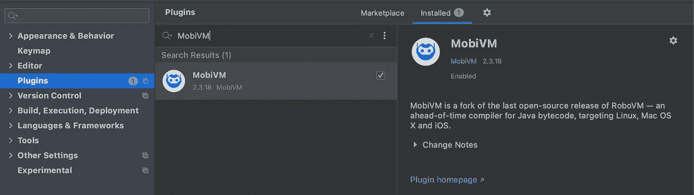

MobiVM 插件

写这个帖子的时候，最后一个版本是`2.3.18`。

安装完成后，插件会建议我们重启 IDE。

我们继续重启 IDE，然后如果我们查看我们的 Android Studio 菜单，我们将有新的`RoboVM`选项可以使用:

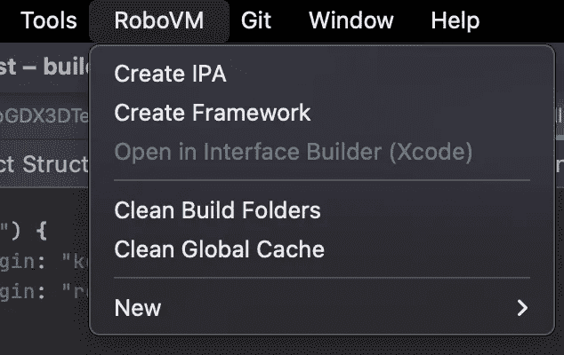

RoboVM 菜单

# 创建运行中的 iOS 配置

现在，我们需要创建 iOS 配置，以便从我们的 Android Studio 编译到我们的 iOS 模拟器。

为此，我们将在`Run/Debug Configuration`选项中转至`Edit Configurations`:

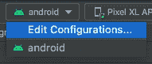

`Edit Configurations…`

然后在这里，我们点击加号(+)按钮添加一个`RoboVM iOS`配置:

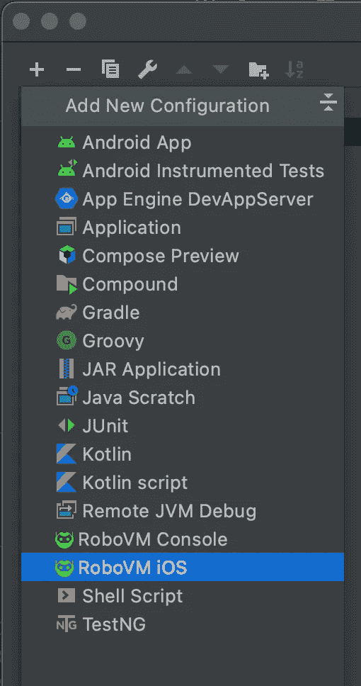

RoboVM iOS 配置

我们可以用以下数据配置视图:

*   名称:`iOS`
*   模块:`LibGDX3DTest.ios`
*   设备/模拟器:我们选择“模拟器”选项
*   设备类型:可以是任何人。
*   架构:应该是`x86_64`。目前，M1/苹果硅处理器(`arm64`)不支持 RoboVM

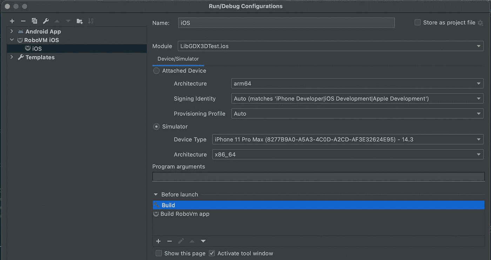

iOS 配置字段

我们点击 OK，新的 iOS 配置被添加到我们的列表中:

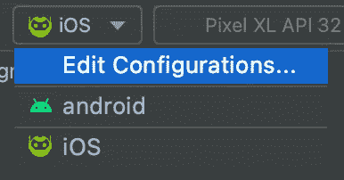

iOS 配置

# 在我们的模拟器中编译项目

为了编译，我改变了项目级别`build.gradle`来使用这些版本:

```
dependencies **{** classpath 'com.android.tools.build:gradle:7.0.4'
    classpath 'com.mobidevelop.robovm:robovm-gradle-plugin:2.3.18'
    classpath "org.jetbrains.kotlin:kotlin-gradle-plugin:$kotlinVersion"
**}**
```

我们将 IntelliJ Idea MobiVM 插件与`robovm-gradle-plugin`版本匹配，也就是`2.3.18`。

此外，我们需要在`allprojects`部分用相同的数字设置`roboVMVersion`变量:

```
gdxVersion = '1.11.0'
roboVMVersion = '2.3.18'
box2DLightsVersion = '1.5'
```

在编译之前，我建议在终端上运行以下命令:

```
xcrun simctl erase all
```

这将清理我们模拟器的缓存。在编译 RoboVM 时，我遇到过模拟器崩溃而没有先删除缓存的问题。

最后，我们点击 Run ( `Control+R`)，我们得到了类似于这个屏幕的东西:

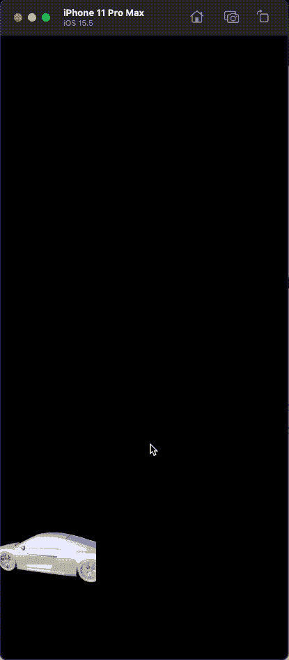

我们在 iOS 中的项目

我们让它跑起来了！但你可能会注意到，这辆车没有居中，似乎有点小。

我们将使用`IOSLauncher.java`并在`createApplication()`方法中添加以下代码行:

```
double scale = UIScreen.*getMainScreen*().getScale();
return new IOSApplication(new LibGDX3DTest(scale), config);
```

对于 android 部分(`AndroidLauncher.java`)，我们只需将`onCreate`方法的最后一行修改如下:

```
initialize(new LibGDX3DTest(1), config);
```

最后，这些是对我们的`LibGDX3DTest.kt`文件的更改:

*   我们添加一个名为`scale`的构造函数变量:

```
class LibGDX3DTest(private var scale: Double) : ApplicationAdapter() {
```

*   然后，我们使用那个`scale`属性乘以 LibGDX API 给我们的`width`和`height`。我们在`Gdx.gl.glViewport`调用的`clearScreen`方法中更改了以下内容:

```
val width = (Gdx.*graphics*.*width* * scale).toInt()
val height = (Gdx.*graphics*.*height* * scale).toInt()
Gdx.*gl*.glViewport(0, 0, width, height)
```

如果我们在 iOS 中再次运行我们的应用程序，我们会得到以下结果:

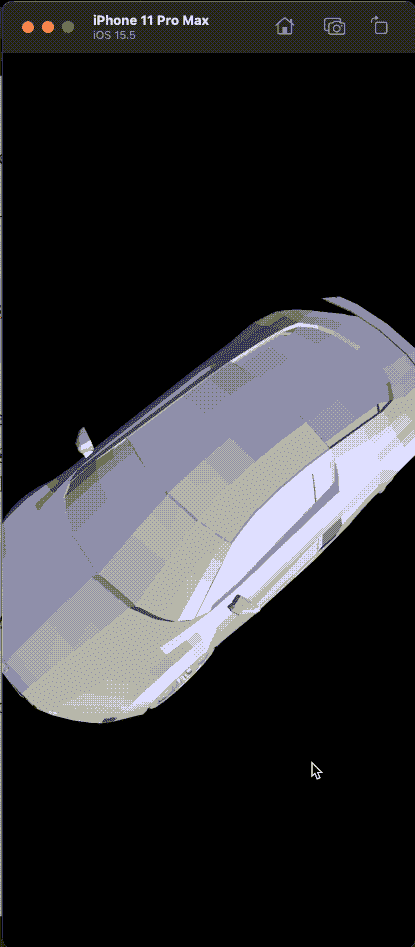

就是这样！我们在 iOS 模拟器中获得了我们的汽车 3D 模型渲染。

# 在设备中编译

首先，如果我们想在 iOS 设备上编译，我们必须更改配置:

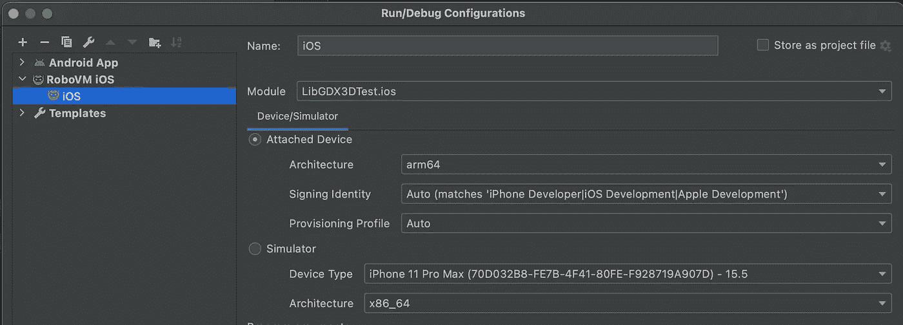

iOS 配置

这样，我们通知编译器构建一个 arm64 架构，而不是在设备上运行(我有一个 iPhone XR)。

但是如果我们尝试运行它，我们可能会得到如下消息:

```
[ERROR] 18:57:06.534 AppLauncher failed with an exception:
[ERROR] 18:57:06.535 org.robovm.libimobiledevice.LibIMobileDeviceException: LOCKDOWN_E_INVALID_SERVICE
[ERROR] 18:57:06.535  at org.robovm.libimobiledevice.LockdowndClient.checkResult(LockdowndClient.java:133)
[ERROR] 18:57:06.535  at org.robovm.libimobiledevice.LockdowndClient.startService(LockdowndClient.java:83)
[ERROR] 18:57:06.535  at org.robovm.libimobiledevice.util.AppLauncher.launchInternal(AppLauncher.java:708)
[ERROR] 18:57:06.535  at org.robovm.libimobiledevice.util.AppLauncher.launch(AppLauncher.java:1057)
[ERROR] 18:57:06.535  at org.robovm.compiler.target.ios.AppLauncherProcess$1.run(AppLauncherProcess.java:67)
```

这是 RoboVM 的一个已知 bug，解决方案是首先从 Xcode 构建一个空项目，使用相同的包标识符。

所以我们用相同的`BundleID`在 Xcode 中创建一个空项目。要得到`BundleID`，我们可以看一下`robovm.properties`文件。在这种情况下，将是`com.fedejordan.libgdx3dtest`:

```
app.version=1.0
app.id=com.fedejordan.libgdx3dtest
app.mainclass=com.fedejordan.libgdx3dtest.IOSLauncher
app.executable=IOSLauncher
app.build=1
app.name=LibGDX3DTest
```


在 Xcode 13.4 中创建项目

我们将它存储在`LibGDX3DTest`项目文件夹中的一个名为`xcode-project`的文件夹中。

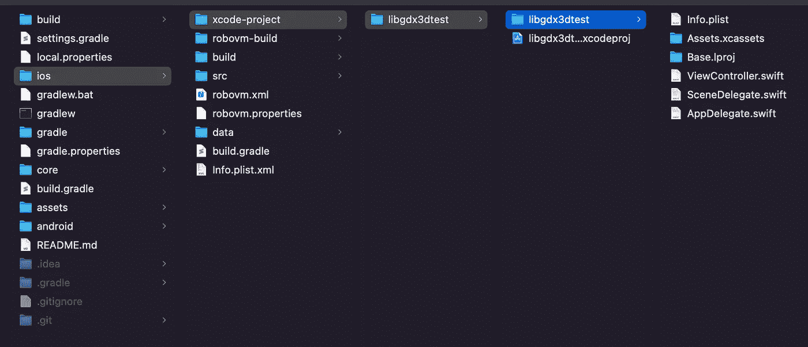

创建了空 Xcode 项目

我们让它从 Xcode 运行，我们停止运行，然后切换回 Android Studio 运行我们真正的 LibGDX 项目:


在 iOS 设备中编译时的演示

# 结论

LibGDX 是一个通用的框架，允许我们在多种平台上编译。我们可以在 iOS、Android、桌面和 HTML 中编译许多主题，如 2D 绘图和 3D 模型，我们可以创建可能使用密集图形渲染的游戏或应用程序。

当在 iOS 中编译时，我们必须做一些设置才能让它工作，但一旦我们得到它，我们就可以继续迭代核心逻辑(没有附加平台)来继续我们的项目。

在我看来，我通常选择 LibGDX 作为创建业余游戏的主要框架，因为它不像拖放那样简单。它允许我们从编程的角度参与游戏的整个逻辑。像渲染、调整大小、动画、精灵、背景、游戏逻辑和用户界面等主题都是灵活的。

# 来源

停不下来推荐[mobi VM gitter 论坛](https://gitter.im/MobiVM/robovm)；他们一直很活跃，回答您对 RoboVM 的任何疑问和问题！谢谢，[汤姆-斯基](https://github.com/Tom-Ski)和 [dkimitsa](https://github.com/dkimitsa) 的帮助。

其他来源:

*   [https://plugins.jetbrains.com/plugin/14440-mobivm](https://plugins.jetbrains.com/plugin/14440-mobivm)
*   [https://groups.google.com/g/robovm/c/hlX8Lh2S-N4](https://groups.google.com/g/robovm/c/hlX8Lh2S-N4)
*   [https://medium . com/@ bschulte 19 e/deploying-your-libgdx-game-to-IOs-in-2020-4 ddce 8 fff 26 c](https://medium.com/@bschulte19e/deploying-your-libgdx-game-to-ios-in-2020-4ddce8fff26c)
*   [http://robovm.mobidevelop.com/](http://robovm.mobidevelop.com/)
*   [https://github.com/MobiVM](https://github.com/MobiVM)