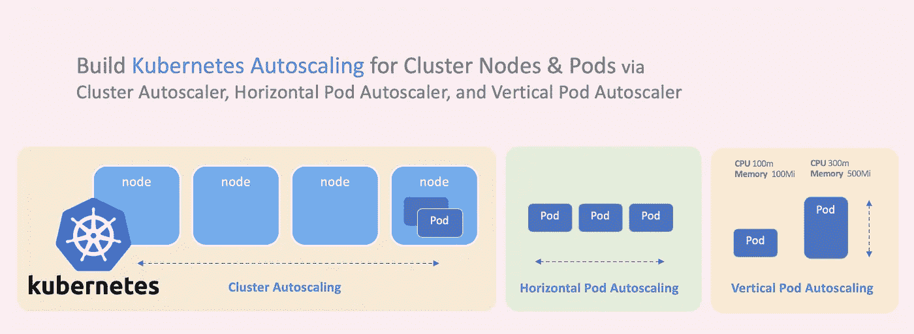
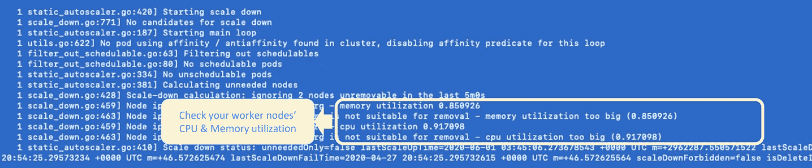
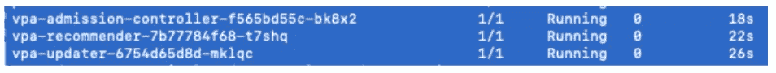
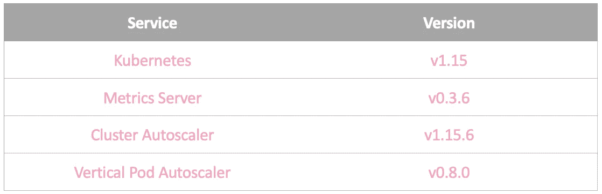

# 为集群节点和应用程序单元构建 Kubernetes 自动伸缩

> 原文：<https://betterprogramming.pub/build-kubernetes-autoscaling-for-cluster-nodes-and-application-pods-bb7f2d716b07>

## 通过集群自动缩放器、水平 Pod 自动缩放器和垂直 Pod 自动缩放器



作者照片。

Kubernetes 支持自动伸缩，以便在需要时扩展您的工作节点集群和应用程序单元。它也可以缩小规模以节省资金。

有三种类型的 Kubernetes 自动缩放。在本文中，我们将分别介绍它们，并逐步探索每种类型。

1.  集群自动缩放—这将通过集群自动缩放器自动调整集群的工作节点数量，以优化节点资源。
2.  水平单元自动扩展—这可以根据单元的 CPU 和内存利用率，通过水平单元自动扩展来调整部署中的单元数量。
3.  垂直 pod 自动扩展—这将调整 pod 的 CPU 和内存，以满足应用程序的实际使用。

# 先决条件

Kubernetes 和 Metrics Server 都已启动并运行。

## 什么是度量服务器？

Metrics Server 可以收集 Kubernetes 的资源使用情况，并将其暴露给其 API 服务器，这可以帮助水平和垂直 Pod 自动缩放器了解当前的资源使用情况。

您可以使用以下命令安装 Metrics Server:

```
kubectl apply -f https://github.com/kubernetes-sigs/metrics-server/releases/download/v0.3.6/components.yaml
```

# 聚类自动缩放

集群自动缩放器支持以下云提供商(我在 AWS 上部署到我的 EKS 集群):

*   [阿里云](https://github.com/kubernetes/autoscaler/blob/master/cluster-autoscaler/cloudprovider/alicloud/README.md)
*   [蔚蓝色](https://github.com/kubernetes/autoscaler/blob/master/cluster-autoscaler/cloudprovider/azure/README.md)
*   [AWS](https://github.com/kubernetes/autoscaler/blob/master/cluster-autoscaler/cloudprovider/aws/README.md)
*   [百度云](https://github.com/kubernetes/autoscaler/blob/master/cluster-autoscaler/cloudprovider/baiducloud/README.md)

1.  创建 IAM 策略:

```
{
    "Version": "2012-10-17",
    "Statement": [
        {
            "Action": [
                "autoscaling:DescribeAutoScalingGroups",
                "autoscaling:DescribeAutoScalingInstances",
                "autoscaling:DescribeLaunchConfigurations",
                "autoscaling:DescribeTags",
                "autoscaling:SetDesiredCapacity",
                "autoscaling:TerminateInstanceInAutoScalingGroup",
                "ec2:DescribeLaunchTemplateVersions"
            ],
            "Resource": "*",
            "Effect": "Allow"
        }
    ]
}
```

2.标记您的节点:

```
k8s.io/cluster-autoscaler/<cluster-name>: ownedk8s.io/cluster-autoscaler/enabled: true
```

3.安装集群自动缩放器:

```
kubectl apply -f [https://raw.githubusercontent.com/kubernetes/autoscaler/master/cluster-autoscaler/cloudprovider/aws/examples/cluster-autoscaler-autodiscover.yaml](https://raw.githubusercontent.com/kubernetes/autoscaler/master/cluster-autoscaler/cloudprovider/aws/examples/cluster-autoscaler-autodiscover.yaml)kubectl -n kube-system annotate deployment.apps/cluster-autoscaler cluster-autoscaler.kubernetes.io/safe-to-evict="false"
```

4.通过添加以下命令编辑集群自动缩放器的 YAML 文件，并修改 Docker 映像:

5.为 Kubernetes 服务帐户创建一个 IAM 角色，并覆盖现有角色:

```
eksctl create iamserviceaccount
    --name cluster-autoscaler **\**
    --namespace kube-system **\**
    --cluster **YOUR_CLUSTER_NAME** **\**
    --attach-policy-arn **YOUR_IAM_POLICY_ARN** **\**
    --approve **\**
    --override-existing-serviceaccounts
```

6.使用以下命令检查集群自动缩放日志。然后，您可以看到它正在检查所有节点的 CPU 和内存利用率以进行扩展:

```
kubectl get pod -n kube-system | grep cluster-autoscaler
kubectl logs **YOUR_CLUSTER_AUTOSCALER_POD_NAME**  -n kube-system
```



# **水平 Pod 自动缩放**

您可以使用以下 YAML 文件将水平窗格自动缩放器应用到您的部署中:

然后，您可以检查水平窗格自动缩放器的状态:

```
kubectl describe hpa **YOUR_SCALER_NAME**
```

## 尝试部署一个示例应用程序

您将能够看到水平 Pod 自动缩放器正在工作。


# **垂直 Pod 自动缩放**

1.  安装垂直 Pod 自动缩放器:

```
git clone https://github.com/kubernetes/autoscaler.git
cd autoscaler/vertical-pod-autoscaler./hack/vpa-up.sh
```

2.使用以下命令检查垂直 Pod 自动缩放器是否启动并运行:

```
kubectl get pods -n kube-system | grep vpa
```



## 尝试部署一个示例应用程序

您将能够看到垂直 Pod 自动缩放器正在工作。


# 我的工作版本



感谢阅读！