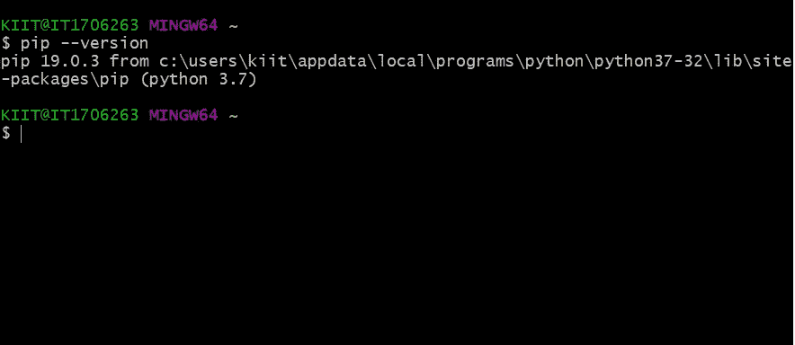
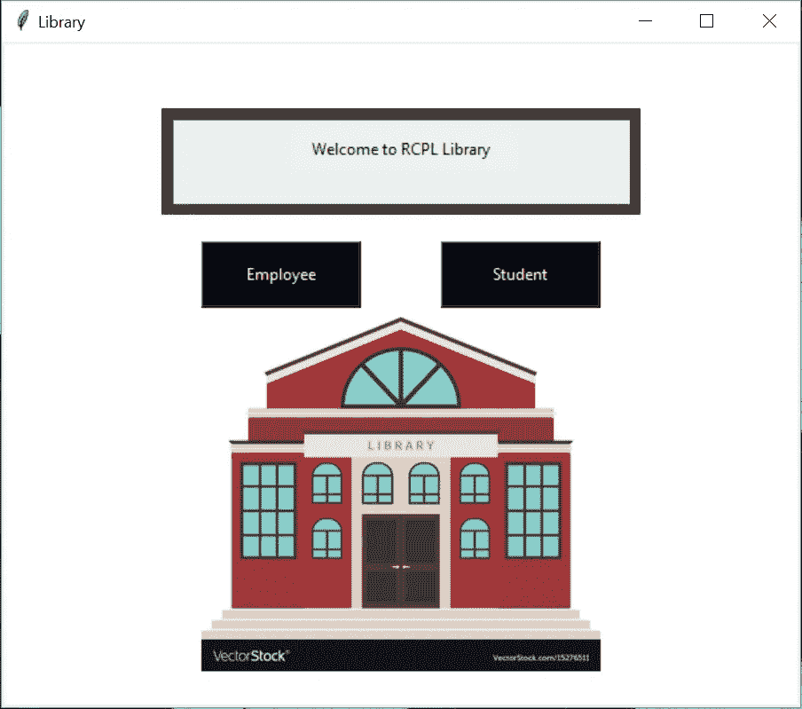
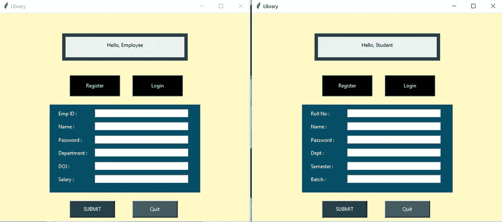
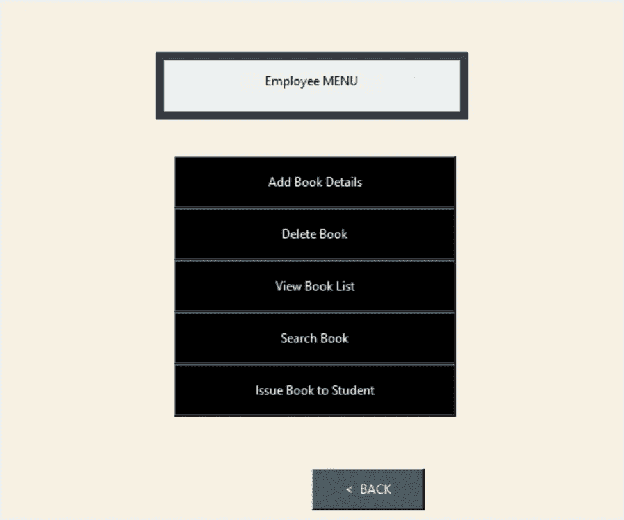

# 使用 Tkinter 从头开始构建库管理软件

> 原文：<https://betterprogramming.pub/build-library-management-software-using-tkinter-from-scratch-f598de2b15d2>

## 因为谁不爱一本好书呢？


照片由[阿尔方斯·莫拉莱斯](https://unsplash.com/@alfonsmc10?utm_source=medium&utm_medium=referral)在 [Unsplash](https://unsplash.com?utm_source=medium&utm_medium=referral) 上拍摄

你有没有想过拥有自己的个人图书馆，或者想知道现实生活中的图书馆管理系统是如何工作的？或者，也许你只是一个读者，想知道你在读什么，图书馆还能提供什么。嗯，作为一名开发人员，你的优势是几乎可以创建任何东西。

我们今天将创建一个图书馆管理软件，仅仅使用一个服务器端数据库和 [Tkinter](https://docs.python.org/3/library/tk.html) ，它可以做各种各样的事情。

**所以让我们开始建造这个东西吧！**

# Tkinter 是什么？

简而言之，Tkinter 是 Python 中的一个库，它帮助我们构建最简单、最快速的 GUI(图形用户界面)应用程序。这是最常用的方法，因为它很容易使用。

要了解更多关于 Tkinter 的信息，请访问 Python 网站，尽管我会推荐查看[这个教程](https://www.tutorialspoint.com/python/python_gui_programming.htm) ，因为我认为它比官方的更容易理解。

# 如何使用

要使用任何模块，首要的规则总是导入它们。在我们的例子中，我们姑且称之为`tk`作为速记符号。你的命令应该是`import tkinter as tk`。这个模块总是有两件事是绝对必要的。

1.  从我们的模块中添加主窗口对象，这将实际打开窗口，我们将在运行时显示我们的内容。为此，我们有一个名为`Tk()`的对象，它在*任何自定义窗口*上初始化。`window = tk.Tk()`其中`window`是我们的主要窗口对象。
2.  为了在这个窗口中包含所有的小部件，我们希望它在一个循环中连续运行。Tkinter 提供了一个名为`mainloop()`的方法，它被放在我们文件的最后，这样窗口总是循环运行，直到用户手动关闭它。

要演示这些作品如何看上面的例子。

# 枕头还是 PIL

还有一件我们需要的东西是 [**枕头**](https://pypi.org/project/Pillow/)**；**Python 的免费库，增加了对打开、操作和保存许多不同图像文件格式的支持。别担心，我们只是用它在我们的主页中添加一个小图片。

一旦 Pillow 安装到您的系统中，您就可以导入它并开始使用了。你还需要一个图像文件，它会放在你的主屏幕上，所以你可以随意选择你自己的图像，或者你可以用我的。

Pillow 有很多应用程序，但是我们将使用的是**图像**模块。要将 Pillow 导入您的文件，请键入`from PIL import Image`，然后键入您将存储图像的对象。`img = Image.open("path or image")`。

# 将所有包安装到您的 Python 环境中

在我们的源代码中实现和使用所有模块之前，每次添加新的包时，总有一个非常重要的步骤需要遵循，即在 Python 环境中安装它。

这个过程非常简单——您只需要选择一个终端。此外，您还必须确保您有 **pip** 可用。你可以通过输入`pip --version`来检查这一点



pip 版本

如果你已经从源代码安装了 Python，用来自[python.org](https://python.org/)的安装程序，或者通过[家酿](https://brew.sh/) 你应该已经有了 pip。如果您使用的是 Linux 并使用 OS 软件包管理器安装，您可能需要单独安装 pip。

## 安装软件包

要在 Python 环境中安装包，请在任意终端中输入以下内容:

```
pip install tkinter
pip install pillow
pip install pymysql
```

但是，如果您使用 Python 的任何其他发行版(我使用 Anaconda3)，那么安装包的步骤会有所不同。首先，打开 Anaconda 提示符**，**然后键入以下内容:

```
conda install -c anaconda tkinter     #Once prompted press y
conda install -c anaconda pillow      #Once prompted press y
conda install -c anaconda pymysql     #Once prompted press y
```

# 我们的最终产品应该是什么样的

在这个项目中，我们将创建的功能是简单但分支的，所以如果您记下我们将要构建的部分会更好:

期末专题概述

1.  我们将创建一个简单的主页，用户可以选择是作为一名员工登录(拥有所有权力)，还是作为一名学生登录(选项较少)。
2.  我们将为首次用户创建一个注册页面，也为现有用户创建一个登录页面。(适用于员工和学生)。
3.  一旦登录，用户将获得某些菜单选项。如果以员工身份登录，他们拥有添加图书、搜索图书、删除图书甚至向学生发放任何图书的所有权限。但是如果他们作为学生登录，他们只有两个选择；查看所有书籍或搜索特定的一本书。

最后但同样重要的是，我们将使用一个纯粹使用 [MySQL](https://www.mysql.com/) 的服务器端数据库，这样我们创建的所有记录都可以被正确保存。

点击此处查看完整源代码:

[](https://github.com/S-ayanide/Library-Manager) [## s-ayan ide/图书馆经理

### 一个图书馆管理软件，在这里你可以查看你的图书馆里所有的书，给学生发书，并做一个…

github.com](https://github.com/S-ayanide/Library-Manager) 

# 主页

每当有人打开我们的应用程序时，这将是主仪表板。它给用户两个选择；以员工或学生身份登录。



首先，让我们添加我们的背景图片。请随意选择您自己的图像，但在这种情况下，我将从源文件中选择我的图像。

使用**枕头**的**图像模块**制作一个**图像对象**，就像我们在`background_image = Image.open('<myimage>')`之前做的那样。现在你的图像存储在这个对象中，但是要在窗口中显示它，我们需要 [ImageTk](https://pillow.readthedocs.io/en/4.2.x/reference/ImageTk.html) ，这是 Pillow 包的另一个模块。

你不能只显示没有背景的图像。为此，您必须创建一个[画布](https://www.python-course.eu/tkinter_canvas.php)小部件。它们是长方形的盒子，用于绘画或其他复杂的布局。

如果用户增加了窗口的大小，你不希望画布停留在固定的高度和宽度。为了实现这个想法，我们从图像对象中提取了`ImageWidth`和`ImageHeight`，每当窗口大小增加时，我们将画布尺寸乘以一个系数“ **n”、**，该系数不应小于 0.25 或大于 5(图像变得太小或太大)。

为了在标题部分产生双重重叠，我们使用了两个框架并用不同的颜色将它们重叠起来。最后，两个简单的按钮连接到自定义功能，这将把用户带到注册和登录页面的按钮点击(我们还没有创建)。

***注意:我们使用*** `***place()***` ***而不是*** `***pack()***` ***因为它提供了更好的可视化以及更好的组件放置。***

# 注册和登录

用户点击后，我们将为员工和学生提供单独的注册和登录窗口。(属性不同)。



为了创建这个功能，我们将添加三个功能——员工注册`EmpRegister()`、学生注册`studentRegister()`和登录`Login()`。然而，在实现这个之前，我们需要清空之前的屏幕，否则所有的新标签和标题将会重叠，我们将得不到我们想要的输出。

为了清除所有我们不需要的先前的组件，我们在我们正在创建的函数中将它们设置为`global` 。例如，如果您的父函数有一个标签框架，并且父函数正在调用子函数，那么您应该在子函数中将组件设为全局的，然后在那里销毁它们。

在这个窗口中，我们已经销毁了所有我们不需要的组件，并添加了一个新的画布，给它的背景“浅海滩阴影”。在中间，我们创建了一个蓝绿色的标签框架，并在其中添加了所有我们需要的带有输入框的标签。

我们创建两个简单的按钮，即**提交**和**退出**。这些按钮将在整个项目中派上用场。无论我们创建什么函数，我们都可以使用`command = <functionName>`回调它们，因此，在我们创建注册或登录函数后，我们只需将它们链接到提交按钮本身。

一旦用户输入他们的凭证，我们就调用一个`getter` 函数，顾名思义，这个函数获取所有输入的值，并将它们存储在相应的变量中。稍后，我们将这些细节添加到我们的 MySQL 数据库中。

在获得所有值并执行必要的数据库处理后，我们清除输入字段。如果用户不得不删除他们输入的内容，这被认为是不好的做法。相反，通过实现`delete(0,END)`，我们确保我们的软件**在用户点击**提交**按钮后自动清除**输入字段值。

验证用户输入的所有值，如果满足所有条件，显示一个消息框，，提示“您已成功登录”，并转到菜单。否则，您将看到不符合标准的错误/验证。

[](https://github.com/S-ayanide/Library-Manager/blob/master/main.py) [## s-ayan ide/图书馆经理

### 更多信息请查看上述功能…

github.com](https://github.com/S-ayanide/Library-Manager/blob/master/main.py) 

# 创建菜单

现在您已经成功登录，并且能够从注册用户那里获取数据，让我们创建一个菜单屏幕(实际上是两个；一个给员工，一个给学生)。应用声明全局组件的相同概念，我们删除这个屏幕中不需要的所有资产/组件小部件，然后创建一个新的。



从现在开始所有的屏幕都相当简单。它只有一个标题框和许多中间的黑色按钮，功能包括增加一本书，删除一本书等等。

现在你可能知道，为了实现这些功能，我们需要创建一个新的函数，我们将通过按钮调用它。因此，与其把一个文件塞满，不如把它们分开并创建新的文件，从现在开始我们将把它们导入到主项目中(这也意味着所有这些文件将在一个新窗口中打开，因为我们在它们里面有`Tk()`)。

类似地，将为学生创建另一个菜单功能，只有两个按钮——查看所有书籍和仅搜索特定书籍——因此它的大小会小得多。在每个按钮的`command`部分，您可以看到它们附带的某些功能。它们只不过是我告诉你要保持分离的功能，这些功能将在以后导入。

下面就来一一说说这些简单的功能。

## 添加书籍

一个窗口，员工可以在其中将图书添加到图书馆，并提供有关图书的某些信息。(图书 ID、名称等)

添加书籍

## AddBooks()

这个函数创建一个新的画布，它在窗口打开时为窗口提供蓝色背景。此外，在中心有一个黑色标签框架，其中包含标签和条目，信息包括图书 ID、标题、主题、作者和图书状态(可用/已发行)。一旦点击，提交`bookRegister()`就被调用。

## 登记簿()

这将获取用户输入的所有值，创建一个到数据库的连接，并将所有值插入其中。维奥拉，你的书被添加了。

将书籍添加到数据库中

## 删除图书

员工可以从图书馆删除图书的窗口。

删除图书

## 删除()

这个函数创建一个新的画布，它在窗口打开时为窗口提供灰色背景。在中心有一个黑色标签框，它包含一个标签和一个请求图书 ID 的条目。按下“提交”后，设置对`deleteBook()`函数的回调。

## 删除图书()

这将从输入字段中获取值，并从表中删除该书。

从数据库中删除书籍数据

## 查看所有书籍

这个窗口向我们展示了我们图书馆中所有书籍的列表。每当我们添加任何显示在此处的新书时，我们在表格中所做的任何更改都将反映在此处。

查看书籍

## 视图()

有一个画布，在背景上提供浅黄色阴影。也有一个标题框架，就像我们以前一样。和显示表格的标签框架。

这个函数跟踪 y 坐标，在显示每个数据后，它将坐标向下移动 0.2，给我们一个类似表格的结构。

以表格形式查看图书馆中的所有书籍

## 搜索书

搜索书

和**删书一模一样。**唯一的区别是它将框架全球化，并在搜索后删除它们，因为它在同一个框架中显示结果。

## 搜索()

它从表中获取数据(主题),并返回所有匹配的数据。例如，如果用户搜索 Python，它会显示所有带有 *Subject = Python* 的书籍。

单击按钮后，它会销毁之前的标签和条目，只在那里显示搜索结果。

搜索给定主题的书籍

## 发行书

该窗口为员工提供了向学生发放图书的选项，前提是他输入了正确的图书 ID、正确的学生编号以及正确的员工 ID。

发行书籍

## 发行书籍()

创建一个带有标题框架的紫色画布，以及一个带有三个输入框的标签框架。

在点击**发布**时，它会创建一个对`issue()`的回调，该回调会完成这里的大部分工作。

## 问题()

获取用户输入的值，并检查用户输入的**图书 ID、员工 ID 和学生编号**是否存在于数据库中。当且仅当他们三个都存在，并且这本书的状态为“可用”(这意味着可用)，这本书才会发给学生。

成功发行图书后，图书的状态从“**有效**变为“**已发行**”。

向学生发放图书并更新图书状态

这个软件就这么多了。在学生部分，您有相同的按钮(查看所有书籍并搜索一本书)，因此只需为您刚刚创建的相同函数设置一个回调。

感谢您阅读本文。我真的很感激所有的努力。如果你在创建软件时遇到任何问题，试着将它们与我的源代码进行比较，或者在下面评论，我会试着回答它们。