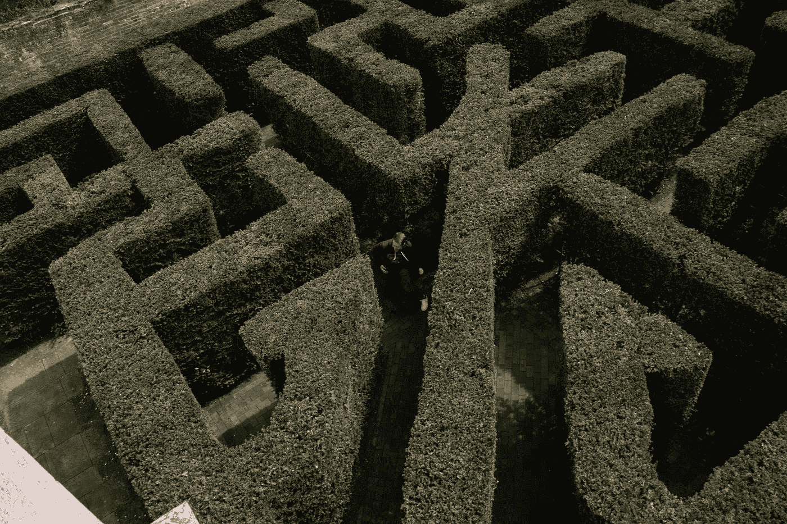
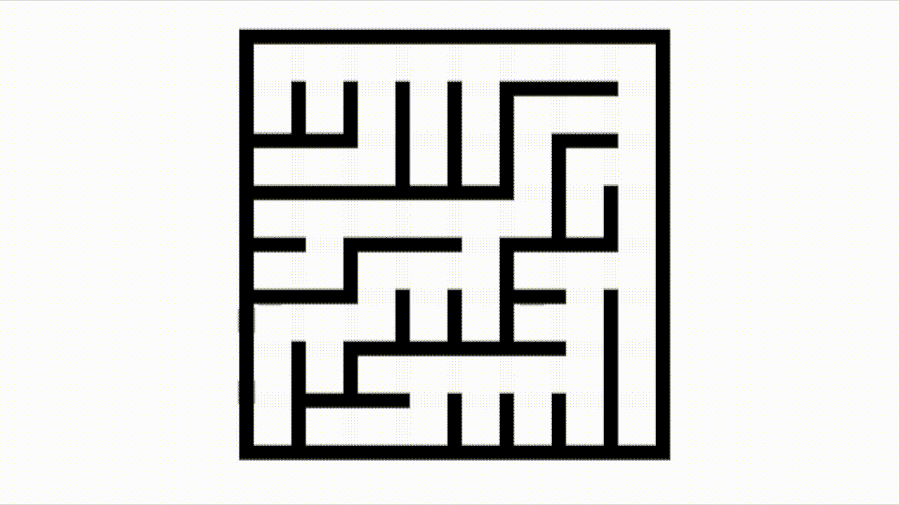
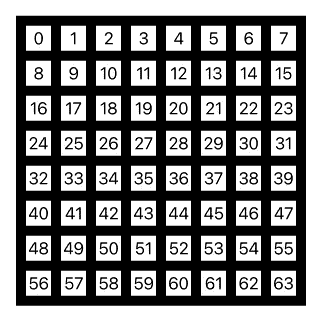
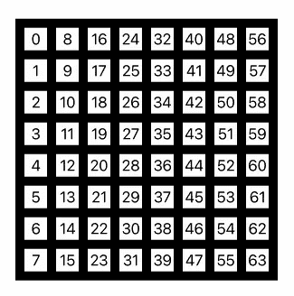
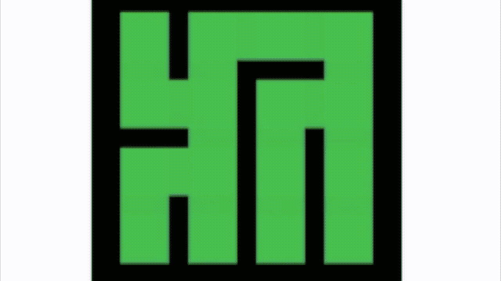

# 用 SwiftUI 建造迷宫

> 原文：<https://betterprogramming.pub/build-mazes-with-swiftui-3521aee2691>

## 使用 Combine 和 SwiftUI 网格的力量在 SwiftUI 应用程序中创建迷宫

托拜厄斯·拉德马赫在 [Unsplash](https://unsplash.com?utm_source=medium&utm_medium=referral) 上拍摄的照片。

我在周末翻阅[实用程序员书架](https://medium.com/pragmatic-programmers)，偶然发现[贾米斯·巴克](https://medium.com/@jamis)写的 [*程序员迷宫*](https://medium.com/pragmatic-programmers/table-of-contents-ad06b9e5f047) 。正如我读到的描述(“还记得以前编程很有趣吗？”)，我内心深处有个东西点了一下。是的，我记得这很有趣，但后来我意识到说明算法的代码使用了 Ruby，一种类似 Python 的语言，我不是很了解。

当我翻阅这本书的时候，所有的算法都用代码很好地描述和说明了。我决定尝试用 Swift 重写它们。

就在我全力以赴之前，我制定了一个后备计划，并做了一些快速调查。你似乎可以在 Swift 中嵌入 Ruby(马尔西奥·克莱帕兹的文章“[Swift&Ruby inter operability](https://medium.com/@MarcioK/swift-ruby-interoperability-9a0ce9a70fd2)”中概述的技术)。我一度考虑使用这样的魔法，但作为一个纯粹主义者，我决定走长路。有趣的那个。

在我开始之前，我想对 Jamis 表示一下感谢，他为本文提供了一些帮助。

# 编程迷宫

那就去看书吧。它告诉你如何建造迷宫，并描述了这样做所需的算法。Jamis 介绍了六种建造更复杂迷宫的方法。我不会把它们都展示给你。不，我只是想尝试在 Swift 中复制足够多的他的作品，让你对这个主题有所了解。

让我们看看第一个例子，并尝试在 Swift 中构建它。最简单的迷宫使用二叉树算法。看起来是这样的。当然，没有进入和退出，但这是一个次要问题，我稍后将返回。如果它困扰你，想想吃豆人。那是一个没有入口和出口的迷宫。

使用 Jamis 书中最简单的算法构建的网格

在我告诉你我是如何做到的之前，有必要指出一种叫做偏见的东西。在二进制算法中，你总是在右手边得到一条直的走廊，一条沿着顶部延伸。在动画 GIF 里可以看的很清楚。这被称为偏见——迷宫建造者试图避免的事情，这并不容易做到。

那么我是怎么做到的呢？我使用了网格(显然是在 Swift 中)。其中两个在另一个上面。第一个网格将框与前沿对齐，而第二个网格将框与底部对齐。为了制作迷宫，我通过简单地将盒子的尺寸+边框增加一倍来桥接网格中的盒子。

具有讽刺意味的是，让它工作的最大挑战是自动生成上面的黑白动画 GIF。这个挑战是由我创建的两个网格的标签和布局不同造成的。

水平布局的网格

垂直布局的网格

问题是我有两种方法来处理同一个方块。当然，它们在数学上是相关的，但这让事情变得比我希望的更复杂。

下面是 Swift 代码和解决方案。这使用了二叉树迷宫算法:

我使用了一个组合发布器，用一个简单的`Timer`函数来表示每秒生成一个新网格的动作。这个功能是通过在设备表面上轻击来启动的。偏见，或迷宫纹理，是这个行业的圣杯。定时或延迟代码本身就是一门艺术。阅读[这篇文章](/using-timers-and-delays-in-swiftui-2-1362f664f013)了解更多关于这个话题的信息。

## 更好的解决方案

我用一行额外的代码解决了 SwiftUI 代码中的标签问题:

这给了这些盒子相同的标签名称，不管它们是垂直还是水平放置的，尽管我仍然需要分别处理它们。然后我又创建了两个网格来代表可以向南和/或向西扩展的盒子。这些网格将由 SwiftUI 自动布局。这让我可以选择使用一个可以向任何方向移动的算法。

回到书中，并试图复制一个可以向任何方向移动的算法(Aldous-Broder 创建的解决方案)。这是不偏不倚的，尽管对于较大的迷宫来说，这是一个很大的代价，在它们完成之前，可能需要通过许多次。

它是这样工作的。你随机选择一个单元，然后选择一个方向进入，当你这样做时，在单元之间搭起一堵墙——除非你以前去过那个单元。如果您以前访问过该单元，则不要桥接它。

结果如下:

Jamis 告诉我，他记录的[和编码的]所有迷宫解决方案应该能产生完美的迷宫。一个完美的迷宫里没有任何循环。如果你可以从一个给定的单元格开始，然后返回到那个单元格，而不返回你的步骤，那么它有一个循环，并且不是一个完美的迷宫。尽管如此，这种解决方案并不总是完美的解决方案。请在评论中告诉我修复方法，因为我找不到它。

代码如下:

# 结论

这让我想到了这篇文章的结尾。最后，我想提一下这个迷宫建造故事的另一面，我还没有提到，但 Jamis 在书中肯定提到了:解决它们。毕竟，如果你不能解决它，做一个迷宫是没有意义的。我可能会在七月报道这个。

[关注 Medium 上的我](https://marklucking.medium.com/)获取更多关于 Swift 编码的文章。在过去的 18 个月里，我已经就这个主题发表了 100 多篇文章。