# 如何用 Chrome DevTools 检测并修复内存泄漏

> 原文：<https://betterprogramming.pub/build-me-an-angular-app-with-memory-leaks-please-36302184e658>

## [网页性能](https://rakiabensassi.medium.com/list/software-engineering-7a179a23ebfd)

## 准备好提高您的 web 性能了吗？


性能时间线记录:修复内存泄漏前后(动画由[作者](https://rakia-bensassi.medium.com/)制作)

*如果你喜欢看，可以在 Udemy 上查看我的* ***视频课程****:*[*如何识别、诊断、修复 Web Apps 中的内存泄漏*](https://www.udemy.com/course/identify-and-fix-javascript-memory-leaks/) *。*

去年，我的团队分配给我一项任务，是修复我们 Angular 应用程序中的一个性能问题。那一刻，我很害怕。我觉得我被那个任务惩罚了。

目标应用的很大一部分是我写的，但我不知道我应该做什么来修复它。该应用程序在开始时运行流畅，但在添加新功能后，如对有角度的材料表进行在线编辑，它运行越来越慢，需要很长时间才能加载，最终用户对此完全不满意。

带着从艾迪·奥斯马尼的教程中学到的一些知识，我开始了我的任务。

一开始，我很挣扎。表演太糟糕了，甚至连灯塔都无法开始运行。我在 Lighthouse 上遇到了一个错误，这是由于很长的[第一次内容丰富的绘画(FCP)](https://developers.google.com/web/tools/lighthouse/audits/first-contentful-paint) 和[交互时间(TTI)](https://developers.google.com/web/tools/lighthouse/audits/time-to-interactive) 造成的，但是几天后，我的热情增加了，因为我看到了 Lighthouse 审计和 Chrome DevTools 性能分析结果的改进。

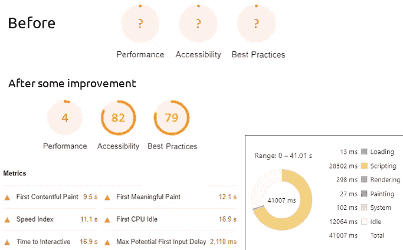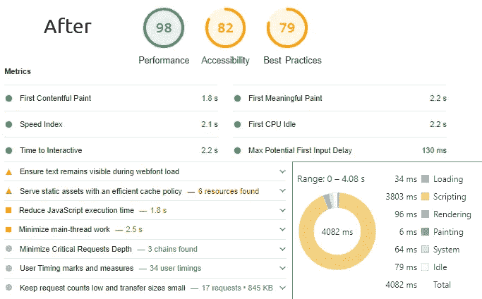

性能调优之旅:改进前后

是的，我做到了。在介绍了我在性能调优过程中为实现这一结果所做的工作之后，我甚至从团队和利益相关者那里获得了非常积极、鼓舞人心的反馈。

几周后，我的团队正在处理的第二个 Angular 应用程序开始出现类似的问题，但症状不同。

最终用户并没有对加载时间感到沮丧，但是在长时间使用该应用程序后，他们意识到它变得更慢、迟缓，并且似乎经常暂停。这一次，我没有害怕，但我很好奇导致问题的原因。

经过一番调查，原来罪魁祸首是一个**内存泄露**。

空谈不值钱。让我们创建一些代码，看看如何生成一个遭受内存泄漏的 web 应用程序，它会损害性能并让用户讨厌它。下面是我们今天的示例应用程序:

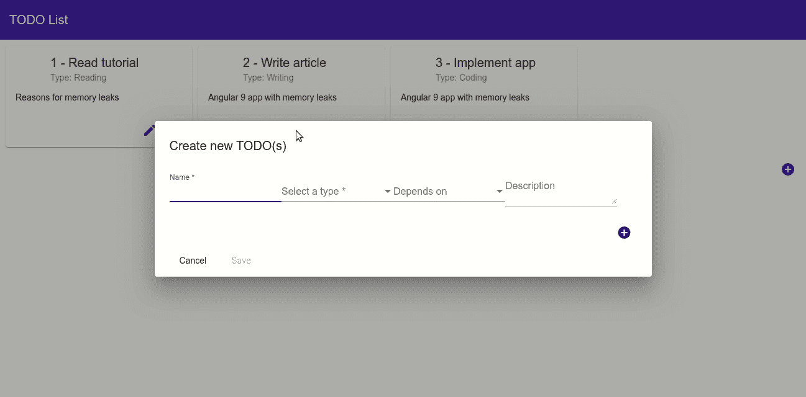

Angular todos 管理 app(动画由[作者](https://rakia-bensassi.medium.com/)创作)

```
**Table of Contents**[**Project Setup**](#402a)[**Code**](#2b58)[**Time for Heap Snapshot**](#7fe5)[**New Feature Request**](#3db1)[**Performance Timeline Record**](#7a4f)[**Identify JS Heap Memory Leaks**](#4555)[**We’ve Got a Leak — How Do We Fix It?**](#3558)
  ∘ [Action 1: unsubscribing](#7d23)
  ∘ [Action 2: onlySelf & emitEvent](#d0a1)
  ∘ [Have we fixed it?](#5853)
  ∘ [Action 3: OnPush ChangeDetection](#ad09)
  ∘ [Action 4: Angular pipe & minimize subscriptions](#1bf1)
[**What’s the Difference?**](#97dc)[**Conclusion**](#a1a7)
```

# 项目设置

你知道该怎么做。启动您的终端，运行命令`ng new`，并提供名称`apngular-memory-leaks`来创建应用程序:

```
ng new angular-memory-leaks
cd angular-memory-leaks
```

`ng new`命令提示您初始应用程序中要包含的特性信息。您可以通过按 Enter 或 Return 键接受默认值。

# 密码

好了，好东西来了。我们必须遵循接下来的步骤。

*   安装[角材](https://material.angular.io/components/table/overview)和[角材伸缩布局](https://github.com/angular/flex-layout):

```
npm install @angular/material
npm install @angular/cdk
npm install hammerjs
npm install @angular/flex-layout
```

*   通过将该行添加到`src/style.scss`来导入角度主题:

```
@import "~@angular/material/prebuilt-themes/indigo-pink.css";
```

*   生成两个新组件，`todo-list`和`todo-dialog`:

```
ng generate component todo-list
ng generate component todo-dialog
```

*   更新`app.module.ts` *:*

应用程序模块

*   将`app.component.html` 的内容替换为:

app.component.html

*   这就是`todo-list.component.html`的样子:

`todo-list.component.html`

*   `todo-list.component.css:`

`todo-list.component.css`

*   `todo-list.component.ts:`

`todo-list.component.ts`

*   `todo.dialog.html:`

`todo.dialog.html`

*   `todo.dialog.ts:`

todo.dialog.ts

*   正如你已经注意到的，`todo-list.component.ts`和`todo.dialog.ts` 正在使用`todo.service.ts`，它提供了所有待办事项的类型和列表。现在，`getTodos()`和`getTypes()`方法正在读取两个常量，但是您可以在您的情况下调整它们，以便通过 REST 调用从后端获得真实数据:

这是运行`**ng serve**`并用浏览器调用`**localhost:4200**`后的结果:

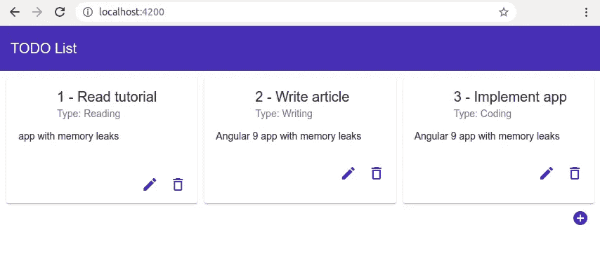

Angular 9:待办事项管理应用

# 堆快照时间

太好了！让我们用 [Chrome DevTools](https://developers.google.com/web/tools/chrome-devtools) (F12)来看看一些统计数据。我们将拍摄两个堆快照，展示内存是如何在应用程序的 JavaScript(对象、原语、字符串、函数、DOM 节点等)之间分配的。)在拍摄快照的时间点。

1.  重新加载页面后，打开 DevTools 上的内存面板(F5)。
2.  启用堆快照复选框。
3.  点击“拍摄快照”按钮。“快照 1”现已准备就绪。

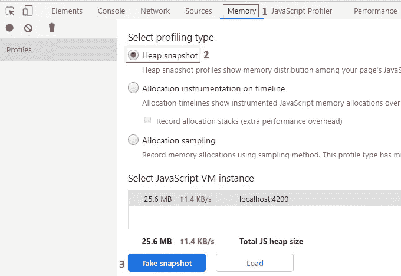

Chrome 开发工具:堆快照

4.玩你的 web 应用程序:用 todo 对话框创建八张新的 todo 卡片(点击加号“+”按钮)。

5.然后单击“拍摄堆快照”图标拍摄第二张快照。第二个记录的快照将比第一个大:8.4 Mb 而不是 5.5 Mb。

6.单击摘要，然后选择比较以查看差异。在“# New”列下，有第二个快照中新分配的对象(新数组、闭包、事件发射器、主题等)。在“# Deleted”列下，有已删除的对象。


比较两个堆快照

# 新功能请求

我们可以开始添加一些有用的功能，例如使用 todo 对话框不仅创建一个 todo，还可以同时创建多个 todo，并在 todo 对话框中的“依赖于”下拉列表中添加一个条件:

*   “写作”类型的待办事项可能依赖于三种待办事项类型:“写作”、“阅读”或“编码”
*   “阅读”或“编码”类型的待办事项可能仅取决于“阅读”或“编码”

对于这个实现，我们将使用 Angular `FormArray` 和订阅类型的字段`valueChanges`。你必须更新`todo.dialog.ts:`如下:

`todo.dialog.ts`

`todo.dialog.html`:

`todo.dialog.html`

我们将删除`createTodo()`和`updateTodo()`方法，而在`todo-list.component.ts`和`todo-list.component.html`中使用`openTodoDialog()`方法:

`todo-list.component.ts`

我们必须调整`todo.service.ts`中的`updateTodoList()`方法:

`todo.service.ts`

新的待办事项对话框布局:

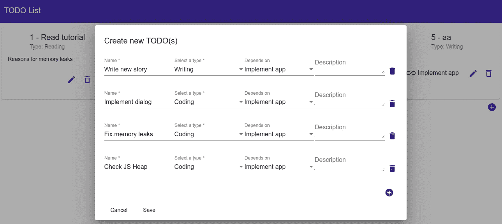

创建多个待办事项的对话框

这是非常漂亮的。是时候说出真相了。您需要重复前面的步骤 1 到 6 来比较当前状态的两个新的堆快照(第一个是初始的，第二个是在创建许多 todos 的列表的场景之后)。结果将类似于以下内容:

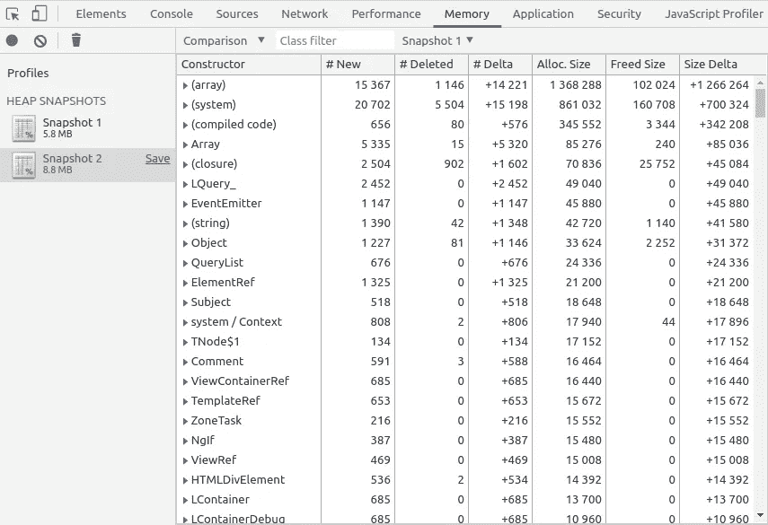

比较 2 个堆快照

如您所见，在第二个快照中，所需的堆大小增加了 3 MB。创建了许多新的对象、侦听器、数组、DOM，但是没有或很少删除它们。

# 绩效时间表记录

我们用一个演奏记录来翻译这个。打开 DevTools 上的 Performance 面板，然后启用 Memory 复选框并做一个记录。


Chrome DevTools:性能记录

在你点击开始按钮之后，在停止记录之前，你需要运行应用程序:多次打开待办事项对话框，创建新的待办事项，在对话框中添加新的表单，在保存和不保存的情况下删除一些表单，更新一些待办事项。停止记录，等待您看到结果:


绩效时间表记录

这是怎么回事？

Chrome 和 DevTools 为我们提供了发现影响页面性能的内存问题的可能性，包括内存泄漏、内存膨胀和频繁的垃圾收集。在上面的记录中，内存使用情况细分为:

*   JS 堆(Javascript 所需的内存，蓝线)
*   文件(红线)
*   DOM 节点(绿线)
*   听众(黄线)
*   GPU 内存

我们注意到 JS 堆结束时比开始时高。在现实世界中，如果您看到这种增长模式(JS 堆大小、节点大小、侦听器大小)，这可能意味着内存泄漏。当应用程序无法清除未使用的资源，并且用户意识到在某个时候应用程序变得更慢、迟缓并且可能会频繁暂停时，就会发生内存泄漏，这是潜在垃圾收集问题的征兆。

在性能时间线记录中，频繁上升和下降的 JS 堆或节点计数图意味着频繁的垃圾收集(蓝色竖线)，这就是我们的示例中的情况。

# 识别 JS 堆内存泄漏

1.  打开开发工具
2.  转到内存面板。
3.  选择“时间线上的分配工具”单选按钮。
4.  按下开始按钮(黑色圆圈)。
5.  执行您怀疑导致内存泄漏的操作。
6.  完成后，按下“停止录制”按钮(红圈)。


Chrome DevTools:时间轴上的分配工具

每条蓝色竖线都是一些 JS 对象的内存分配。您可以用鼠标选择一条线来查看更多细节。

# 我们有一个漏洞，我们如何修理它？

以下是一些可能导致 Angular 应用程序内存泄漏的情况:

*   **丢失退订**，将组件保留在内存中
*   **缺少 DOM 事件监听器**的注销:比如一个滚动事件监听器，一个表单`onChange`事件监听器，等等。
*   **未使用时未关闭的 WebSocket 连接**
*   **分离的 DOM 树**:当没有全局引用时，DOM 节点可能会被垃圾收集。当一个节点从 DOM 树中移除时，它被称为*分离*，但是一些 JavaScript 仍然引用它。这种情况可以通过比较两个堆快照，然后向下滚动到构造函数列下以 Detached 为前缀的元素来识别。

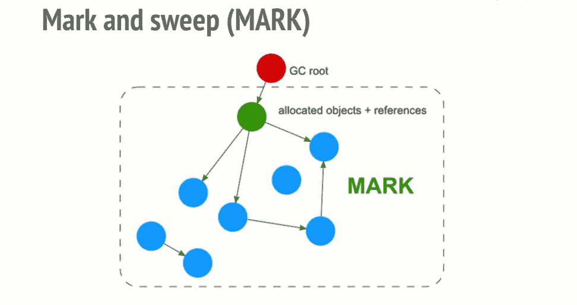

标记和清除垃圾收集算法的可视化效果([来源](https://blog.sessionstack.com/how-javascript-works-memory-management-how-to-handle-4-common-memory-leaks-3f28b94cfbec)

当一个对象不再被一个全局对象可访问的对象引用时，它将被垃圾收集器访问。相互引用但同时无法从根访问的对象将被垃圾回收。

## 性能调整操作 1:取消订阅

我们的 todo 应用程序已经遭受了首先提到的内存泄漏的两个常见原因。每次出现订阅 observable 的需求时，它都会产生一个订阅对象，当组件被 Angular runtime 破坏时，应该以一种不会导致 JavaScript 运行时内存泄漏的方式来处理该订阅对象——这意味着调用`unsubscribe()`，通常在组件的`ngOnDestroy`方法内部。

在保留了对`formGroup.get('type').valueChanges`的订阅并删除了对`formGroup.valueChanges`的订阅后(因为不需要了)，我们在`todo.dialog.ts`和`todo-list.component.ts`中添加了缺少的退订，如下所示:

取消订阅可观的

## 性能调整操作 2:仅自身和发射事件

为了更细粒度地控制变更传播和 DOM 事件发出，我们可以使用`onlySelf: true`和`emitEvent: false`来防止表单字段的变更触发其祖先的`onChange`方法(整个表单或对话框中所有表单的列表)。

在将监听器移至`FormGroup` `valueChanges`之前，您可能已经注意到，每次更改类型下拉列表中的值后，浏览器控制台上会显示两条日志消息:一条来自`console.log('form value changed')`，另一条来自`console.log('type changed')`，因为触发字段事件监听器会传播到父 DOM 事件监听器。

每当删除不需要的 todo 表单(带有删除图标)时，您必须记住取消订阅它的侦听器:

从`formArray`中删除一个项目表单

## 我们修好了吗？

去重复前面的场景，然后为它做一个性能时间线记录。看看会发生什么；我会在这里等。注意到什么有趣的事了吗？区别大吗？

我不这么认为。这种改进并不是灵丹妙药。对于这些内存泄漏，还有更多的问题。所以，让我们继续我们的优化任务。

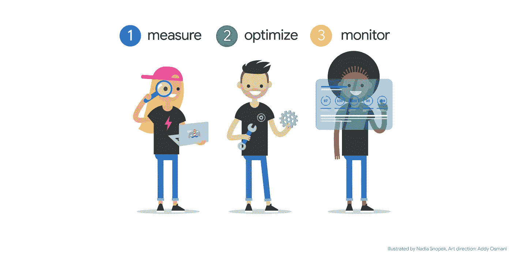

图片来源:Addy Osmani 的《[性能调优:测量、优化和监控](https://medium.com/@addyosmani/measure-optimize-monitor-33e36108e014)

## 性能调整操作 3: OnPush ChangeDetection

代替默认的角度`ChangeDetectionStrategy`，我在 todo 对话框中使用了`OnPush`策略:

todo.dialog.ts 中的 OnPush ChangeDetectionStrategy

## 性能调优操作 4:角度管道和最小化订阅

我实现了一个自定义的纯[管道](https://angular.io/guide/pipes)，并在`selectBox`字段中使用它。现在不再需要订阅《T4》了。

请记住，不纯的管道经常被调用，就像每次按键或鼠标移动一样频繁，并且昂贵的长时间运行的管道可能会破坏用户体验。

选择带管道盒子

不要忘记在`app.module.ts`的声明部分添加`FilterPerTypePipe`:

[按类型过滤管道](https://gist.github.com/rakia/09ee9ff620246a7c0903893e7a117b09)

我在对话框中删除了对`todoService.getTodos()`的订阅，因为`todoList`已经在 todo 列表组件中可用，并且可以添加到`TodoDialogData`。我还将对`todoService.getTypes()`的订阅移动到了 todo list 组件中。在`TodoDialog`中`TodoService`不需要注射:

todo-dialog.ts 没有任何订阅

todo-dialog-data.model.ts

# 有什么区别？

这是经过最后一步优化后的最终 Chrome DevTools 统计数据。在记录过程中，我执行了几乎相同的示例场景:通过使用对话框三次来创建九个新的 todo，添加和删除一些表单，单击一次对话框的 Cancel 按钮，并通过添加依赖项来更新一个 todo。

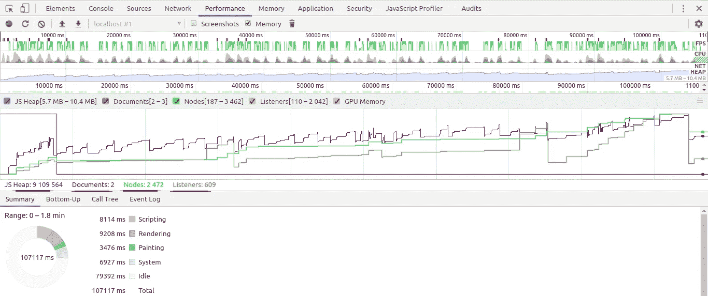

最终绩效时间表记录

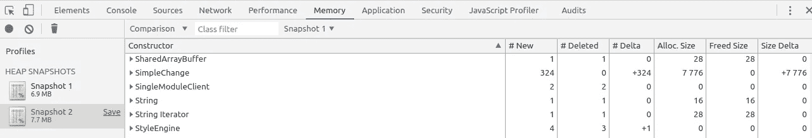

最后两个堆快照

*   在场景的最后，性能时间线记录中的 JS 堆大小是大约 9 MB，而不是大约 10 MB(将鼠标悬停在图形上可以看到它)。
*   在我们的第一份业绩记录中，文件的数量是两份而不是七份。
*   听众人数是 609 人，而不是 2，008 人。
*   在创建了九个新的 todos 之后，第二个快照中的 JS 堆增加了 0,8 MB，而不是我们教程开始时的 3 MB。
*   垃圾收集少了很多→垃圾收集频繁的问题得到缓解。

这很有道理，不是吗？

完整的 Angular 9 todo 应用程序可以在 [this GitHub repository](https://github.com/rakia/angular-memory-leaks) 下找到。

# 最终想法

构建大型应用程序需要编写大量代码、复杂页面、长列表和许多组件和模块。Angular 是一个做了大量内存管理工作的框架。尽管如此，一些场景还是会导致错误，导致内存泄漏，结果是用户体验受损。我们不会知道可能是我们造成了这个问题，直到它出现在生产中。

用户重新加载页面的频率越来越低。[当性能延迟超过一秒钟时，他们就无法专注于正在执行的任务](https://developers.google.com/web/fundamentals/performance/rail)。超过 10 秒，用户会感到沮丧，很可能会放弃任务。他们可能会回来，也可能不会回来。这就是为什么为长期会话保持最佳性能至关重要。

调试内存泄漏问题可能是一项艰巨的任务，避免它们需要对问题有所了解并保持警惕。

🧠💡我为一群聪明、好奇的人写关于工程、技术和领导力的文章。 [**加入我的免费电子邮件简讯独家访问**](https://rakiabensassi.substack.com/) 或注册媒体[这里](https://rakiabensassi.medium.com/membership)。

*你可以在 Udemy 上查看我的* ***视频课程****:*[*如何识别、诊断、修复 Web Apps 中的内存泄漏*](https://www.udemy.com/course/identify-and-fix-javascript-memory-leaks/) *。*

[](/web-vitals-guide-b56e28798e7f) [## 网络生命:它们是什么，如何衡量它们

### 谷歌用来影响你的网络应用排名的基本性能指标指南

better 编程. pub](/web-vitals-guide-b56e28798e7f) [](https://levelup.gitconnected.com/how-to-use-tensorflow-js-without-memory-leaks-273ad16196be) [## 我如何在不泄漏内存的情况下使用 TensorFlow.js

### 使用 TFJS 模型而不影响 web 性能的技巧

levelup.gitconnected.com](https://levelup.gitconnected.com/how-to-use-tensorflow-js-without-memory-leaks-273ad16196be)