# 使用 Amazon Aurora、Amplify 和 SwiftUI 构建移动无服务器应用

> 原文：<https://betterprogramming.pub/build-mobile-serverless-apps-using-amazon-aurora-amplify-and-swiftui-7562ecb7df9a>

## 在 AWS 上使用关系数据创建无服务器 iOS 应用程序


由[泰勒维克](https://unsplash.com/@tvick?utm_source=medium&utm_medium=referral)在 [Unsplash](https://unsplash.com?utm_source=medium&utm_medium=referral) 上拍摄的照片

# 为什么使用 Aurora Serverless？

如果你刚刚得到，或者更喜欢使用 NoSQL 数据库，AWS Amplify 有[指南](https://docs.amplify.aws/start/q/integration/ios)和一些[示例应用](https://github.com/aws-samples/aws-amplify-swiftui-demo)使用他们的 NoSQL 数据库 DynamoDB。

但是，根据您的工作对象，您可能需要使用关系数据库。旧的方法是使用您的后端首选语言创建一个服务器，该服务器将使用 AWS RDS 连接到关系数据库，但使用 Amplify，您可以使用 Aurora Serverless 和 Amplify 缩短时间，消除创建和维护服务器的工作。

# 创建 Amazon Aurora 实例

如果您没有 AWS 帐户，您需要创建一个。首先，进入 [RDS 控制台](https://console.aws.amazon.com/rds)。在您的仪表板上，选择“创建数据库”

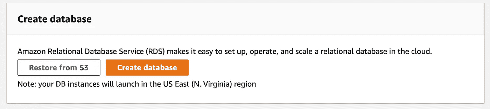

AWS RDS 控制台

在这里，您应该默认选择 Amazon Aurora:

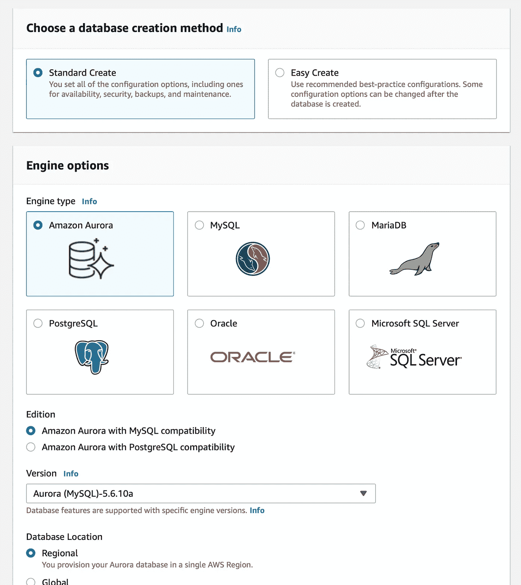

创建数据库

在“数据库功能”下，选择“无服务器”:

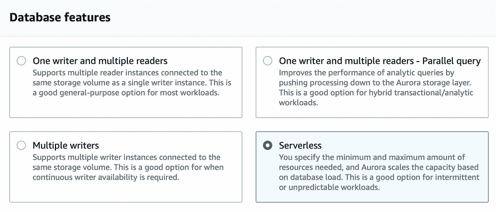

选择数据库功能

在“设置和数据库集群标识符”下，您可以根据需要更改默认的数据库集群标识符。您还应该让 RDS 自动生成密码或自己输入密码。

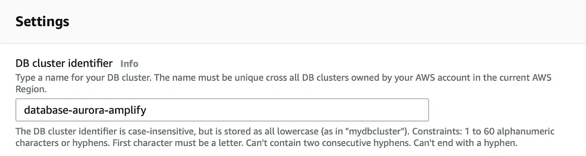

更改数据库集群标识符

在容量设置下，你可以将最大 Aurora 容量单位设置为`1`，这样你就不会不小心在这个项目上花了太多钱。出于同样的原因，在“附加扩展配置”下，选择“连续几分钟不活动后暂停计算容量”

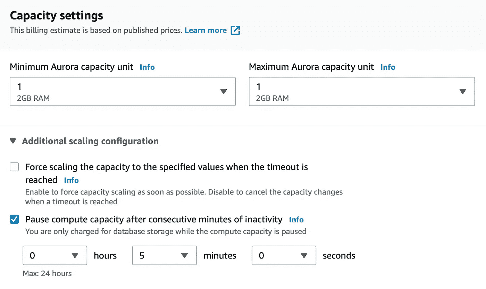

暂停计算容量

现在你可以点击“创建数据库”

# 允许数据库中有特殊字符

如果您计划在 DB 上使用特殊字符，比如带有中文字符的名称，您可能需要修改数据库默认字符集。如果您目前不关心特殊字符，可以跳过这一步，进入下一节，创建表。

为此，点击左侧的“参数组”。在这里，点击“创建参数组”。在参数组系列下选择`aurora5.6`，在类型下选择“DB Cluster Parameter Group”，给出名称和描述，然后单击“Create”

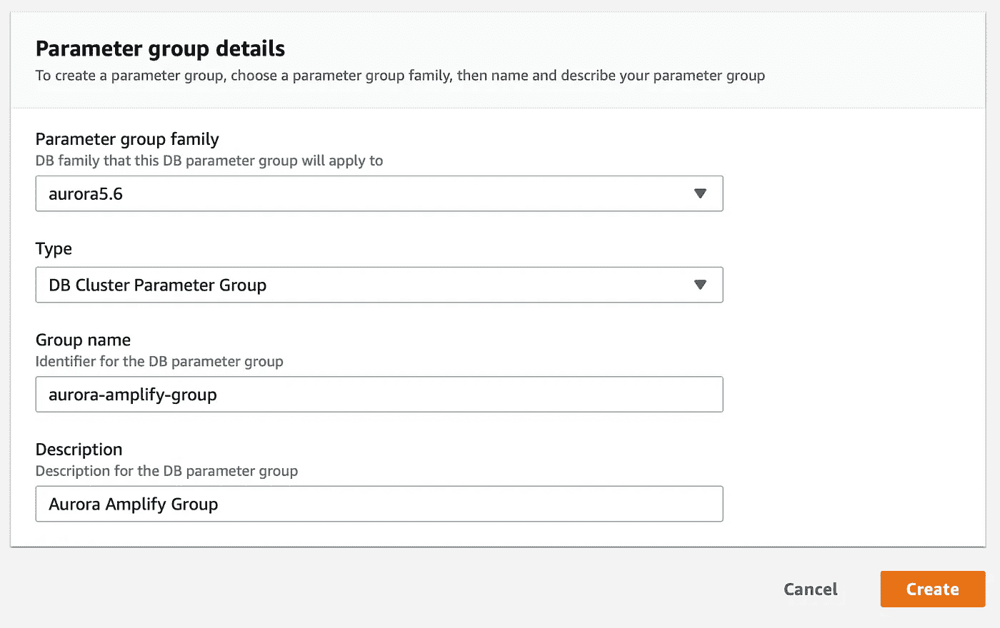

创建参数组

现在点击新创建的参数组。在搜索栏上，输入`character_set_server`，选择它，并点击“编辑参数”在数值上，选择`utf8mb4`，然后点击“保存更改”

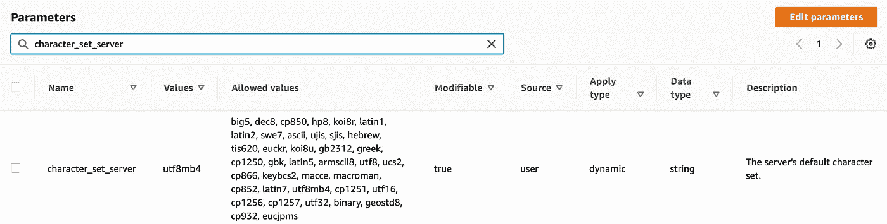

编辑字符集

现在，请在列表中单击您新创建的数据库，并单击“修改”

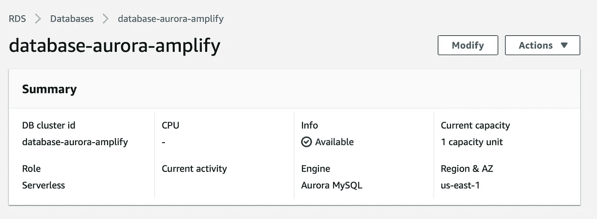

新创建的数据库

在“网络和安全”下，单击“数据 API”，在“附加配置和数据库集群参数组”下，选择您刚刚创建的组。

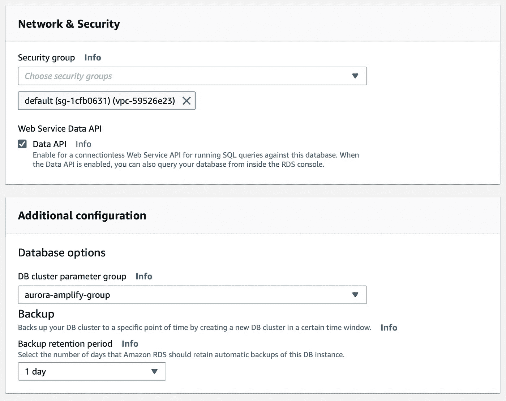

启用数据 API 并选择数据库集群参数组

按“继续”然后在“修改计划”下，选择“立即应用”，然后按“修改群集”

现在我们已经创建了数据库，我们可以继续创建我们将要使用的表。

# 创建表

对于这个项目，让我们创建一个简单的应用程序，用户可以在其中创建个人资料，然后创建博客，博客可以有几篇文章。

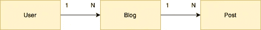

我们应用程序的图表

现在我们需要连接数据库来创建表。在你的数据库仪表板上，按下`Actions`，然后选择`Query`。这里会要求您输入之前输入的密码，以便连接到数据库。

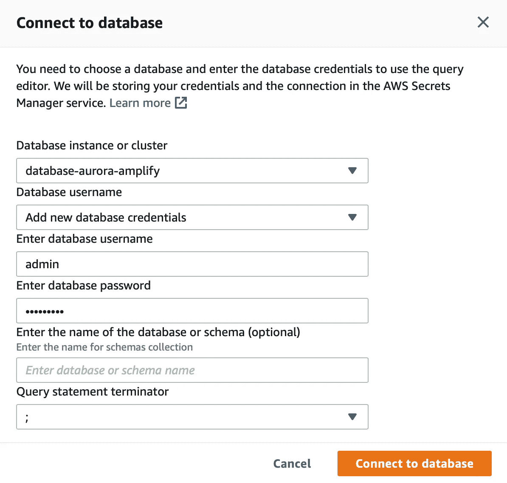

连接到数据库

连接后，您应该会看到下面的查询编辑器:

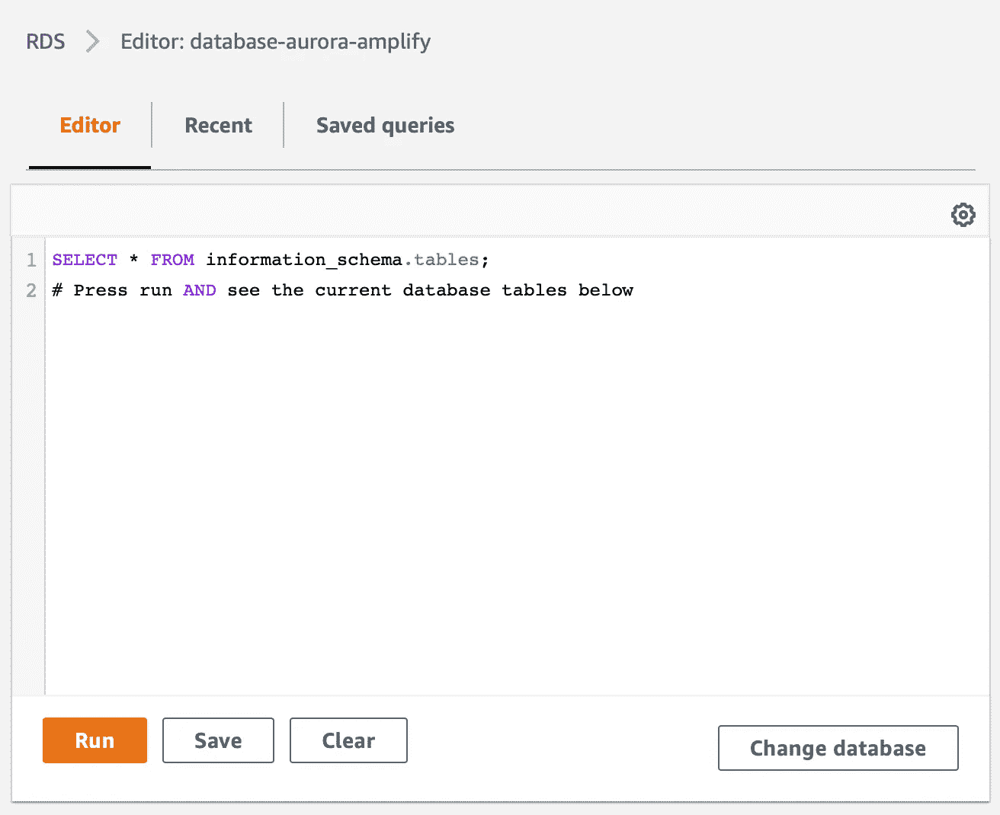

查询编辑器

要为我们的项目创建数据库，请运行以下命令:

```
CREATE DATABASE BLOGDB;
```

之后，点击“更改数据库”在“输入数据库或模式的名称”下，输入`BLOGDB`或您刚刚输入的名称，然后点击“连接到数据库”

现在，要创建表，运行以下命令:

请注意，`createdAt`字段是作为`varchar`创建的，因此我们可以使用 Unix 时间戳。

现在为了测试一切是否正常，您可以在查询编辑器上创建一个新的`User`:

```
INSERT INTO User (userId, name, email, picture, createdAt) VALUES ("fake_uuid_specialchars","名字😄", "email_special@fakemail.com", "picture.png", "1588269238");
```

或者，如果您没有启用特殊字符，您可以创建一个带有简单字符名称的`User`:

```
INSERT INTO User (userId, name, email, picture, createdAt) VALUES ("fake_uuid_john","John Doe", "johndoe@fakemail.com", "picture.png", "1588269239");
```

要查看用户列表，请运行以下命令:

```
Select * from User;
```

您应该看到新创建的用户使用了特殊字符:

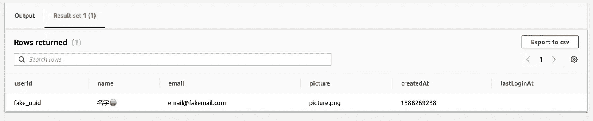

含特殊字符的查询结果

现在我们已经看到我们的数据库正在工作，我们可以继续配置我们的 Xcode 项目。

# 配置您的项目

开始之前，如果您不熟悉 AWS Amplify CLI，您需要遵循[入门指南](https://aws-amplify.github.io/docs/)。这些步骤基本上是注册一个 AWS 帐户，安装它，并配置 CLI。

让我们首先转到 Xcode 并创建一个新项目。选择“单视图应用程序”在语言中选择`Swift`，在用户界面中选择`SwiftUI`。给它您想要的产品名称和组织名称。

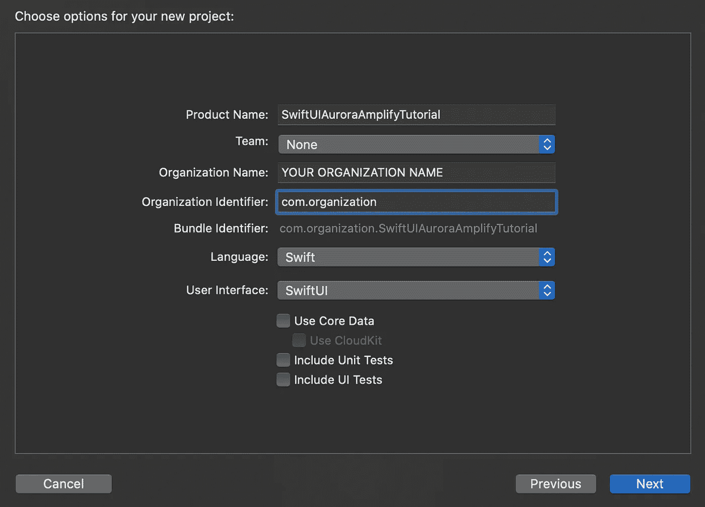

创建我们的项目

在您的计算机上配置 Amplify 并创建 Xcode 项目之后，我们需要为之前创建的 Aurora 数据库生成一个 GraphQL API。转到终端上的 Xcode 项目文件夹，运行以下命令添加 API:

```
$ amplify add api
```

选择`GraphQL`，并保留默认选项。当询问您是否有带注释的 GraphQL 模式时，输入`No`，并输入`No`进行引导模式创建。终端将打印生成的`schema.graphql`的路径。它还将创建一个自定义类型`MyType`。暂时不要删除它，因为如果`.graphql`文件是空的，您可能会在下一步遇到问题。

添加 API 后，我们可以添加 Aurora 数据库作为数据源:

```
$ amplify api add-graphql-datasource
```

选择您的数据库所在的区域，然后选择我们刚刚创建的数据库(`BLOGDB`，或者您给它取的任何名称)。

现在您可以删除`.graphql`文件上自动生成的类型`MyType`并保存该文件。之后，您可以推送更改:

```
$ amplify push
```

您将被询问是否想要为您的新 API 生成代码。选择“是”，保留默认选项。

我们需要添加 [CocoaPods](https://cocoapods.org/) ，因此在我们的项目文件夹中，运行以下命令:

```
$ pod init
```

将以下窗格添加到文件中:

在终端上运行`pod install`之后，我们完成了配置，所以现在我们可以打开 Xcode 了。

# 将 AWS 配置文件复制到 Xcode 中

在能够使用已安装的 pod 之前，我们需要将一些文件复制到 Xcode: `awsconfiguration.json`、`amplifyconfiguration.json`和`API.swift`。您可以将它们放在根文件夹中，或者创建一个文件夹来更好地组织您的项目。

我们可能需要更新 Amplify 配置，所以为了只保留对原始文件的引用，在将文件拖到项目中时，取消选中“如果需要，拷贝项目”。

您的项目应该如下所示:

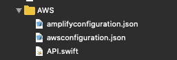

放大所需文件

# 正在初始化 AWS 移动客户端

`AppDelegate`文件应该是这样的:

我将讲述一些细节。首先我们需要导入`AWSAppSync`。然后，我们声明一个变量，`AWSAppSyncClient`。我们还将创建一个`initializeAWSAppSync`函数来初始化`AWSAppSyncClient`。

注意我们调用`AWSAppSyncCacheConfiguration`的那几行——我们需要这样做，以便在没有互联网连接时存储数据库操作，这样当连接恢复时就可以执行这些操作。

最后，不要忘记在`didFinishLaunchingWithOptions`内部调用`initializeAWSAppSync`。

# 创建我们的模型

当生成 API 代码时，Amplify 还生成不同的结构来表示我们的用户、博客和帖子。

每个操作中有不同的结构代表一个用户:`ListUser`、`CreateUser`、`UpdateUser`和`DeleteUser`。博客和帖子也是如此。为了保持一致性，并在整个应用程序中只使用一个模型，我们将创建自己的`User`模型，需要时我们会将其转换为`ListUser`或`CreateUser`。

创建一个名为`ThisUser.swift`的文件，并添加以下内容:

我们需要为博客做同样的事情，所以让我们创建一个名为`ThisBlog.swift`的文件:

最后，对于帖子，让我们创建一个名为`ThisPosts.swift`的文件:

# 创建我们的数据存储类

对于数据库的操作，我们将创建一个类，它包含用户、博客和帖子的数组，并从`ObservableObject`继承，这样我们可以在这些数组中发布更改。我们还将创建从数据库获取用户、博客和帖子的方法，并创建新的方法。

创建一个名为`AWSAppSyncDataStore.swift`的新文件，并添加以下内容:

AWS AppSync 数据存储类

# 将数据存储作为环境变量传递

为了使用我们的数据存储，我们需要将它传递给我们的`ContentView`。在`SceneDelegate.swift`中，添加以下一行:

```
**let** dataStore = AWSAppSyncDataStore()
```

如果您想要测试新的数据存储，可以添加以下行:

```
dataStore.addUser(create: thisUser(name: "Tony Stark", email: "[stark@gmail.com](mailto:stark@gmail.com)", picture: "no_picture", createdAt: "1588606785", lastLoginAt: "1588606785"))

print("datastore.users ", dataStore.users)
```

测试之后，删除这些行，并修改创建我们的`ContentView`的行，这样我们就可以将数据存储作为环境对象传递。

```
**let** contentView = ContentView().environmentObject(dataStore)
```

# 列出用户

现在让我们写一些代码来获取用户并显示他们。首先，我们需要在顶部的`ContentView`中添加`EnvironmentObject`。

列出用户的内容视图

添加了`EnvironmentObject`之后，让我们创建一个`List`和一个`ForEach`，其中包含数据存储用户。

如果我们运行这个应用程序，我们应该会看到一个用户列表，这些用户是我们在 AWS 控制台上创建的，或者是我们之前在`SceneDelegate`中测试的一部分。该列表应类似于下图:

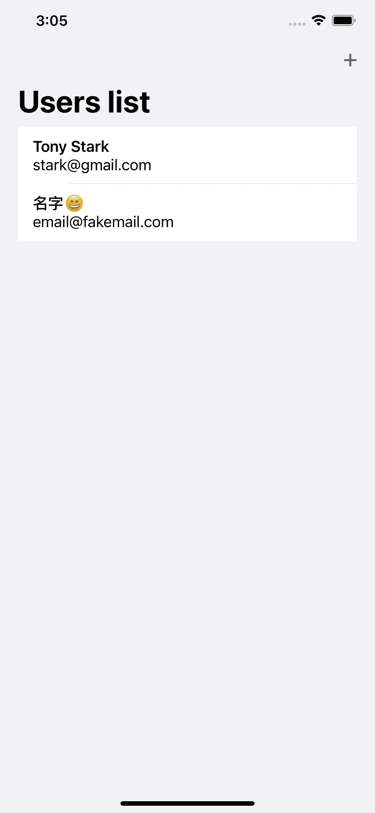

列出数据库中的现有用户

现在让我们进入下一步，创建一个新用户。

# 创建用户

为了创建一个新的`User`，我们将在`Sheet`中使用一个`Form`。首先，我们需要创建一个新文件`CreateUserView.swift`并添加以下内容:

用于创建新用户的表单

如您所见，我们创建了一个带有三个`TextField`的`Form`来输入`User`属性:一个用于`name`，一个用于`email`，一个用于`pictureURL`。

为了显示这个`Form`，我们需要在`ContentView`中添加下面的`State`:

```
[@](http://twitter.com/State)State var presentingSheet = false
```

同样在`ContentView`中，在`NavigationBarItem`中，在`print("Create User")`语句之后，我们需要将`presentingSheet`设置为`true`:

```
self.presentingSheet = true
```

我们需要在`ContentView`中的`List`上附加一个`sheet`:

```
.sheet(isPresented: $presentingSheet, content: {
     CreateUserView()
 })
```

如果我们再次运行我们的应用程序，当按下导航栏上的`+`按钮时，我们应该会看到我们新创建的表单:

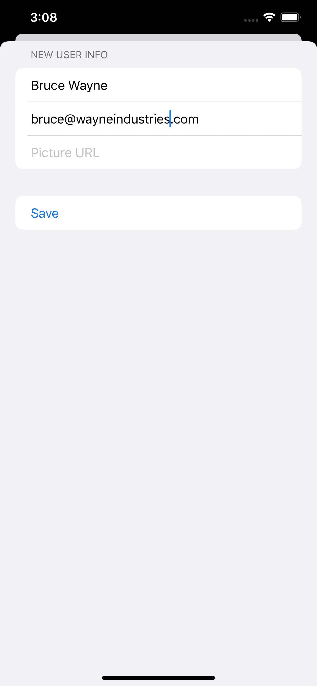

显示新创建的表单的表单

我们必须至少填充`name`和`email`来启用保存按钮。之后，如果我们按 save，表单应该会消失，我们应该会在列表中看到新创建的用户:

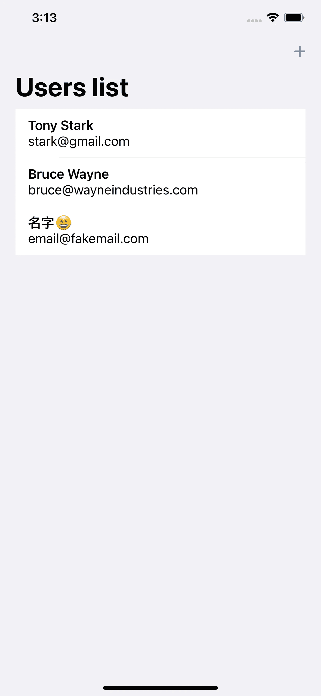

显示我们新用户的列表

如果您想要仔细检查，您可以转到 AWS 控制台，在您的数据库上运行一个`Select`查询:

```
Select * from User;
```

您刚刚使用 SwiftUI 应用程序添加的用户应该在那里。

# 结论

如果你想看看整个项目，请查看 [GitHub repo](https://github.com/rolisanchez/swiftui-aurora-amplify-tutorial) 。

如果你有兴趣使用 AWS Amplify 为你的 SwiftUI 应用添加认证，你可以阅读我的教程，了解如何[登录谷歌、](https://medium.com/better-programming/sign-in-with-aws-amplify-and-swiftui-978b01a5cf10)、[苹果、](https://medium.com/better-programming/how-to-implement-sign-in-with-swiftui-and-aws-amplify-part-3-de994e218ed7)或[电子邮件](https://medium.com/better-programming/how-to-implement-sign-in-with-swiftui-and-aws-amplify-part-4-a59144107147)。