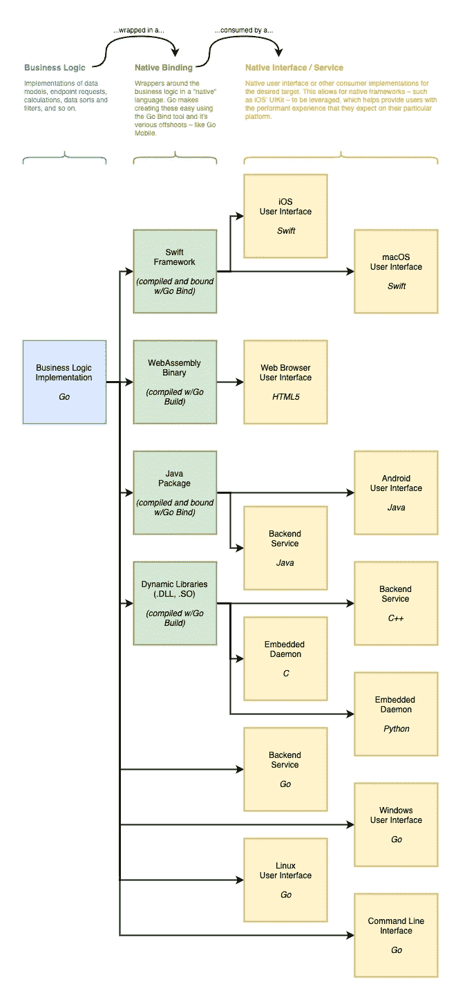

# 如何使用 Golang 构建跨平台的原生应用

> 原文：<https://betterprogramming.pub/build-native-cross-platform-apps-with-go-70f9572baeb5>

## 带 Go 的原生应用？是的，真的

凯尔·格伦在 [Unsplash](https://unsplash.com/photos/IFLgWYlT2fI) 上的照片

在过去的几年里，我在许多项目中使用 Go 作为举重运动员。到目前为止，它是我最喜欢使用的语言。

它受到我称赞的一个原因是它能够轻松地编译成几乎任何目标。我不再需要设置时髦、脆弱的交叉编译器，也不再需要与动态库的连接器和小版本作斗争。此外，Go 有一个令人印象深刻的高质量开源包生态系统——有一些库可以做你想做的任何事情。

这些特性使 Go 成为构建需要本机性能和功能的跨平台项目的理想工具。

这篇文章并不打算成为一个教程。更确切地说，它希望呈现一幅围棋所提供的可能性的高层次图景。

# 一个来源，多个目标

Go 的一流编译器 gobuild 支持多种编译目标。只需一个简单的命令，您就可以将源代码编译成 macOS 二进制文件。使用另一种方法，可以将相同的源代码编译成 arm V6 Linux 二进制文件。还有一种方法，可以将相同的源代码编译成 WebAssembly 二进制文件，供任何现代 web 浏览器或 JavaScript 引擎执行。

Go 还提供了一个名为 gobind 的一流工具，用于在单个 Go 源代码和各种其他语言之间创建绑定。这允许使用单一的、统一的 Go 源，例如，作为 iOS 应用程序的 Swift 框架和 Android 应用程序的 Java 包。

# 伟大的想法

有了上面的知识，逻辑可以在 Go 中实现一次，然后在几乎任何期望的平台上运行，这一点开始变得清晰。Go 被静态编译成其目标的本机代码，这意味着它实际上总是优于其虚拟化(如 Java、Kotlin)和解释(如 JavaScript)版本。

因此，在一个统一的 Go 源代码中编写数据模型、API 集成、算法和其他业务逻辑是非常有利的。然后，可以为每个目的地目标编译所述源，并由在所述目标上运行的用户界面使用。重要的是，所述 Go 源代码遵循严格的接口契约设计原则。

可以使用每个目标平台的原生工具包为其定制界面，也可以使用 HTML5 或 Go 众多可用 GUI 包中的一个来构建一个统一的界面。前一种选择带来了性能优势和真正的原生用户体验，而后一种选择带来了开发速度优势。

# **最后的想法**

本文中描述的跨平台软件开发方法对于软件工程来说绝不是新的。围棋只是让它变得极其简单。

如果您有兴趣进一步探索这一点，请查看以下资源:

*   [pkg.go.dev](https://pkg.go.dev/) ↝围棋包列表及搜索引擎。
*   [libs.garden](https://libs.garden/go) ↝搜索引擎和 Go 包排名看门狗。
*   gomobile ↝围绕 [gobind](https://pkg.go.dev/golang.org/x/mobile/cmd/gobind) 包的功能发出一个包装命令。
*   [Golang/go/Mobile](https://github.com/golang/go/wiki/Mobile) ↝在官方 go 知识库的维基上发表了一篇文章，解释了为移动应用部署构建和绑定 go 代码的各种方法。
*   [通过构建图像到 ASCII 转换器开始使用 WebAssembly 和 Go](https://medium.com/swlh/getting-started-with-webassembly-and-go-by-building-an-image-to-ascii-converter-dea10bdf71f6)↝的好文章，解释了将 go 源代码构建为 WebAssembly 二进制文件并使用 HTML5 的基础。
*   [在 Go 中构建共享库:第 1 部分](https://www.darkcoding.net/software/building-shared-libraries-in-go-part-1/) ↝的文章展示了如何用 Go 创建一个 c 风格的动态库，然后由 Python 脚本使用。
*   [GUI |学习 Go 编程](https://golangr.com/gui/)↝Go 软件包帮助列表，可用于用普通 go 代码创建 GUI。