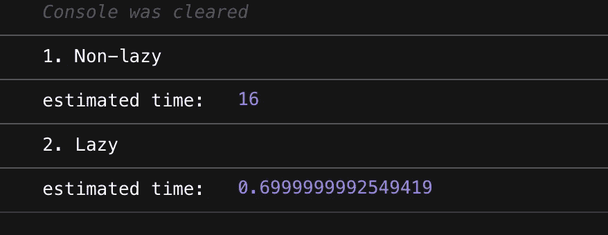
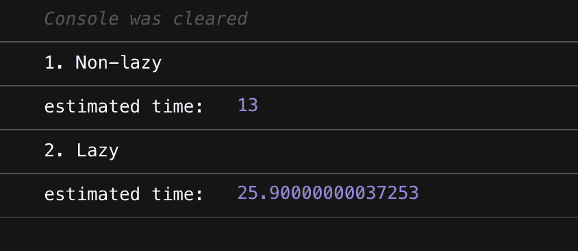

# 使用 ES6 迭代器协议构建函数式编程库

> 原文：<https://betterprogramming.pub/build-our-own-functional-programming-library-from-scratch-with-es6-iterator-protocol-292085f66df2>

## 理解 ES6 迭代器协议以及如何使用它


保罗·吉尔摩在 [Unsplash](https://unsplash.com?utm_source=medium&utm_medium=referral) 上拍摄的照片

```
Table of Contents[Intro](#ae34)
[What is Iterator Protocol?](#c647)
[map, filter and reduce](#e2b5)
[take, takeL](#8a00)
[pipe and curry](#9c5e)
[Performance test](#d315)
```

# 介绍

JavaScript 开发者和函数式编程爱好者们，你们好。

在上一篇文章中，我谈到了函数式编程库 FxTs，它是用 ES6 迭代器协议实现的。

但是你可能和我有同样的问题:

> 什么是 ES6 迭代器协议，如何使用？

为了回答这个问题，我打算建立我们自己的 FP 库，因为没有比自己实现更好的方法来理解一些东西。

每个人都同意我吗？

然后，让我们从头开始创建一个函数库。我们就叫它`light-fp.js`。不要害怕。你会惊奇地发现这比你想象的要容易得多。

# 什么是迭代器协议？

有没有想过`for .. of`怎么可以循环`Map`，`Set`不仅仅是`Array`？答案要归功于 iterable 协议，我现在将对此进行解释。

如果我们使用迭代器协议，我们可以通过一个`for .. of`语句使任何对象都是可迭代的。比如`Map`、`Set`、`Array`等内置对象已经有了自己的迭代器，可以循环使用，我们不需要自己实现。另一方面，普通对象没有迭代器，所以不能使用`for .. of`语句。

为..循环示例

为了能够迭代普通对象，您必须实现遵循迭代器协议的自定义迭代器。

看起来很复杂，但如果你一个一个看，其实并不复杂。制作 iterable 对象的第一个条件是拥有`Symbol.iterator`属性。

```
obj[Symbol.iterator] = function() { ... }
```

第二，这个方法应该返回一个具有`next()`的对象，该对象是一个返回`{ value: someValue, done: false }`或`{ done: true }`的方法。`next`方法使用`done`作为标志来停止`for .. of`语句中的迭代。

```
obj[Symbol.iterator] = function() {
  return {
    next() {
      return isIterationFinished 
        ? { done: true }
        : { value: someValue, done: false }
    }
  }
}
```

第三，要让一个结构良好的迭代器像内置迭代器一样，`next()`应该返回迭代器本身。注意，不能使用`for .. of`语句，除非它是一个格式良好的迭代器。

```
obj[Symbol.iterator] = function() {
  return {
    next() {
      return isIterationFinished 
        ? { done: true }
        : { value: someValue, done: false }
    },
    [Symbol.iterator]() { return this; } // <-- HERE
  }
}
```

太简单了，不是吗？使用生成器函数有一种更简单的方法来构造一个格式良好的迭代器。

要创建一个生成器函数，应该在函数名前附加一个星号(*)。然后，对每个迭代值使用`yield`关键字。这个`yield`关键字停止了生成器函数的执行，每次迭代器执行`next()`时，都会返回跟在`yield`关键字后面的表达式的值。

这是一个关键的技术，用它我们可以创建懒惰的`map`、`filter`和`reduce`。

# 映射、过滤和减少

既然您已经熟悉了迭代器，那么让我们从实现`map`、`filter`和`reduce`开始。这些函数是函数式编程中的基本函数，因为大多数函数都是从这三个函数派生出来的。

先来看看`map`吧。

第一个是我们知道的通用 map 实现，第二个是 lazy map。它在`for .. of`语句中的`yield`处停止迭代，并执行`f(a)`函数。

接下来是`filter`。实现与`map`几乎相同。

最后，`reduce`功能。由于`reduce`函数的目的是做一个值，所以我们不需要实现 lazy reduce。

# 拿着，塔科

take 函数接收一个数字作为参数，用于只提取数组的一部分，与相应的值一样多。

# 烟斗和咖喱

让我们也制作`pipe`和`curry`函数来帮助函数合成。

下面举例说明如何使用`pipe`和`curry`功能。

这里要注意的是我们的 curry 函数只能做 1 次 curry。您必须在第一个中填入 1 个参数，在第二个中填入所有其余的参数。可以使一个`curry`函数多次弯曲，但为了方便函数组合，函数有两个以上的参数，如`reudce`，一次弯曲更好。

```
// our curry function doesn't surrpot currying 3 times,
curried_sum3(1)(2)(3); // Doesn't work!
curried_sum(1)(2, 3); // Works !
```

现在我们已经创建了一个`curry`函数，让我们将它应用于`map`、`filter`、`take`和`reduce`。我们完整版的 FP 库应该是这样的。

light-fp.js

准备结束。现在是时候测试我们的成果了。

# 特性试验

让我们测试惰性函数和非惰性函数的性能。这两组将执行相同的功能，但表现出完全不同的性能。

> [性能测试:非懒惰 vs 懒惰](https://codesandbox.io/s/light-fp-performace-test-e9nlh)



性能测试 1:非懒惰与懒惰

如您所见，多亏了惰性评估，我们能够排除不必要的操作。然而，懒惰评估并不总是所有情况下的灵丹妙药。如果只是简单地遍历一个数组来创建一个新数组，非懒惰会更快。

> [性能测试 2:非懒惰 vs 懒惰](https://codesandbox.io/s/light-fp-performace-test2-55hh7)



性能测试 2:非懒惰与懒惰

因此，如果您必须处理重要的性能问题，您应该选择正确的评估方法，而不是总是选择懒惰的函数。

# 结论

在本文中，我们研究了如何使用迭代器和生成器从头创建一个函数库。如果你对使用懒求值的函数库感兴趣，建议研究一下 FxTs Github 代码。

感谢阅读！