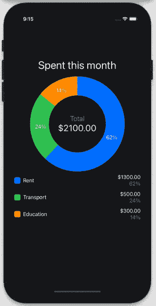
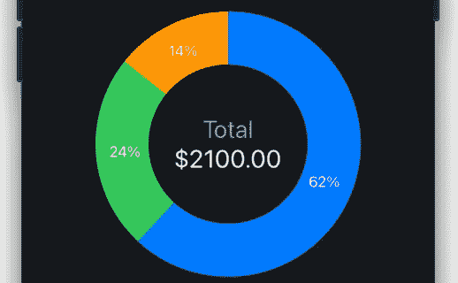
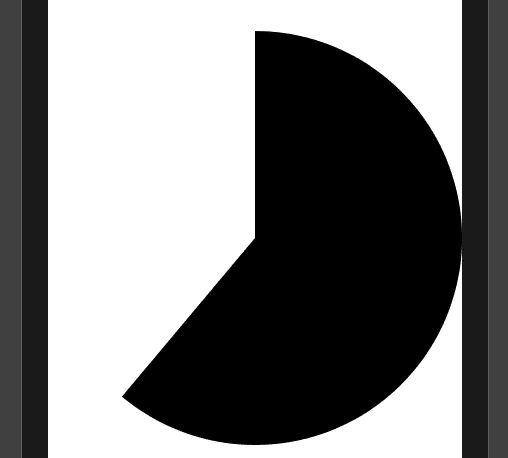
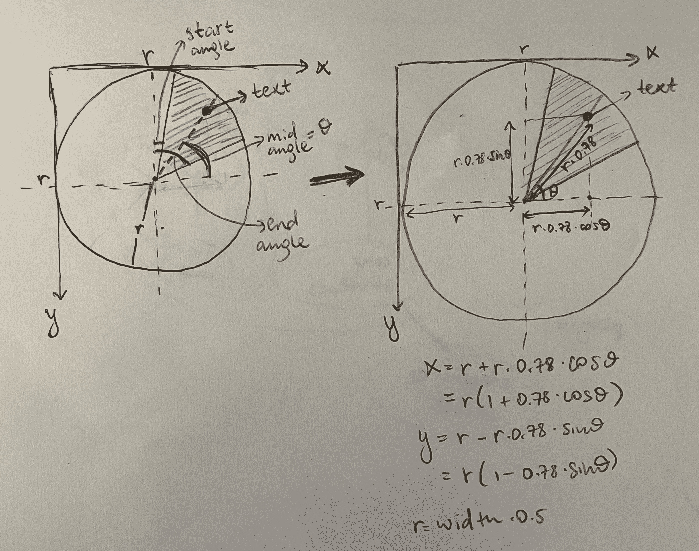
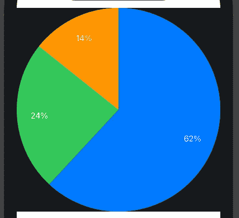
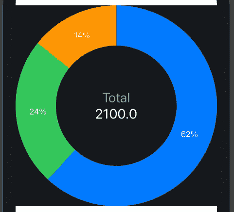
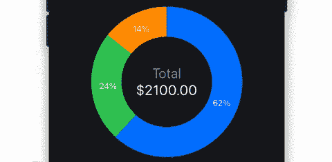
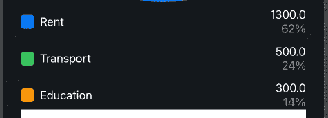

# 在 SwiftUI 中构建饼图

> 原文：<https://betterprogramming.pub/build-pie-charts-in-swiftui-822651fbf3f2>

## 在您的 iOS 应用程序中创建优雅的图表

在本文中，我将解释我是如何在 SwiftUI 中创建了如上所示的漂亮的饼图。您可以在 Github 上找到这个库，并通过一个简单的步骤将其添加到您的 XCode 项目中。参见[https://github.com/ilamanov/SwiftPieChart](https://github.com/ilamanov/SwiftPieChart)。

文章由两部分组成:

*   创建饼图
*   创建在饼图下方显示附加信息的表格

# 创建饼图

饼图由一些切片组成。让我们创建一个组件来显示一个切片。

饼图的一部分

创建一个新文件`PieSliceView.swift`。向其中添加以下`PieSliceData`数据结构——这将用于保存饼图扇区的数据:

为了渲染饼图，我们将使用一个`Path`。`Path`需要两次调用来渲染这个切片。首先，我们需要将光标移动到屏幕的中心，然后我们需要画一个弧形。我们将用`path.move()`和`path.addArc()`来完成这些:

我们使用框架的宽度和高度来计算中心点。我们可以从`GeometryReader`对象中获取框架的宽度和高度。我们取框架的最小尺寸，并将其作为图表的尺寸(上面的第`7`行),这样我们的图表就是方形的，并适合它的框架。我们还添加了`aspectRatio()`，因此我们的图表垂直居中。我们需要 90 度的偏移(线`17`和`18`)，因为在 SwiftUI 坐标系中，0 度从 3 点开始，而不是从 0 点开始。

我们现在可以测试这个切片渲染:

结果是这样的:

让我们在这个切片上添加文本。为此我们将使用`ZStack`——我们将文本堆叠在我们的弧的顶部:

计算文本的位置(上面的第`30`行)很复杂。首先，我们计算中间角度(开始和结束角度之间的中点-线`4`)。同样，我们需要一个`Pi / 2` (90 度)的偏移量来补偿坐标系的差异(SwiftUI 中的 0 度是 3 点钟，但在我们的目的中，0 度是 12 点钟)。

然后使用下面的公式计算文本的位置:

结果是顶部有文本的饼图切片:

现在我们可以渲染一片饼图，让我们渲染一堆饼图，并将它们组合成一个饼图。

## 组合饼图切片

让我们创建一个名为`PieChartView.swift`的新文件来呈现饼图。我们将为这个视图添加两个参数:`values`和`colors` ，它们将指示饼图切片的值和颜色。

我们根据提供的`values`和`colors`计算`slices`(它是一个`PieSliceData`的数组)。我们基于每个切片的值来计算该切片的跨度。以度为单位计算跨度的公式是`degrees = 360 * value / sum`，其中`sum`是所有值的总和(第 13 行)。基于跨度，我们计算所有切片的`start`和`end angles`。我们将使用`slices`数组将所需的数据从上一节传入我们的`PieSliceView`。

现在，让我们修改视图的`body`功能，以便绘制我们的切片:

我们使用一个`ZStack`来堆叠所有切片，并将所有切片的帧设置为等于我们的`PieChartView`的帧大小。我们还为我们的`PieChartView`添加了一个`backgroundColor`参数，这样我们可以很容易地改变背景。结果如下所示:

现在，让我们在饼图的中心添加一些文本。我们首先添加一个与背景颜色匹配的圆，然后在圆的顶部添加文本:

我们添加了另一个参数叫做`innerRadiusFraction`(第 11 行)来控制内圆的半径。现在，我们将饼图中心的文本设置为所有值的总和。

*我们也可以让这个文本动态化——当你点击切片时显示切片的值。动态文本的实现参见***。**

*结果如下:*

**

*我们已经完成了饼图中最重要的部分。我们还可以在用户单击单个切片时添加很酷的动画，如下所示。那些效果的实现见[https://github.com/ilamanov/SwiftPieChart](https://github.com/ilamanov/SwiftPieChart)。*

**

*接下来，让我们在饼图下方添加一些附加信息。*

# *创建显示附加信息的表格*

*让我们将下面的`PieChartRows`视图添加到`PieChartView.swift`中:*

*该视图将如下所示:*

**

*我们现在可以在我们的`PieChartView`中渲染它:*

*我们把我们的`ZStack`包装成了一个`VStack`，并在`ZStack`下面加上了`PieChartRows`。我们还添加了另一个参数`names`，这样我们就可以在图表中显示类别的名称。*

***就这样！我们的饼图完成了。`PieChartView`的完整代码如下所示。***

*结果是:*

**

*我们没有将悬停效果添加到我们的饼状图中，但是您可以在 Github repo 中找到这些效果的实现:[https://github.com/ilamanov/SwiftPieChart](https://github.com/ilamanov/SwiftPieChart)。*

*您甚至可以直接从 XCode 将这个 repo 作为资源库添加到您的项目中——有关说明，请参阅 repo。*