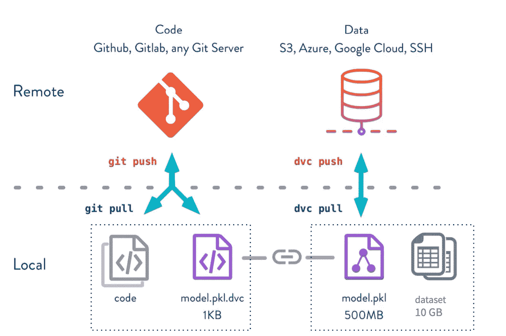
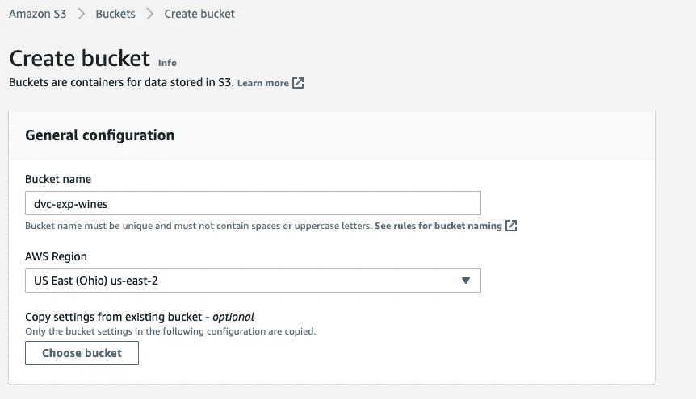
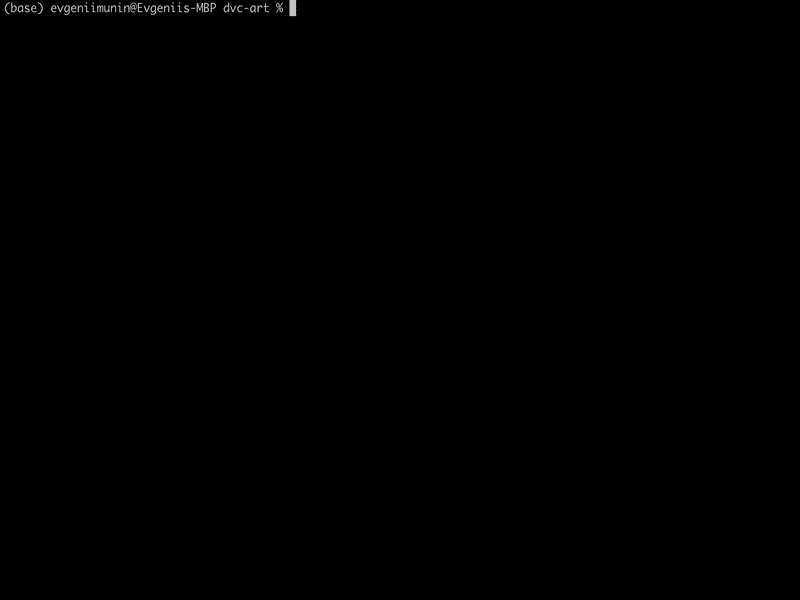
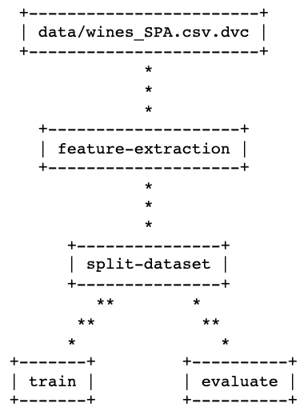

# 与 DVC 和 S3 一起构建生产就绪的 ML 工作流

> 原文：<https://betterprogramming.pub/build-production-ready-ml-workflow-with-dvc-and-s3-cdd9c95bf19>

## DVC:和 Git 一样，只是数据不同


克劳迪奥·施瓦茨在 [Unsplash](https://unsplash.com?utm_source=medium&utm_medium=referral) 上的照片

在本文中，我们将介绍数据版本控制(DVC)。这是一个由 [Iterative.ai](https://dvc.org/) 团队开发的开源工具，用于使机器学习(ML)模型可共享和可复制。

我们从 Git 开始。尽管 Git 在版本化代码方面非常有用，但它并不适合数据存储。通常用于训练 ML 模型的巨大的二进制文件、图像、视频或文本文档在存储在 repo 中时会引起问题。多次提交修改的数据会在你的 repo 中消耗大量空间，所以做`git push`需要很长时间。

DVC 解决了这个问题，因为它支持不同类型的远程存储(亚马逊 S3，GCS，Azure，HDFS 等。)并以一种直观的类似 Git 的方式与它们交互。



git-DVC 命令相似性(来源:[https://DVC . org/doc/use-cases/data-and-model-files-version in](https://dvc.org/doc/use-cases/data-and-model-files-versionin)g)

DVC 功能可以分为几个部分:

*   数据和模型版本控制:DVC 处理与回购分开存储的数据集，并确保分支机构之间的高效共享和来回切换。
*   数据和模型访问:它处理如何使用工件和从另一个 DVC 项目导入数据。
*   数据管道:描述模型工件，并提供重现它们的方法。
*   度量、参数和图:这个特性允许您评估 ML 模型，并跟踪版本之间的验证度量。

在我们的文章中，我们将在某个时候介绍这四个组件。下面是 ML 日巴团队开发的优秀[教程](https://github.com/mlrepa/dvc-1-get-started)。我们将采用它的基本结构，并添加一些特性，使代码更适合生产，并设置一个 AWS S3 远程存储。

我们将建立 ML 项目，训练和验证模型，同时处理与 DVC 的数据处理管道的每一步。作为远程存储的一个示例，我们将使用 AWS S3 存储桶。类似于[之前的文章](https://medium.com/better-programming/automate-your-machine-learning-experiments-with-mlflow-8c9e42df421)，我们将在数据集西班牙葡萄酒价格预测上进行演示。我们将训练回归模型，并根据葡萄酒的产地和年份、类型、酸度等来预测每种葡萄酒的价格。

[](/automate-your-machine-learning-experiments-with-mlflow-8c9e42df421) [## 使用 MLflow 自动化您的机器学习实验

### 少花钱多办事的简要指南

better 编程. pub](/automate-your-machine-learning-experiments-with-mlflow-8c9e42df421) 

我们将遵循下一个结构:

*   设置 AWS S3 时段
*   设置 ML 项目
*   使用 DVC 构建版本化管道

为了能够将数据推送到 S3，请确保您已经安装了[AWS CLI](https://docs.aws.amazon.com/cli/latest/userguide/getting-started-install.html)并配置了您的[凭证](https://docs.aws.amazon.com/sdk-for-javascript/v2/developer-guide/getting-your-credentials.html)。

## 设置 AWS S3 时段

首先，在 AWS 控制台中设置一个新的 S3 存储桶。你可以重定向到 S3 页面并点击`Create Bucket`按钮。在新页面上，给出您的存储桶的名称。在我们的例子中，这个桶被称为`dvc-exp-wines`。您可以保留其他默认设置。



S3 新桶创作

恭喜你！现在你有了 S3 桶`s3://dvc-exp-wines`并开始运行！

## 设置 ML 项目

现在我们要构建 ML 项目。为此，我们将可执行的 python 脚本、工件和文件夹组织成以下结构。

```
./
├── configs/
│   └── train_config.yaml
├── data/
│   ├── .gitignore
│   └── wines_SPA.csv.dvc
├── models/
│   ├── .gitignore
│   ├── metrics.json
│   └── model.pkl
├── src/
│   ├── params.py
│   └── build_features.py
├── evaluate.py
├── featurization.py
├── split_dataset.py
└── train.py
```

首先，我们将定义管道的模型参数。我们将为分割、功能、培训和一般管道设置参数。为了将它们全部集中起来，我们将使用`train_config.yaml`。

为了将`.yaml`文件解析成参数的类成员，我们将使用 [marshmallow-dataclass](https://pypi.org/project/marshmallow-dataclass/) 库。该工具有助于从数据类自动生成类型安全模式。

在我们的数据集中，我们有分类和数字特征。下一步是处理它们。这里我们将使用 [sklearn.pipeline](https://scikit-learn.org/stable/modules/generated/sklearn.pipeline.Pipeline.html) 并分别应用两个变压器:

*   带标准刻度的数字
*   用`OneHotEncoder`分类

然后我们将连接两个数据帧，并将它们序列化为`data_featurized.csv`和`data_target.csv`。我们从`params.feature_params`中获取的列列表已经在前面定义过了。

可执行文件`featurization.py`导入`build_features.py`中定义的参数和函数。

我们还定义了`train.py`和`evaluate.py`可执行文件。我们在我们的模型中使用了`RandomForestClassifier`，但是我们的实现方式也确保了我们可以轻松地添加任意数量的模型，并在`train_config.yaml`的`train_params`中定义它们的参数。为了评估我们的模型，我们将使用 R2 指标，并将它记录到`metrics.json`中。

## 与 DVC 建立管道



DVC 管道演示

现在，让我们深入 DVC。首先，让我们安装 DVC 与选项使用 S3 远程桶。

```
pip install 'dvc[s3]'
```

我们应该在项目中运行初始化命令来创建 DVC 元文件，并在 Git 中提交更改。这将添加 DVC 内部文件来开始版本控制和跟踪实验工作流。

```
dvc init
git add .
git commit -m "initialize dvc"
```

我们可以配置一个默认的远程连接到先前创建的 S3 桶。在这里，我们将推送并存储初始数据集。

```
dvc remote add -d mys3remote s3://dvc-exp-wines
git commit .dvc/config -m "initialize DVC remote"
dvc add data/wines_SPA.csv
dvc push
```

如果您移动到另一台机器或者您的团队想要导入您的项目，则可以通过从远程位置拉取存储的数据集来轻松访问它。

```
dvc pull
```

为了构建管道，我们将使用`dvc run`创建几个阶段。可在自动创建的`dvc.yaml`中访问管道详情。我们将使用以下选项来创建和运行阶段:

*   `-n`:要添加的阶段名称
*   `-d`为依赖关系
*   `-o`为输出
*   `-m`对于公制

通过指定每个命令的依赖项和输出，我们可以在数据管道中描述这个序列。让我们使用 DVC 运行我们之前创建的可执行脚本。

```
./dvc_run.sh
```

管道建好之后，我们就可以检查了。

```
dvc dag
```



DAG 可视化

产生的`dvc.yaml`将如下所示:

我们还可以检查在评估阶段获得的 R2 指标。

```
dvc metrics show -T---
Revision    Path                 r2_score                             
workspace   models/metrics.json  0.54166
```

至此，我们已经建立了管道。基本上，它代表了一堆 DVC 文件。每一个都依赖于前一阶段的数据源和来自我们项目的代码。如果我们从外部导入这个项目，并提取初始数据集，我们可以如下重现这个管道:

```
dvc repro
```

如果我们想在不同版本的数据管道之间切换，我们可以简单地在 Git 上签出，然后在 DVC 上签出。它会将您的分支对应的`.dvc`文件从`.dvc/cache`恢复到工作区。

```
git checkout new-branch
dvc checkout
```

## 最后的想法

在本文中，我们看到了 DVC 的功能，并构建了一个 ML 管道示例。使用众所周知的类似 Git 的语法，您和您的团队会很乐意使用这个工具并对数据进行实验。

我希望这篇文章能帮助你了解一个新的方便的 ML 工具，我会感谢你在下面评论区的反馈！

## 链接

*   【https://dvc.org/doc 号
*   【https://dvc.org/blog/aws-remotes-in-dvc 
*   [https://github.com/mlrepa/dvc-1-get-started](https://github.com/mlrepa/dvc-1-get-started)

[](/log-machine-learning-experiments-with-mlflow-on-azure-databricks-5a85955c9d3a) [## 用 MLflow 在 Azure Databricks 上进行日志机器学习实验

### 在 Databricks 中获取远程 MLflow tracking 服务器上记录的模型、指标和工件

better 编程. pub](/log-machine-learning-experiments-with-mlflow-on-azure-databricks-5a85955c9d3a) [](/automate-your-machine-learning-experiments-with-mlflow-8c9e42df421) [## 使用 MLflow 自动化您的机器学习实验

### 少花钱多办事的简要指南

better 编程. pub](/automate-your-machine-learning-experiments-with-mlflow-8c9e42df421)