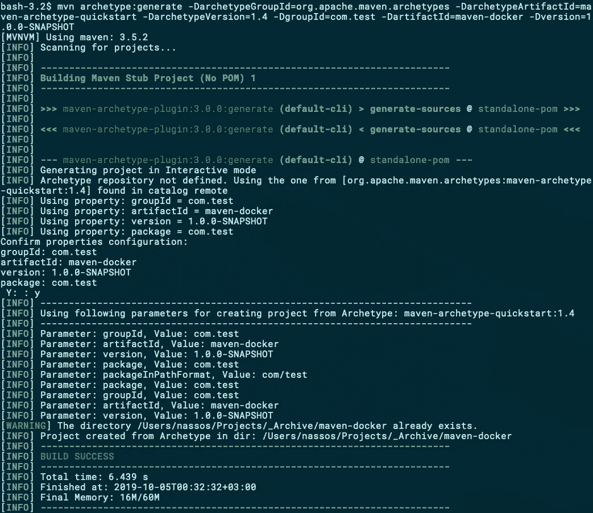

# 使用 Maven 构建并推送至 Docker

> 原文：<https://betterprogramming.pub/build-push-to-docker-with-maven-eea7c4b8cfa2>

## 使用 Spotify、fabric8 和 JIB Maven 插件自动将项目推送到 Docker


Maven 现在已经完全自动化了您的构建。你所有的插件和依赖都已经就位。你的罐子在`target`等着你。

但是，如何将它转换成 Docker 映像并推送到您喜欢的 Docker 注册表中呢？接下来我们一起来做。

# 让我们有 pom

我们将使用 [Maven Quickstart 原型](https://maven.apache.org/archetypes/maven-archetype-quickstart/) :
`mvn archetype:generate -DarchetypeGroupId=org.apache.maven.archetypes -DarchetypeArtifactId=maven-archetype-quickstart -DarchetypeVersion=1.4 -DgroupId=com.test -DartifactId=maven-docker -Dversion=1.0.0-SNAPSHOT`创建并构建一个简单的 Hello World 命令行应用程序



快速 Hello World 原型

在我们检查自动生成的项目是否编译和运行之前，我们需要修改`pom.xml`来构建一个可执行的 JAR，方法是修改`plugins`部分，添加下面的`plugin`:

```
<plugin>
  <artifactId>maven-assembly-plugin</artifactId>
  <configuration>
    <archive>
      <manifest>
        <mainClass>com.test.App</mainClass>
      </manifest>
    </archive>
    <descriptorRefs>
      <descriptorRef>jar-with-dependencies</descriptorRef>
    </descriptorRefs>
  </configuration>
  <executions>
    <execution>
      <id>make-assembly</id>
      <phase>package</phase>
      <goals>
        <goal>single</goal>
      </goals>
    </execution>
  </executions>
</plugin>
```

构建和运行时间:

`mvn clean install
java -jar target/maven-docker-1.0.0-SNAPSHOT-jar-with-dependencies.jar`

你看过《你好世界》吗？很好，是时候让多克参与进来了。

# 准备好订购另一个插件了吗，先生？

说到 Maven-Docker 集成，不缺 Maven 插件:[Spotify/Docker-Maven-plugin](https://github.com/spotify/docker-maven-plugin)(现已不活动)[Spotify/Docker file-Maven](https://github.com/spotify/dockerfile-maven)， [JIB](https://github.com/GoogleContainerTools/jib) ， [boost-maven-plugin](https://openliberty.io/blog/2018/09/12/build-and-push-spring-boot-docker-images.html) (专注于 Spring Boot)，[fabric 8 io/Docker-Maven-plugin，](https://dmp.fabric8.io/)可能还有一些我不知道的。

那么选择哪个插件呢？一个比其他的好吗？哪一个构建得更快，哪一个没有？哪一个更灵活，提供大量选项来完全定制您的构建？

好吧，这些都是有效的问题，但是在我们挑选一些插件进行实验之前，让我们花几分钟来讨论几个重要的概念。

## 归档还是不归档

传统上，您通过创作一个[Docker 文件](https://docs.docker.com/engine/reference/builder/)来使用 Docker 映像，在`docker build`和`docker push`的帮助下，您构建您的映像并将其推送到远程注册表。

许多可用的 Maven-Docker 插件允许您跳过这一部分:当您的`pom`中有 XML 的全部功能和一个智能插件来解析您的配置时，为什么还要有 Docker 文件呢？选择这样做，您可以将所有的构建逻辑放在一个文件中。如果你没有太多的 Docker 知识，你可能会发现在必要的时候应用修改更容易。

当然，大多数 Maven-Docker 插件也允许使用外部定义的 Docker 文件。这里没有什么特别的——您只需像处理 Maven 时一样处理 Docker 文件，插件会负责将 Docker 映像构建作为 Maven 构建的一部分来调用。

那么该走哪条路呢？我想说这确实是项目和经验特有的，这里没有正确或错误的答案。就我个人而言，我更喜欢有一个外部 Docker 文件——因为当我需要参考时有大量的文档可用，并且我可以快速测试我的 Docker 构建中的更改，而不必每次都调用 Maven。

## 客户端、守护程序和 API

Docker 是一只具有巨大深度和复杂性的野兽；但是，它的高级架构可以在下图中简要概括:


Docker 发动机的主要部件来自 Docker 公司的。

其核心是 Docker 守护进程，周围是一个基于 REST 的 API，提供了与外界交互的端点。使用 API 的官方客户端作为命令行应用程序提供给您使用(即您使用的`docker`命令)。

直到最近，所有已知的 Maven-Docker 插件都在与 Docker 守护进程的 REST API 进行交互，以利用其功能来构建和推送图像。2018 年夏天，谷歌云平台[的工程师们推出了](https://cloud.google.com/blog/products/gcp/introducing-jib-build-java-docker-images-better) JIB。JIB 从根本上不同于所有其他 Docker-Maven 插件，因为它不仅不使用 Docker 守护进程的 REST API，而且它实际上甚至不关心您是否有 Docker 可用/安装。

根据 JIB 的 Google[博客公告](https://cloud.google.com/blog/products/gcp/introducing-jib-build-java-docker-images-better):

> Jib 是一个快速简单的容器映像构建器，可以处理将应用程序打包成容器映像的所有步骤。它不需要您编写 docker 文件或安装 docker，它直接集成到 Maven 和 Gradle 中——只需将插件添加到您的构建中，您就可以立即将您的 Java 应用程序容器化。

JIB 会查看你的 pom 文件，找出你想要构建的内容，进行一些默认的合理猜测，并通过直接构建[图像的层](https://docs.docker.com/v17.09/engine/userguide/storagedriver/imagesandcontainers/)来生成一个 Docker 图像。

这实际上意味着，在 CI/CD 环境中，由于权限的原因，对 Docker 守护进程的访问可能会有问题(或者在 Docker-in-Docker 场景中很有挑战性)，JIB 可以为您构建一个映像，为您省去这个麻烦。在这一点上，你可能想知道，“所以 JIB 是我所需要的，为什么我要从现在开始为任何其他 Docker-Maven 插件而烦恼呢？”

JIB 是强大、灵活和智能的，但是有一个重要的警告:您不能执行 RUN 命令。你知道，那些`apt-get install`、`wget foo.tar`、`tar xfz bar.tar.gz`等等。我们通常在 Dockerfile 文件开头看到的命令？

原因很简单，与 JIB 的架构有关。因为 JIB 不使用 Docker 守护进程，所以没有创建临时容器来执行这样的 RUN 命令。所以这是一个可能[永远不会在 JIB 中得到支持的功能](https://github.com/GoogleContainerTools/jib/blob/master/docs/faq.md#i-need-to-run-commands-like-apt-get)，除非从根本上改变它的架构。

当然，你可以有一个已经包含了你需要的所有定制的基础映像，然后使用 JIB 在它的基础上构建你的应用程序；然而，这将额外的活动部分引入到您可能不想要的构建管道中。在关闭 JIB 之前，值得一提的是，如果你愿意，JIB 也可以使用 Docker 守护进程。

既然理论已经过时了，是时候深入研究一些代码了。

# 构建和推动

我们的测试程序非常简单，所以我们可以尝试上面提到的所有主要的 Docker-Maven 插件。接下来就让我们一个一个来看。这篇文章的完整代码可以在 [GitHub](https://github.com/NMichas/maven-docker) 上找到。

## 私有注册支持

如果您计划将您的映像推送到需要认证的注册中心，请确保您相应地准备好了您的环境。有几种方法可以做到这一点，下面的每个插件可能支持以下一种或多种方法:

## `~/.docker/config.json`

```
"auths": {
    "[https://index.docker.io/v1/](https://index.docker.io/v1/)": {
      "auth": "FOO",
      "email": "[m](mailto:nassosmichas@me.com)e@me.com"
    }
  }
```

请注意，`auth`参数是 username:password 的 Base64 编码版本(即`echo -n 'username:password' | base64`)。

## **$ MAVEN _ HOME/settings . XML**

```
<server>
  <id>docker.io</id>
  <username>FOO</username>
  <password>BAR</password>
</server>
```

## Spotify 插件

```
<plugin>
  <groupId>com.spotify</groupId>
  <artifactId>dockerfile-maven-plugin</artifactId>
  <version>${dockerfile-maven-version}</version>
  <executions>
    <execution>
      <id>default</id>
      <goals>
        <goal>build</goal>
        <goal>push</goal>
      </goals>
    </execution>
  </executions>
  <configuration>
    <repository>myrepo/maven-docker-spotify</repository>
    <tag>${project.version}</tag>
    <buildArgs>
      <JAR_FILE>${project.build.finalName}-jar-with-dependencies.jar</JAR_FILE>
    </buildArgs>
  </configuration>
</plugin>
```

构建:`mvn dockerfile:build` 运行:`docker run --rm myrepo/maven-docker-spotify:1.0.0-SNAPSHOT` 推送:`mvn dockerfile:push` 带认证推送(带`~/.docker/config.json` ):
`mvn dockerfile:push` 带认证推送(带`$MAVEN_HOME/settings.xml` ):
`mvn dockerfile:push -Ddockerfile.useMavenSettingsForAuth=true`

## Fabric8 插件

```
<plugin>
  <groupId>io.fabric8</groupId>
  <artifactId>docker-maven-plugin</artifactId>
  <version>${docker-maven-plugin}</version>
  <configuration>
    <filter>${*}</filter>
    <images>
      <image>
        <name>myrepo/maven-docker-fabric8:${project.version}</name>
      </image>
    </images>
  </configuration>
</plugin>
```

构建:`mvn docker:build` 运行:`docker run --rm myrepo/maven-docker-fabric8:1.0.0-SNAPSHOT` 推送:`mvn docker:push` 带认证的推送(带`$MAVEN_HOME/settings.xml` ):
`mvn docker:push`

## JIB 插件

```
<plugin>
  <groupId>com.google.cloud.tools</groupId>
  <artifactId>jib-maven-plugin</artifactId>
  <version>1.6.1</version>
  <configuration>
    <to>
      <image>myrepo/maven-docker-jib:${project.version}</image>
    </to>
  </configuration>
</plugin>
```

带认证的构建和推送(带`~/.docker/config.json` ):
`mvn docker:build` 运行:`docker run --rm myrepo/maven-docker-jib:1.0.0-SNAPSHOT`

# 结论

对于使用 Maven 构建和推送 Docker 映像，没有通用的解决方案。

这实际上取决于你想完成什么，你的项目有多复杂，你的映像构建有多复杂，在构建过程中你是否可以访问 Docker 守护进程，以及其他一些因素。

来自 [Spotify](https://github.com/spotify/dockerfile-maven) 、 [Fabric8](https://dmp.fabric8.io/) 、以及 [Google 云平台](https://github.com/GoogleContainerTools/jib/tree/master/jib-maven-plugin)的三款主流插件都是非常优秀的选择，性能良好，维护积极，在很多项目中都有使用。

离开之前的最后一件事:尽管 Docker-Maven 集成使得推送图像变得不那么痛苦，但是尽量避免直接从您的开发工作站/环境推送。

在您的 CI/CD 环境中设置一个作业，并确保只有通过触发该作业才能推送新映像。这将为您省去一些麻烦，并为您提供对 Docker 映像创建和分发的集中控制和监控。

*如果你使用 Docker，你可能还想看看这个由三部分组成的 Docker 自动化系列:* [*当你推 GitHub*](https://medium.com/better-programming/build-your-docker-images-automatically-when-you-push-on-github-18e80ece76af) *，* [*如何在 Docker Hub*](https://medium.com/better-programming/how-to-test-your-automated-builds-on-docker-hub-e40879f35d1e) *上测试你的自动化构建，以及* [*如何从失败的自动化 Docker Hub 构建*](https://medium.com/better-programming/how-to-recover-from-a-failed-automated-docker-hub-build-8b6c1cc3d7d4) *中恢复。*