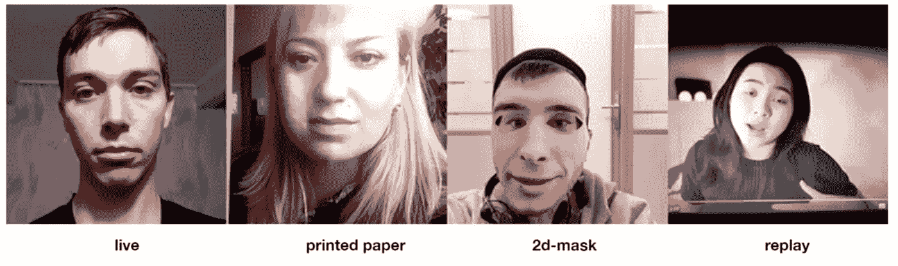

# 为 Face ID 欺骗检测建立 PyTorch 模型

> 原文：<https://betterprogramming.pub/build-pytorch-model-for-face-id-spoofing-detection-1f8d9d89eb3>

## 如何构建 PyTorch 分类模型的快速指南


来源:[https://pytorch.org/](https://pytorch.org/)

你好，在这篇文章中我想展示如何建立简单的多类分类 PyTorch 模型。PyTorch 是发展最快的深度学习框架，拥有非常活跃的社区。周围有许多教程，它的文档是相当完整和广泛的。因为我们将执行检测 Face ID 欺骗企图的任务。

# 数据

我们将使用来自 [IDRND 反欺骗挑战](https://ods.ai/competitions/idrnd-facial-antispoofing)的数据集。我们的目标是建立一个模型来检测不同的面部身份欺诈方法:冒名顶替者展示打印的肖像，把它戴在脸上，或者从另一个屏幕上重播视频。



来源:[https://github.com/datasouls/idrnd-antispoofing-challenge](https://github.com/datasouls/idrnd-antispoofing-challenge)

该数据集代表了来自 11500 名受试者的直播和恶搞图像。对于每个对象，它有 5 帧以 200 毫秒的间隔和 1080P 高清分辨率拍摄的图像。该数据集是从野外收集的，有不同的姿势和背景变化。攻击可以是以下三种类型之一:

*   2D 面具，
*   重播，
*   印刷纸。

我们将使用以下指标作为衡量标准

```
minC = min(P(false_alarm) + 19 P(miss)) by threshold
minC = min(FP/(FP+TN) + 19 FN/(FN+TP))) by threshold
```

其中`P(false_alarm)` —假阳性的概率，`P(miss)` —假阴性的概率。阈值将欺骗的概率二进制化。当模型没有检测到实际的欺骗企图时，因子 19 用于增加惩罚。

## 数据处理

为了提高模型泛化能力，我们将使用来自`[torchvision](https://pytorch.org/vision/stable/index.html)`库的标准扩充:

*   RandomResizedCrop
*   随机水平翻转
*   色彩抖动
*   随机旋转

对于训练数据，我们将应用随机变换，对于验证，我们只应用确定性变换。

我们使用 torch [数据集和 Dataloader](https://pytorch.org/tutorials/beginner/basics/data_tutorial.html) 来处理小批数据，并在每个时期对它们进行洗牌，以减少模型过拟合。使用数据集，我们可以索引加载的图像和相应的标签。Dataloader 为我们提供了 iterable，它抽象出了对数据进行批处理的逻辑。

扩充是在定义数据集对象时应用的。

## 模型

作为模型，我们将使用在 ImageNet 数据集上预先训练的`resnet50`。我们将解冻特征提取器的顶部 70 层，并添加自定义的全连接块。

## 培训和验证

为了训练模型，我们设置了经典的[亚当](https://pytorch.org/docs/stable/generated/torch.optim.Adam.html)优化器和 [BCEWithLogitsLoss](https://pytorch.org/docs/stable/generated/torch.nn.BCEWithLogitsLoss.html) 。在每个验证时期，我们将模型切换到评估模式，并停止梯度计算。我们还计算损失、准确性和自定义加权`minC`的运行指标，并在数据集上对它们进行平均。

结果，我们获得了以下指标。


# 最后的想法

在本文中，我们看到了如何构建分类 PyTorch 模型。作为基础，我们使用预训练的`resnet-50`，然后在我们的特定数据集上对其进行微调。我们还看到了如何通过 torch Dataset 和 Dataloader 使用混洗的数据批次。

## 链接

*   [https://ods.ai/competitions/idrnd-facial-antispoofing/data](https://ods.ai/competitions/idrnd-facial-antispoofing/data)
*   [https://py torch . org/tutorials/初学者/基础知识/数据 _ 教程. html](https://pytorch.org/tutorials/beginner/basics/data_tutorial.html)
*   [https://pytorch.org/vision/stable/index.html](https://pytorch.org/vision/stable/index.html)

[](https://levelup.gitconnected.com/kafka-in-machine-learning-for-real-time-predictions-45a4adf4620b) [## 用于实时预测的机器学习中的卡夫卡

### 使用 scikit 运行 Kafka 学习实时应用程序

levelup.gitconnected.com](https://levelup.gitconnected.com/kafka-in-machine-learning-for-real-time-predictions-45a4adf4620b) [](/kafka-with-python-how-to-get-your-projects-up-and-running-34bc58c46652) [## 使用 Python 的 Kafka:如何启动和运行您的项目

### 使用 Kafka 运行流式作业

better 编程. pub](/kafka-with-python-how-to-get-your-projects-up-and-running-34bc58c46652)