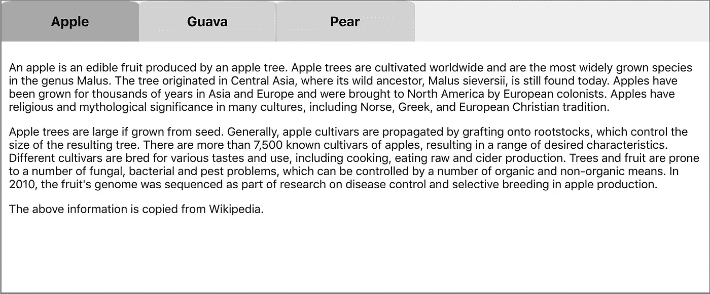
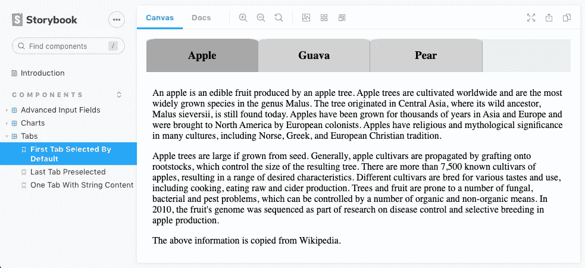
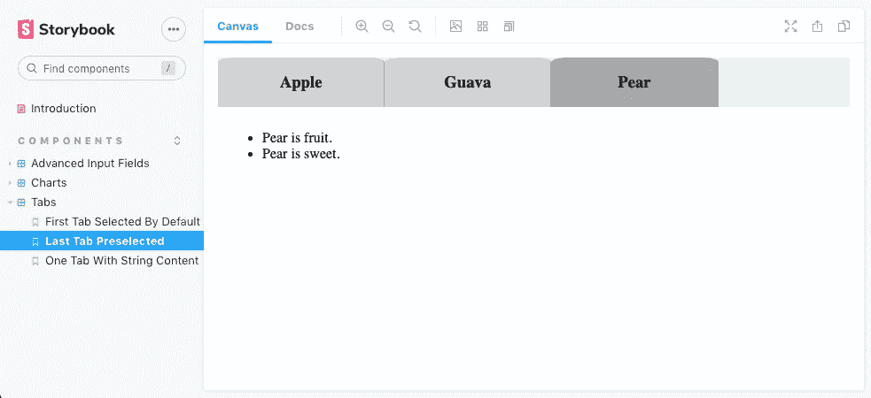
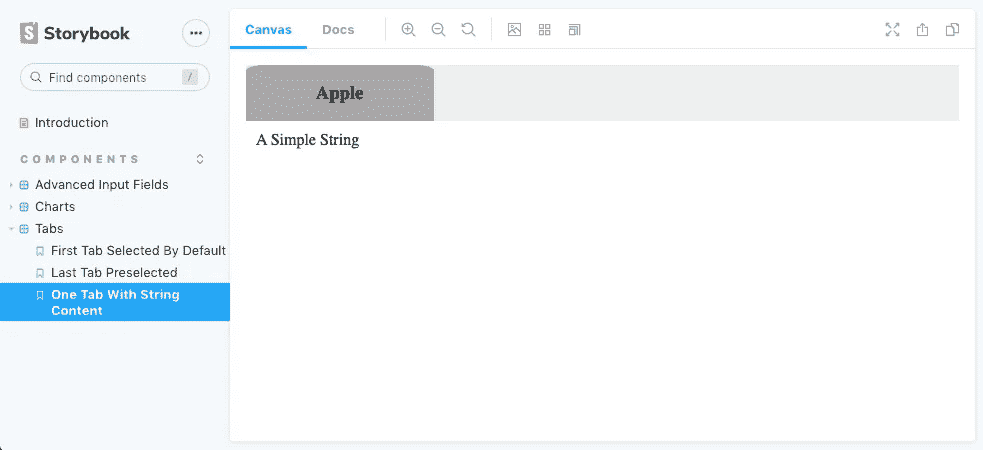

# 使用反冲、样式组件和 Storybook.js 构建 React 选项卡

> 原文：<https://betterprogramming.pub/build-react-tabs-using-recoil-styled-components-and-storybook-js-4ad534cef007>

## 用最新技术构建 React 组件的开发指南


图片来源:作者

在上一篇文章中，我们介绍了自 2020 年 5 月起可用的状态管理库——反冲。对于管理状态，反冲比上下文 API 和 Redux 更简单有效。从那以后，我们就一直在我们的项目中使用它。

在另一篇文章的[中，我们介绍了样式组件，这是一个 JavaScript 库，允许我们在 JavaScript 文件中编写 CSS。因此，组件可以独立运行，不依赖任何外部 CSS 文件。](https://medium.com/better-programming/styled-components-a-css-in-js-approach-755f6a196c42)

[Storybook](/an-in-depth-look-at-storybook-6-8c44cd6895ee) 是 UI 开发的工具。它通过隔离组件使开发更快更容易。这允许我们一次处理一个组件。

我们用标签作为例子来说明反冲、样式组件和故事书的威力。

由于我们正在编写[采访系列](https://jenniferfubook.medium.com/jennifer-fus-web-development-publications-1a887e4454af)，创建选项卡组件也是一个常见的采访问题。这篇文章让你为开发工作和面试挑战做好准备。

# 选项卡组件

选项卡是 UI 中最常用的组件之一。它们允许在同一上下文中的视图之间切换，而无需导航到不同的区域。每个选项卡都有一个标题标签和一个详细的内容面板。任何时候都有且只有一个活动标签。需要视觉指示来显示哪个选项卡是活动的。显示活动选项卡的内容，隐藏其他内容。

以下是选项卡的示例:



总共有三个选项卡，`Apple`是活动选项卡。用户可以点击标签并激活它。

我们将构建`Tabs`组件，它允许开发人员以声明方式编写标签:

```
<Tabs activeIndex={2}>
  <Tab label="Apple">
    <any JSX content>
  </Tab>
  <Tab label="Guava">
    <any JSX content>
  </Tab>
  <Tab label="Pear">
    <any JSX content>
  </Tab>
</Tabs>
```

`Tabs`是由若干`Tab`组件组成的。每个`Tab`组件都有一个标签，显示为选项卡名。其内容是任何 JSX 内容。`Tabs`有一个可选属性:`activeIndex`。如果它是一个有效的数字，相关联的选项卡将被预先选择为活动的。否则，第一个选项卡将被预先选择为活动的。

这些可以通过以下类型定义来总结:

```
export interface TabsProps {
  activeIndex?: number;
  children: JSX.Element[] | JSX.Element;
}export interface TabProps {
  label: string;
  children: JSX.Element[] | JSX.Element | string;
}
```

# 建立工作环境

和往常一样，我们使用 [Create React App](https://medium.com/better-programming/10-fun-facts-about-create-react-app-eb7124aa3785) 来设置 React 编码环境:

```
npx create-react-app my-app
cd my-app
npm start
```

在这个 React 环境中，我们为`package.json`中的`[dependencies](https://medium.com/better-programming/package-jsons-dependencies-in-depth-a1f0637a3129)`设置了反冲和样式组件:

```
npm i recoil
npm i styled-components
```

为了使用后坐力，部件必须用`<RecoilRoot>`包裹。在下面的`src/index.js`中，在第 3、10 和 12 行添加`RecoilRoot`:

然后我们安装故事书:

```
npx sb init
```

我们准备建造`Tabs`。需要创建`src/components/Tabs`中的以下文件来完成任务:

```
$ ls
Tab.js          Tabs.js         Tabs.stories.js index.js        tabStates.js
```

# 实现 tabStates.js

`useState`是一个钩子，用于跟踪函数组件中的反应状态。但是，这种状态只在函数组件内部可用。为了创建`Tabs`和`Tab`之间共享的状态，需要外部状态。

我们使用反冲来跟踪标签状态。它由两个原始状态组成:

*   活动索引
*   所有标签

还有一种派生状态。基于活动索引和所有标签，我们可以计算活动标签。

原始状态保存在原子中，原子是共享的、可写的。派生状态来自选择器，选择器使用纯函数来计算派生值。选择器避免冗余状态，通常不需要归约器来保持状态同步和有效。

订阅相关原子或选择器的组件将在这些原子或选择器的状态改变时重新呈现。

在下面的`src/components/Tabs/tabStates.js`、`activeIndexAtom`(第 6 - 9 行)和`labelArrayAtom`(第 14 - 17 行)是原子。`activeLabelSelector`(第 23 - 30 行)是一个选择器。

# 实现 Tab.js

选项卡有一个标题标签和一个详细的内容面板。内容面板是否显示由`Tabs`控制。`Tab`组件呈现其选项卡标签。

以下是`src/components/Tabs/Tab.js`:

第 6-18 行定义了选项卡标签的 CSS，这是一个基于`h3`的样式化组件(`TabName`)。在[一篇采访准备文章](https://medium.com/javascript-in-plain-english/interview-prep-build-web-application-using-html-css-and-javascript-d6489132daaf)中，我们解释了如何布局和设计组件的基础知识。它有指针光标和网格布局。当它处于悬停状态时，背景颜色会发生变化。

第 25 行读取了`activeLabelSelector`值。基于该值，选项卡背景被设置为`darkgrey`(活动)或`lightgrey`(非活动)。选项卡颜色会相应更新。

# 实现 Tabs.js

选项卡由许多选项卡组件组成。将显示选项卡名称和活动选项卡的内容。

下面是`src/components/Tabs/Tabs.js`:

第 6-9 行定义了选项卡名称的 CSS，这是一个基于`div`的样式化组件(`TabNames`)。

第 11-13 行定义了选项卡内容面板的 CSS，这是一个基于`div`的样式化组件(`TabContent`)。

第 20 行读取并设置`activeIndexAtom`值。活动索引用于显示活动内容(第 45-48 行)。如果有效，第 31-33 行设置初始活动索引。否则，将使用默认值 0。当点击一个选项卡时，活动索引相应地更新(第 40 行)。

第 21 行获取`setLabelArray`方法，该方法用于将所有标签初始化为`labelArrayAtom`(第 30 行)。

如果不是数组，第 23-26 行将子元素转换为数组。

# 实现 index.js

`index.js`不是必须的，但是使用一个文件来[再导出](https://medium.com/better-programming/a-handy-guide-to-export-and-import-modules-for-javascript-and-typescript-6cff8e47d554)会使使用变得容易。对于通用组件，建议创建索引文件。

以下是`src/components/Tabs/index.js`:

使用`Tabs`的所有组件，我们可以使用修改后的`src/App.js`运行演示:

在第 2 行，import 语句通过使用`index.js`更加清晰。否则，我们必须从两个不同的文件中导入`Tab`和`Tabs`。

# 实现 Tabs.stories.js

我们已经构建了选项卡组件并展示了一个演示。它工作了。

但是如果我们用一个特定的活动索引来初始化呢？如果只有一个标签呢？

对于所有的变化，故事书提供了一个很好的尝试场所。我们可以为每个“如果”编一个故事

下面是`src/components/Tabs/Tabs.stories.js`，由三个故事组成:

8 号线把故事包在`<RecoilRoot>`里面。

故事名称是组件的[骆驼案例名称](https://en.wikipedia.org/wiki/Camel_case)的解析字符串(第 13、68 和 123 行)。

第 13-66 行定义了第一个故事。这类似于我们在`src/App.js`中的演示，默认情况下第一个标签被选中。



第 68-121 行定义了第二个故事，其中第二个选项卡(基于 0)被初始化选择(第 70 行)。



第 123-129 行定义了第三个故事，这里只有一个选项卡。



很容易添加更多的用例。

用命令`npm run storybook`启动故事书。

# 结论

我们已经使用反冲、样式组件和故事书创建了标签组件。这是构建通用组件的三个强大要素。

这个例子位于 GitHub 上的[。你可以在线观看和玩故事书](https://github.com/JenniferFuBook/react-components)。[我们的下一篇文章](https://medium.com/better-programming/build-advanced-react-input-fields-using-styled-components-and-storybook-js-a231b9b2438)描述了如何为存储库建立一个 GitHub Pages 站点。

感谢阅读。我希望这有所帮助。你可以在这里看到我的其他媒体出版物。