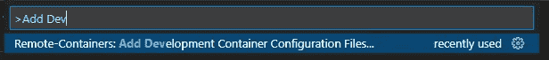
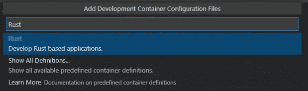
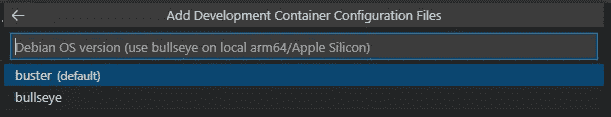
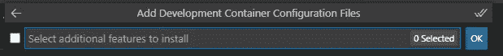
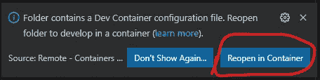
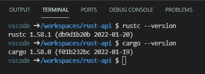
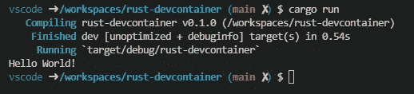
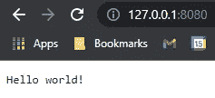
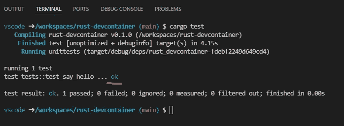
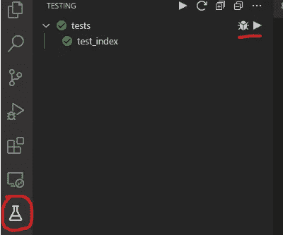

# 用开发容器构建 Rust 应用程序

> 原文：<https://betterprogramming.pub/build-rust-apps-with-dev-containers-3799b20ca683>

## 你有没有想过试试 Rust？立即开始使用 VSCode 和 Devcontainers！


迈克尔在 [Unsplash](https://unsplash.com?utm_source=medium&utm_medium=referral) 上的照片

Rust 是这个领域的新生事物，它目前正在——也很有道理——引发大量炒作。喜欢 Rust 的原因有很多，但我认为它们在许多其他文章中都有涉及。我将使用 Rust 来进一步展示包含 VS 代码的开发容器是非常强大的工具，我认为所有开发人员都应该在他们的工具箱中拥有这些工具，而不是对 Rust 本身大肆渲染。

我猜想，虽然许多技术博客的读者可能听说过 Rust。但是我也猜想，没有多少人在您的机器上安装了工具，并开始使用 Rust？

这不会是一个 Rust 语言教程——外面有很多这样的教程！本文将展示如何使用 Visual Studio 代码和 Docker 为 Rust 建立一个开发环境。我将演示如何在 Docker 容器中构建一个全功能的 Rust 开发环境，这样你就可以不用在你的机器上安装任何特定于 Rust 的东西就可以开始了。

为了说明这一点，我将使用 [Acitx](https://actix.rs/) 构建一个简单的 API 示例。当然，如果我不加入一些测试，那就没什么意思了，所以我也要说了！

根据我以前的教程，您的机器的先决条件如下:

*   [码头工人](https://docs.docker.com/get-docker/)
*   [Visual Studio 代码](https://code.visualstudio.com/download)
*   VSCode 的'[远程容器](https://marketplace.visualstudio.com/items?itemName=ms-vscode-remote.remote-containers)'扩展
*   运行 bash shell 的终端
*   如果你用的是 Windows，[我推荐 WSL](https://docs.microsoft.com/en-us/windows/wsl/install-win10) ，尽管这不是必须的。

这里的代码可以在找到[。想跳到最后就克隆回购！](https://github.com/AndyWatt83/rust-docker-dev-env)

# 我们走吧！


照片由[玛丽·P](https://unsplash.com/@marie_enk?utm_source=medium&utm_medium=referral)在 [Unsplash](https://unsplash.com?utm_source=medium&utm_medium=referral) 拍摄

首先创建一个空文件夹，放入 cd，然后打开 VSCode。将它复制并粘贴到您的终端中，或者用传统的方式通过 explorer 来完成。

```
mkdir rust-devcontainer; \
cd rust-devcontainer; \
code .;
```

当 VSCode 打开时，按 F1，并搜索添加开发容器。*注意:你需要安装* [*扩展*](https://marketplace.visualstudio.com/items?itemName=ms-vscode-remote.remote-containers) *。*



搜索“Rust”并添加容器配置文件。



选择默认版本(撰写时为 buster)。



跳过任何附加功能，点击“确定”



当自动添加配置文件时，VSCode 将显示一个弹出窗口，让您打开容器。点击“在容器中重新打开”,在 Docker 中打开环境。

*注意:如果弹出窗口没有出现，点击 F1 并搜索“在容器中重新打开”*



通过打开一个终端并检查 Rust 工具是否可用，向自己证明您现在是在一个安装了所有 Rust 工具的容器中运行:



一旦进入 Rust 环境，建立一个简单的 API 就非常简单了。通过在 VSCode 中打开终端并键入以下命令来初始化一个新的 Rust 项目:

```
cargo init
```

为了表明我们已经真正启动并运行了 rust 环境，请转到`src\main.rs`文件，并添加以下内容:

```
fn main() {
   println!("Hello World!");
}
```

然后，在 VSCode 终端中，键入以下内容:

```
cargo run
```



就是这样！我们有一个全功能的 Rust 开发环境正在运行，我们已经准备好构建任意数量的应用程序。

接下来，让我们使用 Actix 构建一个演示 API。

# 简单 API

在`cargo.toml`文件中为 Actix 添加一个依赖项。

注意:我现在用的是测试版。

```
[dependencies]
actix-web = "4.0.0-beta.21"
```

然后，删除“hello world”示例，并将其添加到`src\main.rs`文件中:

要确保它正常工作，请打开终端，键入

```
cargo run
```

这将启动在`http://127.0.0.1:8080`上运行的 API

如果您在浏览器中访问该 URL，您会看到它的行为符合预期。



到目前为止一切都很好，我们可以到此为止了。但是，在至少有一个单元测试运行之前，我是不会满意的，所以让我们开始吧。

# 测试


照片由[JESHOOTS.COM](https://unsplash.com/@jeshoots?utm_source=medium&utm_medium=referral)在 [Unsplash](https://unsplash.com?utm_source=medium&utm_medium=referral) 上拍摄

回到`src\main.rs`文件，在逻辑下添加以下代码:

并通过在 VSCode 中进入终端并键入以下命令来运行测试:

```
cargo test
```

您应该看到测试通过了！



这是一个可用的测试设置，但我确实喜欢测试浏览器，这样 VSCode 感觉更像一个“真正的 IDE”。一如既往，社区提供了一个。

在文件`.devcontainer\devcontainer.json`中，向 extensions 属性添加另外两行

```
"swellaby.vscode-rust-test-adapter",
"ms-vscode.test-adapter-converter"
```

您需要退出并重新进入远程容器才能看到更改(F1，回到 WSL，然后回到 devcontainer)。重新加载环境后，您将看到熟悉的 VSCode 测试资源管理器。您可以直接从 explorer 中运行测试！



假设一切正常，您可以从 VSCode 测试资源管理器中导航并运行测试。

# 结论

我认为这是暂时停下来的好地方。我们已经建立了一个相当全面的 Rust 开发环境，其中安装了一个基本的 API、一个单元测试示例和一些基本的 Rust 扩展。

因为这些都是使用 devcontainers 配置的，所以这个设置可以非常容易地在团队中共享，让每个人在几秒钟内就可以启动并运行一个一致的 Rust dev 环境——就像克隆一个 repo 一样长！

我希望这是对那些坚持到最后的人有用的阅读！我希望我已经改变了至少几个新的“农村人”！

```
**Want to Connect?**You can get in touch on [Linkedin](https://www.linkedin.com/in/andywatt83/).
```