# 使用 Nest.js 构建可伸缩的事件驱动应用程序

> 原文：<https://betterprogramming.pub/build-scalable-event-driven-applications-with-nest-js-28676cb093d0>

## 我们将探索可能发生的可伸缩性问题的实际例子以及解决这些问题的常用方法。


加布里埃尔·海因策在 [Unsplash](https://unsplash.com?utm_source=medium&utm_medium=referral) 上的照片

在这篇文章中，我想谈谈 Nest.js 框架为开发人员提供的可伸缩事件驱动应用程序的元素。我将展示使用现代框架构建后端 Node.js 应用程序是多么容易。

```
**Agenda**

What is Nest.js?

[How Does Nest.js Help Build Highly-Scalable Apps?](#1fc3)

[Demo App and Tools](#e49d)

[Demo App in Action](#7525)
```

我想简要地写一下什么是 Nest.js，以及它如何帮助构建可伸缩的应用程序？我为你准备了一个演示。我们将描述整体架构和使用的工具，然后运行并查看我们的演示。

# **什么是** Nest.js **？**

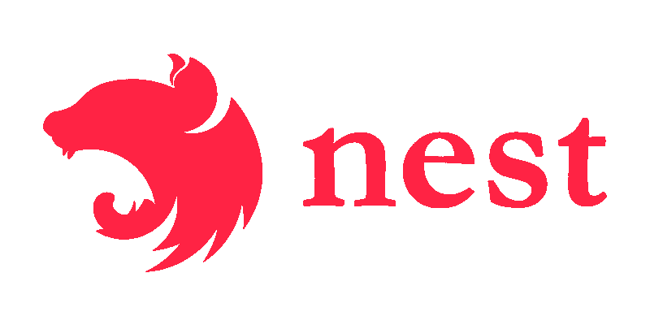

Nest.js —构建后端 Node.js 应用程序的现代框架。

这是一个构建 Node.js 应用程序的框架。

它的灵感来自 Angular，并且非常依赖 TypeScript。

所以它提供了某种类型安全的开发体验。transpiling 之后还是 JavaScript，所以在处理常见的安全风险时要小心。

它已经是一个相当流行的框架，你可能已经听说过了。

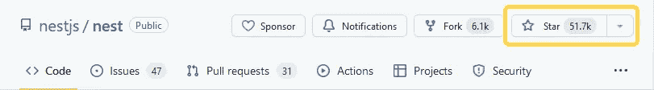

GitHub 从 2022 年到 2011 年

## 为什么使用另一个框架？

*   依赖注入
*   与数据库的抽象集成
*   抽象的常见用例:缓存、配置、API 版本和文档、任务调度、队列、日志、cookies、事件和会话、请求验证、HTTP 服务器(Express 或 Fastify)、身份验证。
*   打字稿(和装饰者)
*   优秀应用程序的其他设计元素:中间件、异常过滤器、防护、管道等等。
*   还有一些，我稍后会讲到

让我们快速回顾一下这个框架为我们提供了什么。

使用框架的一个主要优点是有一个依赖注入。它消除了创建和支持类依赖树的开销。

它与大多数数据库有抽象的集成，所以你不必考虑它。一些最受支持的开发和流行的包是 mongoose、TypeORM、MikroORM 和 Prisma。

它抽象了 web 开发的常见用例，如缓存、配置、API 版本和文档、队列等。

对于 HTTP 服务器，您可以选择 Express 或 Fastify。

它使用了 TypeScript 和 decorators。它简化了阅读代码，尤其是在较大的项目中，并允许开发团队在推理组件时保持一致。

此外，与任何框架一样，它提供了其他应用程序设计元素，如中间件、异常过滤器、防护、管道等等。

最后，我们稍后将讨论可伸缩性特有的其他一些特性。

# Nest.js 如何帮助构建高可伸缩性的应用？

让我们首先回顾一下构建高可伸缩性应用程序的主要策略。

以下是选项:

*   整体式(模块化)
*   微服务
*   事件驱动的
*   混合的

> 软件开发都是关于权衡的。

我想谈的第一种方法是使用 monolith。


monolith Nest.js 项目架构示例。

这是一个组件紧密耦合的单一应用程序。

他们一起部署，一起支持，通常，他们离不开彼此。

如果你用那种方式编写你的应用程序，最好使用模块化的方法，这是 Nest.js 非常擅长的。

当使用模块化方法时，您可以有效地拥有一个代码库，但是您的系统的组件作为某种程度上独立的实体，可以由不同的团队来工作。随着团队和项目的增长，这变得更加困难。这就是为什么我们有其他的架构开发模型。

## **微服务**

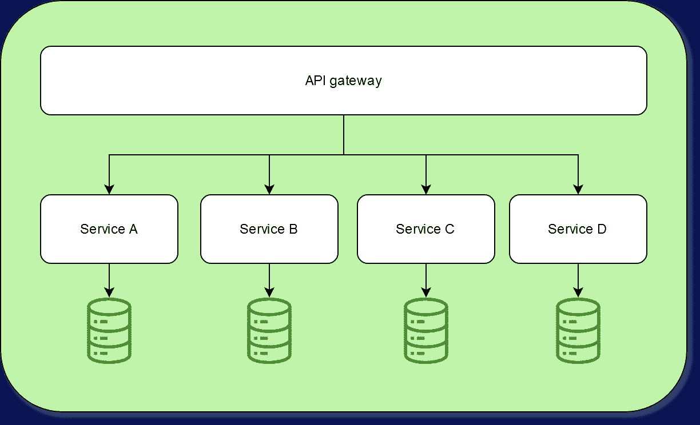

一个微服务 Nest.js 项目架构的例子。

微服务是指每个服务都有单独的部署。通常，每个服务只负责一小部分工作，并且会有自己的存储。

事件驱动的方法类似于微服务。

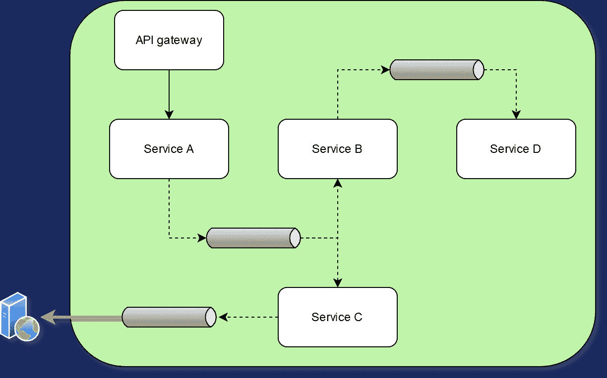

事件驱动的 Nest.js 项目架构示例。

现在，服务之间没有直接的通信。而是每个服务都会发出一个事件，然后就不管了。

该事件可以有侦听器，但不能有侦听器。如果有人消费了事件，它可以再次产生另一个事件，另一个服务可以消费，等等。

最终，有人会为等待的客户端生成一个响应。它可以是 WebSocket 响应或 webhook 或其他任何东西。

服务将通过 HTTP 请求或消息传递与其他服务通信。

## **混合建筑**

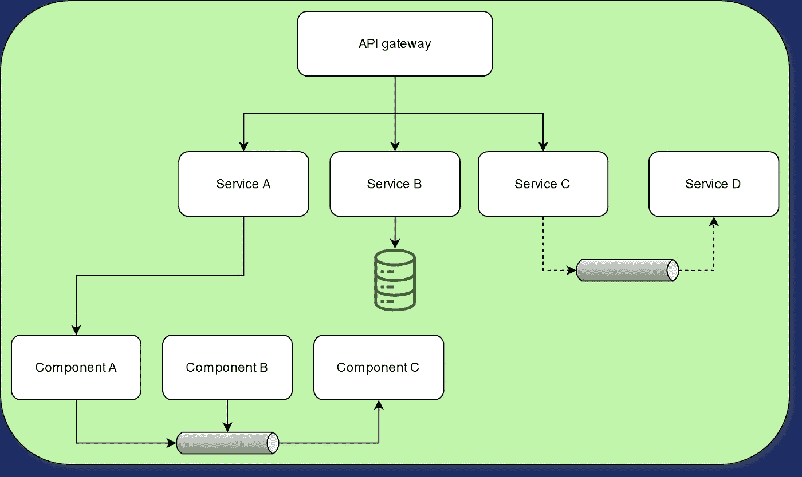

混合 Nest.js 项目架构的例子。

通常，我们的大型项目是所有设计的混合——一些组件紧密耦合并部署在一起，一些组件单独部署，一些组件通过事件消息传递进行通信。

# Nest.js =简单的事件驱动应用程序开发

让我们思考一下为什么这个框架简化了事件驱动的开发。

*   与 Redis/Bull 集成进行队列管理(【github.com/OptimalBits/bull】T4)
*   与大多数消息传递代理集成
*   促进模块化开发
*   出色的文档和示例
*   单元和集成测试是自举的(DI，Jest)

首先，它允许快速简单地集成流行的 Bull 队列包。

对于微服务开发和通信，它集成了最受欢迎的消息代理，如 Redis、Kafka、RabbitMQ、MQTT、NATS 等。

第三，它促进了模块化开发，因此在项目生命周期的后期提取单个工作单元自然很容易。

我的下一点是，它有很好的文档和例子，这总是好的。你可以在几分钟内运行你的第一个分布式应用。

我想注意的另一件事是，单元和集成测试是为你自举的。它有用于测试的 DI 和 Jest 测试框架的所有其他强大特性。

# **队列** (npm/bull)

现在，让我们看看如何在 NestJS 中创建一个简单的队列。

## **队列:添加连接**

首先，使用以下命令安装所需的依赖项:

```
npm install --save @nestjs/bull bull
npm install --save-dev @types/bull
```

然后创建一个到 Redis 的连接。

> Nest.js 用 Bull 连接 Redis 的例子。

```
BullModule.forRootAsync({
  imports: [ConfigModule],
  useFactory: async (configService: ConfigService) => ({
    redis: {
      host: configService.get('REDIS_HOST') || '127.0.0.1',
      port: +configService.get('REDIS_PORT') || 6379,
      password: configService.get('REDIS_PASSWORD') || undefined,
    },
  }),
  inject: [ConfigService],
}),
```

最后，注册一个队列。

> 向 Bull 注册 Nest.js 队列的例子。

```
BullModule.registerQueue({
  name: TRADES,
}),
```

## 队列:**事件生成器注入一个队列**

> Nest.js 用 Bull 发出事件的例子。

```
export class TradeService {
  constructor(@InjectQueue(TRADES) private queue: Queue) {}

  async add() {
    const uuid = randomUUID();

    await this.queue.add({ uuid });
  }
}
```

接下来，在服务构造函数中的其他地方，您键入提示您的队列，它被依赖注入容器注入——您现在拥有对队列的完全访问权，并且可以开始发出事件。

## 队列:**事件消费者处理队列**

> Nest.js 用 Bull 消费事件的例子。

```
@Processor(TRADES)
export class TradeService {
  @Process()
  async process(job: Job<TradeCreatedDto>) {
    // ...
  }
}
```

在另一个模块的某个地方，你用一个最小的设置来修饰你的处理器类，以使一个队列系统工作。

您可以让生产者和消费者存在于一个应用程序中，也可以分开存在。他们将通过您选择的消息代理进行交流。

# **消息传递集成—连接**

消息提供者连接从添加客户端模块连接开始。在这个例子中，我们有 Redis 传输，应该提供 Redis 特定的连接选项。

> Nest.js 向 Redis 注册消息客户端模块的示例。

```
@Module({
  imports: [
    ClientsModule.register([
      {
        name: 'MATH_SERVICE',
        transport: Transport.REDIS,
        options: {
          host: 'localhost',
          port: 6379
        }
      },
    ]),
  ]
  ...
})
```

# **消息传递集成—生产者**

下一步是将客户机代理接口注入我们的生产者服务。

> Nest.js 将消息传递客户端模块注入服务类的示例。

```
constructor(
  @Inject('MATH_SERVICE') private client: ClientProxy,
) {}
```

我们进一步的选择是`SEND`方法或`EMIT`。

`SEND`通常是一个同步动作，类似于 HTTP 请求，但是被框架抽象为通过选择的传输来动作。

在下面的例子中，`accumulate()`方法的响应直到消息被监听器应用程序处理后才会被发送到客户端。

> 一个 Nest.js 通过消息代理向远程服务发送消息的例子。

```
accumulate(): Observable<number> {
  const pattern = { cmd: 'sum' };
  const payload = [1, 2, 3];
  return this.client.send<number>(pattern, payload);
}
```

`EMIT`命令是一个异步的工作流启动，它将充当触发和遗忘或者在某些传输中，这将充当一个持久的队列事件。这将取决于所选择的传输及其配置。

> Nest.js 通过消息代理向远程服务发送消息的例子。

```
async publish() {
  this.client.emit<number>('user_created', new UserCreatedEvent());
}
```

`SEND`和`EMIT`模式在消费者端有稍微不同的用例。让我们看看。

# **消息传递集成—消费者**

`MessagePattern` decorator 只用于类似同步的方法(用`SEND`命令产生)，并且只能在控制器修饰的类中使用。

因此，我们希望通过我们的消息传递协议收到的请求会得到一些响应。

> Nest.js 通过消息代理响应远程服务的例子。

```
@Controller()
export class MathController {
  @MessagePattern({ cmd: 'sum' })
  accumulate(data: number[]): number {
    return (data || []).reduce((a, b) => a + b);
  }
}
```

另一方面，`EventPattern` decorator 可以在你的应用程序的任何自定义类中使用，它会监听在同一个队列或事件总线上产生的事件，并且它不期望我们的应用程序返回什么。

> Nest.js 通过消息传递代理处理来自远程服务的消息的示例。

```
@EventPattern('user_created')
async handleUserCreated(data: Record<string, unknown>) {
  // business logic
}
```

这种设置类似于其他消息传递代理。如果是自定义的，您仍然可以使用阿迪容器并使用 Nest.js 接口创建自定义事件子系统提供程序。

> Nest.js 的 MQTT 和 NATS 消费者示例

```
// MQTT
@MessagePattern('notifications')
getNotifications(@Payload() data: number[], @Ctx() context: MqttContext) {
  console.log(`Topic: ${context.getTopic()}`);
}

// NATS
@MessagePattern('notifications')
getNotifications(@Payload() data: number[], @Ctx() context: NatsContext) {
  console.log(`Subject: ${context.getSubject()}`);
}
```

> RabbitMQ 和 Kafka nest . js 的消费者示例。

```
// RabbitMQ
@MessagePattern('notifications')
getNotifications(@Payload() data: number[], @Ctx() context: RmqContext) {
  console.log(`Pattern: ${context.getPattern()}`);
}

// Kafka
@MessagePattern('hero.kill.dragon')
killDragon(@Payload() message: KillDragonMessage, @Ctx() context: KafkaContext) {
  console.log(`Topic: ${context.getTopic()}`);
}
```

这就是使用 Nest.js 抽象与最常见的消息传递代理集成的简单程度。

# **演示应用和工具**

可从以下 [GitHub](github.com/dkhorev/conf42-event-driven-nestjs-demo) 获得。

在这一节中，我将回顾一个真实应用程序的一部分(当然是简化的)。您可以在我的 GitHub 页面上获得源代码，或者稍后试用。我将展示正确设计的 EDA 如何面对挑战，以及我们如何使用框架工具快速解决这些挑战。

# **演示应用概述**

让我们先做一个快速的概述。我们预期的工作流程如下:

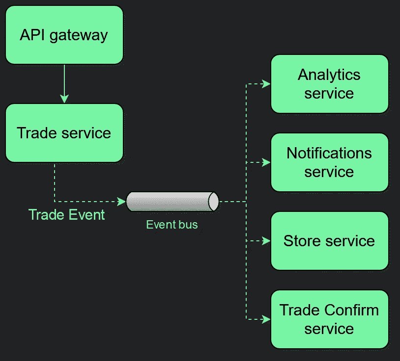

Nest.js 事件驱动的应用程序演示概述。

我们有一个在 API 网关中发生的动作，它触及交易服务，交易服务发出一个事件。

该事件进入队列或事件总线。然后，我们有四个其他服务监听并处理它。

为了观察这个应用程序的性能，我使用了一个辅助应用程序，它是我的“通道监视器”这是一种提高可观察性的强大模式，有助于根据渠道指标自动扩大和缩小规模。

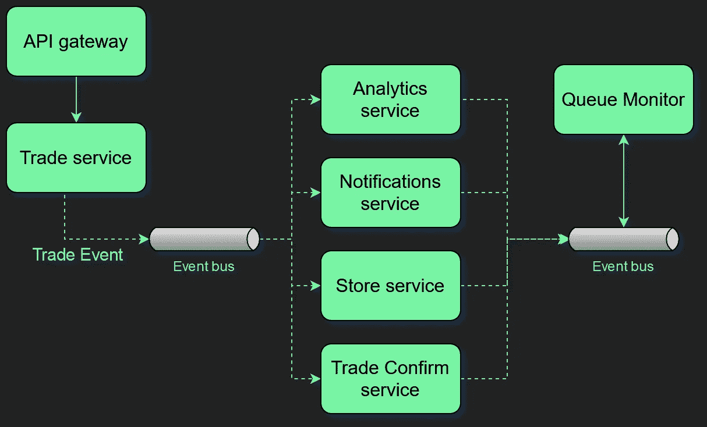

带有通道监视器的 Nest.js 事件驱动应用程序演示概述。

一会儿我会告诉你它是如何工作的。

# 运行中的演示应用——正常条件下

我准备了一个`Makefile`，所以你可以跟着来。

首先，运行一个`make start`命令，它将启动 docker 和所有需要的服务。接下来，运行一个`make monitor`命令来查看应用程序指标。

监视器显示了队列名称、等待作业的数量、已处理作业的数量以及在线工作实例的数量。

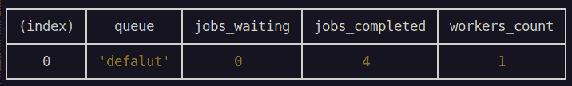

运行中的演示应用——正常条件下。

如您所见，在正常情况下，`jobs_waiting`计数为零，事件流很慢，我们没有任何堆积的作业。

这个应用程序在低事件计数的情况下工作良好。但是如果流量突然增加会怎么样呢？

# 运行中的演示应用程序—流量峰值

您可以通过运行`make start-issue1`命令并使用`make monitor`命令重启监视器来开始这个演示。我们的事件流增加了三倍。

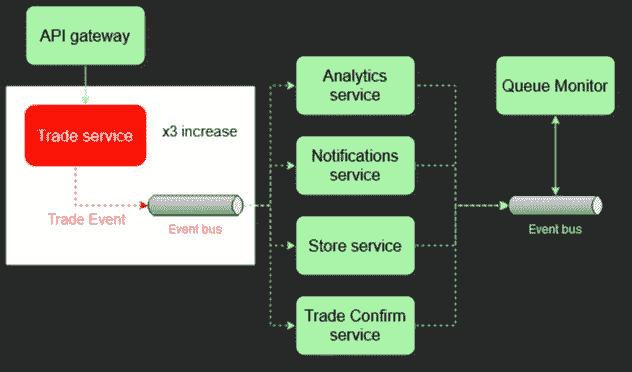

Nest.js 事件驱动的应用程序演示，流量增加。

您最终会在 monitor 应用程序中注意到`jobs_waiting`计数将开始增加，虽然我们仍在用一个工人处理作业，但与增加的流量相比，队列已经变慢了。

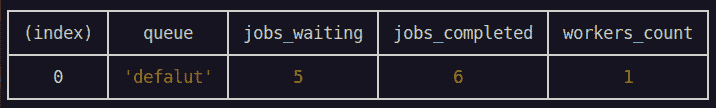

运行中的演示应用——流量激增。

现在我们可以看到，这抑制了我们的关键任务贸易服务确认。

worker 会无优先级地处理所有事件，因此每个新的交易确认必须首先等待一些 over 事件完成。

您可以想象这会导致我们的交易处理前端客户端应用程序的响应时间变慢。

# **解决方案？**

让我们探索一下解决这个问题的方法:

*   扩展 worker 实例，以便它能够更快地处理队列
*   增加工作实例计数
*   应用优化
*   分开队列
*   优先处理事件

第一个也是最明显的是扩展 worker 实例，这样它会运行得更快。在 Node.js 世界中，这很少是一个好的解决方案，除非您正在处理视频、音频或加密等高 CPU 密集型任务。

第二是增加工作实例数。这是一个有效的选择，但有时不太划算。

接下来，我们可以考虑应用程序优化，包括概要分析、调查数据库查询以及类似的活动。这可能很耗时，且不会产生任何结果或非常有限改进。

Nest.js 可以帮助我们实现最后两个选项。这是为了区分队列和优先处理一些事件。

# 步骤 1-分离队列

我将从应用队列分离方法开始。

交易队列将只负责处理交易确认事件。

我的代码应该是这样的:

```
this.queue.add(JOB_ANALYTICS, { uuid });
this.queue.add(JOB_NOTIFICATION, { uuid });
this.queue.add(JOB_STORE, { uuid });
// this.queue.add(JOB_TRADE_CONFIRM, { uuid });
this.queueTrades.add(JOB_TRADE_CONFIRM, { uuid });
```

第一步是要求我们的`PRODUCER`向新队列`TRADES`发出一个`TRADE CONFIRM`事件。

在消费者端，我提取了一个名为`TradesService`的新类，并将其作为监听器分配给`TRADES`队列。

```
@Processor(QUEUE_TRADES)
export class TradesService {
  protected readonly logger = new Logger(this.constructor.name);

  @Process({ name: '*' })
  async process(job: Job<TradeCreatedDto>) {
    // ...
  }
}
```

`QUEUE DEFAULT`监听器服务保持不变。我不需要在这里做任何改变。

```
@Processor(QUEUE_DEFAULT)
export class DefaultService {
  protected readonly logger = new Logger(this.constructor.name);

  @Process({ name: '*' })
  async process(job: Job<TradeCreatedDto>) {
    // ...
  }
}
```

现在，无论发生什么，无论我们有什么样的峰值，交易永远不会停止处理(他们会慢下来，但不会等待不重要的事件)。

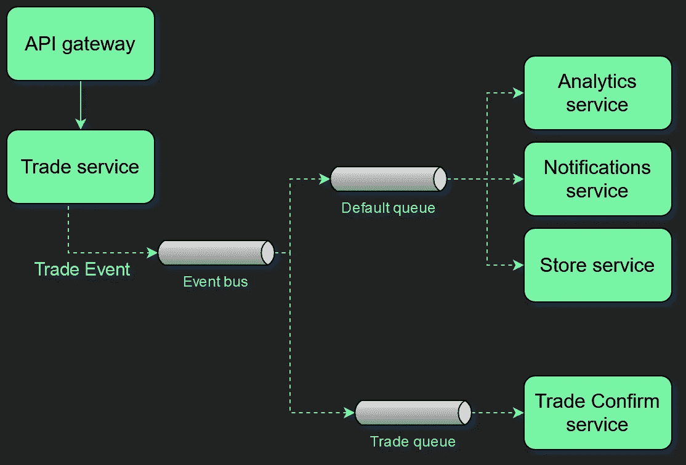

带有独立交易队列的 Nest.js 事件驱动应用程序演示。

您可以使用`start-step1`命令运行这个示例，并重新启动监视器。

您会注意到交易队列的`jobs_waiting`计数为零，但是默认队列仍然会遇到问题。

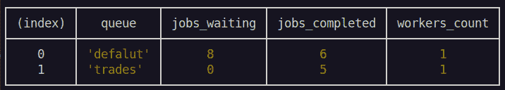

运行中的演示应用程序——交易队列是独立且固定的。

现在，我将根据我所掌握的信息应用我们的第二步进行扩展，我只为`DEFAULT QUEUE`将 worker 实例计数增加到`3`。

# **步骤 2 —秤工人**

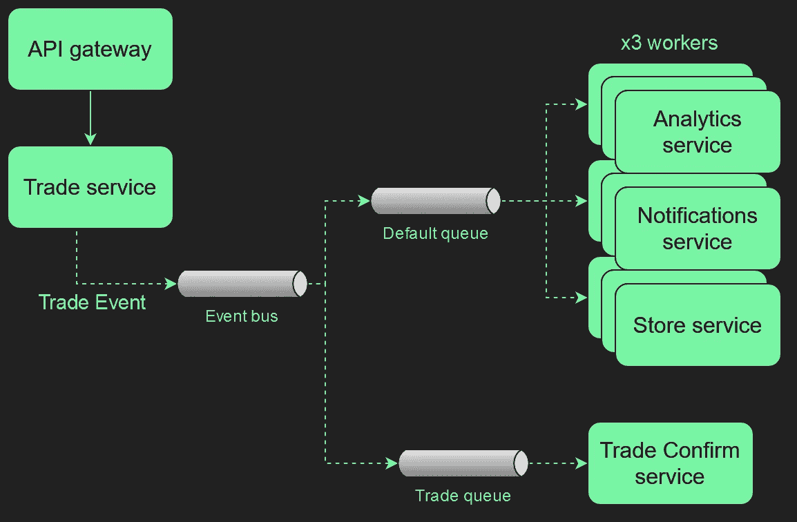

Nest.js 事件驱动的应用程序演示，具有单独的交易队列，并将默认队列工作线程增加到 3 个。

您可以通过运行`start-step2`命令并重启显示器来开始此演示。随着时间的推移，这个应用程序在两个队列上都变为零 `jobs_waiting`，干得好！

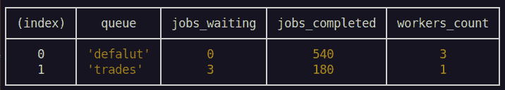

运行中的演示应用——应用稳定。

如您所知，我的例子有点做作，主要是为了演示。你可以很容易地看到我们如何利用`channel monitor patterns`通过放大或缩小单独的队列工作器来有计划地对我们的应用程序性能变化做出反应。

# 解决方案—概述

让我们回顾一下。我在这里应用了列表中的以下解决方案:

*   扩展 worker 实例，以便它能够更快地处理队列
*   增加工作实例计数
*   应用优化
*   分开排队
*   优先处理事件

创建了一个单独的`TRADES`队列，该队列还会自动确定这些事件的优先级。

接下来，我增加了`DEFAULT QUEUE`到`3`的 worker 实例数。

所有这些主要是由 Docker 和 Nest.js 框架为我完成的。

下一步你可以通过使用框架的工具来实现，就是将一些其他的事件优先于其他的事件。例如，与日志记录或内部指标相关的任何事情都可以被延迟，以支持更关键的任务事件，如数据库交互、通知等。

测试代码的存储库在这里:[github.com/dkhorev/conf42-event-driven-nestjs-demo](https://github.com/dkhorev/conf42-event-driven-nestjs-demo)。

对于容器和模块化开发，我在链接处使用了`Container Role Pattern`描述的[。](https://medium.com/@dkhorev/docker-container-roles-pattern-for-nestjs-apps-ca8b07a08a9a)

我希望这有所帮助。祝好运，工程快乐！

更有趣的 Nest.js 读着:

[](/validating-complex-requests-with-nestjs-a-practical-example-b55c287f7c99) [## 用 Nest.js 验证复杂请求

### 实际例子

better 编程. pub](/validating-complex-requests-with-nestjs-a-practical-example-b55c287f7c99) [](/improve-response-time-10x-by-introducing-an-interceptor-in-nestjs-590695692360) [## 通过在 Nest.js 中引入拦截器，将响应时间提高 10 倍

### 带有基准比较的实际实施

better 编程. pub](/improve-response-time-10x-by-introducing-an-interceptor-in-nestjs-590695692360)