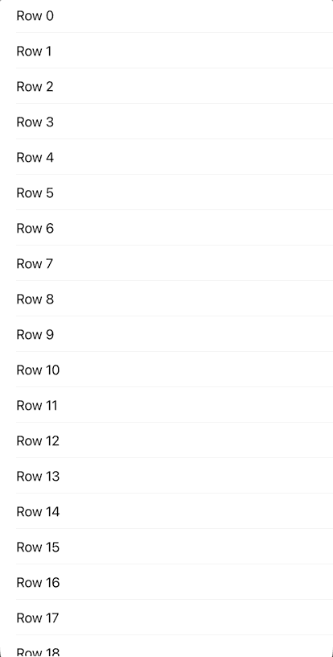
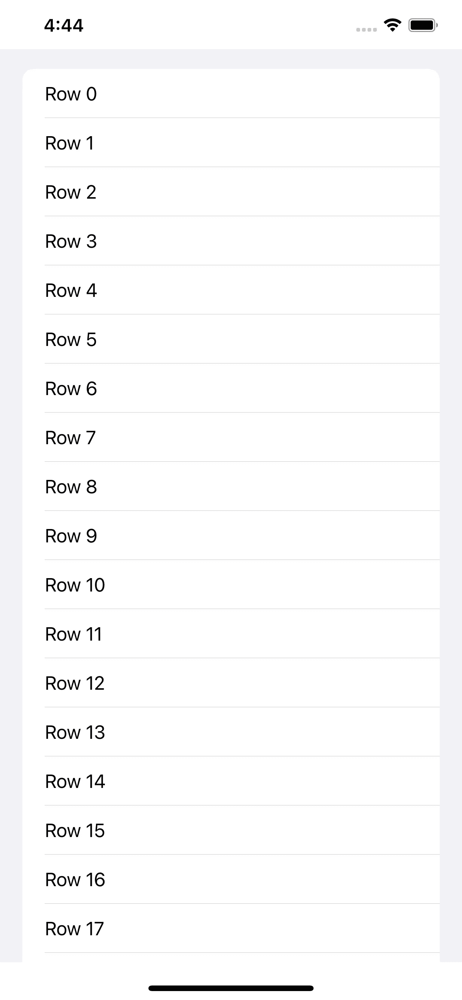

# 在 iOS 14+中构建更简单、更现代的收藏视图

> 原文：<https://betterprogramming.pub/build-simpler-more-modern-collection-views-in-ios-14-ca74eab2bb89>

## UICollectionView 的新增功能


照片由[Ferit ciek](https://unsplash.com/@ferrit?utm_source=unsplash&utm_medium=referral&utm_content=creditCopyText)在 [Unsplash](https://unsplash.com/s/photos/scroll?utm_source=unsplash&utm_medium=referral&utm_content=creditCopyText) 上拍摄

看起来苹果正在提升收藏视图，通过让它包括水平滚动、垂直滚动等等，给了我们更多定制的灵活性。我相信这种现象的新术语是*现代收藏观*。

今天，您将走一条简单的路线，构建一个简单的现代收藏视图。

切记这只有 iOS 14 及以上版本支持，并且只能在 XCode 12+中使用。

# 先决条件

要跟随本教程，您需要对 Swift 有一个基本的了解，并至少具备 Xcode 12+的一些基础知识。

# 设置集合视图

创建一个`UICollectionView`的`@IBOutlet`:

```
@IBOutlet weak var collectionView: UICollectionView!
```

创建`UICollectionViewDiffableDataSource`，用于管理数据并为集合视图提供单元格。

```
var dataSource: UICollectionViewDiffableDataSource<Section, Int>? = nil
```

# 设置数据源

创建一个名为`configureDataSource`的函数，并插入以下代码来注册单元格并设置 UI:

```
let cellRegistration = UICollectionView.CellRegistration<UICollectionViewListCell, Int> { (cell, indexPath, item) in
    var content = cell.defaultContentConfiguration()
    content.text = "Row \(item)"
    cell.contentConfiguration = content
}
```

接下来，在同一个函数中，您需要实例化之前创建的数据源。如果你记得的话，目前是零。

```
dataSource = UICollectionViewDiffableDataSource<Section, Int>(collectionView: collectionView) {
    (collectionView: UICollectionView, indexPath: IndexPath, identifier: Int) -> UICollectionViewCell? in

    return collectionView.dequeueConfiguredReusableCell(using: cellRegistration, for: indexPath, item: identifier)
}
```

最后，将每条信息追加到数据源中:

```
var snapshot = NSDiffableDataSourceSnapshot<Section, Int>()
snapshot.appendSections([.main])
snapshot.appendItems(Array(0..<94))
dataSource?.apply(snapshot, animatingDifferences: false)
```

因此，您将看到一个行为与表视图完全一样的集合视图。我总是试图在所有东西中使用表格视图，但看起来苹果正在试图改进收藏视图。



# 设置布局

我发现特别有趣的一点是你可以使用的布局。目前，布局设置为`plain`，这就是你在上面的 GIF 中看到的。

```
let config = UICollectionLayoutListConfiguration(appearance: .plain)
let layout = UICollectionViewCompositionalLayout.list(using: config)
collectionView.collectionViewLayout = layout
```

`insetGrouped`如下图所示:

