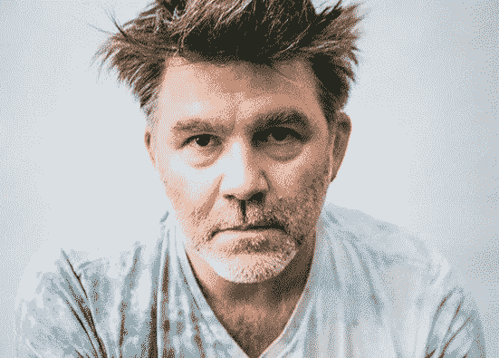
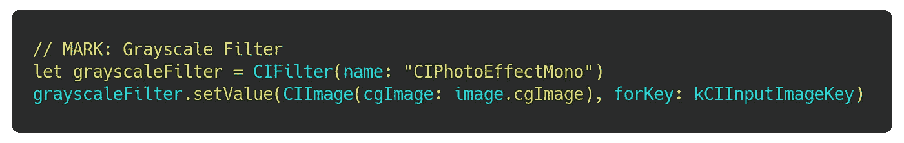
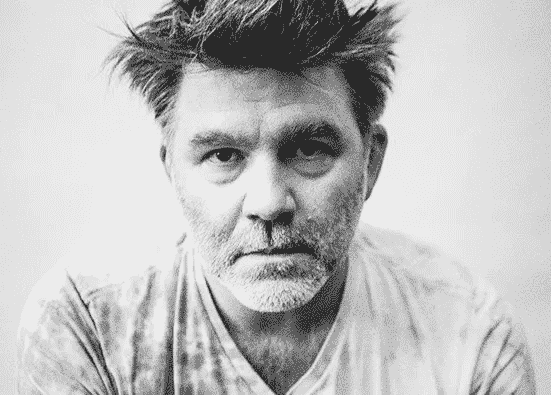
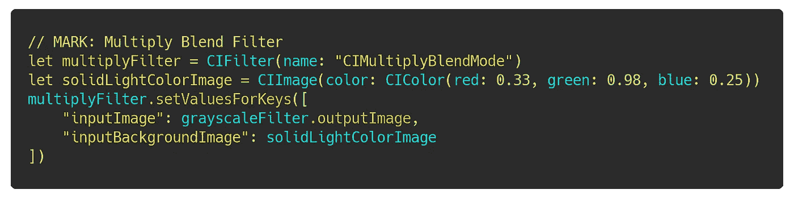
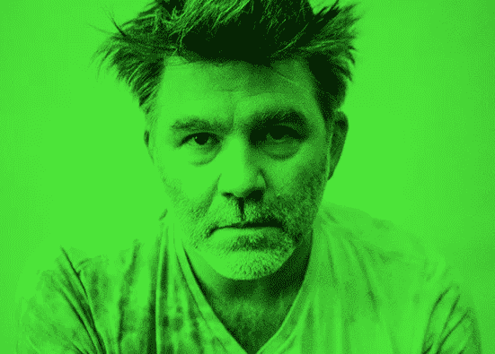
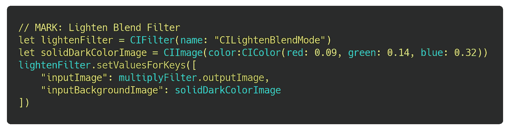
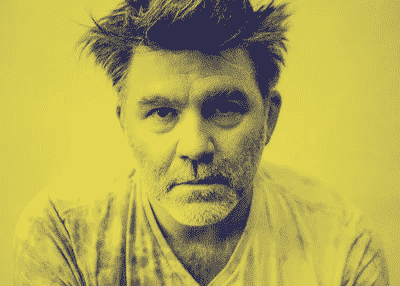
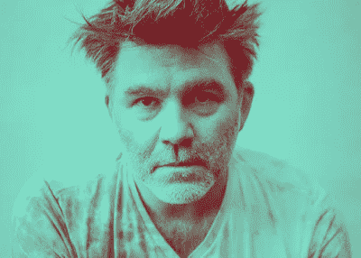
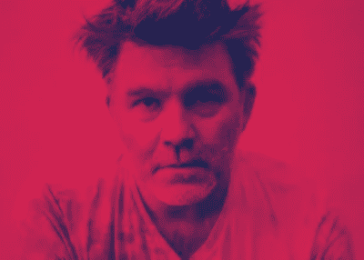

# 在 iOS 中构建 Spotify 的彩色化效果

> 原文：<https://betterprogramming.pub/build-spotifys-colorizer-effect-in-ios-1be6851dce1c>

## 重现了 Spotify 品牌中一直流行的双色调外观

带有额外渐变效果的双色调。

早在 2015 年，Spotify 经历了一次[品牌重塑](https://www.underconsideration.com/brandnew/archives/new_identity_for_spotify_by_collins.php),包括一个更加扁平的设计以及明亮、大胆和互补的颜色。这种新的品牌风格贯穿整个服务，包括宣传材料和播放列表封面艺术。为了获得想要的外观，他们在图像上使用了一种叫做*双色调效果*的东西。

在这篇文章中，我们将看看如何在 iOS 中使用 CoreImage 来重现这种效果。令人欣慰的是，苹果在建立 CoreImage 库时，对照片处理的行业技术相当忠实。我们将利用提供给我们的三个不同的`CIFilter`对象。这些直接映射到滤镜，你可以通过 Photoshop 这样的程序来达到同样的效果，所以如果你有这方面的经验，这应该看起来很熟悉。

注意:下一节假设您有 iOS 开发的工作知识，并且有一个可以访问`UIImage`资产的项目。

从詹姆斯·墨菲的正常形象开始。

# 步骤 1:灰度滤镜

首先，我们需要对图像应用一个[灰度过滤器](https://developer.apple.com/library/archive/documentation/GraphicsImaging/Reference/CoreImageFilterReference/index.html#//apple_ref/doc/filter/ci/CIPhotoEffectMono)来移除所有的颜色。这允许在接下来的步骤中对图像进行处理，而不会影响原始颜色。它还使图像中的高光更加突出，以便效果更好。

原稿+灰度。

# 第二步:多重过滤

现在我们有了一个灰度图像，我们需要应用一个明亮颜色的[乘滤镜](https://developer.apple.com/library/archive/documentation/GraphicsImaging/Reference/CoreImageFilterReference/index.html#//apple_ref/doc/filter/ci/CIMultiplyBlendMode)——在这个例子中是绿色。这将带出图像中的亮点，并给它“流行”我们所追求的。

注意:你会注意到我们把前一个过滤器的`outputImage`作为它的`inputImage`输入到下一个过滤器中。这被称为*过滤图*，允许我们避免在内存中存储中间图像资产。

灰度+乘法。

# 第三步:淡化过滤器

我们很接近了，但图像仍然需要双色调的颜色。为了实现这一点，我们将应用最后一个过滤器:[减轻混合](https://developer.apple.com/library/archive/documentation/GraphicsImaging/Reference/CoreImageFilterReference/index.html#//apple_ref/doc/filter/ci/CILightenBlendMode)。这里的命名有点混乱，因为它被称为变亮滤镜，但我们将使用它来应用比上一步更深的颜色。这是因为变亮是通过找到两种颜色之间的最大值(最接近白色)并应用该值来实现的。因为我们的乘法步骤已经添加了一个非常亮的绿色，这个变亮步骤将只影响图像的暗，接近黑色的颜色，通过应用一个稍微亮一点的海军蓝颜色。

乘+减。

就是这样！

这种方法也适用于所有不同的颜色。只要确保选择相对互补的颜色，并且在乘法步骤中总是使用更亮的颜色。您还可以在源图像经过灰度步骤后操纵其对比度，以获得更明显的亮色和暗色之间的差异。玩弄它。这里还有三个调色板:

# 参考

*   [用 Objective-C 编写的示例应用程序](https://github.com/alexpersian/SpotifyColorizer)
*   【CoreImage 滤镜的苹果开发者文档
*   [objc.io 文章](https://www.objc.io/issues/21-camera-and-photos/core-image-intro/)深入讨论 CoreImage
*   [原创媒体文章关于在 Photoshop 中制作这个的灵感](https://medium.com/@pierrellev/reproduce-colorizer-effect-of-spotify-71d5de88039f)