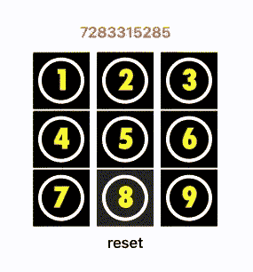

# 使用 SpriteKit 构建 SwiftUI 游戏

> 原文：<https://betterprogramming.pub/build-swiftui-games-using-spritekit-deb069535765>

## SwiftUI、SpriteKit 和缺失触摸手势

迈克尔·泽兹奇在 [Unsplash](https://unsplash.com?utm_source=medium&utm_medium=referral) 上的照片。

[SpriteKit](https://developer.apple.com/spritekit/) 到现在已经差不多十年了，在 2013 年的 WWDC 问世，在 2014 年、2016 年、2017 年、2019 年被修订，甚至在 2020 年的 WWDC 也被提及。

这是苹果创造 2D 游戏的框架。这很容易使用，也是一个非常好的方法来教年轻的程序员他们的手艺。搜索所有你喜欢的关于如何实现它的文档。你会发现大多数文章要么关注基础知识(如 [Felicity Johnson](https://medium.com/u/72b89c11cbe0?source=post_page-----deb069535765--------------------------------) 在本文中所做的[)要么全力以赴(例如](https://medium.com/@felicity.johnson.mail/spritekit-basics-bc5c44a7f013) [Dylan Shine](https://medium.com/u/f463ee1c1651?source=post_page-----deb069535765--------------------------------) 整理了[一份关于构建游戏的超级令人印象深刻的指南](https://medium.com/@dylanshine/building-my-first-ios-game-with-sprite-kit-d618a0848fac))。

它们都是很棒的文章，我也想做一个游戏，但是我想从 Artturi Jalli 的角度来看这个问题。这不是一个游戏，但说明了如何使用 SpriteKit 和 SwiftUI。

让我们回到 2019 年，当时苹果无意中透露，你现在可以在 SwiftUI 界面中添加一个`SKScene`。你可以用这些不朽的诗句:

本代码中提到的`GameScene`由以下代码制作:

我相信这段代码片段来自苹果的一篇新闻稿，记录了新的功能。它显示了一个黑色的方块，你可以在上面通过触摸来生成精灵。当你触摸的时候，它们会掉到地上。这是一种游戏，但是等等。再读一遍这段。

有印象吗？不久前，我写了一篇关于使用拖拽来模拟 SwiftUI 军械库中一个丢失的手势的文章— `touch`。

 [## SwiftUI 中的拖动、滑动和触摸手势

### 看看 SwiftUI 2.0 中的一些新手势

better 编程. pub](/drag-swipe-and-touch-gestures-in-swiftui-fa5364090745) 

它工作得很好——你得到一个各种各样的`touch`,你只需要移动你的手指就可以让它注册。这没问题，但我们可以用不同的方式来做。我很想说*更好*，但是有一个警告我稍后会提到。

在 SwiftUI 中使用 SpriteKit，您就有了真正的`touch`手势。让我们探索一下如何使用 SpriteKit 在 SwiftUI 上实现`touch`。我们将通过构建一个简单的游戏来实现这一点。

# 编码器

我想在我的第一台计算器上实现一个游戏。这是《太空入侵者》的早期版本。它的工作方式是，你有一个简单的显示器，上面会出现数字，当它们出现时，你需要按下所说的数字，让它消失。它是这样工作的:

通过 SpriteKit 在 SwiftUI 中使用触摸的简单游戏

九个盒子都是`SceneKit`的实例，其中有`SKLabelNode`。使用 SwiftUI 中的`LazyHGrid`对盒子进行布局。在每个`SceneKit`对象中，我正在观察屏幕上是否出现了`touch`事件。

当发生触摸时，它会将我的`SpriteView`上的背景更改为红色。当触摸结束时，它返回黑色。白色圆圈是在 SwiftUI 中绘制在 SpriteKit 视图的顶部。

现在，当你按下“重置”，游戏开始，棋盘顶部的数字慢慢变大。你的任务是找到键盘上的数字，按下它们，让它们消失。

如果你设法让所有的数字消失，那么字符串变大所需的时间将减少一半，你必须以两倍的速度完成这项工作。如果数字达到十位数，游戏就结束了。

您需要显示一个计时器以及正在使用的延迟。这样做，你就可以挑战你的朋友，看谁能在最短的时间内坚持最久。因为这是简单的版本，你可以按任何顺序在键盘上敲击数字。硬版本应该限制你先打最左边的数字。额外学分的第二个任务。

现在看到这里并不容易，但是要理解正在发生的事情。尽管乍一看我们好像在使用`tap`，但我们并没有。我们用的是`touch`。

使用`SceneKit`，我们实际上可以用 SwiftUI 构建实现`touch`手势，尽管我想提一个警告。我在按钮上画的圆圈实际上会挡住`touch`手势。在这个例子中，我可以摆脱它，但是如果你认为你可以使用这个技术，你需要记住这一点。

以下是动画 GIF/游戏的代码供您更新:

# 结论

这让我想到了这篇文章的结尾。我希望你喜欢读它，就像我喜欢写它一样。在 Medium 上关注我，获取更多关于 Swift 编码的文章，或者查阅我的一些其他文章。

 [## 马克·卢金-中号

### 用户是全球商业模式的命脉，事实上，当……

marklucking.medium.com](https://marklucking.medium.com)