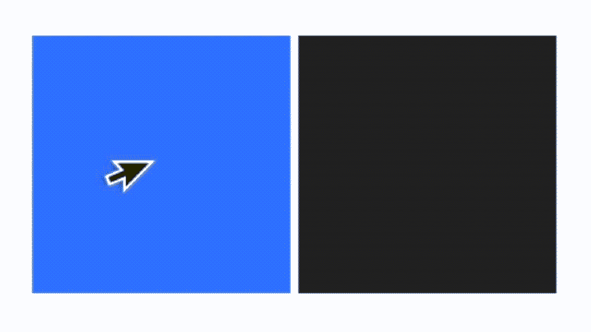
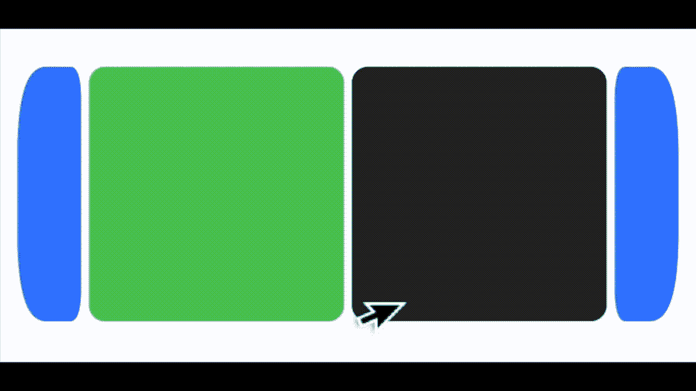
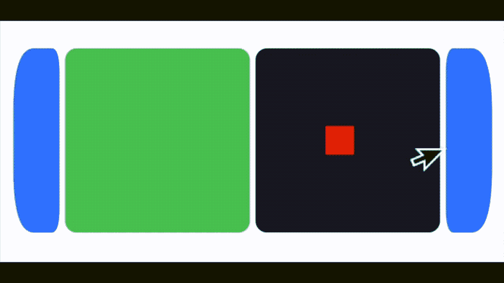
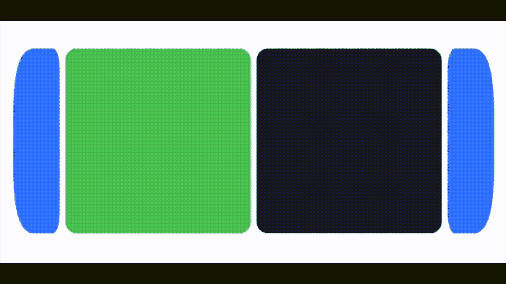

# 如何使用 SwiftUI 控制 SpriteKit 游戏

> 原文：<https://betterprogramming.pub/build-swiftui-games-using-spritekit-ii-fa0e5df8648b>

## 用 SpriteKit 和 SwiftUI 开发游戏


照片由 [Riho Kroll](https://unsplash.com/@rihok?utm_source=medium&utm_medium=referral) 在 [Unsplash](https://unsplash.com?utm_source=medium&utm_medium=referral) 上拍摄。

我最近发表了一篇关于结合 SwiftUI 使用 SpriteKit 的文章。我很高兴地说，它很受欢迎:

[](/build-swiftui-games-using-spritekit-deb069535765) [## 使用 SpriteKit 构建 SwiftUI 游戏

### SwiftUI、SpriteKit 和缺失触摸手势

better 编程. pub](/build-swiftui-games-using-spritekit-deb069535765) 

在其中，我创建了一个简单的游戏，使用 SpriteKit 游戏场景的矩阵和一些 SwiftUI 代码来排列它们。应用程序的重点是用 SpriteKit 控制 SwiftUI 界面。

在这篇文章中，我想做相反的事情。我将使用一个单一的游戏场景，这次是在 SwiftUI 界面中，但重点是 SwiftUI 控制 sprite kit——无论如何在某种程度上。

# 旅程

让我们构建一个游戏，玩家需要在物体飞来时接住它们。我将把 iOS 设备分成两个屏幕。顶部的屏幕是显示器，而下面的是控制面(我需要为本文改变方向)。

游戏场景代码与我在另一篇文章开始时使用的版本略有不同，因为我想更新`GameScene`而不需要它自己重绘。此外，我必须在类中添加几个控制变量，以便于 SwiftUI 代码和`GameScene`之间的同步。

`ContentView`中的 SwiftUI 代码显然也大不相同，本文详细介绍了我为`drag`手势所需的模板代码。我用这个手势直接更新精灵的位置。

你可以在下面的动画 GIF 中看到最终结果。创建这样一个简单的界面证明了苹果的框架是多么强大。



复制代码并尝试一下。这很有趣，但需要微调。滞后不是很理想，但是还可以。这使得它更具挑战性，尽管我很容易失去我的方块这一事实有点致命。

那么，我需要做的第一件事就是修改消失法案。我在`GameScene`中添加了几行代码来解决这个问题:

我这样做是为了宽度和高度，确保我悬停的红色框停留在屏幕上——即使当我拖动得有点太过，嗯，热情了。

我应该在这里提到，我也考虑过`SKActions`，找到了[Jeremy Jacobson](https://medium.com/hackernoon/a-guide-to-spritekit-actions-c20b079f5398)的这篇文章，并尝试使用与`drag`手势相对的按钮，但感觉不对，我又回到了`drag`。

接下来，我需要改变游戏启动和实际进展的方式。我也需要在界面上添加一些按钮。我还想增加一些精灵。我想让它看起来更圆一些。此时的目标是达到这个阶段:



我是怎么做到的？首先，我给`ContentView`(我的标准 SwiftUI 应用)添加了两个按钮。然后，我添加了一个布尔变量来开始创建绿色小石头，并将它链接到按钮动作。我还把我现在的绿色控制表面改成了圆角矩形，并给`SpriteView`添加了一个圆角矩形遮罩。

然后我移动到我的`GameScene.swift`上，添加代码来创建绿色的盒子(石头)并将它们随机放置在屏幕的顶部(在动画 GIF 中的左边)。我给`GameScene`添加了物理元素，最后设置了方块，这样当它们碰到台面时就会消失。

显然，我减缓了重力，这样绿色的岩石就不会移动得太快，我就可以避开或者抓住它们。如果你想让它更有挑战性，你要找的线是这条:

```
PhysicsWorld.gravity = CGVector(dy:0, dx:0.1)
```

现在我游戏的目标是移动红色方块，这样我就能抓住绿色的石头。接下来要做的工作是添加碰撞检测。我开始也给我的红色方块一个物理实体，尽管我确保关闭了所述节点上的重力。我用这两行来做:

```
box.physicsBody = SKPhysicsBody(rectangleOf: CGSize(width: 40, height: 40))
box.physicsBody?.affectedByGravity = false
```

现在我可以抓住绿色的小石头了——至少这两个方块是相互作用的。

下一步是在积木碰撞时做些什么。要做到这一点，我需要使用委托协议，向我们的`GameScene`添加一个扩展，在这个扩展中，我添加代码来删除绿色石头，如果它击中红色方块。我们的游戏看起来会像这样:



我快好了。现在我需要一些动态的东西，当你抓住绿盒子的时候，它会显示进度。我在这篇文章的[中看到了一个由](https://medium.com/codex/gradient-in-sprite-kit-84e4b3092778) [Artturi Jalli](https://medium.com/u/b7bdb0fad1c4?source=post_page-----fa0e5df8648b--------------------------------) 提出的极好的精灵纹理建议/扩展，并将这个想法应用到了游戏中。

我编辑了`GameScene`,这样盒子和石头碰撞时都会被删除。后者只是作为另一块落下的绿色岩石重新出现。前者也是，但是使用了我刚刚提到的前一篇文章中记录的方法。

我添加了一个`gameOver`变量来计算碰撞发生的次数，以及一个随着次数增加而应用的纹理数组。纹理基本上是将块从红色变成绿色。如果一块绿色的石头砸到你，而你没有红色的石头，那么游戏就结束了。这是最后一场比赛:



在游戏结束的场景中，红色的盒子和绿色的石头都不会回来。

在本文中，我们介绍了在 SwiftUI 中创建一个`GameScene`，通过 SwiftUI 中的控件控制所述的`GameScene`，以及一些有用的 SpriteKit 编码技术。下面是`GameScene`的最终代码:

而`ContentView`:

## 额外学分

你可以改变游戏的动态。也许你可以让绿色的石头掉得更快。也许你可以添加多个绿色岩石。也许你可以把绿色的石头变大。也许把你的红盒子变大。也许你可以改变相关的形状。你可以加一个计时器。你可以将控制界面从`drag`改为按钮甚至滑块。你可以改变绿色盒子的方向，让它们朝多个方向落下。你甚至可以添加一些声音，跟随大卫·派珀的这篇文章。如果你非常有信心，你可以在不同的设备之间拆分控制视图和显示视图。我不久前写的这篇文章描述了如何做到这一点。这个简单的想法有很大的潜力。

说到这里，我将结束这篇文章。我希望你在里面剪切并粘贴了插图代码，并尝试创建你自己的游戏版本。

[](https://marklucking.medium.com) [## 马克·卢金-中号

### style 关键字出现在 Swift 的许多结构中。我认为这是一个很少有人真正使用的工具，这是一个…

marklucking.medium.com](https://marklucking.medium.com)