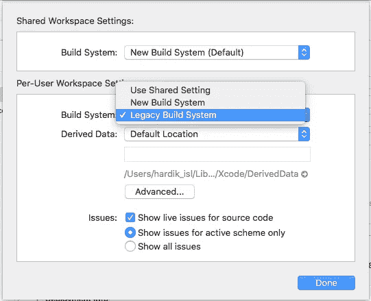

# Xcode 10 中的构建系统——面临的问题及其解决方案

> 原文：<https://betterprogramming.pub/build-systems-issues-and-solutions-in-xcode-10-6708d1613ef3>

## Info.plists、Cocoapods、运行脚本等等

随着 Xcode 10 的推出，我们引入了一个新的编译和构建代码的构建系统。这个新的构建系统提供了改进的可靠性和构建性能，并且它捕捉到了遗留构建系统所没有的项目配置问题。

新的构建系统主要包括-

*   使用共享设置
*   新构建系统
*   遗留构建系统(这是一个很酷的名字！)

尽管新的生成系统与现有项目兼容，但出于以下原因，有些项目可能需要更改:

*   新的构建系统对构建中元素之间的循环进行了更严格的检查，以防止不必要的重建。
*   由多个生成命令生成的生成中的任何单个文件都是错误的。例如，如果两个目标都从 shell 脚本阶段声明了相同的输出文件，那么必须将输出文件声明到单个目标中。
*   如果 shell 脚本生成的输出文件用作构建中其他地方的输入(例如，另一个 shell 脚本的输入)，则该输出必须由生成它的脚本声明为显式输出，否则构建系统可能会在文件生成之前尝试搜索该文件，从而导致构建失败。
*   新的构建系统不支持在始终搜索用户路径(`ALWAYS_SEARCH_USER_PATHS`)设置为`YES`时生成的旧标题映射。相反，将`ALWAYS_SEARCH_USER_PATHS`设置为`NO`，并迁移到使用现代的头包含语法。将项目存储库中任何需要的头文件添加到 Xcode 项目中，以确保它们可用于#include(通过项目范围的头文件映射)。对项目标题使用引号样式的 include ( `"example.h"`)并对系统标题保留尖括号 include ( `<example.h>`)。
*   新的构建系统在运行 shell 脚本构建阶段时将`undefined_arch`作为`ARCH`环境变量的值传递。该值以前没有很好地定义。依赖于该值的任何 shell 脚本必须对正在构建的所有已定义架构正确运行，可通过`ARCHS`环境变量获得。
*   新的构建系统使用“清理构建文件夹”行为。不支持传统的“清理”行为。

在 Xcode 项目中，如果我们转到 Xcode ->文件->项目/工作区设置，我们会发现类似这样的内容:

**Xcode - >文件- >项目/工作区**

配置为使用遗留构建系统的项目将在 Activity 视图中显示一个橙色的锤子图标:

我们可以根据需求在遗留和新构建系统之间切换。

新的构建系统并行运行目标和构建阶段，以加速整体的快速构建。一旦从 Xcode 激活，我们将开始获得好处以及与我们的 iOS 项目中的新构建系统相关的问题。

我们面临很多问题，尤其是在不是 Xcode 10 而是 Xcode 以前版本的项目中。这些问题会对项目的构建产生负面影响——可能会弹出错误，不必要地中止特定项目的构建。

Xcode 新构建系统强调的一些最常见的错误以及当前解决这些错误的方法如下。

# 1.信息。Plist

当使用新的构建系统构建 iOS 项目时，info.plist 文件开始出现几个问题。下面是一些关于新构建系统和 Info.plist 文件的规则。

## **解决方法**

*   在任何目标的复制捆绑资源构建阶段都不应该有 plist 文件，否则新的构建系统将无法构建应用程序。此外，如果文件被多次复制到包中，它也不起作用。
*   新的构建系统在干净构建和增量构建中具有不同的运行 Info.plist 步骤的优先级。在干净构建中，info.plist 步骤在处理资源之后，链接故事板之前。对于增量构建，它在签名前运行。
*   如果目标只有 Info.plist 值，没有任何 Xcode 引用的文件夹，Xcode 构建系统会导致构建失败。

# 2.椰子足类

使用 CocoaPods 的 iOS 项目引入了一些问题。以下是一些常见问题。

## 工作区

*   除非我们执行干净的构建，否则开发单元不会更新。embed pods 框架构建阶段执行不可靠。Github 上有一个关于这个[的问题。](https://github.com/CocoaPods/CocoaPods/issues/8073)
*   应用程序的存档可能会失败，或者应用程序中可能会有古怪的行为-一些 Cocoapods 相关的构建阶段脚本不能可靠地运行。

简而言之，Cocoapods 和新的构建系统不能很好地协同工作。

# 3.运行脚本阶段

使用新的构建系统，您可能会遇到运行脚本阶段开始失败或给出不稳定结果的问题。是有原因的。

在 Xcode 10 中，运行-脚本-构建阶段改进了很多。然而，我们必须通过为运行脚本阶段指定一些输入文件来帮助构建过程。如果我们为运行脚本阶段指定了输入文件，这对于构建系统决定是否需要为依赖的目标构建运行脚本是很重要的。Xcode 构建系统试图并行运行一些任务，如果运行脚本阶段的输入还没有生成，那么构建系统会变得混乱并失败。

## 工作区

在适用的情况下，向运行脚本提供输入文件总是一个好主意。当输入文件的数量增加时，Xcode 10 为我们提供了一种在。xcfilelist 格式。我们可以在构建阶段添加这个文件作为文件列表输入。*当没有输入文件*、输入文件改变或输出文件丢失时，Xcode 构建系统将一直运行这个构建阶段。重要的是添加那些文件，以避免在不需要的时候为所有的增量构建运行这个阶段。

# 4.清理生成文件夹操作

在新的构建系统中，Xcode 的清理操作已经被*弃用*，并且引入了清理构建文件夹操作。此操作会从 iOS 应用程序中移除所有派生数据，从头开始创建更干净的构件。这意味着如果你使用 Cocoapods，它将从头开始重新构建所有的框架，并导致构建 iOS 项目的巨大延迟。如果你使用 Carthage 和预建的框架，它不会对你有太大影响。如果你有建造部落的习惯，你需要格外小心等待。您可能还会面临 Xcode 索引速度慢的问题。

# 5.XCCONFIG 文件

你们中的大多数人可能正在使用。xcconfig 文件，以便为特定目标将 Xcode 构建设置保存在一个地方。xcconfig 文件中的条件变量赋值可能不会按预期工作，从而导致生成失败。

## 工作区

为了检查你的 xcconfig 文件，Apple 建议运行一个命令，如果这个命令显示任何警告或错误，我们需要修复它以获得稳定的版本。命令是:

`defaults write com.apple.dt.XCBuild EnableCompatibilityWarningsForXCBuildTransition -bool YES`

这在 Xcode 10 中是默认设置的，所以我们迟早要更新我们的构建过程来适应新的构建系统。当然，它将为应用程序带来许多配置增强！

务必阅读并分享！！