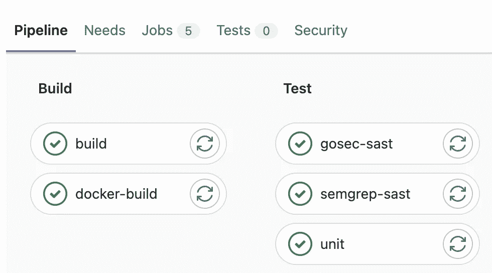
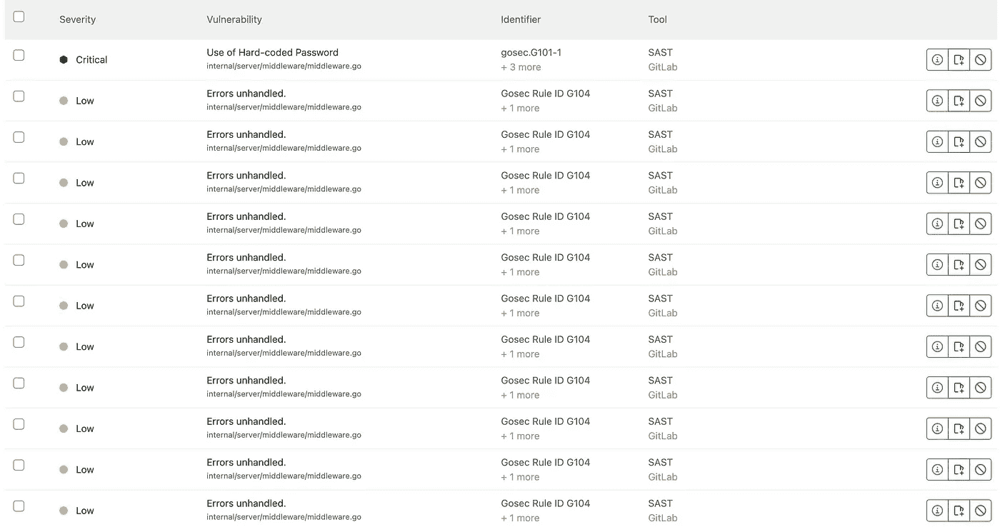
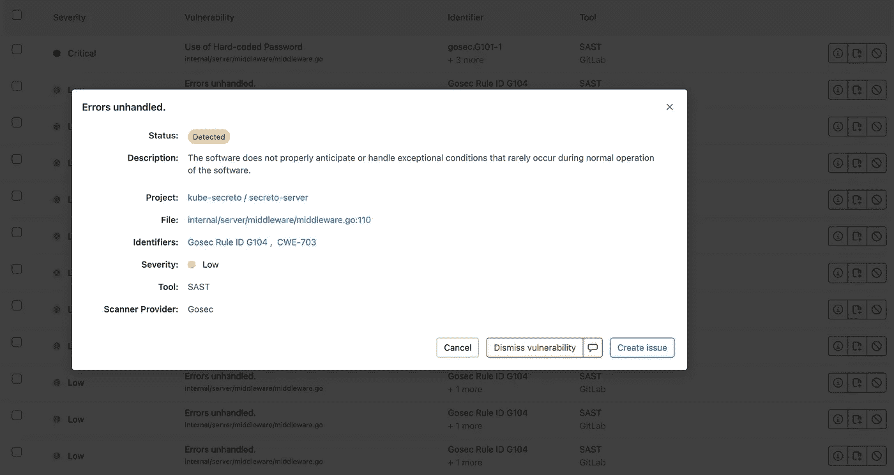

# 在 Go 中构建、测试和自动化 Kubernetes 接口应用程序

> 原文：<https://betterprogramming.pub/build-test-and-automate-a-kubernetes-interfacing-application-in-go-da71e4d5aaef>

## 了解如何创建、构建、测试和自动化与 Kubernetes 接口的 Go 应用程序


照片由[克洛维斯伍德摄影](https://unsplash.com/@clo_shooting?utm_source=medium&utm_medium=referral)在 [Unsplash](https://unsplash.com?utm_source=medium&utm_medium=referral) 上拍摄

Kubernetes 的 [Client-Go](https://github.com/kubernetes/client-go) 提供了各种与集群交互的包。这些软件包包括以下内容:

*   `kubernetes`包包含访问 Kubernetes API 的客户端集。
*   `discovery`包用于发现 Kubernetes API 服务器支持的 API。
*   `dynamic`包包含一个动态客户端，可以对任意 Kubernetes API 对象执行一般操作。
*   `plugin/pkg/client/auth`包包含可选的身份验证插件，用于从外部来源获取凭证。
*   `transport`包用于设置身份验证和启动连接。
*   `tools/cache`包对于编写控制器很有用。

除了上面所有的包，Client-Go 还包含一个假客户端，它允许您模拟特定 Kubernetes 资源的创建、读取、编辑和删除，以便轻松增加单元测试覆盖率。

回到 KubeCon Europe 2019，我介绍了使用 Go-Client 假客户端执行单元测试:

今天，我将介绍如何创建一个简单的[集群外](https://github.com/kubernetes/client-go/tree/master/examples/out-of-cluster-client-configuration)应用程序，用于在您的 Kubernetes 集群上执行操作。然后我将向您展示如何在您的单元测试中模拟 Kubernetes API 调用，并使用 GitLab 自动运行这些测试以及更多！

# 先决条件

为了开始使用，您必须安装一些程序:

*   [Go](https://go.dev/) —一种开源编程语言。
*   [MiniKube](https://minikube.sigs.k8s.io/docs/) —一个在 macOS、Linux 和 Windows 上快速建立本地 Kubernetes 集群的工具。您还需要一个虚拟化驱动程序来运行 MiniKube，例如 Docker、HyperV、Podman 等。更多信息可在[这里](https://minikube.sigs.k8s.io/docs/drivers/)找到。

**注意**:你可以使用除了`minikube`之外的另一个集群，它会根据设置的`kubectl`上下文正常工作。这个指南是用`minikube`写的，因为每个人都可以接触到。

您还必须了解以下内容:

*   [Go 基础知识](https://go.dev/doc/)——我写的代码在 Go 中。确保你有基本的了解。
*   [Kubernetes 基础知识](https://kubernetes.io/docs/concepts/) —了解如何使用 Kubernetes 集群，以及如何使用 kubectl。
*   [Kubernetes 的秘密](https://kubernetes.io/docs/concepts/configuration/secret/) —了解 Kubernetes 中有哪些秘密。

了解以下内容很有好处:

*   [Git 基础知识](https://www.freecodecamp.org/news/learn-the-basics-of-git-in-under-10-minutes-da548267cc91/) —很高兴知道 Git 可以自己创建分支并修改代码。
*   [GitLab CI](https://docs.gitlab.com/ee/ci/) —我的代码存放在 GitLab 中，我使用 GitLab CI 来运行我的单元测试和安全扫描。

我将使用我的 [secreto-server](https://gitlab.com/k2511/secreto-server) 项目，它执行以下功能:

*   生成通用的 Kubernetes 秘密
*   列出每个给定名称空间的秘密
*   获得包含有效载荷的秘密数据
*   删除机密

# 运行应用程序(本地)

首先，我们将使用 MiniKube 创建一个集群，并确保我们可以与 Kubernetes secrets 进行交互。然后，我们将在本地启动应用程序，并验证应用程序的所有功能。

## 创建 Kubernetes 集群

1.  安装 MiniKube。您可以在[入门页面](https://minikube.sigs.k8s.io/docs/start/)下载基于您的操作系统和架构的 Minikube 版本。

2.运行 Minikube。下载所需的包可能需要几分钟，但是只要您有所需的虚拟化驱动程序，运行 Minikube 就很简单。Docker 桌面适用于大多数情况，但我正在使用 podman 尝试一些不同的东西。有关驱动程序的更多信息，请参见 [Minikube 文档](https://minikube.sigs.k8s.io/docs/drivers/)。

```
$ minikube startminikube v1.25.2 on Darwin 12.3 (arm64)
Using the podman (experimental) driver based on existing profile
Starting control plane node minikube in cluster minikube
Pulling base image ...
E0321 11:05:07.616563   66007 cache.go:203] Error downloading kic artifacts:  not yet implemented, see issue #8426
Restarting existing podman container for "minikube" ...
Preparing Kubernetes v1.23.3 on Docker 20.10.12 ...E0321 11:05:13.251398   66007 start.go:126] Unable to get host IP: RoutableHostIPFromInside is currently only implemented for linux
▪ kubelet.housekeeping-interval=5m
Verifying Kubernetes components...
    ▪ Using image gcr.io/k8s-minikube/storage-provisioner:v5
Enabled addons: storage-provisioner, default-storageclass
kubectl not found. If you need it, try: 'minikube kubectl -- get pods -A'
Done! kubectl is now configured to use "minikube" cluster and "default" namespace by default
```

3.验证 Minikube 是否正常运行。我们可以通过检查 Minikube 节点是否处于就绪状态来做到这一点。

```
$ minikube kubectl get nodesNAME       STATUS   ROLES                  AGE     VERSION
minikube   Ready    control-plane,master   3m50s   v1.23.3
```

4.创造一个秘密。我们将通过`kubectl`来验证我们是否可以访问 secrets API。我正在用`literal[*shhh*]=*supersecret*` *创建一个通用的秘密。*

```
$ minikube kubectl create secret generic my-secret -- --from-literal=shhh=supersecretsecret/my-secret created
```

5.现在，让我们验证这个秘密是否已经成功创建

我们可以在 YAML 模式下抓取它，并查看 base64 编码的`supersecret` ( `*c3VwZXJzZWNyZXQ=*`)。

```
$ minikube kubectl get secrets my-secret -- -o yamlminikube kubectl get secrets my-secret -- -o yaml
apiVersion: v1
data:
  shhh: c3VwZXJzZWNyZXQ=
kind: Secret
metadata:
  creationTimestamp: "2022-03-20T21:16:48Z"
  name: my-secret
  namespace: default
  resourceVersion: "728"
  uid: 9fcb7814-77f1-44dc-b476-066db11598bd
type: Opaque
```

# 构建应用程序

1.  将应用程序克隆到您的 [GOPATH](https://go.dev/doc/gopath_code)

```
$ git clone [git@gitlab.com](mailto:git@gitlab.com):k2511/secreto-server.gitgit clone [git@gitlab.com](mailto:git@gitlab.com):k2511/secreto-server.git
Cloning into 'secreto-server'...
remote: Enumerating objects: 235, done.
remote: Counting objects: 100% (232/232), done.
remote: Compressing objects: 100% (121/121), done.
remote: Total 235 (delta 97), reused 177 (delta 69), pack-reused 3
Receiving objects: 100% (235/235), 282.99 KiB | 3.11 MiB/s, done.
Resolving deltas: 100% (97/97), done.$ cd secreto-server
```

2.构建应用程序可执行文件。我创建了一个 Makefile，这使它变得容易。一旦运行这个命令，应该会创建一个名为`secreto-server`的新的可执行文件。

```
$ make buildgo mod download
GOOS=darwin GOARCH=arm64 go build -o secreto-server .
chmod +x secreto-server
```

**注意:**如果你不是在 M1 Mac 上运行，你可能需要改变 [Makefile](https://gitlab.com/k2511/secreto-server/-/blob/main/Makefile) 中的`$GOOS`和`$GOARCH`变量。更多详情[此处](https://www.digitalocean.com/community/tutorials/building-go-applications-for-different-operating-systems-and-architectures)。

3.在本地运行应用程序。这是通过在运行可执行文件时传递`-local`标志来实现的。在没有`-local`标志的情况下运行它，将要求应用程序在 Kubernetes 集群中运行，因为它使用不同的 [auth 方法](https://github.com/kubernetes/client-go/tree/master/examples/in-cluster-client-configuration)。

```
$ ./secreto-server -local2022/03/20 16:18:30 KubeClient running with local configuration
2022/03/20 16:18:30 Starting server on the port 8080
```

您也可以在执行程序前通过设置`SECRETO_PORT`环境变量来更改端口。

现在应用程序正在运行。让我们继续下去，并确认它的工作。我们可以通过打开另一个终端并向服务器发送请求来获得它的版本。

```
$ curl http://localhost:8080/api/secreto/version{"version":1}
```

我们现在有了一个工作应用程序！让我们验证应用程序的几个功能。

## 添加秘密

我们可以通过向 secreto API 路径传递一个`name`和`payload`来添加一个秘密。确保你也添加了`namespace`到路径的末端，如下图所示。

```
$ curl -X POST http://localhost:8080/api/secreto/default -d '{"name": "my-secret2", "payload": "my-secret-yoo"}'{"Secret Created Successfully":{"name":"my-secret2","namespace":"default","date":"2022-03-20 17:39:41 -0500 CDT","payload":"my-secret-yoo"}}
```

## 查看秘密

我们可以列出我们所有的秘密，按名称空间排序，甚至查找有效载荷。这是通过在不同的路径上执行 GET 来完成的:

*   `/api/secreto`:列出所有秘密
*   `/api/secreto/{namespace}`:列出{命名空间}中的所有秘密
*   `/api/secreto/{namespace}/{name}`:列出{命名空间}中机密{name}的数据

```
$ curl -X GET [http://localhost:8080/api/secret](http://localhost/api/secrets)o[{"name":"default-token-m9wsq","namespace":"default","date":"2022-03-20 16:10:27 -0500 CDT","payload":""},{"name":"my-secret","namespace":"default","date":"2022-03-20 16:16:48 -0500 CDT","payload":"supersecret"},{"name":"yeet","namespace":"default","date":"2022-03-20 16:56:24 -0500 CDT","payload":"my-secret-yoo"},{"name":"default-token-dq5wr","namespace":"kube-node-lease","date":"2022-03-20 16:10:26 -0500 CDT","payload":""},{"name":"default-token-nwbxx","namespace":"kube-public","date":"2022-03-20 16:10:26 -0500 CDT","payload":""},{"name":"attachdetach-controller-token-cdfl4","namespace":"kube-system","date":"2022-03-20 16:10:14 -0500 CDT","payload":""},{"name":"bootstrap-signer-token-ljx9n","namespace":"kube-system","date":"2022-03-20 16:10:14 -0500 CDT","payload":""},{"name":"bootstrap-token-81dbvo","namespace":"kube-system","date":"2022-03-20 16:10:13 -0500 CDT","payload":""},{"name":"certificate-controller-token-9nqdf","namespace":"kube-system","date":"2022-03-20 16:10:15 -0500 CDT","payload":""},{"name":"clusterrole-aggregation-controller-token-wb95r","namespace":"kube-system","date":"2022-03-20 16:10:13 -0500 CDT","payload":""},{"name":"coredns-token-7sldt","namespace":"kube-system","date":"2022-03-20 16:10:14 -0500 CDT","payload":""},{"name":"cronjob-controller-token-l5msx","namespace":"kube-system","date":"2022-03-20 16:10:16 -0500 CDT","payload":""},{"name":"daemon-set-controller-token-ppr8p","namespace":"kube-system","date":"2022-03-20 16:10:16 -0500 CDT","payload":""},{"name":"default-token-mxzhs","namespace":"kube-system","date":"2022-03-20 16:10:26 -0500 CDT","payload":""},{"name":"deployment-controller-token-ctsrt","namespace":"kube-system","date":"2022-03-20 16:10:13 -0500 CDT","payload":""},{"name":"disruption-controller-token-kf9qs","namespace":"kube-system","date":"2022-03-20 16:10:14 -0500 CDT","payload":""},{"name":"endpoint-controller-token-kkp5b","namespace":"kube-system","date":"2022-03-20 16:10:13 -0500 CDT","payload":""},{"name":"endpointslice-controller-token-b4bwk","namespace":"kube-system","date":"2022-03-20 16:10:13 -0500 CDT","payload":""},{"name":"endpointslicemirroring-controller-token-g7bqq","namespace":"kube-system","date":"2022-03-20 16:10:15 -0500 CDT","payload":""},{"name":"ephemeral-volume-controller-token-t7s6h","namespace":"kube-system","date":"2022-03-20 16:10:14 -0500 CDT","payload":""},{"name":"expand-controller-token-wvhn8","namespace":"kube-system","date":"2022-03-20 16:10:26 -0500 CDT","payload":""},{"name":"generic-garbage-collector-token-q62cw","namespace":"kube-system","date":"2022-03-20 16:10:26 -0500 CDT","payload":""},{"name":"horizontal-pod-autoscaler-token-wmkcc","namespace":"kube-system","date":"2022-03-20 16:10:13 -0500 CDT","payload":""},{"name":"job-controller-token-9492p","namespace":"kube-system","date":"2022-03-20 16:10:26 -0500 CDT","payload":""},{"name":"kube-proxy-token-6z9ht","namespace":"kube-system","date":"2022-03-20 16:10:14 -0500 CDT","payload":""},{"name":"namespace-controller-token-lrwx8","namespace":"kube-system","date":"2022-03-20 16:10:15 -0500 CDT","payload":""},{"name":"node-controller-token-x9vwn","namespace":"kube-system","date":"2022-03-20 16:10:16 -0500 CDT","payload":""},{"name":"persistent-volume-binder-token-vdw68","namespace":"kube-system","date":"2022-03-20 16:10:26 -0500 CDT","payload":""},{"name":"pod-garbage-collector-token-jl9z2","namespace":"kube-system","date":"2022-03-20 16:10:16 -0500 CDT","payload":""},{"name":"pv-protection-controller-token-jv9d8","namespace":"kube-system","date":"2022-03-20 16:10:13 -0500 CDT","payload":""},{"name":"pvc-protection-controller-token-d4ccm","namespace":"kube-system","date":"2022-03-20 16:10:13 -0500 CDT","payload":""},{"name":"replicaset-controller-token-hbdj6","namespace":"kube-system","date":"2022-03-20 16:10:15 -0500 CDT","payload":""},{"name":"replication-controller-token-74kl8","namespace":"kube-system","date":"2022-03-20 16:10:13 -0500 CDT","payload":""},{"name":"resourcequota-controller-token-767r2","namespace":"kube-system","date":"2022-03-20 16:10:13 -0500 CDT","payload":""},{"name":"root-ca-cert-publisher-token-7zbhn","namespace":"kube-system","date":"2022-03-20 16:10:14 -0500 CDT","payload":""},{"name":"service-account-controller-token-vdxgt","namespace":"kube-system","date":"2022-03-20 16:10:26 -0500 CDT","payload":""},{"name":"service-controller-token-nvt8n","namespace":"kube-system","date":"2022-03-20 16:10:15 -0500 CDT","payload":""},{"name":"statefulset-controller-token-97d8r","namespace":"kube-system","date":"2022-03-20 16:10:26 -0500 CDT","payload":""},{"name":"storage-provisioner-token-nsblb","namespace":"kube-system","date":"2022-03-20 16:10:16 -0500 CDT","payload":""},{"name":"token-cleaner-token-wdbdn","namespace":"kube-system","date":"2022-03-20 16:10:15 -0500 CDT","payload":""},{"name":"ttl-after-finished-controller-token-rgjt4","namespace":"kube-system","date":"2022-03-20 16:10:16 -0500 CDT","payload":""},{"name":"ttl-controller-token-tzjfc","namespace":"kube-system","date":"2022-03-20 16:10:14 -0500 CDT","payload":""}]$ curl -X GET [http://localhost:8080/api/secreto/default](http://localhost/api/secrets/default)[{"name":"default-token-m9wsq","namespace":"default","date":"2022-03-20 16:10:27 -0500 CDT","payload":""},{"name":"my-secret","namespace":"default","date":"2022-03-20 16:16:48 -0500 CDT","payload":"supersecret"},{"name":"my-secret2","namespace":"default","date":"2022-03-20 16:56:24 -0500 CDT","payload":"my-secret-yoo"}]$ curl -X GET [http://localhost:8080/api/secreto/default/](http://localhost/api/secrets/default/yeet)my-secret{"name":"my-secret","namespace":"default","date":"2022-03-20 16:16:48 -0500 CDT","payload":"supersecret"}
```

## 删除秘密

现在，让我们继续删除我们之前创建的一个秘密。这是通过在机密的完整路径上执行删除来完成的。

```
$ curl -X DELETE [http://localhost:8080/api/secreto/default/my-secret](http://localhost:8080/api/secreto/default/my-secret2){"Secret Deleted Successfully":"my-secret"}
```

# 分析代码

现在让我们深入研究一下[应用程序代码](https://gitlab.com/k2511/secreto-server)。我将主要介绍与 Kubernetes API 交互的部分。应用程序按以下方式拆分:

*   `middleware`:包含处理请求和生成响应的所有应用程序逻辑。这包括与 Kubernetes API 通信，以便对秘密执行不同的功能。
*   `router`:将来自特定 URIs 的调用路由到中间件中的应用逻辑。
*   `model`:包含应用程序中用于显示和创建秘密的结构。
*   `main.go` **:** 启动应用程序，加载`web-server`。

现在让我们深入了解一下源代码是如何工作的。

## 认证和设置

使用 Kubernetes 客户端进行身份验证可以在 [middleware.go](https://gitlab.com/k2511/secreto-server/-/blob/main/internal/server/middleware/middleware.go) 中看到。在本文中，我们将讨论集群外身份认证。

这段代码摘自 Client-Go 的[集群外配置示例](https://github.com/kubernetes/client-go/tree/master/examples/out-of-cluster-client-configuration)。需要注意的主要部分是:

*   Kubernetes 配置是通过查看`~/.kube/config`文件夹中的活动内容来设置的
*   如果不存在主目录，那么我们必须传递`-kubeconfig` 以及我们的 Kubernetes 配置的路径，以便正确地加载它
*   这里有一个全局变量`ClientSet=client` 设置，这样我们就不需要一直加载`kubeconfig`就可以用`ClientSet`运行命令了

## 添加秘密

为了添加一个秘密，下面的代码接受一个请求，调用私有的`createSecret`函数，然后将响应返回给用户。需要注意的主要部分是:

*   为 [CORS](https://developer.mozilla.org/en-US/docs/Web/HTTP/CORS) 设置标题，例如，访问控制允许方法，这将允许浏览器使用不同类型的方法
*   从 [router.go](https://gitlab.com/k2511/secreto-server/-/blob/main/internal/server/router/router.go) 中定义的 URI 路由{namespace}中获取命名空间的参数
*   基于请求体中的项目生成 Kubernetes API 调用
*   对实际机密进行编码并返回，或者返回一个错误

下面的代码是一个私有函数，它使用 Client-Go 来创建一个秘密。需要注意的主要部分是:

*   `metav1.ObjectMeta`与封装在图`secretData`和`secretDataBytes`中的秘密有效载荷一起被设置
*   一辆库伯内特 v1。基于函数中发送的数据的秘密被传递给 Kubernetes API 以创建秘密
*   如果秘密生成成功，那么我们生成一个 [Secreto 对象](https://gitlab.com/k2511/secreto-server/-/blob/main/internal/server/models/models.go)，并在返回它之前用来自秘密的数据填充它

## 查看秘密

我们有几个函数用来查看秘密。他们使用 Client-Go 获取 Kubernetes 的秘密和信息。因为大多数函数都是相似的，所以我只是想回顾一下获取秘密细节的过程。需要注意的主要部分是:

*   为 [CORS](https://developer.mozilla.org/en-US/docs/Web/HTTP/CORS) 设置标题，例如，访问控制允许方法，这将允许浏览器使用不同类型的方法
*   从在 [router.go](https://gitlab.com/k2511/secreto-server/-/blob/main/internal/server/router/router.go) 中定义的 URI 路由`{namespace}/{name}`中获取名称空间和名称的参数，并生成对 Kubernetes API 的调用
*   对实际机密进行编码并返回，或者返回一个错误

下面的代码是一个使用 Client-Go 的私有函数，用来描述一个通过 Client-Go 获取其细节的秘密。

```
func getSecretDetails(namespace string, name string) (*v1.Secret, error) {
	secret, err := ClientSet.CoreV1().Secrets(namespace).Get(context.TODO(), name, metav1.GetOptions{})

	if err != nil {
		return nil, err
	}

	return secret, nil
}
```

## 删除秘密

删除一个秘密非常简单。需要注意的主要部分是:

*   为 [CORS](https://developer.mozilla.org/en-US/docs/Web/HTTP/CORS) 设置标题，例如，Access-Control-Allow-Methods，允许浏览器使用不同类型的方法
*   从在 [router.go](https://gitlab.com/k2511/secreto-server/-/blob/main/internal/server/router/router.go) 中定义的 URI 路由`{namespace}/{name}`中获取名称空间和名称的参数，并生成对 Kubernetes API 的调用
*   返回一条消息，说明机密已成功删除，或者返回一个错误

下面的代码是一个私有函数，它使用 Client-Go 来删除一个秘密:

```
func deleteSecret(name string, namespace string) error {
	err := ClientSet.CoreV1().Secrets(namespace).Delete(context.TODO(), name, metav1.DeleteOptions{})
	if err != nil {
		return err
	}

	return nil
}
```

# 编写单元测试

现在我们已经看到了应用程序中所有不同的功能，我们将继续编写一些单元测试。单元测试是对我们的应用程序的不同部分的单独测试，这对于验证我们的逻辑和确保我们的应用程序做它应该做的事情是很重要的。

我写的所有单元测试都位于[中间件 _test.go](https://gitlab.com/k2511/secreto-server/-/blob/main/internal/server/middleware/middleware_test.go) 。

## 一般设置

我创建了一个函数，只为不同的单元测试设置测试值。您可以看到`setupSecrets()`函数，它将生成不同的秘密以及要寻找的期望值。

## 嘲笑客户-去

`ClientSet`是 [*中间件. go*](https://gitlab.com/k2511/secreto-server/-/blob/main/internal/server/middleware/middleware.go) 中定义的全局变量。在测试中，我们覆盖了它，允许所有请求返回假值，而不与我们的 Kubernetes 集群通信。假客户机发出返回模拟对象和值的请求。

```
ClientSet = fake.NewSimpleClientset()
```

## 嘲弄请求

可以使用 [httptest](https://pkg.go.dev/net/http/httptest) 来模拟请求，它提供了 HTTP 测试的实用程序，并允许我们“记录”请求。需要注意的几件事是:

*   创建一个请求，并在 requestBody 中传递测试变量
*   用我们生成的假函数`w http.ResponseWriter, r *http.Request` 调用`CreateSecret`函数

## 运行测试

既然我们已经检查了测试，我们可以继续运行它们。这可以通过运行以下命令来完成:

```
$ make testgo test -v ./...
?    gitlab.com/k2511/kube-secreto [no test files]
=== RUN   TestProcessSecrets
--- PASS: TestProcessSecrets (0.00s)
=== RUN   TestGetSecretsClient
--- PASS: TestGetSecretsClient (0.00s)
=== RUN   TestGetSecretDetailsClient
--- PASS: TestGetSecretDetailsClient (0.00s)
=== RUN   TestCreateSecretClient
--- PASS: TestCreateSecretClient (0.00s)
=== RUN   TestDeleteSecretClient
--- PASS: TestDeleteSecretClient (0.00s)
=== RUN   TestGetSecretsByNamespace
--- PASS: TestGetSecretsByNamespace (0.00s)
=== RUN   TestGetSecretDetails
--- PASS: TestGetSecretDetails (0.00s)
=== RUN   TestCreateSecret
--- PASS: TestCreateSecret (0.00s)
=== RUN   TestDeleteSecret
--- PASS: TestDeleteSecret (0.00s)
=== RUN   TestGetVersion
--- PASS: TestGetVersion (0.00s)
PASS
ok   gitlab.com/k2511/kube-secreto/internal/server/middleware 1.406s
?    gitlab.com/k2511/kube-secreto/internal/server/models [no test files]
?    gitlab.com/k2511/kube-secreto/internal/server/router [no test files]
```

# 用覆盖率和 Sast 自动化测试

我使用 GitLab for CI 来自动化构建、测试和将应用程序容器推送到我的注册中心。这使得我不必在每次推送代码时手动执行这些功能。

我可以配置 GitLab，以便自动测试我的应用程序，从而验证我的应用程序逻辑。我的应用程序也被构建、容器化并推送到我的容器注册中心。我还可以使用 [GitLab SAST](https://docs.gitlab.com/ee/user/application_security/sast/index.html) 来检查我的源代码是否安全。

我的 [GitLab Yaml](https://gitlab.com/k2511/secreto-server/-/blob/main/.gitlab-ci.yml) 如下图:

现在，如果我们看看最新运行的 GitLab 管道，我们可以看到以下内容:

*   构建阶段:运行构建应用程序的`build`和构建应用程序容器并将其推送到我的容器注册中心的`docker-build`
*   测试阶段:`unit` 运行单元测试并生成覆盖报告，`gosec-sast`和`semgrep-sast` 分别使用`gosec`和`semgrep`*到*扫描应用源代码的漏洞



单击“Security”选项卡时，我们可以看到一些我们应该解决的漏洞，按严重性排序。



点击其中一个会提供描述、位置、CVE 和解决方案。您还可以消除漏洞或创建一个机密问题，与其他人一起进行补救，而无需提醒未经许可的人。



GitLab 还有更多[安全扫描仪](https://docs.gitlab.com/ee/user/application_security/)以及其他很酷的 CICD 工具可供你查看。

感谢您的阅读，我希望这篇文章能够帮助您开始创建和测试一个与 Kubernetes 交互的应用程序！