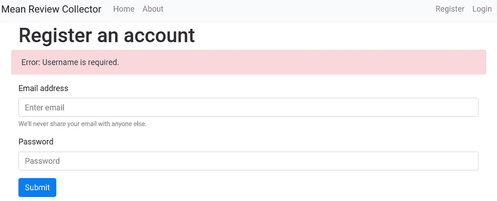

# 构建、测试和部署 Flask 应用程序:第 2 部分

> 原文：<https://betterprogramming.pub/build-test-and-deploy-a-flask-application-part-2-53f2c8df3ebc>

## 用户验证-注册


照片由[伯纳德·赫曼特](https://unsplash.com/@bernardhermant?utm_source=medium&utm_medium=referral)在 [Unsplash](https://unsplash.com?utm_source=medium&utm_medium=referral) 上拍摄

# 关于本教程的元信息

## 学习目标

*   用户验证—注册

注:本教程是 [*科学学烧瓶*](https://medium.com/@neohao/learn-flask-in-a-scientific-way-baf4d8055f6e) *系列的一部分。*

## 源代码

*   本教程的源代码可以在 [GitHub](https://github.com/Neo-Hao/mean-review-collector) 上获取。
*   该演示可在[https://pacific-fortress-91193.herokuapp.com/](https://pacific-fortress-91193.herokuapp.com/)获得。
*   仅涵盖本教程的版本可在此处访问[。](https://github.com/Neo-Hao/mean-review-collector/tree/ecd52a0af58ab1b1165491d50afdd355dfb9988f)

# 规划和设计

我们的目标是在应用程序中设置用户注册。为此，我们需要一个存储用户信息的数据库表。该表至少包含三列:

1.  身份证明
2.  用户名
3.  密码

每个用户的用户名必须是唯一的。路线/视图功能必须考虑到这一点。注册和登录的模板都需要更新，以便向数据库发送数据。

此外，用户登录时的模板页面需要扩展我们在上一个教程中准备的基本模板。

# 数据库设置

我们将使用一个 [SQLite](https://www.sqlite.org/) 数据库来存储用户信息。Python 在 [sqlite3](https://docs.python.org/3.4/library/sqlite3.html) 模块中内置了对 SQLite 的支持。

要设置数据库，我们需要在应用程序的根级别准备一个 SQL 文件，因此我们的应用程序结构将如下所示:

```
--- app.py
--- app.test.py
--- templates
       --- html files
**--- schema.sql**
```

这个 SQL 文件(`schema.sql`)包含 SQL 命令，这些命令按照我们的计划创建一个包含三个字段的空表:

```
DROP TABLE IF EXISTS user;CREATE TABLE user (
  id INTEGER PRIMARY KEY AUTOINCREMENT,
  username TEXT UNIQUE NOT NULL,
  password TEXT NOT NULL
);
```

ID 是该表中的主键，设置为自动递增。主键唯一地标识表中的每条记录，也可以作为在表之间建立关系的工具。

此外，我们明确表示用户名必须是`UNIQUE`。

虽然 schema 中的 SQL 命令已经设置好了，但是我们仍然需要 Python 代码来执行它。更新您的`app.py`,增加更多配置和四个数据库功能:

```
# imports
from flask import Flask, request, g, redirect, url_for, \
                  render_template, flash, make_response
from werkzeug.security import check_password_hash, generate_password_hash
import sqlite3# configuration
app = Flask(__name__)
app.config["SECRET_KEY"] = "rajsiosorqwnejrq39834tergm4"
app.config['DATABASE'] = 'flaskr.db'
app.config['DEBUG'] = True# connect to database
def connect_db():
    rv = sqlite3.connect(app.config['DATABASE'])
    rv.row_factory = sqlite3.Row
    return rv# create the database
def init_db():
    with app.app_context():
        db = get_db()
        with app.open_resource('schema.sql', mode='r') as f:
            db.cursor().executescript(f.read())
        db.commit()# open database connection
def get_db():
    if not hasattr(g, 'sqlite_db'):
        g.sqlite_db = connect_db()
    return g.sqlite_db# close database connection
@app.teardown_appcontext
def close_db(error):
    if hasattr(g, 'sqlite_db'):
        g.sqlite_db.close()// ...
```

有两件事需要解释:

## **app.config**

每个 Flask 应用程序都有一个名为`app.config`的全局配置对象。这个配置对象可以像 Python 字典一样处理，通过它可以访问、分配和修改配置变量的值。

值得注意的是，我们通过`app.config`直接更新这些变量。这种方法只适用于像我们这样的小型应用程序。

## **g**

`g`对象使事物全球化。

Flask 应用程序通常运行在几个。py 文件。`g`对象允许你在你的应用程序中对文件进行全局操作。

到目前为止，我们既没有利用工厂也没有利用蓝图，并且仍然只使用其中一个。py 文件，所以我们还没有机会体验它是如何被使用的。然而，了解一下`g`对象是做什么的仍然是值得的。

现在，让我们通过 Python shell 初始化一个数据库:

```
python3
>>> from app import init_db
>>> init_db()
```

如果运行时没有错误，您将看到数据库文件将出现在相同的目录中:

```
--- app.py
--- app.test.py
--- templates
       --- html files
--- schema.sql
**--- flaskr.db**
```

## **数据库测试**

为了测试数据库是否成功创建，我们可以在`BasicTestCase`类下用另一个单元测试方法进一步扩展我们的`app.test.py`:

```
def test_database(self):
    tester = os.path.exists("flaskr.db")
    self.assertTrue(tester)
```

# 登记

随着数据库的建立，我们可以更新应用程序的注册组件了。

在我们开始之前，我们需要确保您理解`POST`和`GET`请求之间的区别。

如果这是你第一次听说这样的术语，请先参考[本教程](https://www.diffen.com/difference/GET-vs-POST-HTTP-Requests)对`POST`和`GET`请求有一个概念性的了解。

注册组件有三个部分需要更新:

1.  路由功能
2.  查看功能
3.  模板

我们将按照这个顺序把它们全部更新:`register.html`(模板)——>路由和查看功能——>——`base.html`(模板)。

## **模板(register.html)**

如果您还记得我们在上一个教程中所做的事情，我们成功地设计了注册模板的样式，但是注册表单无法运行，因为我们的表单没有方法属性，输入字段也没有名称属性:

```
<form>
 ...      
<input type="email" class="form-control" id="email" aria-describedby="emailHelp" placeholder="Enter email">
...
<input type="password" class="form-control" id="user-password" placeholder="Password">
...
</form>
```

为了成功发送和处理 post 请求，我们将通过添加以下属性来更新模板:

```
<form **method="post"**>
 ...      
<input type="email" class="form-control" id="email" aria-describedby="emailHelp" placeholder="Enter email" **name="username"**>
...
<input type="password" class="form-control" id="user-password" placeholder="Password" **name="password"**>
...
</form>
```

值得注意的是，表单输入元素的 ID 与元素中包含的数据无关。

但是，name 属性在浏览器发送给服务器的 HTTP 请求中用作变量名(与 value 属性中包含的数据相关联)。

## **路线和查看功能**

需要更新路由以考虑不同类型的 HTTP 请求，包括`GET`和`POST`。更新后的路线应该如下所示:

```
@app.route('/register', methods=('GET', 'POST'))
```

视图功能需要考虑不同类型的 HTTP 请求，处理不同的用户交互场景，并为这些场景呈现可能不同的视图。

这种情况包括:

*   注册成功->重定向用户到登录页面。
*   没有用户名(当用户仍然点击提交按钮时)。
*   无密码(当用户仍然点击提交按钮时)。
*   已经注册了相同的用户名。

对于第一个场景，我们需要将注册信息提交到数据库，并将用户重定向到不同的页面(例如登录页面)。

对于最后三种情况，我们需要通知用户这样的错误，并让他们保持在同一页面上。

```
[@app](http://twitter.com/app).route('/register', methods=('GET', 'POST'))
def register():
    if request.method == 'POST':
        username = request.form['username']
        password = request.form['password']
        db = get_db()
        error = None if not username:
            error = 'Username is required.'
        elif not password:
            error = 'Password is required.'
        elif db.execute(
            'SELECT id FROM user WHERE username = ?', (username,)
        ).fetchone() is not None:
            error = 'User {} is already \
                   registered.'.format(username) if error is None:
            db.execute(
                'INSERT INTO user (username, password) VALUES \
               (?, ?)', (username, **generate_password_hash**(password))
            )
            db.commit()
            return redirect(url_for('login')) **flash**(error) return render_template('register.html')
```

到目前为止，我们显示了最后三个场景的各种错误，但是这些错误无处可去。如果你现在启动你的应用程序，当你试图在没有密码的情况下注册时，你不会看到任何错误。

## **模板(base.html)**

为了在必要时向用户显示闪现的错误，我们需要对模板进行进一步的更新。我们只能对`register.html`进行更新，但在处理登录视图功能时可能会遇到类似的场景。

更好的解决方案是更新基本模板，它由`register.html`和`login.html`扩展。以下是我将在`base.html`中包含的错误块:

```

    <div class="container alert alert-danger">
      <span>Error: {{ message }}</span>
    </div>

```

和以前一样，我参考了 Bootstrap 的[文档，了解如何设置错误信息的样式。它会呈现这样的效果:](https://getbootstrap.com/docs/3.4/components/#glyphicons-examples)



# 测试

为了测试我们的注册组件，让我们添加另一个类并修改我们的`app.test.py`:

```
import os
import unittest
import tempfileimport app// ... class FlaskrTestCase(unittest.TestCase):
  # set up a new temp database for per test
  def setUp(self):
    self.db_fd, app.app.config['DATABASE'] = tempfile.mkstemp()
    app.app.config['TESTING'] = True
    self.app = app.app.test_client()
    app.init_db() # destroy the temp database for per test
  def tearDown(self):
    os.close(self.db_fd)
    os.unlink(app.app.config['DATABASE']) def register(self, username, password):
    return self.app.post('/register', data=dict(
      username=username,
      password=password
    ), follow_redirects=True) # test messages
  def test_register_messages(self):
    """Test register messages using helper functions."""
    rv = self.register(
            "[cat@123.com](mailto:cat@123.com)",
            ""
    )
    assert b'Password is required' in rv.data rv = self.register(
            "",
            "123"
    )
    assert b'Username is required' in rv.data
```

注册的一切都准备好了，别忘了把你的代码推给 GitHub。

随着我们的`app.py`变得越来越臃肿，我们将重构它的代码。py 文件，并使用下一篇教程中开发 Flask 应用程序、工厂或蓝图的推荐实践以及登录组件开始探索。

# 教程列表

*   [构建并测试迷你烧瓶应用程序](https://medium.com/@neohao/build-test-and-deploy-a-mini-flask-application-1d9ca6c45115)
*   [构建、测试和部署 Flask 应用程序:第 1 部分——模板](https://medium.com/better-programming/build-test-and-deploy-an-interactive-flask-application-part-i-templates-53a7b0cbe760)
*   [构建、测试和部署 Flask 应用程序:第 2 部分——认证](https://medium.com/better-programming/build-test-and-deploy-a-flask-application-part-2-53f2c8df3ebc)
*   [构建、测试和部署 Flask 应用程序:第 3 部分——应用程序工厂和蓝图](https://medium.com/@neohao/build-test-and-deploy-a-flask-application-part-3-3a2abfe4be21)
*   [构建、测试和部署 Flask 应用程序:第 4 部分——重构测试](https://medium.com/@neohao/build-test-and-deploy-a-flask-application-part-4-5aa4f079fadb)
*   [构建、测试和部署 Flask 应用程序:第 5 部分—认证(续)](https://medium.com/@neohao/build-test-and-deploy-a-flask-application-part-5-4a3c0bc36b8e)
*   [构建、测试和部署 Flask 应用程序:第 6 部分——评审系统](https://medium.com/@neohao/build-test-and-deploy-a-flask-application-part-6-952a1b29a02a)
*   [构建、测试和部署 Flask 应用程序:第 7 部分——部署](https://medium.com/@neohao/build-test-and-deploy-a-flask-application-part-7-60dde9080330)