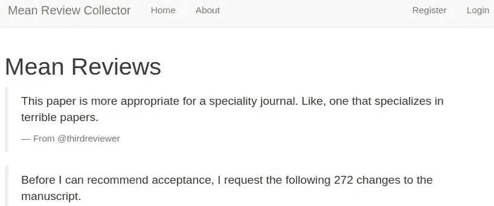

# 构建、测试和部署 Flask 应用程序:第 3 部分

> 原文：<https://betterprogramming.pub/build-test-and-deploy-a-flask-application-part-3-3a2abfe4be21>

## 使用应用工厂和蓝图


由[谢尔盖·佐尔金](https://unsplash.com/@szolkin?utm_source=medium&utm_medium=referral)在 [Unsplash](https://unsplash.com?utm_source=medium&utm_medium=referral) 上拍摄的照片

# 关于本教程的元信息

## 学习目标

*   将一个 [Flask](https://www.palletsprojects.com/p/flask/) 项目从单个脚本应用程序重组为使用应用程序工厂和蓝图。

注:本教程是 [*系列*](https://medium.com/@neohao/learn-flask-in-a-scientific-way-baf4d8055f6e) *科学学烧瓶的一部分。*

## 源代码

*   本教程的源代码可以在 [GitHub](https://github.com/Neo-Hao/mean-review-collector) 上获取。
*   该演示可在[https://pacific-fortress-91193.herokuapp.com/](https://pacific-fortress-91193.herokuapp.com/)获得。
*   单个脚本应用程序的版本可以在 GitHub 上访问[。](https://github.com/Neo-Hao/mean-review-collector/tree/ecd52a0af58ab1b1165491d50afdd355dfb9988f)

# 应用工厂和蓝图—它们是什么，我们为什么需要它们？

从上一个教程继续，我们已经有了一个测试注册功能的应用程序。

然而，所有的东西都被编码在一个文件中，`app.py`。这种方法很方便，但是扩展性不好。当复杂性增加时，单个文件应用程序可能会很成问题。

尽管 Flask 没有对应用程序项目进行严格的组织，但是有几种推荐的方法。几乎所有这些都涉及应用工厂和蓝图的使用。

应用程序工厂只是一个负责创建应用程序对象及其配置的函数。如果需要，它还可以创建多个应用程序对象。

当所有东西都驻留在一个`app.py`文件中时，一旦脚本被执行，应用程序对象将被创建。到那时，不可能应用进一步的配置更改。

相比之下，应用程序工厂会延迟应用程序对象的创建，因为没有初始化应用程序实例。因此，可以动态地应用配置更改，甚至创建多个应用程序对象。

典型的应用程序工厂如下所示:

```
#__init__.pyfrom flask import Flask
# import moredef create_app(config_file=None):
    # create and configure the app
    app = Flask(__name__) # configuration
    if (config_name is not None):
       app.config.from_pyfile(config_file, silent=True)
    else:
       app.config.from_mapping(
         SECRET_KEY='sdfigtertairasgkd8dty60546j4563l43563',
         DATABASE=os.path.join(app.instance_path, 'app.sqlite'),
    ) # attach routes/views and database functions return app
```

`create_app()`函数是应用工厂，以配置文件为参数。配置文件默认为`None`。当没有指定配置名时，将在`else`分支下建立一个简单的配置。

一旦创建了应用程序对象，就可以进一步配置它，并且可以初始化其他功能(例如，数据库、视图)。最后，工厂函数将创建并返回一个应用程序实例。

蓝图是一组`.py`文件，用于组织相关路线和视图功能组。处理身份验证的函数应该与处理错误的函数组织在不同的文件中，这是很自然的。

除此之外，blueprints 还解决了使用应用程序工厂带来的复杂性。在单个脚本应用程序中，首先创建应用程序对象，以允许`app.route`装饰器工作。

当使用应用程序工厂时，应用程序对象是在运行时创建的，这使得 routes 和 review 函数以同样的方式工作为时已晚。

为了解决这种复杂性，蓝图在休眠状态下将路由功能与自身关联起来，直到蓝图向应用程序注册。

典型的蓝图如下所示:

```
#auth.py
from flask import Blueprintbp = Blueprint('auth', __name__)[@bp](http://twitter.com/bp).route('/register', methods=('GET', 'POST'))
def register(): # register stuff return render_template('auth/register.html')
```

蓝图的注册如下所示:

```
#__init__.pyfrom flask import Flask
# import moredef create_app(config_file=None):
    # create and configure the app
    app = Flask(__name__) # configuration stuff # attach routes/views and database functions
 **from . import auth
    app.register_blueprint(auth.bp)** return app
```

# 整体重组

为了利用应用程序工厂和蓝图，我们需要重新构建我们的应用程序，以便:

```
mean-review-collector
---app
  ---templates
    ---base.html
    ---etc.
  ---__init__.py
  ---errors.py
  ---auth.py
  ---review.py
  ---db.py
  ---schema.sql
---tests
---instance
  ---app.sqlite
---env
```

应用程序包将位于`app`文件夹中。测试用例将存在于`test`文件夹中。数据库将位于`instance`文件夹中。

和以前一样，`env`文件夹仍然保存虚拟环境配置。当我们以后需要让 app 应用程序可安装时，这个结构会很方便。

# 应用工厂

应用程序工厂位于`__init__.py`中，在`app`文件夹下:

```
#__init__.pyimport os
from flask import Flaskdef create_app(config_file=None):
    # create and configure the app
    app = Flask(__name__) # configuration
    if (config_name is not None):
       app.config.from_pyfile(config_file, silent=True)
    else:
       app.config.from_mapping(
         SECRET_KEY='sdfigtertairasgkd8dty60546j4563l43563',
         DATABASE=os.path.join(app.instance_path, 'app.sqlite'),
    ) # attach routes/views and database functions return app
```

值得注意的是，我们的应用工厂在当前状态下是不完整的。

当我们完成与数据库和蓝图相关的功能时，我们会将它们注册到应用程序工厂，并更新`create_app()`功能。

# 数据库ˌ资料库

我们将把与数据库相关的所有功能分解到一个脚本中，`db.py`。虽然大多数功能保持不变，但仍有一些明显的差异:

```
#db.pyimport sqlite3
import click
from flask import current_app, g# more functions# create the database
def init_db():
    db = get_db()
    with current_app.open_resource('schema.sql') as f:
        db.executescript(f.read().decode('utf8'))@click.command('init-db')
@with_appcontext
def init_db_command():
    """Clear the existing data and create new tables."""
    init_db()
    click.echo('Initialized the database.')# more functions
```

首先，`db.py`中的所有函数都是在没有应用对象被创建时创建的。因此，我们无法访问之前创建的对象`app`。

然而，有时候，我们确实需要参考对象。一种解决方法是使用`current_app`。`current_app`通常用作应用程序的代理，因此当您采用应用程序工厂和蓝图模式时，您可以处理所有请求。

对`init_db`方法的仔细比较可以更清楚地证明这一点:

```
# app.py
# create the database -- when you have access to app object
def init_db():    
  with app.app_context():        
    db = get_db()        
    with app.open_resource('schema.sql', mode='r') as f:
      db.cursor().executescript(f.read())        
      db.commit()# db.py
# create the database -- when you adopt application factory
def init_db():
  db = get_db()
  with **current_app**.open_resource('schema.sql', mode='r') as f:
    db.cursor().executescript(f.read())        
    db.commit()
```

第二，我们需要创建一个函数`init_db_command`，作为可以通过终端运行的命令。我们将不再能够访问创建的`app`对象。

因此，我们不能再像在第 2 部分中那样初始化数据库。我们需要将所有数据库功能关联到我们的应用程序工厂:

```
#__init__.pyimport os
from flask import Flaskdef create_app(config_file=None):
    # create and configure the app
    app = Flask(__name__) # configuration # attach routes/views and database functions
 **from . import db
    db.init_app(app)** return app
```

之后，我们将能够通过在终端中键入以下命令来初始化数据库:

```
flask init-db
```

# 蓝图和模板

为了使我们的模板更有条理，我们将重新构建模板文件夹，以便:

```
templates
  --base.html
  auth
    --login.html
    --register.html
  review
    --home.html
    --about.html
    --error.html
```

我们将与路线和视图相关的所有功能分解到两个不同的蓝图文件中:

*   `auth.py`:认证相关功能。
*   `review.py`:与非认证页面相关的功能(例如，查看平均评论、添加平均评论、更新现有评论)。

例如，`auth.py`将包含:

```
#auth.pyfrom flask import Blueprint
# import morebp = Blueprint('auth', __name__)@**bp**.route('/login')
def login():
    return render_template('auth/login.html')@**bp**.route('/register', methods=('GET', 'POST'))
def register():
  # many cases if error is None:
    db.execute(
      'INSERT INTO user (username, password) VALUES (?, ?)',
      (username, generate_password_hash(password))
    )
    db.commit()
    return redirect(url_for('**auth.login**')) flash(error) return render_template('**auth/register.html**')
```

有两件事值得我们注意。

首先，所有路由都与蓝图相关联，蓝图处于休眠状态，直到它们向应用程序注册。注册是这样进行的:

```
#__init__.pyimport os
from flask import Flaskdef create_app(config_file=None):
    # create and configure the app
    app = Flask(__name__) # configuration # attach routes/views and database functions
    from . import db
    db.init_app(app) **from . import auth
    app.register_blueprint(auth.bp)** return app
```

第二，视图函数的端点总是在前面加上蓝图名称。

例如，上面登录函数的端点是`auth.login`，因为登录函数被添加到了 auth 蓝图中。因此，您还需要更新`base.html`中的所有端点来反映这一点(基础模板包含导航栏):

```
<li class="nav-item">
 <a class="nav-link" href="{{ url_for('**auth.register**') }}">Register</a>
</li>
<li class="nav-item">
 <a class="nav-link" href="{{ url_for('**auth.login**') }}">Login</a>
</li>
```

# 运行重构的应用程序

在所有的更改之后，我们将准备好运行脚本。如果您使用的是 Linux 或 Mac，请通过终端运行以下三行代码:

```
export FLASK_APP=app
export FLASK_ENV=development
flask run
```

如果您使用的是 Windows，请通过 CMD 运行以下三行命令:

```
set FLASK_APP=app
set FLASK_ENV=development
flask run
```

您将能够看到与单个脚本应用程序完全相同的效果:



到目前为止，我们已经介绍了如何从单个脚本应用程序到使用应用程序工厂和蓝图来重构 Flask 项目。

然而，我们的重组也破坏了我们的测试。我们将在下一个教程中重新构建我们的测试。

完成这篇文章比预期多花了一周时间，我的学校采用的是四分之一制。随着季度末的临近，许多事情突然出现，让我无法写作。

如果你还在上学，这可能是你最后一周或第二周，我希望你有一个美好的寒假。如果你正在工作，我希望你能很快过一个愉快的假期。

# 教程列表

*   [构建并测试迷你烧瓶应用程序](https://medium.com/@neohao/build-test-and-deploy-a-mini-flask-application-1d9ca6c45115)
*   [构建、测试和部署 Flask 应用程序:第 1 部分——模板](https://medium.com/better-programming/build-test-and-deploy-an-interactive-flask-application-part-i-templates-53a7b0cbe760)
*   [构建、测试和部署 Flask 应用程序:第 2 部分——认证](https://medium.com/better-programming/build-test-and-deploy-a-flask-application-part-2-53f2c8df3ebc)
*   [构建、测试和部署 Flask 应用程序:第 3 部分——应用程序工厂和蓝图](https://medium.com/@neohao/build-test-and-deploy-a-flask-application-part-3-3a2abfe4be21)
*   [构建、测试和部署 Flask 应用程序:第 4 部分——重构测试](https://medium.com/@neohao/build-test-and-deploy-a-flask-application-part-4-5aa4f079fadb)
*   [构建、测试和部署 Flask 应用程序:第 5 部分—认证(续)](https://medium.com/@neohao/build-test-and-deploy-a-flask-application-part-5-4a3c0bc36b8e)
*   [构建、测试和部署 Flask 应用程序:第 6 部分——评审系统](https://medium.com/@neohao/build-test-and-deploy-a-flask-application-part-6-952a1b29a02a)
*   [构建、测试和部署 Flask 应用程序:第 7 部分——部署](https://medium.com/@neohao/build-test-and-deploy-a-flask-application-part-7-60dde9080330)