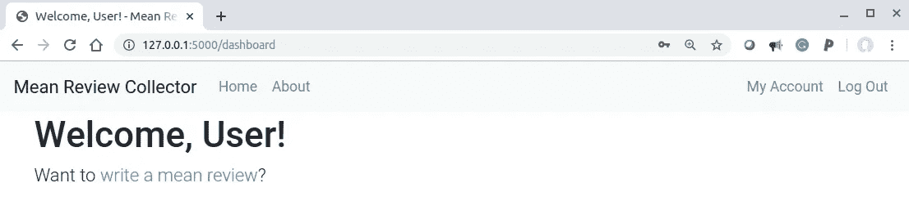
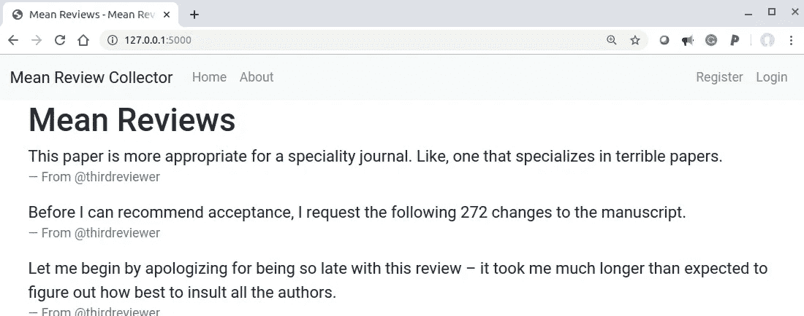

# 构建、测试和部署 Flask 应用程序(第 5 部分)

> 原文：<https://betterprogramming.pub/build-test-and-deploy-a-flask-application-part-5-4a3c0bc36b8e>

## **认证(续**


照片由[马文·迈耶](https://unsplash.com/@marvelous?utm_source=medium&utm_medium=referral)在 [Unsplash](https://unsplash.com?utm_source=medium&utm_medium=referral) 上拍摄

# 关于本教程的元信息

## 学习目标

*   证明

注:本教程是 [*系列*](https://medium.com/@neohao/learn-flask-in-a-scientific-way-baf4d8055f6e) *科学学烧瓶的一部分。*

## 源代码

*   本教程的源代码可以在 [GitHub](https://github.com/Neo-Hao/mean-review-collector) 上获取。
*   该演示可在[该网站](https://pacific-fortress-91193.herokuapp.com/)上获得。
*   仅涵盖本教程的版本可在此处访问[。](https://github.com/Neo-Hao/mean-review-collector)

# 计划

在本教程中，我们将继续开发和测试 web 应用程序的身份验证组件。

到目前为止，我们有一个功能正常的注册页面。在此基础上，我们将开发登录和注销功能，并彻底测试它们。最终，我们希望达到以下效果:



当用户登录时，他/她会看到这个。

单击“注销”按钮时，用户将被定向到主页:



当用户注销时，他/她会看到这个。

请注意，导航栏上的按钮(在右侧)会根据用户是否登录而变化。

# 添加登录和注销功能

## **登录和注销功能**

为了添加登录和注销功能，我们在`auth.py`中至少还需要两个功能:登录和注销功能。

对于登录功能，当请求方法为`POST`时，至少必须检查两种情况，包括(a)从未向应用程序注册电子邮件时，以及(b)找到用户名但密码错误时。

```
# auth.py
@bp.route('/login', methods=('GET', 'POST'))
def login():
    if request.method == 'POST':
        username = request.form['username']
        password = request.form['password']
        db = get_db()
        error = None
        user = db.execute(
            'SELECT * FROM user WHERE username = ?', (username,)
        ).fetchone() if user is None:
            error = 'Incorrect username.'
        elif not check_password_hash(user['password'], password):
            error = 'Incorrect password.' if error is None:
            session.clear()
            session['user_id'] = user['id']
            return redirect(url_for('review.dashboard')) flash(error) return render_template('auth/login.html')
```

请注意，当用户成功登录时，我们会将用户定向到仪表板页面，但我们还没有这样的页面。我们将很快创建它。

注销功能相对简单一些:

```
# auth.py
@bp.route('/logout')
def logout():
    session.clear()
    return redirect(url_for('review.home'))
```

我们只是在用户注销时将他们重定向到主页。

## 仪表盘

仪表板仅供登录服务的用户使用。因此，我们需要准备一个包装器方法，它可以用作其他函数的装饰器:

```
# auth.py
def login_required(view):
    @functools.wraps(view)
    def wrapped_view(**kwargs):
        if g.user is None:
            return redirect(url_for('auth.login')) return view(**kwargs) return wrapped_view
```

仪表板页面的视图功能将能够利用这个功能作为登录需求装饰器:

```
# review.py
[@bp](http://twitter.com/bp).route('/dashboard')
@login_required
def dashboard():
    return render_template('review/dashboard.html')
```

现在，我们可以创建仪表板模板了:

```
# templates/review/dashboard.html

<div class="container">
  <h1>Welcome, User!</h1>
</div>

<div class="container">
  <p class="lead">Want to <a href="#">write a mean review</a>?</p>
</div>

```

仪表板模板扩展了基本模板，目前不包含太多信息。

## 自适应导航栏

我们打算让导航栏有不同的按钮，这取决于用户是否登录。为此，我们依赖于用户登录时启动的会话:

```
# templates/base.html

  <li class="nav-item">
    <a class="nav-link" 
       href="{{url_for('auth.register')}}">Register</a>
  </li>
  <li class="nav-item">
    <a class="nav-link" 
       href="{{ url_for('auth.login') }}">Login</a>
  </li>

  <li class="nav-item">
    <a class="nav-link" 
       href="{{ url_for('review.dashboard') }}">My Account</a>
  </li>
  <li class="nav-item">
    <a class="nav-link" 
       href="{{ url_for('auth.logout') }}">Log Out</a>
  </li>

```

当具有指定用户 ID 的会话为 none 时，这意味着没有登录的用户，因此我们显示“注册”和“登录”按钮。否则，我们会显示“我的帐户”和“注销”按钮。

# 测试登录和注销功能

为了测试成功登录，我们需要在数据库中存储用户信息(即电子邮件地址和密码)。为了实现这一点，我们可以更新我们的代码，在执行所有测试用例之前将一个测试用户插入到我们的数据库中:

```
# conftest.py
import ...with open(os.path.join(os.path.dirname(__file__), 'data.sql'), 'rb') as f:
    _data_sql = f.read().decode('utf8')...with app.app_context():
        init_db()
        get_db().executescript(_data_sql)yield app
```

在`data.sql`中，我们只插入一个条目:

```
# data.sql
INSERT INTO user (username, password)
VALUES
  ('cat@cat.com', 'pbkdf2:sh...');
```

在此基础上，我们可以继续添加一些测试登录和注销的测试函数。

如果我们有多个不同的场景，我们可能会有很多冗余的登录代码。为了减少冗余，我们可以将登录和注销代码分解到驻留在`conftest.py`中的一个类中。

```
# conftest.py@pytest.fixture
def client(app):
  return app.test_client()class AuthActions(object):
  def __init__(self, client):
    self._client = client def login(self, username='cat@cat.com', password='test'):
    return self._client.post(
      '/login',
      data={'username': username, 'password': password}
    ) def logout(self):
    return self._client.get('/logout')@pytest.fixture
def auth(client):
  return AuthActions(client)
```

在上面的代码中，我们实际上再次利用了 pytest fixture 对象。函数`auth`将总是返回一个`auth`对象；一个`auth`对象是一个`AuthActions`对象，它将一个`client`对象作为唯一的参数并对其进行操作。

这导致您可以随时使用两个简单的函数来实现登录和注销:

*   `auth.login()`:这将使你登录到网络应用程序。
*   `auth.logout()`:这将使你注销。

有了这两个函数，我们可以继续测试登录和注销功能:

```
def test_login(client, auth):
  assert client.get('/login').status_code == 200
  response = auth.login()
  assert response.headers['Location'] == 
                               'http://localhost/dashboard'  
  with client:
    client.get('/')
    assert session['user_id'] == 1
    assert g.user['username'] == 'cat@cat.com'def test_logout(client, auth):
  auth.login()
  with client:
    auth.logout()
    assert 'user_id' not in session
```

# 教程列表

*   [构建并测试一个迷你烧瓶应用程序](https://medium.com/@neohao/build-test-and-deploy-a-mini-flask-application-1d9ca6c45115)
*   [构建、测试和部署 Flask 应用程序:第 1 部分—模板](https://medium.com/better-programming/build-test-and-deploy-an-interactive-flask-application-part-i-templates-53a7b0cbe760)
*   [构建、测试和部署 Flask 应用程序:第 2 部分—认证](https://medium.com/better-programming/build-test-and-deploy-a-flask-application-part-2-53f2c8df3ebc)
*   [构建、测试和部署 Flask 应用程序:第 3 部分——应用程序工厂和蓝图](https://medium.com/@neohao/build-test-and-deploy-a-flask-application-part-3-3a2abfe4be21)
*   [构建、测试和部署 Flask 应用程序:第 4 部分——重构测试](https://medium.com/@neohao/build-test-and-deploy-a-flask-application-part-4-5aa4f079fadb)
*   [构建、测试和部署 Flask 应用程序:第 5 部分—认证(续)](https://medium.com/@neohao/build-test-and-deploy-a-flask-application-part-5-4a3c0bc36b8e)
*   [构建、测试和部署 Flask 应用程序:第 6 部分——评审系统](https://medium.com/@neohao/build-test-and-deploy-a-flask-application-part-6-952a1b29a02a)
*   [构建、测试和部署 Flask 应用程序:第 7 部分——部署](https://medium.com/@neohao/build-test-and-deploy-a-flask-application-part-7-60dde9080330)