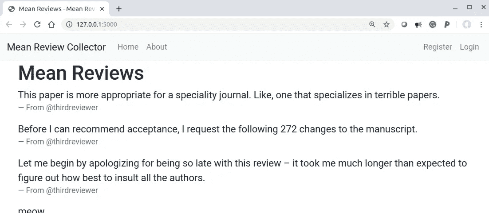
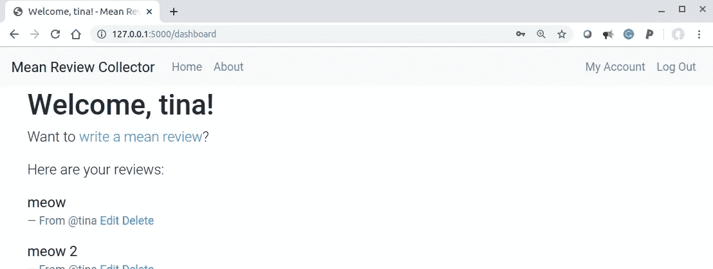
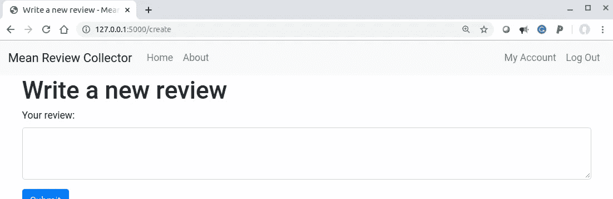
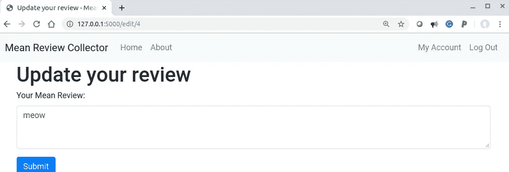

# 构建、测试和部署 Flask 应用程序(第 6 部分)

> 原文：<https://betterprogramming.pub/build-test-and-deploy-a-flask-application-part-6-952a1b29a02a>

## 审查制度


照片由[克林特·王茂林](https://unsplash.com/@clintadair?utm_source=medium&utm_medium=referral)在 [Unsplash](https://unsplash.com?utm_source=medium&utm_medium=referral) 上拍摄

# 关于本教程的元信息

## 学习目标

*   持久存储的四个基本功能—创建、读取、更新和删除(CRUD)。

注:本教程是 [*系列*](https://medium.com/@neohao/learn-flask-in-a-scientific-way-baf4d8055f6e) *科学学烧瓶的一部分。*

## 源代码

*   本教程的源代码可以在 [GitHub](https://github.com/Neo-Hao/mean-review-collector) 上获取。
*   该演示可在[该网站](https://pacific-fortress-91193.herokuapp.com/)上获得。
*   仅涵盖本教程的版本可以在 GitHub 上访问[。](https://github.com/Neo-Hao/mean-review-collector)

# 计划

在本教程中，我们将开发和测试 web 应用程序的审阅系统组件。

本质上，这个组件将允许任何人查看所有用户添加的所有平均评论，并允许向应用程序注册帐户的用户创建、编辑和删除他们自己的评论。

主页汇总了所有用户的所有评论，并按时间降序排列:



主页

用户控制面板仅聚合特定用户的评论，并允许用户创建、编辑和删除自己的评论:



用户仪表板

# create, read, update, and delete

我们的系统旨在让用户分享他们收到的稿件的平均评论，因此每个用户都应该能够在登录我们的应用程序时创建、编辑和删除评论。

## 创造

我们希望用户在单独的页面上写一篇新的评论，并将新添加的评论存储到数据库中，如下所示:



为了实现这一点，我们需要首先更新我们的数据库。我们需要另一个表,( 1)保存评论的数据,( 2)将每个评论链接到发布评论的用户:

```
# schema.sqlDROP TABLE IF EXISTS review;
CREATE TABLE review (
  id INTEGER PRIMARY KEY AUTOINCREMENT,
  created TIMESTAMP NOT NULL DEFAULT CURRENT_TIMESTAMP,
  author_id INTEGER NOT NULL,
  content TEXT NOT NULL,
  FOREIGN KEY (author_id) REFERENCES user (id)
);
```

在审阅表中，`author_id`列引用用户表中的`id`列。在此基础上，我们可以继续为用户撰写新评论的页面准备`create.html`模板:

```
# templates/review/create.html

<div class="container">
  <h1>Write a new review</h1>
</div>

<div class="container">
  <form method="post">
    <div class="form-group">
      <label for="exampleFormControlTextarea1">Your review:</label>
      <textarea class="form-control" rows="3" name="review-text">   
      </textarea>
    </div>
    <button class="btn btn-primary" type="submit">Submit</button>
  </form>
</div>

```

基于这个模板，我们可以在`review.py`中准备一个新的 blueprint 函数来处理这个表单:

```
# review.py@bp.route('/create', methods=('GET', 'POST'))
@login_required
def create():
  if request.method == 'POST':
    text = request.form['review-text']
    text = text.strip()
    db = get_db()
    error = Noneif not text:
    error = 'You didn\'t add any new reviews.'
  if error is None:
    db.execute(
      'INSERT INTO review (author_id, content) VALUES (?, ?)',   
      (g.user['id'], text)
    )
    db.commit()
    return redirect(url_for('review.dashboard'))flash(error)return render_template('review/create.html')
```

## 阅读

当您启动应用程序、登录并添加一个新的评论时，很自然地会期望新添加的评论会聚集在主页和用户仪表板上。

为此，我们需要更新主页模板的代码，将静态文本替换为:

```
# templates/review/home.html...

  <blockquote class="blockquote">
    <p class="mb-0">{{ review['content'] }}</p>
      <footer class="blockquote-footer">
        From @{{ review['username'].split("@")[0] }}
      </footer>
  </blockquote>

...
```

此外，我们需要更新 home 函数:

```
# review.py@bp.route('/')
def home():
    db = get_db()
    reviews = db.execute(
        'SELECT r.id, created, author_id, content, username'
        ' FROM review r JOIN user u ON r.author_id = u.id'
        ' ORDER BY created DESC'
    ).fetchall()
    return render_template('review/home.html', reviews=reviews)
```

类似地，我们需要更新仪表板功能的代码。仪表板功能仅选择并显示给定用户撰写的评论。

```
# review.py@bp.route('/dashboard')
@login_required
def dashboard():
  db = get_db()
  reviews = db.execute(
        'SELECT r.id, created, author_id, content, username'
        ' FROM review r JOIN user u ON r.author_id = u.id'
 **' WHERE author_id = ?'**
        ' ORDER BY created DESC',
 **(g.user['id'],)**
  ).fetchall()return render_template('review/dashboard.html', reviews=reviews)
```

dashboard 模板使用作为哈希表传递给模板的`review`，并将键`id`对应的值插入到*编辑*和*删除*的链接中，这样用户就可以实际编辑和删除评论。

```
# templates/review/dashboard.html<p class="lead">Here are your reviews:</p>

  <blockquote class="blockquote">
    <p class="mb-0">{{ review['content'] }}</p>
    <footer class="blockquote-footer">
      From @{{ review['username'].split("@")[0] }}
      <a href="
             **{{ url_for('review.edit', id=review['id']) }}**">Edit</a>
      <a href="
         **{{ url_for('review.delete', id=review['id']) }}**">Delete</a>
    </footer>
  </blockquote>

```

## 更新和删除

用户应该能够在一个单独的页面上编辑他们给定的评论`edit.html`。

这个页面和`create.html`很像，所以编辑页面`edit.html`的代码应该和`create.html`几乎一模一样。但是，由于这是编辑，用户应该能够看到评论的原始内容:



我们通过将`review['content']`传递给编辑表单来实现这一点:

```
# templates/review/edit.html

<div class="container">
  <h1>Update your review</h1>
</div>

<div class="container">
  <form method="post">
    <div class="form-group">
      <label for="exampleFormControlTextarea1">
        Your Mean Review:
      </label>
      <textarea class="form-control" 
       id="exampleFormControlTextarea1" rows="3" name="review-text">
 **{{ review['content'] }}**
      </textarea>
    </div>
    <button class="btn btn-primary" type="submit">Submit</button>
  </form>
</div>

```

至于编辑和删除功能，两者都需要检索评论。因此，我们可以将此作为一个独立的方法`get_review`:

```
# review.pydef get_review(id):
  db = get_db()
  review = db.execute(
        'SELECT r.id, created, author_id, content, username'
        ' FROM review r JOIN user u ON r.author_id = u.id'
        ' WHERE r.id = ?',
        (id,)
  ).fetchone() if review is None:
    abort(404, "Review id {0} doesn't exist.".format(id)) if review['author_id'] != g.user['id']:
    abort(403) return review
```

编辑和删除功能都可以使用该功能:

```
# review.py@bp.route('/edit/<int:id>', methods=('GET', 'POST'))
@login_required
def edit(id):
  review = get_review(id) if request.method == 'POST':
    text = request.form['review-text']
    text = text.strip()
        db = get_db()
        error = None if not text:
    error = 'You can\'t update the review to nothing.'
    if error is None:
    db.execute(
      'UPDATE review SET content = ?'
      ' WHERE id = ?',
      (text, id)
    )
    db.commit()
    return redirect(url_for('review.dashboard')) flash(error)
  return render_template('review/edit.html', review=review)@bp.route('/delete/<int:id>', methods=('GET', 'POST'))
@login_required
def delete(id):
  get_review(id)
  db = get_db()
  db.execute('DELETE FROM review WHERE id = ?', (id,))
  db.commit()
  return redirect(url_for('review.dashboard'))
```

值得注意的是，评论 ID 被传递给这两个函数，它们的路由将 URL 格式化为`domain_name/function/review_id`，像`/edit/1`或`/delete/2`。

# 测试

CRUD 的测试相对简单。例如，`test_create`功能将是:

```
def test_create(client, auth, app):
  count_prior = 0
  count_after = 0 with app.app_context():
    db = get_db()
    count_prior = db.execute(
        'SELECT COUNT(id) FROM review').fetchone()[0] auth.login()
    assert client.get('/create').status_code == 200
    client.post('/create', 
      data={'review-text': 'this is a mean review'}) with app.app_context():
    db = get_db()
    count_after = db.execute(
      'SELECT COUNT(id) FROM review').fetchone()[0] assert count_prior + 1 == count_after
```

除了 CRUD 上的测试，我们可能需要测试`login_required`是否如这些页面上预期的那样工作，以及是否只有评论的作者可以编辑他们的评论。

# 教程列表

*   [构建并测试一个迷你烧瓶应用程序](https://medium.com/@neohao/build-test-and-deploy-a-mini-flask-application-1d9ca6c45115)
*   [构建、测试和部署 Flask 应用程序:第 1 部分—模板](https://medium.com/better-programming/build-test-and-deploy-an-interactive-flask-application-part-i-templates-53a7b0cbe760)
*   [构建、测试和部署 Flask 应用程序:第 2 部分——认证](https://medium.com/better-programming/build-test-and-deploy-a-flask-application-part-2-53f2c8df3ebc)
*   [构建、测试和部署 Flask 应用程序:第 3 部分——应用程序工厂和蓝图](https://medium.com/@neohao/build-test-and-deploy-a-flask-application-part-3-3a2abfe4be21)
*   [构建、测试和部署 Flask 应用程序:第 4 部分——重构测试](https://medium.com/@neohao/build-test-and-deploy-a-flask-application-part-4-5aa4f079fadb)
*   [构建、测试和部署 Flask 应用程序:第 5 部分—认证(续)](https://medium.com/@neohao/build-test-and-deploy-a-flask-application-part-5-4a3c0bc36b8e)
*   [构建、测试和部署 Flask 应用程序:第 6 部分——评审系统](https://medium.com/@neohao/build-test-and-deploy-a-flask-application-part-6-952a1b29a02a)
*   [构建、测试和部署 Flask 应用程序:第 7 部分——部署](https://medium.com/@neohao/build-test-and-deploy-a-flask-application-part-7-60dde9080330)