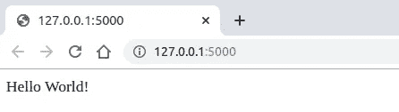
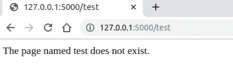
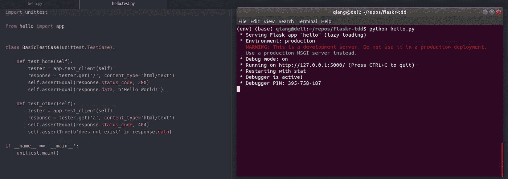

# 构建并测试一个迷你烧瓶应用程序

> 原文：<https://betterprogramming.pub/build-test-and-deploy-a-mini-flask-application-1d9ca6c45115>

## 开始使用 Flask 和 Python


西蒙·维亚尼在 Unsplash[上的照片](https://unsplash.com/s/photos/flask?utm_source=unsplash&utm_medium=referral&utm_content=creditCopyText)

# 关于本教程的元信息

## **学习目标**

*   Flask web 应用程序的基本结构。
*   什么是“请求”和“响应”。

注:本教程是 [*科学学烧瓶*](https://medium.com/@neohao/learn-flask-in-a-scientific-way-baf4d8055f6e) *系列的一部分。*

## **发展目标**

*   一个有几个静态页面的网站(注意:这里开发是一个学习的场所)。

## **关于学习者的假设**

*   对 Python 编程有所了解。
*   对面向对象编程有一定的了解。
*   了解一点 Git。

# **项目设置**

项目设置可能看起来不必要。然而，本教程还旨在介绍开发中的最佳实践，例如利用版本控制和虚拟开发环境。

1.  下载 [Python 3.8](https://www.python.org/downloads/release/python-380/) 。
2.  [下载安装 pip](https://www.tecmint.com/install-pip-in-linux/) : [pip](https://pip.pypa.io/en/stable/) 是 Python 的一个包管理系统，就像 [npm](https://www.npmjs.com/package/node) to Node 一样。 [Flask](https://www.palletsprojects.com/p/flask/) 是 Python 中的一个包。
3.  [使用 pip 下载并安装 venv](https://gist.github.com/Geoyi/d9fab4f609e9f75941946be45000632b):venv[可以用来创建一个隔离的虚拟开发环境。这可以帮助您避免以后遇到依赖冲突。这是推荐的开发实践之一。](https://docs.python.org/3/library/venv.html)

现在，您可以开始设置开发环境了:

1.  在 GitHub 上创建一个名为`flask-app`的空存储库，并将其下载到本地环境中(并通过命令行导航到下载的空文件夹)。

```
git clone https://github.com/*your-username*/flask-app
cd flask-app
```

2.在下载的空文件夹中创建虚拟环境:

```
python3 -m venv env
source env/bin/activate
```

您将会看到`env`现在显示在您的终端`(env)$`中的`$`之前，这意味着您当前处于本地环境中。

要退出虚拟环境，使用命令`deactivate`。使用命令`source env/bin/activate`重新激活虚拟环境。

3.安装烧瓶:

```
pip install flask
```

# 建立你的第一个 Flask 网站并测试它

我们建立网站的第一次尝试只是一个名为“hello”的文件。为此，创建一个名为`hello.py`的文件(假设您仍然在刚刚设置的环境中):

```
touch hello.py
```

然后，您可以使用您喜欢的文本编辑器将以下代码复制并粘贴到这个新创建的 Python 文件中:

```
from flask import Flask
from flask import make_responseapp = Flask(__name__)@app.route('/')
def home():
    return "Hello World!"@app.route('/<page_name>')
def other_page(page_name):
    response = make_response('The page named %s does not exist.' \
                             % page_name, 404)
    return responseif __name__ == '__main__':
    app.run(debug=True)
```

之后，您可以通过终端运行以下命令:

```
python3 hello.py
```

您将看到类似如下的输出:

```
* Serving Flask app "hello" (lazy loading)
 * Environment: production
   WARNING: This is a development server. Do not use it in a production deployment.
   Use a production WSGI server instead.
 * Debug mode: on
 * Running on [http://127.0.0.1:5000/](http://127.0.0.1:5000/) (Press CTRL+C to quit)
 * Restarting with stat
 * Debugger is active!
 * Debugger PIN: 113-996-155
127.0.0.1 - - [11/Nov/2019 16:41:31] "GET / HTTP/1.1" 200 -
```

当您通过网络浏览器查看 [http://127.0.0.1:5000/](http://127.0.0.1:5000/) 时，您会看到:



当您检查同一域的任何其他页面(http://127.0.0.1:5000/)时，您会看到以下内容(例如 test):



这意味着你的网站是活的，并且(可能)像预期的那样运行。



# 我们能从我们的第一个 Flask 网站中学到什么

从这个简单网站的代码中，我们可以学到很多东西。

## 1.Flask 应用程序从 Flask 对象开始

```
from flask import Flask 
app = Flask(__name__)
```

web 服务器从客户端(web 浏览器)收到的所有请求都被发送到此对象进行处理。类似地，对此类请求的所有响应都从该对象开始。

Flask 构造函数要求的唯一参数是当前应用程序主模块的名称。

## 2.路由和查看功能协同工作

Flask 对象记录了 URL 和它们的处理函数之间的映射。每个映射都是一条路线。例如:

```
@app.route('/')
def home():
    return "Hello World!"
```

这是一条路线。home 函数处理对访问 web 应用程序主页('/')的请求的响应——当用户访问主页时，他们将看到“Hello World！”。

像这样的函数被称为视图函数，因为它们处理客户端接收到的内容。

同样值得注意的是，route 和 view 函数利用了 Python decorators。本质上，Flask 将修饰函数注册为视图函数的路由。

## **3。路由可以动态定义**

在代码中，我们只有一个有效的 URL，那就是主页。

对于任何其他页面的请求，我们告诉客户端他们尝试访问的页面不存在，而不是依赖默认的错误信息:

```
@app.route('/<page_name>')
def other_page(page_name):
    response = make_response('The page named %s does not exist.' \
                             % page_name, 404)
    return response
```

`page_name`这里是一个字符串变量名，代表客户端提供的任何可能的页面名称。`404`状态代码表示未找到页面。

这里，我们首先将一个响应对象放在一起，而不是以元组的形式返回字符串和状态代码。Flask 视图函数可以选择返回一个`response`对象。

`[make_response()](https://kite.com/python/docs/flask.make_response)`函数最多可以接受三个参数。

# 不要忘记测试你的代码

不测试就是坏了。

到目前为止，我们还没有测试我们的代码。鉴于我们只有 17 行代码，当然还不算太晚。建议尽早并经常进行测试。

在同一个开发环境中制作一个名为`hello.test.py`的文件:

```
touch hello.test.py
```

这个文件将包含我们的测试代码:

```
import unittestfrom hello import appclass BasicTestCase(unittest.TestCase):def test_home(self):
        tester = app.test_client(self)
        response = tester.get('/', content_type='html/text')
        self.assertEqual(response.status_code, 200)
        self.assertEqual(response.data, b'Hello World!')def test_other(self):
        tester = app.test_client(self)
        response = tester.get('a', content_type='html/text')
        self.assertEqual(response.status_code, 404)
        self.assertTrue(b'does not exist' in response.data)if __name__ == '__main__':
    unittest.main()
```

该文件可以按如下方式执行:

```
python3 hello.test.py
```

你会看到类似的结果:

```
..
--------------------------------------------------------------------
Ran 2 tests in 0.003sOK
```

我们的测试利用了 Python 中的 [unittest](https://docs.python.org/3/library/unittest.html) 包和 Flask 中的 [test_client](https://flask.palletsprojects.com/en/1.1.x/api/#flask.Flask.test_client) 方法。

我们通过检查响应数据和状态代码来测试这两条路由。输出显示我们成功地通过了两个测试用例。如果您将`test_other`方法中的一行代码改为:

```
self.assertEqual(response.status_code, 200)
```

您将失败一个测试用例，并且输出将是:

```
.F
====================================================================
FAIL: test_other (__main__.BasicTestCase)
--------------------------------------------------------------------
Traceback (most recent call last):
  File "hello.test.py", line 17, in test_other
    self.assertEqual(response.status_code, 200)
AssertionError: 404 != 200--------------------------------------------------------------------
Ran 2 tests in 0.003sFAILED (failures=1)
```

记得把它从`200`改回`404`，把你的代码推送到 GitHub。

这就完成了我们的第一个教程[科学地学习烧瓶](https://medium.com/@neohao/learn-flask-in-a-scientific-way-baf4d8055f6e)。

# 教程列表

*   [构建并测试迷你烧瓶应用](https://medium.com/@neohao/build-test-and-deploy-a-mini-flask-application-1d9ca6c45115)
*   [构建、测试和部署 Flask 应用程序:第 1 部分——模板](https://medium.com/better-programming/build-test-and-deploy-an-interactive-flask-application-part-i-templates-53a7b0cbe760)
*   [构建、测试和部署 Flask 应用程序:第 2 部分——认证](https://medium.com/better-programming/build-test-and-deploy-a-flask-application-part-2-53f2c8df3ebc)
*   [构建、测试和部署 Flask 应用程序:第 3 部分——应用程序工厂和蓝图](https://medium.com/@neohao/build-test-and-deploy-a-flask-application-part-3-3a2abfe4be21)
*   构建、测试和部署 Flask 应用程序:第 4 部分——重构测试