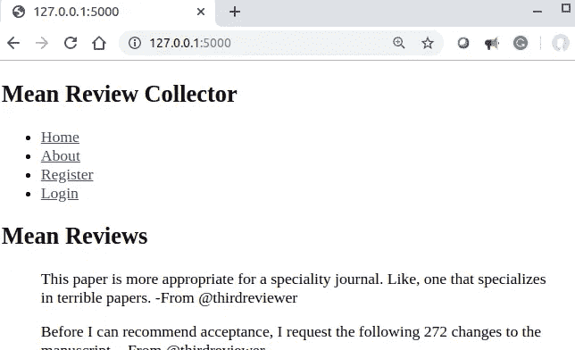
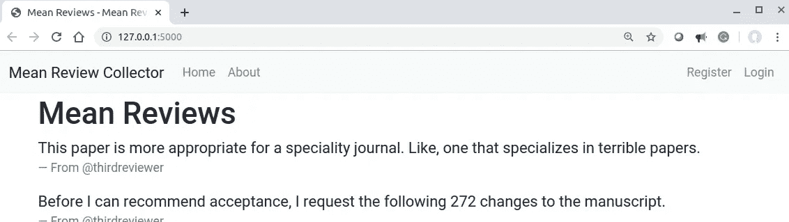
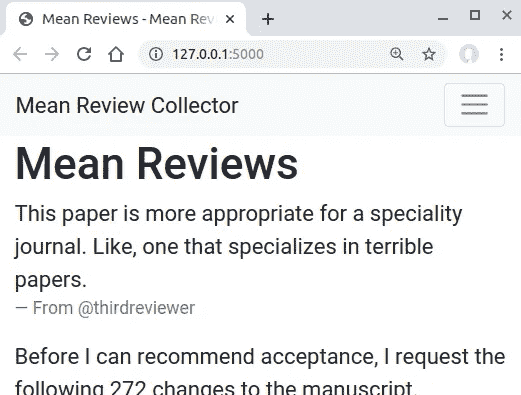

# 构建、测试和部署 Flask 应用程序:第 1 部分

> 原文：<https://betterprogramming.pub/build-test-and-deploy-an-interactive-flask-application-part-i-templates-53a7b0cbe760>

## 烧瓶中的模板


[freestocks.org](https://unsplash.com/@freestocks?utm_source=medium&utm_medium=referral)在 [Unsplash](https://unsplash.com?utm_source=medium&utm_medium=referral) 上拍照

# 关于本教程的元信息

## 学习目标

*   了解 Flask 中的模板

注:本教程是 [*系列*](https://medium.com/@neohao/learn-flask-in-a-scientific-way-baf4d8055f6e) *科学学烧瓶的一部分。*

## 源代码

*   本教程的源代码可以在 [GitHub](https://github.com/Neo-Hao/mean-review-collector) 上获取。
*   该演示可在[https://pacific-fortress-91193.herokuapp.com/](https://pacific-fortress-91193.herokuapp.com/)获得。
*   仅涵盖本教程的版本可在此处访问[。](https://github.com/Neo-Hao/mean-review-collector/tree/816e41c65f77a62eb97ddb0db0377c60771b9304)

# 规划和设计

在开始构建我们的应用程序之前，我们必须制定一个好的计划。我们的应用程序至少需要七页才能工作:

*   主页:展示不同投稿人的平均评论列表。
*   关于页面:介绍我们的服务。
*   404 页面:当访问者请求一个不存在的页面时。
*   注册帐户页面:允许人们注册一个帐户。
*   登录页面:允许用户登录。
*   添加评论页面:允许用户添加评论(需要登录)。
*   更新评论页面:允许用户更新评论(需要登录)。

“添加评论页面”和“更新评论页面”都需要首先进行用户验证。为了简洁起见，我们将在第 1 部分教程中省略这两页。

# 项目设置

这里我们假设你已经安装了 Flask 和 [venv](https://docs.python.org/3/library/venv.html) ，并了解它们的基本用法。如果没有，请先阅读 [*构建并测试一个迷你烧瓶应用*](https://medium.com/better-programming/build-test-and-deploy-a-mini-flask-application-1d9ca6c45115) 。

1.  在 GitHub 上创建一个名为`flask-app`的空存储库，并将其下载到本地环境中(并通过命令行导航到下载的空文件夹)。

```
git clone https://github.com/*your-username*/mean-review-collector
cd mean-review-collector
```

2.在下载的空文件夹中创建虚拟环境:

```
python3 -m venv env
source env/bin/activate
```

# 入门指南

根据我们从 [*构建和测试一个迷你 Flask 应用程序*](https://medium.com/better-programming/build-test-and-deploy-a-mini-flask-application-1d9ca6c45115) 中学到的，我们至少需要两个 Python 文件用于这个应用程序:

*   这是我们应用程序的逻辑所在；应用程序处理所有的路由和查看功能。

```
from flask import Flask, make_responseapp = Flask(__name__)[@app](http://twitter.com/app).route('/')
def home():
    return 'home page'[@app](http://twitter.com/app).route('/about')
def about():
    return 'about page'[@app](http://twitter.com/app).route('/register')
def register():
    return 'register page'[@app](http://twitter.com/app).route('/login')
def login():
    return 'login page'[@app](http://twitter.com/app).route('/<page_name>')
def other_page(page_name):
    response = make_response('The page named %s does not exist.' \
                            % page_name, 404)
    return responseif __name__ == '__main__':
    app.run(debug=True)
```

*   `app.test.py`:这是测试上述路由和查看功能的地方。

```
import unittestfrom app import appclass BasicTestCase(unittest.TestCase):def test_home(self):
        tester = app.test_client(self)
        pages = ['/', 'about', 'register', 'login']
        for page in pages:
            response = tester.get(page, content_type='html/text')
            self.assertEqual(response.status_code, 200)def test_other(self):
        tester = app.test_client(self)
        response = tester.get('test', content_type='html/text')
        self.assertEqual(response.status_code, 404)if __name__ == '__main__':
    unittest.main()
```

即使所有的测试用例都通过了，你也不会在每个页面上呈现出预期的效果(当你通过浏览器检查它们的时候)，而且你也缺少一个导航栏。

要达到这样的效果，你需要 Flask 中模板的帮助。

# 模板

Flask 中的模板是管理表示逻辑的工具。每个模板中的部分内容是 HTML 代码，而另一部分是逻辑(例如，确定是否向未经身份验证的用户显示页面)。

Flask 使用 [Jinja 2](https://jinja.palletsprojects.com/) 作为模板引擎来管理这样的逻辑。最简单的形式，Jinja 2 模板只是一个包含静态 HTML 代码的文件:

```
<h1>Hello world!</h1>
```

在更复杂的形式中，Jinja 2 模板可以只是一个包含 HTML 代码、变量和逻辑以实现各种目的的文件。

例如，下面的代码根据访问者是否经过身份验证呈现不同的文本:

```
  
   <h1>Hello, {{ username }}! </h1>
  
   <h1>Hello, Stranger! </h1>

```

`{{ … }}`包含变量名，如果你需要混合 HTML 和变量(在 Python 代码中)。

``包含逻辑(比如条件执行或者循环)。里面的基本上是 Python 代码，因为 Jinja 2 是纯 Python。这里适用左括号和右括号的概念。

换句话说，每个开口``需要在结束时用另一个``关闭。

对于 Flask 应用程序，所有模板都位于名为“templates”的文件夹下(以便 Flask 将它们识别为模板)。换句话说，当您扩展 Flask 应用程序以包含每个计划页面的模板时，它将具有以下结构:

```
--- app.py
--- app.test.py
--- templates
       --- home.html
       --- about.html
       --- register.html
       --- login.html
       --- 404.html
```

*除了语法，理解模板的可扩展性也很重要。*

同一应用程序的网页可以共享某些元素。例如，我们希望我们的五个页面共享完全相同的导航栏。

在这种情况下，我们可以将公共元素切割出来，放在不同的 HTML 文件(基本文件)中，并让其他 HTML 文件扩展基本文件。

在我们的例子中，我们称这个基础文件为`base.html`,并把它放在 templates 文件夹下。我们的应用程序的结构将是:

```
--- app.py
--- app.test.py
--- templates
       --- home.html
       --- about.html
       --- register.html
       --- login.html
       --- 404.html
       --- base.html
```

基本模板包含:

```
<!doctype html>
<nav>
  <h1>Mean Review Collector</h1>
  <ul>
    <li><a href="{{ url_for('home') }}">Home</a></li>
    <li><a href="{{ url_for('about') }}">About</a></li>
    <li><a href="{{ url_for('register') }}">Register</a></li>
    <li><a href="{{ url_for('login') }}">Login</a></li>
  </ul>
</nav>
<section class="content">
  <header>
    
  </header>
  
</section>
```

`[url_for](https://flask.palletsprojects.com/en/1.1.x/api/#flask.url_for)`是为给定端点生成 URL 的 Flask 方法。

例如，`url_for(‘home’)`将返回主页的 URL。我们的导航栏中有四个链接(目前还没有)，这就是这个文件包含的全部内容。section 块定义了扩展 base 的其他模板应该遵循的结构——既有标题又有内容块。

例如，我们主页的模板将扩展 base:

```

  <h1>Mean Reviews</h1>

  <blockquote>
    This paper is more appropriate for a speciality journal. Like, 
    one that specializes in terrible papers. - From [@thirdreviewer](http://twitter.com/thirdreviewer)
  </blockquote>
  <blockquote>
    Before I can recommend acceptance, I request the following 272 
    changes to the manuscript. - From [@thirdreviewer](http://twitter.com/thirdreviewer)
  </blockquote>
  <blockquote>
    Let me begin by apologizing for being so late with this review – 
    it took me much longer than expected to figure out how best to 
    insult all the authors. - From [@thirdreviewer](http://twitter.com/thirdreviewer)
  </blockquote>

```

第一行``表示扩展名。

以下部分遵循基础模板设置的结构，并填写了三个平均评审。为了呈现这个模板，我们需要更新我们在`app.py`中的代码:

```
from flask import Flask, render_template, make_responseapp = Flask(__name__)[@app](http://twitter.com/app).route('/')
def home():
    return render_template('home.html')// more
```

我们导入了`[render_template](https://flask.palletsprojects.com/en/1.1.x/api/#flask.render_template)`方法，所以我们可以在返回语句中使用它来呈现模板中定义的效果。当此方法采用一个参数时，该参数必须是模板名称。

让我们启动应用程序:

```
python3 app.py
```

你会看到:



其他模板也扩展了基本模板。要查看他们的代码是什么样子，请参考 [GitHub](https://github.com/Neo-Hao/mean-review-collector/tree/6ac5d30e8db109dd75f4f1dd3b5aecd7fe6407c9) 上的这个页面。`app.py`也需要更新:

```
from flask import Flask, render_template, make_responseapp = Flask(__name__)[@app](http://twitter.com/app).route('/')
def home():
    return render_template('home.html')[@app](http://twitter.com/app).route('/about')
def about():
    return render_template('about.html')[@app](http://twitter.com/app).route('/register')
def register():
    return render_template('register.html')[@app](http://twitter.com/app).route('/login')
def login():
    return render_template('login.html')[@app](http://twitter.com/app).route('/<page_name>')
def other_page(page_name):
    response = make_response(render_template('404.html'), 404)
    return responseif __name__ == '__main__':
    app.run(debug=True)
```

到目前为止，我们已经实现了所有的模板和一个功能导航栏(还不是一个酒吧)。我们仍然怀念这个应用程序的风格。

# 添加样式

为了给我们的应用程序添加样式，我们将使用 [Bootstrap](https://getbootstrap.com/) 来代替编写 CSS 文件。

Bootstrap 是 Twitter 的一个开源框架，它可以帮助你创建有吸引力的网页，并且兼容所有现代浏览器。有关引导程序的更多信息，请参见[getbootstrap.com](https://getbootstrap.com/)。

要将引导风格添加到您的基础模板，您只需将以下内容添加到您的基础模板的开头([参见此处的快速入门说明](https://getbootstrap.com/docs/4.3/getting-started/introduction/)):

```
<link rel="stylesheet" href="[https://stackpath.bootstrapcdn.com/bootstrap/4.3.1/css/bootstrap.min.css](https://stackpath.bootstrapcdn.com/bootstrap/4.3.1/css/bootstrap.min.css)" integrity="sha384-ggOyR0iXCbMQv3Xipma34MD+dH/1fQ784/j6cY/iJTQUOhcWr7x9JvoRxT2MZw1T" crossorigin="anonymous">
<script src="[https://code.jquery.com/jquery-3.3.1.slim.min.js](https://code.jquery.com/jquery-3.3.1.slim.min.js)" integrity="sha384-q8i/X+965DzO0rT7abK41JStQIAqVgRVzpbzo5smXKp4YfRvH+8abtTE1Pi6jizo" crossorigin="anonymous"></script>
<script src="[https://cdnjs.cloudflare.com/ajax/libs/popper.js/1.14.7/umd/popper.min.js](https://cdnjs.cloudflare.com/ajax/libs/popper.js/1.14.7/umd/popper.min.js)" integrity="sha384-UO2eT0CpHqdSJQ6hJty5KVphtPhzWj9WO1clHTMGa3JDZwrnQq4sF86dIHNDz0W1" crossorigin="anonymous"></script>
<script src="[https://stackpath.bootstrapcdn.com/bootstrap/4.3.1/js/bootstrap.min.js](https://stackpath.bootstrapcdn.com/bootstrap/4.3.1/js/bootstrap.min.js)" integrity="sha384-JjSmVgyd0p3pXB1rRibZUAYoIIy6OrQ6VrjIEaFf/nJGzIxFDsf4x0xIM+B07jRM" crossorigin="anonymous"></script>
```

之后，您需要对模板文件进行一些更改。例如，第一个报价的 HTML 代码将从:

```
<blockquote>
    This paper is more appropriate ... in terrible papers. -From 
    @thirdreviewer
</blockquote>
```

对此:

```
<blockquote class="blockquote">
    <p class="mb-0">This paper is more appropriate ... in terrible 
                    papers.</p>
    <footer class="blockquote-footer">From @thirdreviewer</footer>
</blockquote>
```

在这里记任何东西都没有意义。你需要做的就是参考[Bootstrap](https://getbootstrap.com/docs/4.0/getting-started/introduction/)的文档，仔细搜索你需要的东西。

在上面的例子中，我搜索了 [blockquotes](https://getbootstrap.com/docs/4.0/content/typography/#blockquotes) 。所有更新模板的代码都可以在 [GitHub](https://github.com/Neo-Hao/mean-review-collector) 上找到。当您再次启动该应用程序时，您将看到:



Bootstrap 使我们的风格适应不同尺寸的屏幕。在手机、平板电脑或更小的屏幕上，我们的应用程序将看起来像:



现在，您已经成功地设计了 Flask 应用程序。别忘了把你的代码推送到 GitHub。

这就完成了我们的第二个教程[科学地学习烧瓶](https://medium.com/@neohao/learn-flask-in-a-scientific-way-baf4d8055f6e)。

# 教程列表

*   [构建并测试迷你烧瓶应用](https://medium.com/@neohao/build-test-and-deploy-a-mini-flask-application-1d9ca6c45115)
*   [构建、测试和部署 Flask 应用程序:第 1 部分—模板](https://medium.com/better-programming/build-test-and-deploy-an-interactive-flask-application-part-i-templates-53a7b0cbe760)
*   [构建、测试和部署 Flask 应用程序:第 2 部分—认证](https://medium.com/better-programming/build-test-and-deploy-a-flask-application-part-2-53f2c8df3ebc)
*   [构建、测试和部署 Flask 应用程序:第 3 部分——应用程序工厂和蓝图](https://medium.com/@neohao/build-test-and-deploy-a-flask-application-part-3-3a2abfe4be21)
*   [构建、测试和部署 Flask 应用程序:第 4 部分——重构测试](https://medium.com/@neohao/build-test-and-deploy-a-flask-application-part-4-5aa4f079fadb)
*   [构建、测试和部署 Flask 应用程序:第 5 部分—认证(续)](https://medium.com/@neohao/build-test-and-deploy-a-flask-application-part-5-4a3c0bc36b8e)
*   构建、测试和部署 Flask 应用程序:第 6 部分——评审系统
*   [构建、测试和部署 Flask 应用程序:第 7 部分——部署](https://medium.com/@neohao/build-test-and-deploy-a-flask-application-part-7-60dde9080330)