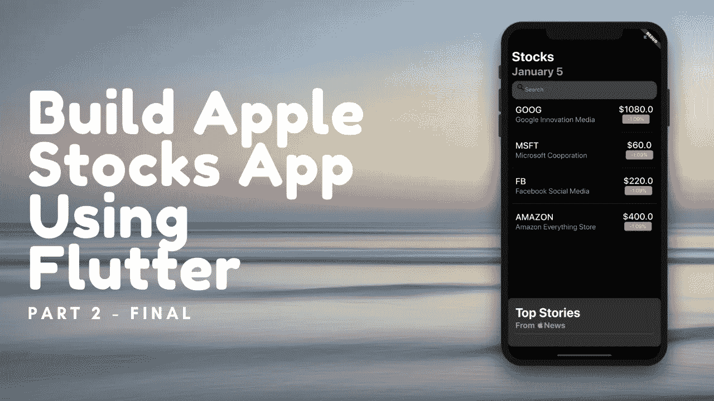
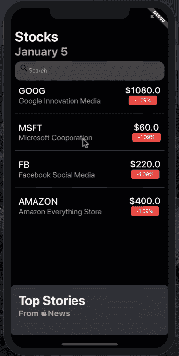

# 使用 Flutter 构建苹果股票应用程序(第 2 部分)

> 原文：<https://betterprogramming.pub/build-the-apple-stocks-app-using-flutter-part-2-b1d4f04f7e4a>

## 跨平台股票报价

在本系列的第一篇文章中，我们介绍了如何在你的 Flutter 应用程序中显示股票。我们创建了一个 JSON API，内置 Node 和 Express，它将虚拟股票返回给 Flutter 应用程序。

在这段代码中，我们将通过在自定义新闻视图中显示新闻来完成股票应用程序。用户还可以使用手势在新闻视图上执行向上滑动和向下滑动操作。

# 更新服务器

我们将首先向我们的[服务器](https://glitch.com/edit/#!/silicon-rhinoceros?path=README.md:1:0)添加一个新的端点，它将负责向用户提供假的 JSON 新闻。实现如下所示:

与股票端点一样，我们只是简单地返回一个文章列表作为硬编码的 JSON 响应。如果你喜欢冒险，你可以试试 NewsAPI.org T21 服务，它可以用来传回实时新闻。

# 使用 Flutter 获取头条新闻

下一步是从 JSON API 获取新闻。这是我们的 HTTP 客户端的责任，由`Webservice`类表示。`getTopNews`功能的实现如下所示:

函数`getTopNews`类似于`getStocks`，它只是使用 URL 来获取数据。稍后，数据被填充到`NewsArticle`模型中。`NewsArticle`模型的实现如下所示:

`NewsArticle`模型由三个属性组成:标题、出版物和 imageURL。`fromJson` 函数作为工厂方法，基于 json 对象创建一个新的`NewsArticle`实例。既然我们的 web 服务和模型已经完成，我们就可以专注于实现视图模型了。

# 实现 NewsArticleViewModel

`NewsArticleViewModel`负责向视图提供新闻数据。`NewsArticleViewModel`的实现如下所示:

`NewsArticleViewModel`接受`NewsArticle`模型作为参数，并公开几个属性来访问与`title`、`publication`和`imageURL`相关的数据。

现在，我们可以更新我们的`StockListViewModel`来添加一个新的`load`函数。这将负责从我们的自定义 API 获取股票和新闻。`load`功能实现如下:

在 load 函数中，我们使用`Future.wait`来等待两个期货的完成。一旦期货完成，它返回与期货相关的值的列表。我们使用数组上的第一个和最后一个辅助函数来访问这些值，最后调用`notifyListeners()`。

# 显示头条新闻

下一步是在视图上显示热门新闻文章。我们实现了一个`NewsList`小部件，它将负责在屏幕上填充新闻。`NewsList`小部件需要三个参数:

*   `articles` —代表要在屏幕上显示的新闻文章
*   `onHeaderTap` —当用户点击标题时触发的回调函数
*   `onDragUpdate` —当用户拖动视图时触发的回调函数

我们没有在`NewsList`视图中处理事件，而是给了父视图机会。这意味着父节点负责传递文章和实现`onHeaderTap`和`onDragUpdate`事件。

下面是`NewsList`小部件的完整实现:

大部分代码用于设置`NewsList`的用户界面。我们还使用了`GestureDetector`来处理触摸事件。`onTap`和`onVerticalDragUpdate`事件被映射到`onHeaderTapped`和`onDragUpdate`闭包，这意味着它们将由父事件处理。

在父视图中，我们使用`AnimatedContainer`来制作拖动动作的动画。

基于拖动的方向，我们扩展和压缩`NewsList` 视图。动画如下所示:

在这个由两部分组成的系列中，您了解了如何在 Flutter 中创建一个 Apple Stocks 应用程序。我们还使用了`MVVM`和`Provider`模式来构建我们的 Flutter 应用程序，这导致了一个更加结构化和可维护的代码库。

[GitHub](https://github.com/azamsharp/AppleStocksFlutter)

# 资源

*   [使用 Flutter Part 1](https://medium.com/better-programming/building-apple-stocks-app-using-flutter-part-1-ea1c7477d58d) 构建苹果股票应用程序
*   [飘起&飞镖——使用 MVVM 设计模式构建应用](https://www.udemy.com/course/flutter-dart-mvvm-design-pattern/?referralCode=3E32698D188E47553501)