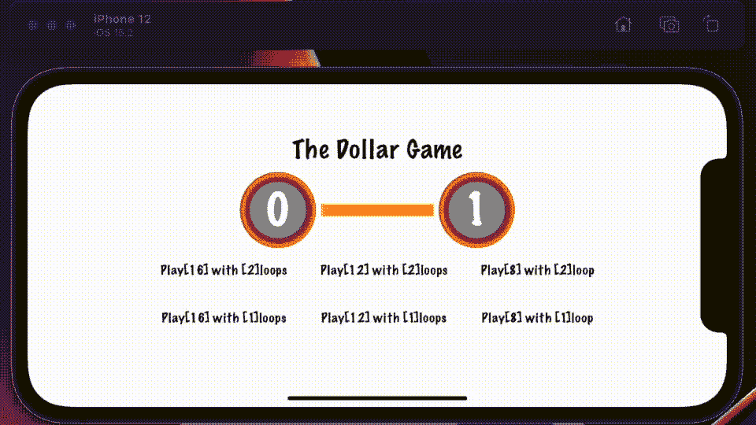
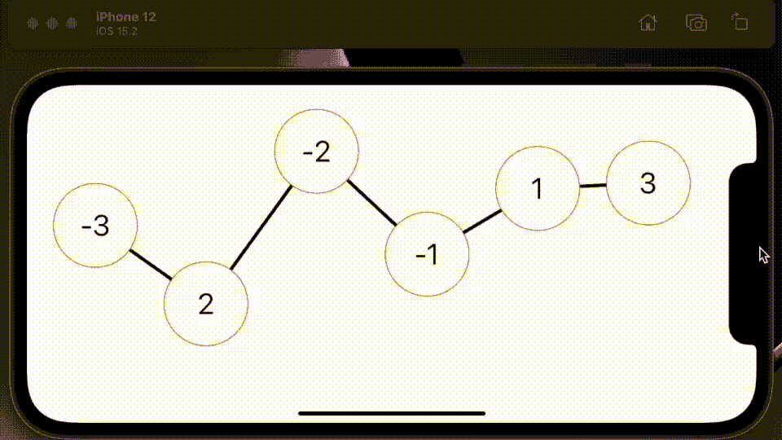
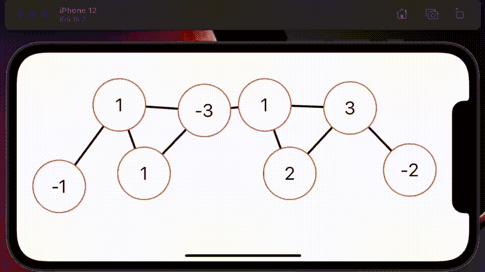
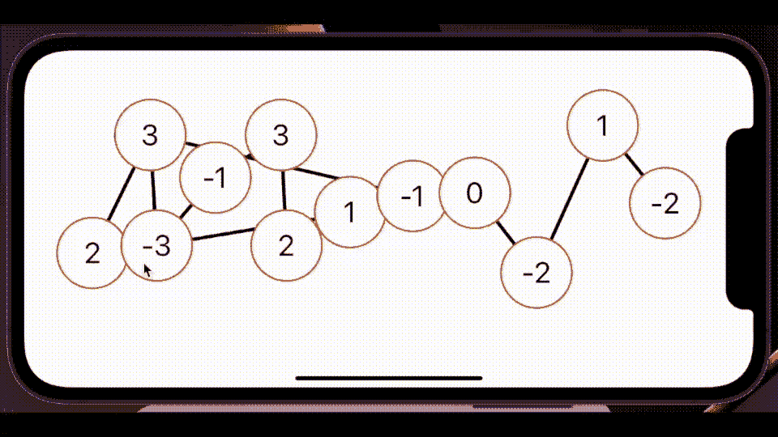

# 使用 SwiftUI 构建美元游戏

> 原文：<https://betterprogramming.pub/build-the-dollar-game-using-swiftui-73f0599727cb>

## 使用图论开发一个简单游戏的 A 到 Z

来自[美元游戏](https://apps.apple.com/app/id1607755511)的截图

如果你在过去几周一直关注我，你会知道我发表了半打关于 Swift 5.5 中并行编程特性的文章，这是一个编码的奥德赛，涵盖了目前编写 Swift 的一些更具挑战性的方面。

但不用担心，因为这篇论文会有趣得多。受这个基于数字的简单游戏的[视频](https://www.youtube.com/watch?v=U33dsEcKgeQ&t=58s)的启发，我想我会试着做一个电子版的。当然，虽然我认为看起来很容易的任务可能是欺骗性的。

## 案情摘要

在美元游戏中，你画一个节点网络。所有节点至少有一个连接，有些是多个连接。每个节点都有一个美元值，有些节点是负的，有些是正的。

这个游戏的目标是确保每个节点至少有零美元。你点击一个节点，与它的邻居分享它的值。共享是一个挑战，因为节点必须与所有直接连接的节点共享其重要性。

## 设计

现在我应该开始说，我不认为 pure SwiftUI 是做这件事的最佳选择——我可以通过使用 SpriteKit 构建游戏来证明这一点。

这里的挑战是建立一个棋盘，一个由节点组成的棋盘——这些节点不重叠并且相互连接。SwiftUI 在一个调整到布局平衡界面的框架内，并不完全适合整个设计范例，这是一项任务。

但是这不是唯一的挑战——因为你需要确保类图，也就是所有节点的总和，也能工作。亏格的等式是节点数+边数+ 1，视频上是这么说的——尽管我不确定我是否理解正确，因为我得到了一个更小的亏格。

## 单曲

最初的重点是建立一个最小功能的游戏。感受一下如何有效地制作界面。我使用了六个节点，彼此之间都只有一个连接。

美元游戏初稿

它工作得相当好，其背后的主要代码库如下所示。它首先为边、节点和值设置网格坐标——几乎所有东西都是硬编码的。然后，它运行几个循环来提取所有内容。

## 一些循环

除此之外，我添加了一些节点和一些循环，最终效果如下。这当然对游戏性有影响，循环使得解决起来更有挑战性。

第二稿美元游戏

但是产生差异的代码并不像我希望的那样好。其中大部分是硬编码的—这一变化意味着您将总是看到相同的节点/边排列。我们可以做得更好。

## 随机解

在这一点上，我后退了一步，重新考虑我的选择。节点的值是一个灌篮；真的，如果我每次都使用相同的值也没关系，只要我把它们混在一起。

秘密在于节点数+边数。所以我重新编码了双连接，使它们变得随机，并增加了节点数。

虽然我还添加了一个显著的区别，那就是重新排列地图上的节点的能力。

美元游戏第三稿

只要看着我重新排列节点，你就可以开始体会到用一个算法来做这件事会非常困难。所有这些都让我想到了这篇文章的结尾。下面是让您入门的最终代码:

我说结束；我并没有完全止步于此——我决定继续构建，并上传一个版本到 app store。您在本文标题中看到的最终版本的快照。除了我在这里描述的以外，我改变了什么？

*   我定制了使用的字体。
*   我定义了一个自定义结构来保存链接，取代了这里使用的数组。
*   我构建了一个入口页面，让您可以选择播放不同大小的网络。
*   我替换了代码中使用的幻数来完成上述工作。
*   我设置了一些基本的来回导航。
*   我添加了一个检查来查看您何时解决了网格问题——以及一个警告。

然后，我在 iTunes 中设置了它，包括截图和描述，并提交给审查。仅用了 24 小时就获得了批准，当你读到这篇文章时，它已经在商店里了；[这里是](https://apps.apple.com/app/thedollargame/id1607755511)(app store 的链接)。

这也正是我在这篇论文的结尾。获得灵感——编写自己的游戏并上传到应用商店。