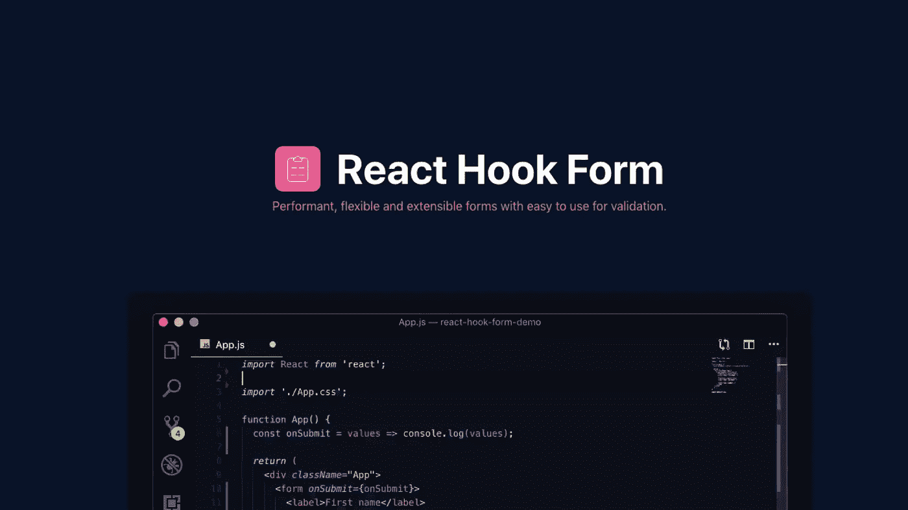

# 用 React Hooks 表单构建下一代表单

> 原文：<https://betterprogramming.pub/build-the-next-generation-of-forms-with-react-hooks-forms-b4f2039e51c1>

## 高性能、灵活、可扩展的表单，易于使用 React 钩子进行验证



# 为什么不是其他的 React 库形式？

这真的很简单，有很多好的理由:

1.  性能很重要，封装尺寸也很重要。这是一个没有任何依赖关系的小型库。
2.  减少了处理表单的代码，由于挂钩而降低了复杂性。你可以在这里找到完整的代码对比[。](https://react-hook-form.com/)
3.  最大限度地减少重新渲染的次数，加快装载速度，努力提供最佳用户体验。比其他封装如 [Formik](https://jaredpalmer.com/formik/) 或 [Redux Form](https://redux-form.com/) 少二十倍。
4.  易于采用由于表单状态本身是本地的，所以它可以在没有其他依赖的情况下被容易地采用。

# 装置

安装[反应钩形式](https://react-hook-form.com/)只需要一个单一的命令，你就可以开始了。如果您正在使用 [npm](https://www.npmjs.com/) :

```
npm install react-hook-form
```

或者，如果你正在使用[纱线](https://yarnpkg.com/):

```
yarn add react-hook-form
```

# 基本用法

下面的代码将演示基本用法。

使用的主要组件是带有返回函数和变量的`useForm`钩子:

*   `register`:将字段连接到规则或验证函数。
*   `handleSubmit`:发送提交前检查并验证所有字段。
*   `watch`:这将观察指定的输入并返回它们的值。
*   `errors`:包含属于每个输入的表单错误或错误消息。

# 寄存器字段

每个字段都需要一个特定的唯一名称，您也将使用这个名称作为标签，然后您将把`register`钩子传递给`ref`元素。

在它内部，您将传递多个参数。 *Required* 需要告诉用户是否必须输入该字段，然后你将能够轻松地使用其他标准的 HTML 规则。

以下是支持的验证规则列表:

*   `required`
*   `min`
*   `max`
*   `minLength`
*   `maxLength`
*   `pattern`
*   `validate`

[validate](https://react-hook-form.com/api#register) 函数是使用特定于该字段的定制逻辑的好方法，使您能够非常容易地实现定制行为。

```
<input
  name="single"
  ref={
    register({
      validate: (value) => value === '1'
    })
  }
/>
```

# 处理字段错误

React Hook 表单提供了一个`errors`对象来显示表单中与每个唯一字段相关的错误。

# 拖放生成器

你可以在 [React Hook 表单网站](https://react-hook-form.com/form-builder)用自动生成的代码构建自己的表单。

您将能够使用拖放来重新安排、删除和编辑每个字段，从而开始使用这个不可思议的插件，而无需阅读任何文档，只需复制代码。

您可以在不到一分钟的时间内轻松构建一个这样的表单！

# 如果你想了解更多关于钩子的知识

当我开始使用钩子的时候，我亲自阅读了**"**[**Learn React Hooks**](https://amzn.to/2Y8hoX9)**"**，它帮助我理解了它们如何使用工具，例如 useForm:[https://amzn.to/2Y8hoX9](https://amzn.to/2Y8hoX9)

# 参考资料和资源

*   [https://react-hook-form.com/](https://react-hook-form.com/)
*   [https://github.com/react-hook-form/react-hook-form](https://github.com/react-hook-form/react-hook-form)
*   [https://react-hook-form.com/api#register](https://react-hook-form.com/api#register)
*   【https://amzn.to/2Y8hoX9】