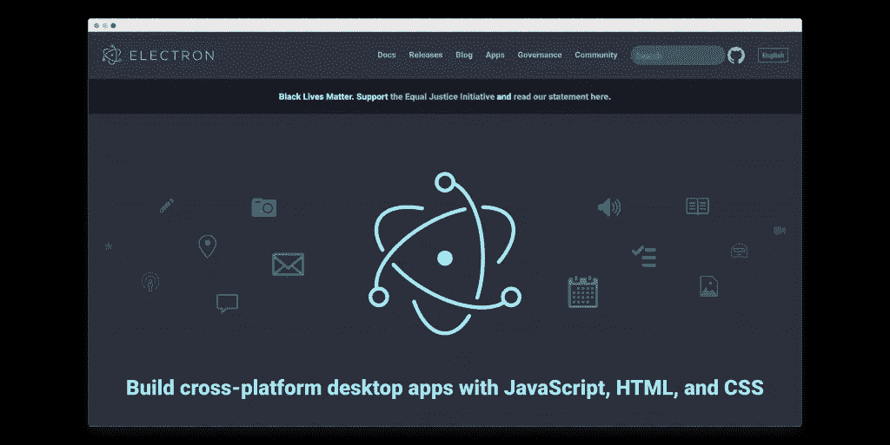
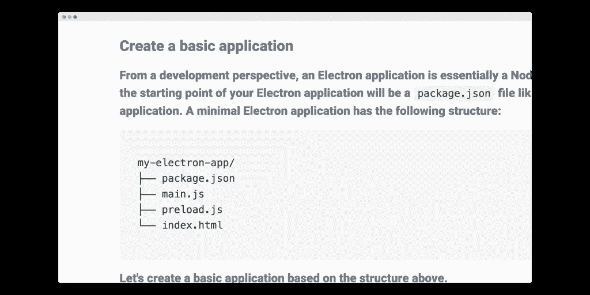
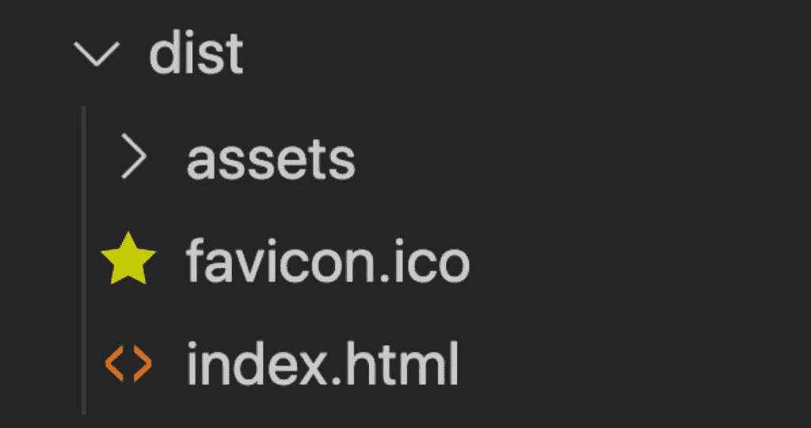
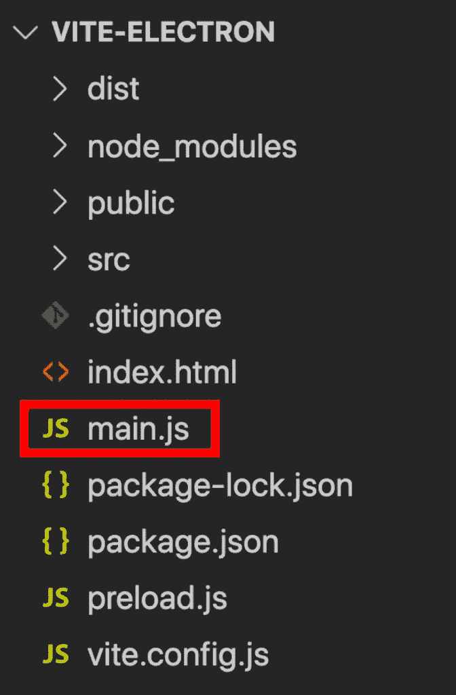
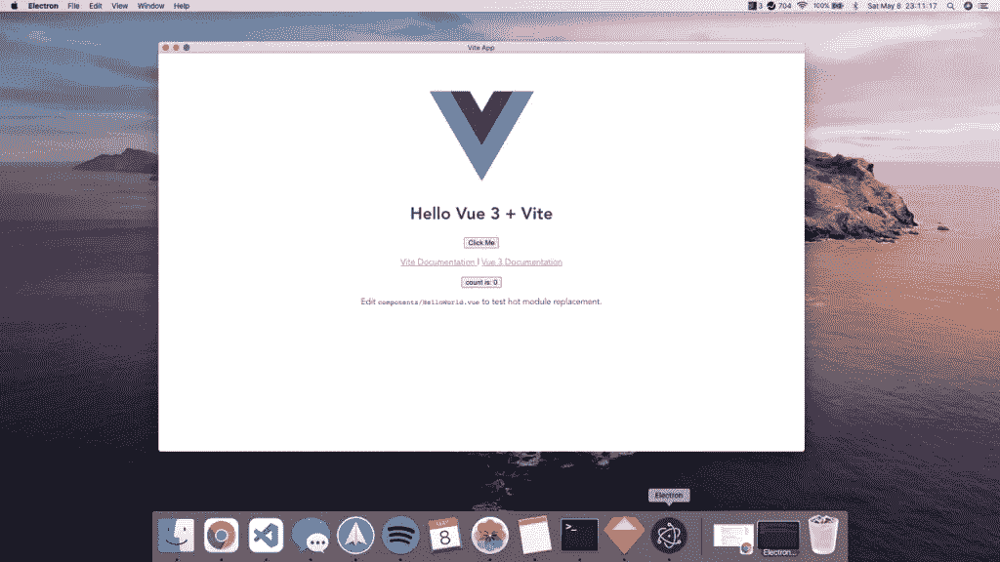

# 只需 5 分钟即可构建 Vue 3 桌面应用

> 原文：<https://betterprogramming.pub/build-vue-3-desktop-apps-in-just-5-minutes-vite-electron-quick-start-guide-804dfc53b30a>

## Vite +电子快速入门指南


照片由[黑脸田鸡·萨加诺](https://unsplash.com/@sorasagano?utm_source=medium&utm_medium=referral)在 [Unsplash](https://unsplash.com?utm_source=medium&utm_medium=referral) 上拍摄。

嘿，德夫斯！

在这篇文章中，我们将看看如何从一个 [Vite](https://vitejs.dev/) 应用程序构建一个 Vue 3 桌面项目。

为此，我们将使用[Electron](https://www.electronjs.org/)——用 JavaScript 构建跨平台桌面应用最流行的框架之一。很多流行的应用程序都使用 Electron，比如 VS Code、Slack、Twitch 等等。



照片来自[电子](https://www.electronjs.org/)。

让我们先快速浏览一下我们将在本教程中做什么:


这只是 Vite starter 模板，但它在自己的专用应用程序中，而不是在我们的浏览器中。这是一个超级酷的步骤，也是构建自己的桌面应用程序的必要步骤。

好吧，让我们直接进入代码。

# 创建我们的基本 Vite 应用程序

首先，让我们制作我们的 Vite 应用程序。关于 Vite 是如何工作的，我不打算讲太多细节。基本上，让我们到我们的终端运行:

```
npm init @vitejs/app 
cd [project-name] 
npm install
```

让我们首先在浏览器中尝试一下。

在我们的终端中，我们只需运行一个普通的`npm run dev`，获取我们的本地主机 URL，并加载它。

那就是 Vite 入门模板！

完美。现在是时候给这个装置添加电子了。

# 向我们的 Vite 项目添加电子

对于这个快速入门指南，我们将松散地遵循官方文档中的 [Electron 自己的快速入门指南](https://www.electronjs.org/docs/tutorial/quick-start)——并稍微调整它以在我们的 Vite 应用程序中工作。

我们要做的第一件事实际上是安装电子设备，因此让我们前往终端并这样做:

```
npm install --save-dev electron
```

接下来，我们再快速浏览一下电子指南。据说一个简单的电子装置需要四个主要文件:



照片来自[电子](https://www.electronjs.org/docs/tutorial/quick-start)。

起初，看起来我们已经有了`main.js`和`index.html` 文件，但是这些是我们在 Vite 中需要的——而不是在 electronic 中需要的。Vite 文件用于运行我们的 Vite 应用程序。我们需要为我们的应用程序单独的电子文件。

`main.js`将创建我们的桌面应用程序，并在`index.html`中加载，这将有我们建立的 Vite 应用程序。

# 构建我们的 Vite 应用程序

所以首先，我们必须建立我们的 Vite 应用程序。因为我们在处理电子，我们必须做一点额外的配置。

我们希望确保在构建项目时，所有对最终 JavaScript 和 CSS 文件的引用都指向正确的路径。

构建我们的 Vite 项目会创建一个具有以下结构的`dist`文件夹:



但是因为我们的电子代码在我们的根目录中，我们想把我们整个项目的基础设置为这个`dist`文件夹。我们可以通过使用`path`库并在我们的`vite.config.js`文件中设置`base`属性来做到这一点:

现在我们可以在终端中运行`npm run build`来创建我们自己的`dist`文件夹！

完美。

# 设置我们的电子主页

下一步是在根目录下创建我们的`main.js`文件。



一旦创建完成，我们就可以从[电子快速入门指南](https://www.electronjs.org/docs/tutorial/quick-start#create-the-main-script-file)中复制并粘贴代码！

不过，我们必须做一个改变。

在我们加载`index.html` 文件的地方，我们所要做的就是把它改成`dist/index.html`，这样我们就可以使用`dist`文件夹中的文件了。

因此`main.js` 中的最终代码将如下所示:

# 制作 preload.js

接下来，让我们在根目录下创建我们的`preload.js`文件。同样，我们可以使用[快速启动代码](https://www.electronjs.org/docs/tutorial/quick-start#define-a-preload-script)。但是这一次，我们不需要改变什么:

# 修改 package.json

好了，快到了。我们要做的最后一件事是对我们的`package.json`文件做一些修改，这样我们就可以实际运行我们的一些电子命令。

首先，我们必须设置`main`属性。默认情况下，Electron 将在根目录中寻找一个`index.js`文件来启动我们的应用程序，但是由于我们的文件被称为`main.js`，我们只需在我们的`package.json`中定义它:

```
{ 
  "name": "vite-electron", 
  "version": "0.0.0", 
  "main": "main.js", // this line 
  ... 
}
```

我们要做的最后一件事实际上是创建一个运行电子的方法，所以在`scripts`部分，让我们创建一个运行`electron .`的新脚本`electron:start`:

这就是构建基本电子应用程序的所有代码。

我们现在要做的就是去我们的终端，说`npm run electron:start`，我们就有了我们的桌面应用！太神奇了！



# 结论

很明显，这只是一个快速入门指南，让你在 Vite 中有一个基本的电子设置。

如果你想看更多的 Vite +电子教程，请在回复中告诉我，因为我喜欢教你觉得有趣的东西。如果你们中有足够多的人感兴趣，也许我会开始一个系列，我们一起构建一个大型的 Vue 桌面应用程序。

但在那之前，祝编码快乐！

*原载于 2021 年 5 月 9 日 https://learnvue.co**[*。*](https://learnvue.co/2021/05/build-vue-3-desktop-apps-in-just-5-minutes-vite-electron-quick-start-guide/)*