# 使用 Directus、MDX 和 Next.js 按需 ISR 构建您的博客应用程序

> 原文：<https://betterprogramming.pub/build-your-blog-app-with-directus-mdx-and-next-js-on-demand-isr-54bc14a34a28>

## 在自己的网站上显示博客文章和内容

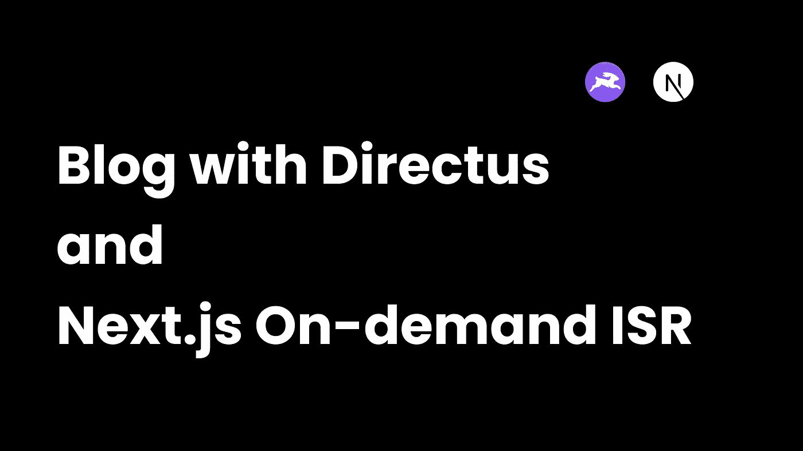

有很多无头 CMS 和其他工具可以让我们轻松快捷地写博客。今天我们来看看如何用 Directus 和 Next.js 建立一个博客

我们将使用 [MDX](https://mdxjs.com/) 在 Directus 中存储我们的博客内容。我们还将使用 [Next.js 的按需增量静态再生功能](https://nextjs.org/docs/basic-features/data-fetching/incremental-static-regeneration#on-demand-revalidation-beta)，它让我们可以在不触发重新构建的情况下添加或更新网站内容。

## 演示

注意，从现在开始，增量静态再生将被称为 ISR

# 为什么按需 ISR 优于常规 ISR？

Next.js 支持 ISR 已经有几年了，但按需 ISR 使它变得更好。以前，我们会用缓存数据的秒数指定一个`revalidate`属性。这有几个缺点-

*   即使服务器中的数据没有改变，缓存也会定期失效。这也会导致不必要的 API 调用。
*   通常，提供的内容是陈旧的。

按需 ISR 解决了常规 ISR 的上述两个问题。这是通过 webhooks 触发缓存重新验证来实现的。因此，每当服务器(或 CMS)上的内容更新时，就会触发一个 webhook 事件，这将创建或更新所需的静态页面

# 设置 Directus 项目

虽然 Directus 可以自托管，但它有一个免费的云产品。如果你还没有注册一个帐户，那就去注册吧。单击仪表板中的“创建项目”(在入职流程中可能会提示您创建一个项目)，并为您的项目命名。在“基础设施”下，选择“社区云”，在“起始模板”下，选择“空项目”。现在点击“创建项目”,在 2 分钟内，它应该被创建。

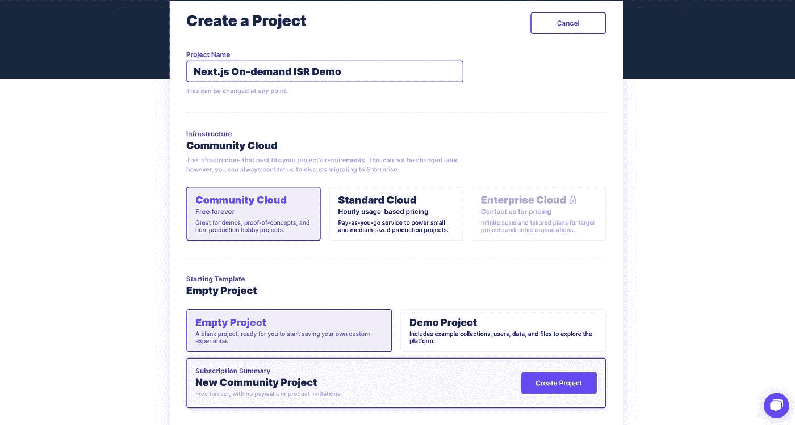

创建项目后，在仪表板上单击它，然后单击“打开项目”。在这里，在登录屏幕上，输入已经发送到与您的 Directus 帐户关联的电子邮件地址的凭据。

# 设置我们的博客收藏

对，Directus，应该说没有集合。让我们创建一个名为“博客”的集合。点击右上角的箭头，检查“状态”、“创建日期”和“更新日期”。我们稍后将添加更多的字段。现在单击复选标记，我们应该能够看到我们的集合的模式-

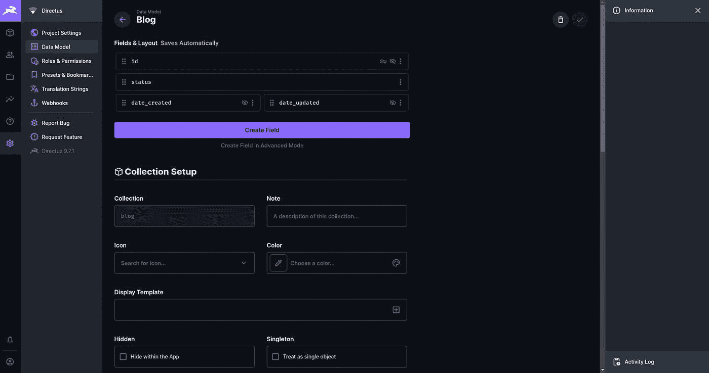

让我们再添加几个字段。创建一个名为“Input”的类型，并给它一个“title”键。将其设为必填项，然后点击保存。

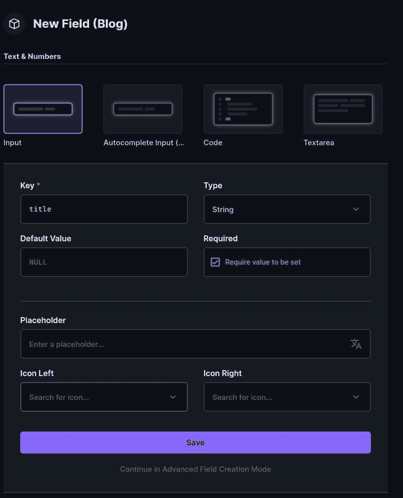

再添加一个类型为“Markdown”的字段，并给它一个键“content”。使其成为必填项，然后点击保存。

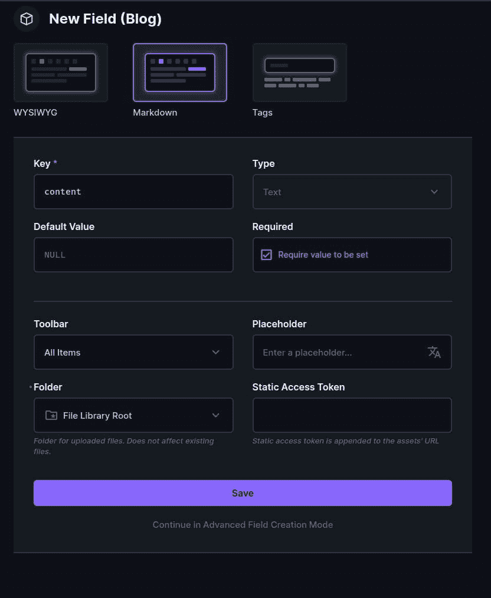

我们还需要为我们的博客帖子添加一个 slug。使用“输入”类型和“slug”键创建一个新字段，并使其成为必填字段。现在单击“在高级字段创建模式下继续”。在“Interface”下，选中“Slugify”选项，然后单击复选标记创建该字段。

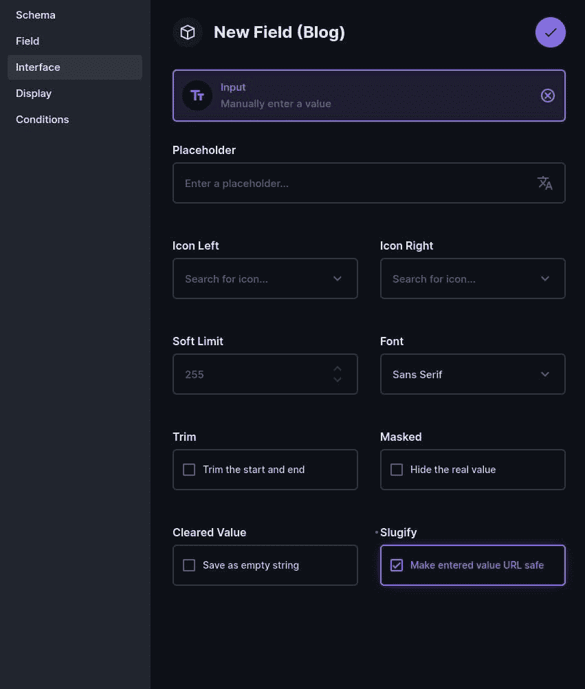

# 添加一些示例数据

在 Directus 中添加内容极其容易！转到侧边栏中的 content 选项卡(第一个带有 3d 框图标的选项卡)并选择 Blog collection。现在点击“创建项目”。在这里添加一个标题和一些内容和一段文字。此外，请确保将状态更改为“已发布”。我们稍后将使用这个状态来管理 API 访问。请注意，您可以在这里使用 markdown。添加完内容后，单击复选标记保存它。

# 为我们的 API 设置权限

转到侧边栏上的设置选项卡，然后在设置导航中单击“角色与权限”。接下来，点击“公开”

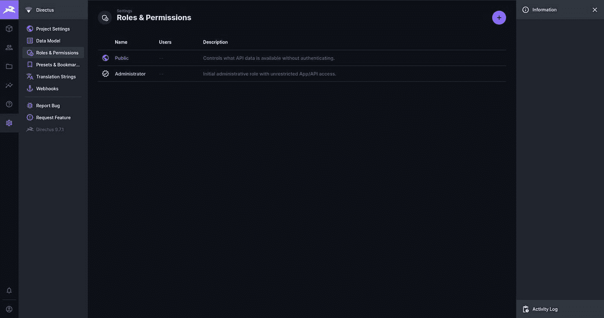

在这里我们可以看到我们的博客收藏。单击眼睛下方的红色“不允许”标志(这表示允许查看)。在下拉列表中，选择“使用自定义”。

取消“项目权限”，添加以下规则，仅允许公众查看已发布的项目-

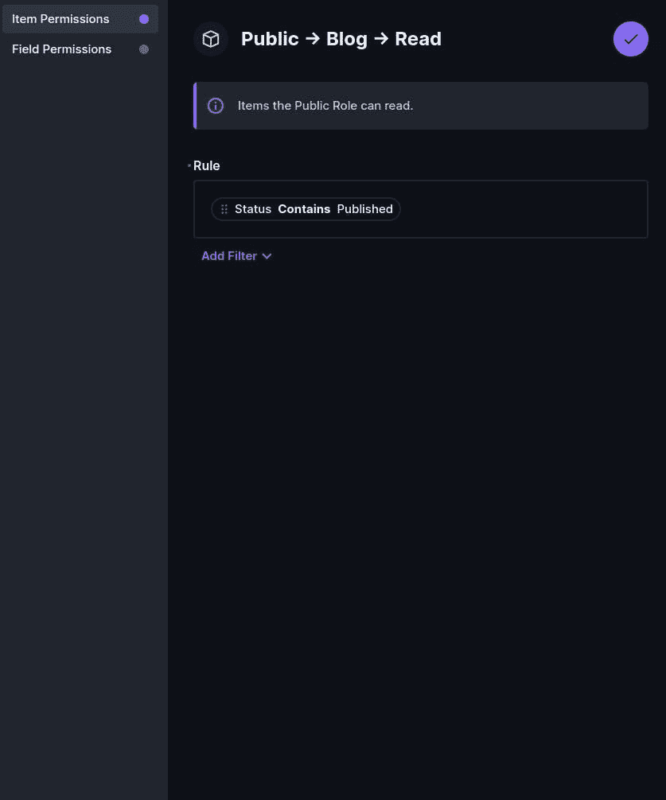

在“字段权限”下，选择“全部”,然后单击复选标记保存权限。

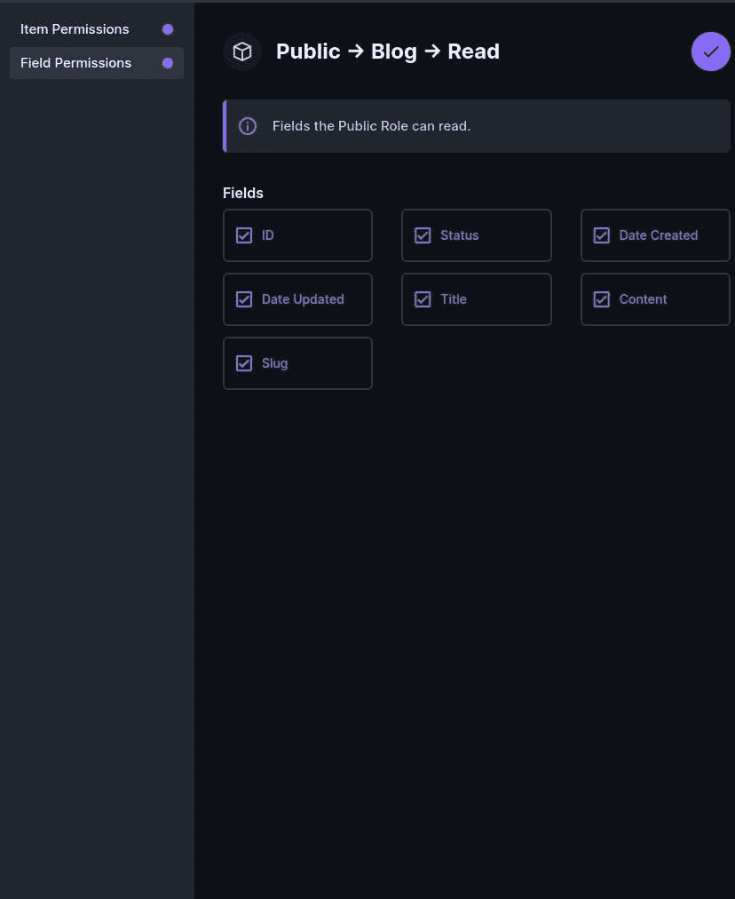

# 用 Next.js 和 Directus 创建博客

让我们从创建一个新的 Next.js 应用程序开始

```
npx create-next-app nextjs-directus-on-demand-isr
# OR
yarn create next-app nextjs-directus-on-demand-isr
```

创建完成后，在您喜欢的代码编辑器中打开项目。

接下来，安装 Directus JS SDK -

```
npm install @directus/sdk
# OR
yarn add @directus/sdk
```

现在，创建一个名为`lib/directus.js`的文件，并添加以下代码

在这里，我们用 Directus 后端的 URL 初始化 SDK。我们必须将这个 URL 设置为环境变量。继续创建一个名为`.env.local`的新文件并添加环境变量-

```
DIRECTUS_URL = <PATH_TO_YOUR_DIRECTUS_INSTANCE_WITHOUT_ANY_OF_THE_PATHS>
```

确保用您的实例的 URL 来适当地替换 URL。

现在，打开`pages/index.js`文件，用下面的代码替换它

在这里，我们获取所有的博客文章，但只有标题、slug 和 id 字段。我们在`getStaticProps`中这样做，并将数据作为道具传递给客户端。因此，获取是在服务器环境中完成的，只是在构建时。(注意，在开发环境中，`getStaticProps`在每个请求上运行)

在本文的后面，我们将看到当 webhook 被触发时将运行`getStaticProps`的按需 ISR。

一旦你运行`yarn dev`并在浏览器上打开 https://localhost:3000，你应该能够看到你的博客文章-

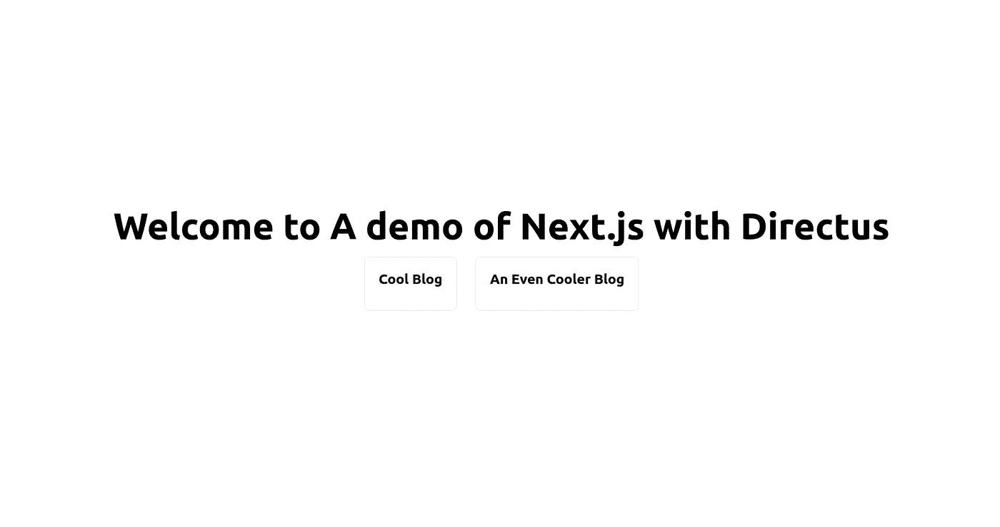

现在，如果我们单击博客帖子卡片，它会将我们带到 404，因为我们还没有设置我们的博客帖子页面。让我们现在就这样做。

创建一个新文件`pages/[slug].js`并添加以下代码

在这里，在`getStaticPaths`中，我们只获取所有博客文章的片段。然后我们映射它并创建一个参数数组，让 Next.js 知道存在的路径。最后，我们将`fallback`设置为`false`，这样任何不在路径数组中的路径都会重定向到 404。

在`getStaticProps`中，我们通过`slug`字段进行过滤。我们还特别要求只有`title`和`content`字段。

最后，我们通过 props 传入数据，并在客户端呈现出来。

此外，我们可以为这个页面添加一些 CSS。创建一个名为`styles/BlogPost.modules.css`的新文件，并在其中添加以下内容

现在，如果我们看到我们的博客文章页面，我们会看到内容呈现为字符串，而不是被解析为 markdown -


让我们解决这个问题

# 呈现内容的 MDX

尽管 MDX 支持更高级的特性，比如呈现 React 组件的能力，但我们不打算在本文中讨论这个问题。然而，让我们专注于解析 markdown 和呈现必要的 HTML。

在本教程中，我们将使用`[next-mdx-remote](https://github.com/hashicorp/next-mdx-remote)`。让我们安装它-

```
npm install next-mdx-remote
# OR
yarn add next-mdx-remote
```

现在，用以下代码替换`pages/[slug].js`中的代码

现在，如果我们导航到一篇博客文章，我们可以看到渲染的降价-


# 结合 Directus 使用 Next.js 按需 ISR

如果我们构建 Next.js 应用程序并提供生产版本，然后在 Directus 中进行更改，除非我们重新构建，否则这些更改不会反映在我们的网站中。我们有三个选择-

*   每次添加/更新/删除内容时触发新版本
*   使用常规 ISR，并指定缓存应保留的时间
*   使用按需 ISR 仅在需要时重建特定页面

对于第一种选择，它可能既昂贵又耗时。在许多情况下，重建也会使所有页面的缓存失效。当您处理较大的网站时，这可能会导致问题。

对于第二个选项，将会有对我们的服务器的不必要的 API 调用，并且数据可能是陈旧的。

这给我们留下了第三种选择。虽然设置它比其他两种方法稍微复杂一些，但是它没有其他两种方法的缺点。而且，我将向您展示如何准确地设置它，所以它应该不会很难:)

**注意:**目前该网站托管在本地，但 Directus 需要一个可公开访问的 URL 作为 webhook。你可以在某个地方托管它，然后测试它，或者使用类似于 [Ngrok](https://ngrok.com/) 的东西启动一个本地隧道

在`pages/api/revalidate.js`下创建一个新文件，并添加以下代码

这是一个简单的 Next.js API 路径。

首先，我们检查`x-webhook-secret`头，并将其与一个预设的 webhook 秘密进行比较，该秘密被设置为一个环境变量。我们应该始终使用 webhook 秘密来防止垃圾邮件。在某些情况下，这也可能是一个安全风险(但这里不是，因为我们不依赖作为事件有效负载发送的数据作为输入)。

Directus 向我们发送了一些事件负载，我们正在析构集合字段，该字段包含进行了更改的集合的名称。我们检查这是否是博客集合，然后继续重新验证页面。虽然这在这里没有多大意义，但是如果我们的页面有多组可以重新验证的页面，我们可以明确地只重新验证一组页面，而不是所有的页面。(例如，如果有一个登录，然后有一个博客页面，对于登录集合的更改，我们可以只重新验证登录页面，但是对于博客页面的更改，我们可以只重新验证特定的博客页面和博客索引)。

现在，事件有效负载不包含博客文章的 slug，但是它有 id。我们使用 Directus SDK 获取与该 id 对应的 slug，然后重新验证该 slug 页面和主页(因为它有博客索引)。

最后，打开`.env.local`文件并添加`REVALIDATE_SECRET`环境变量。对于值，它可以是随机字符串。最简单的方法是使用以下命令的输出-

```
openssl rand -base64 32
```

为了测试这一点，我们不能使用开发环境，因为`getStaticProps`会在每次对开发环境发出请求时运行。要么用`npm run build`或`yarn build`建立站点，用`npm run start`或`yarn start`本地服务，然后使用 Ngrok 等本地隧道解决方案，要么部署到 [Vercel](https://vercel.com/) 等托管平台。

现在转到您的 Directus 实例，并转到设置选项卡。现在点击侧面导航栏中的“Webhooks”并创建一个新的。给它一个名称，并为 URL 字段添加您的 Ngrok URL 或您的托管实例。确保废料是`/api/revalidate`。URL 应该类似于`https://<my-domain>/api/revalidate`。确保状态设置为“有效”,并且选中“发送事件数据”复选框。

现在，添加一个名为`x-webhook-secret`的头，其中包含您之前创建的秘密的值，并将其设置为一个环境变量。在“触发器”下，检查所有操作和博客收藏。现在单击复选标记保存它。这是我看到的样子-

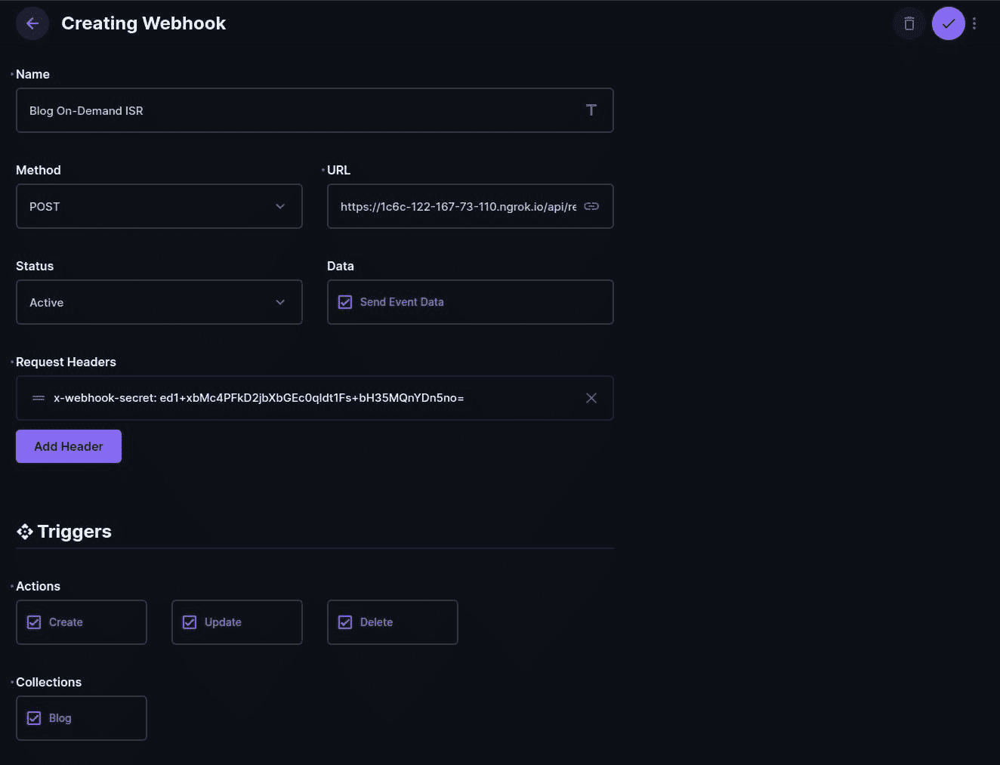

# 结论

已经很多了！让我们回顾一下我们做过的事情-

*   首先，我们在 Directus 中创建了一个项目，并为我们的博客文章创建了一个模式
*   我们创建了一个 Next.js 应用程序，并添加了 Directus SDK
*   我们在主页上显示我们的博客文章，并在自己的页面上显示文章内容
*   我们使用`next-mdx-remote`来渲染降价
*   我们使用 Next.js 按需 ISR 在任何需要的时候重新验证缓存

希望你喜欢这个教程。

下次博客见。

*原发布于*[*https://blog . anishde . dev*](https://blog.anishde.dev/making-a-blog-with-directus-mdx-and-nextjs-on-demand-isr)*。*