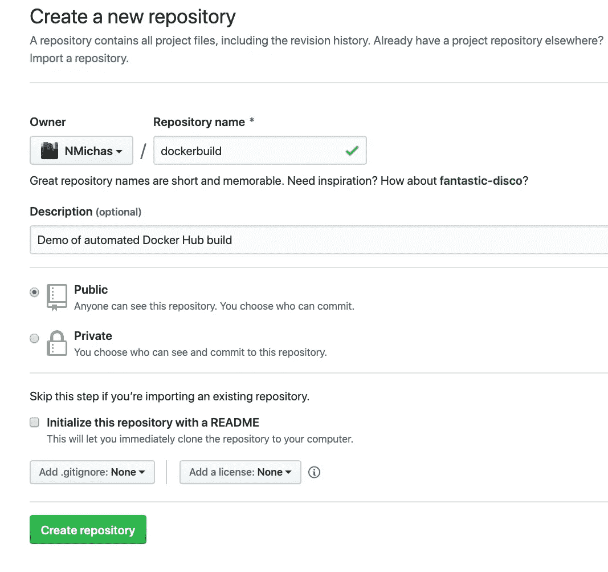
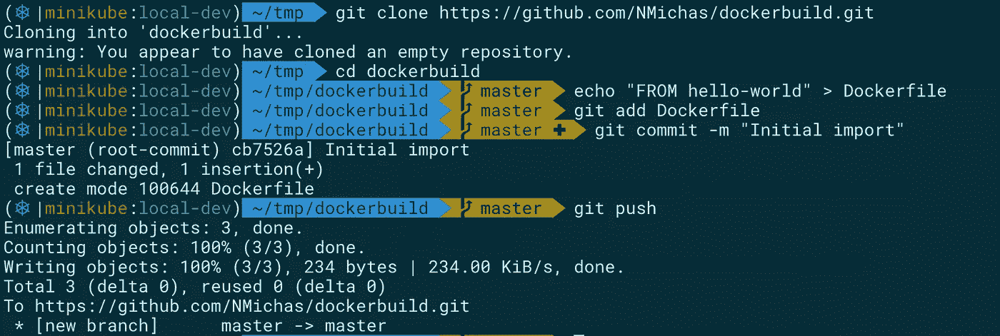
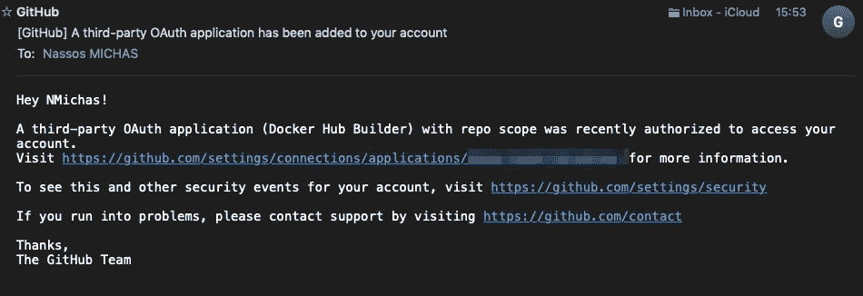
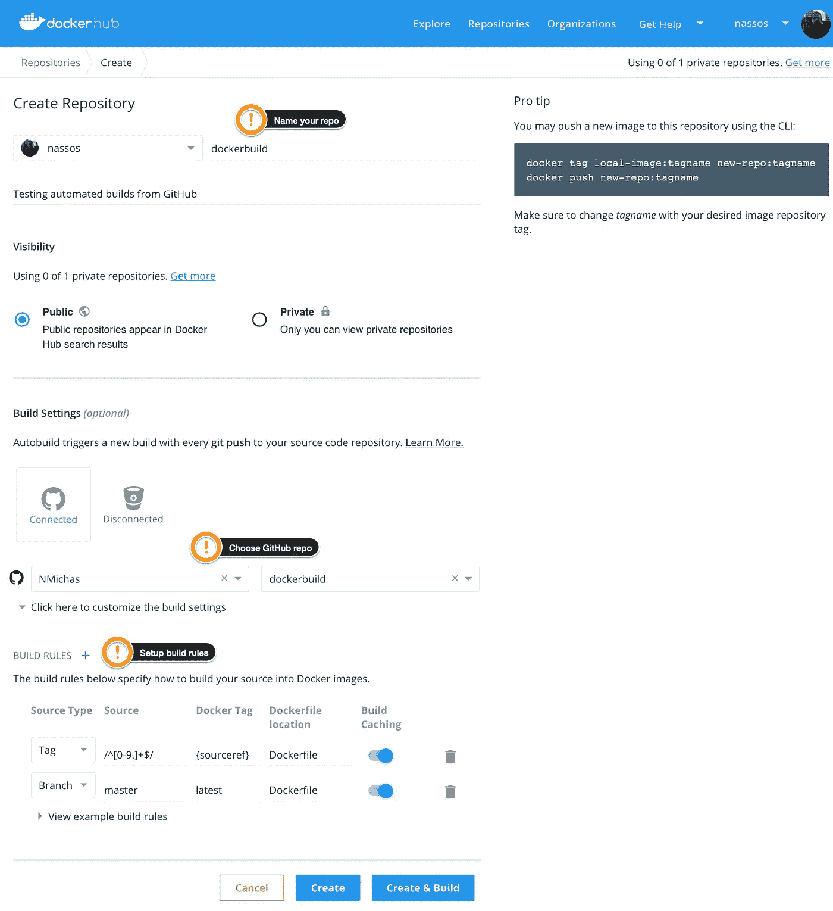
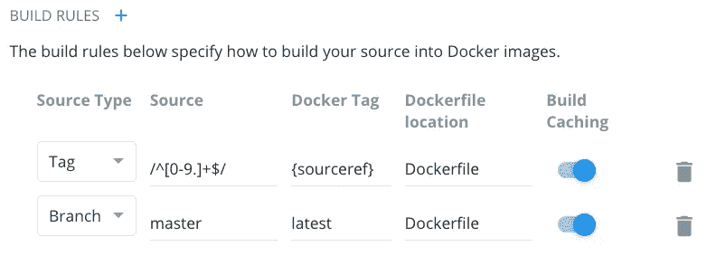
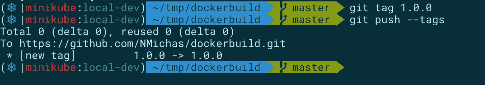
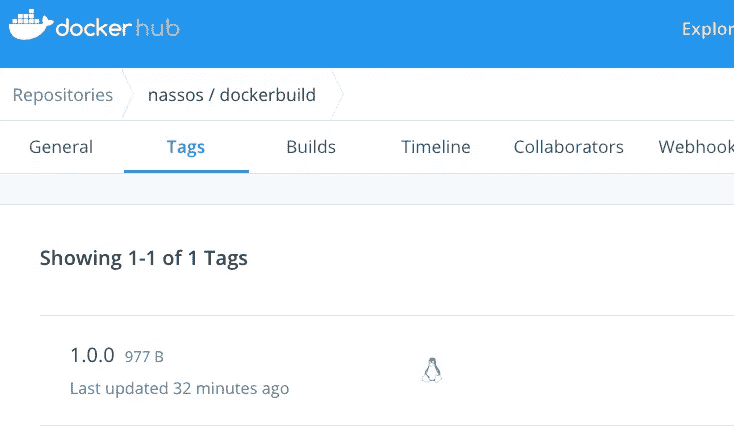
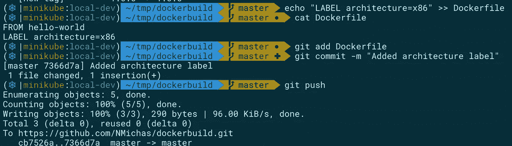
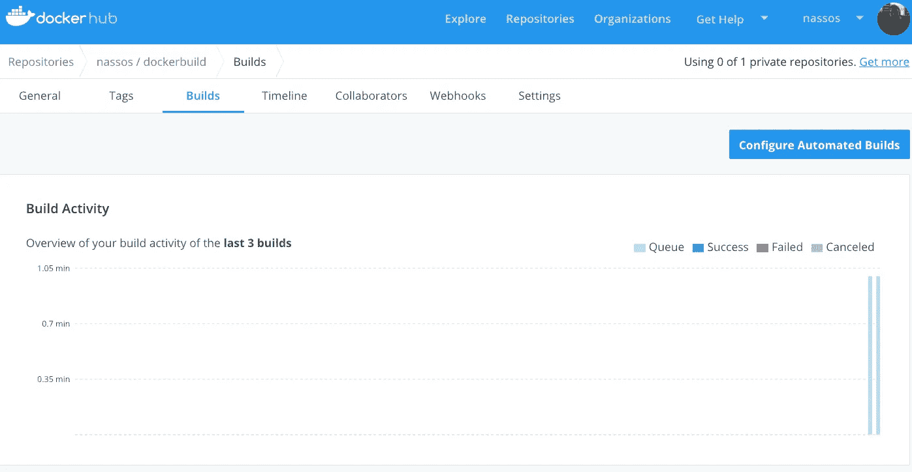
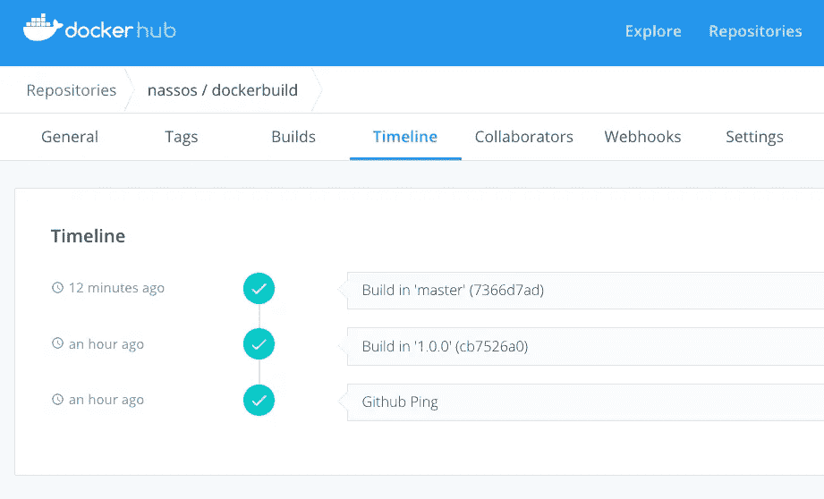

# 当你在 GitHub 上推送时，自动构建你的 Docker 图像

> 原文：<https://betterprogramming.pub/build-your-docker-images-automatically-when-you-push-on-github-18e80ece76af>

## 实现 Docker Hub 和 GitHub 的集成

[*Docker Hub*](https://hub.docker.com) *与*[*GitHub*](https://github.com)*(以及*[*bit bucket*](https://bitbucket.org)*)集成，允许您在推送新代码时自动构建容器的映像。您的映像的标记可以从您的存储库的标记(或分支)中提取，并且可以执行自动化测试，以确保您的映像在可供下载之前按预期构建。在这篇文章中，我将向你展示如何快速建立这样一个工作流程。*

# 创建你的 GitHub Repo 并添加一个`Dockerfile`

显然，第一步是在 GitHub 上设置您的存储库:

创建公共 GitHub 库

接下来，在本地克隆您的新存储库，添加一个示例`Dockerfile`，并将更改推回到存储库:

将默认的`Dockerfile`添加到您的存储库中

如你所见，我们创建的`Dockerfile`非常简单——仅仅使用了官方的`hello-world`图片。

# 在 Docker Hub 上实现自动化构建

要启用自动构建，您需要将您的 Docker Hub 帐户与您在 GitHub 上的帐户连接。登录 Docker Hub，进入*账户设置>关联账户*。向下滚动找到 *GitHub* 并点击*连接*链接。您将通过通常的 OAuth 流程登录 GitHub(如果尚未登录)并授权 Docker 访问您的 GitHub 库。如果一切顺利，您应该会收到来自 GitHub 的通知:

成功连接 Docker Hub 和 GitHub

现在是时候创建 Docker Hub 资源库并将其链接到您的 GitHub 资源库了:

使用 GitHub access 创建 Docker Hub 存储库

这里发生了一些事情，让我们来分解一下:

*   **给你的回购命名**
    这里不多说，只是用一个有意义的名字。我选择了与我的 GitHub 库相同的名字。
*   **选择 GitHub repo** 选择您在上一步中创建的存储库。
*   **设置建造规则**
    真正有趣的部分来了。因为代码可以在任何时候被推送，所以您应该让 Docker Hub 知道您映像应该在什么时候构建，以及哪个标签应该将该映像分配给它。您可以使用*构建规则*来配置这两者。

现在只需点击 *Create* (不要点击 *Create & Build* ，因为这将触发手动构建)。

# 建立规则

要让 Docker Hub 知道如何以及何时自动构建您的映像，您可以指定构建规则。您可能有多个并行应用的规则，只需一次 git-push 就可以有效地为您的图像分配多个标签:

基于标记和主分支自动构建的构建规则

在上图中，我们设置了两个不同的规则——让我们看看它们是怎么做的。

## 标签规则

“标记规则”允许 Docker Hub 在 git 存储库中发现新标记时开始构建映像。这可能是您为正式发布的图像构建图像的首选方式。

由于 git 标签可以是任意的，并且包含开发人员可能选择的任何内容，Docker Hub 允许您定义一个[正则表达式](https://regex101.com)，以便确定 git 标签的哪个部分应该成为 Docker 图像标签的一部分。在上面的例子中，我们选择了`/^[0-9.]+$/`作为正则表达式来提取图像标签。实际上，这告诉 Docker Hub 我们的 git 标签适合自动构建，应该是带点的数字形式，并且应该是标签的唯一文本。提取并分配给它的图像标签由在 *Docker 标签*下输入的`{sourceref}`属性表示。

## 分支规则

“分支规则”允许 Docker Hub 根据特定分支上的活动开始构建映像。这里典型的用例是使用这样一个规则，根据您的 git 存储库的日常活动构建一个最新的映像。在*源*下输入要监控的分支，并在*停靠标签*下为从其构建的停靠图像分配标签。

# 建立你的第一个形象

现在一切就绪，我们只需要标记 git 存储库的当前状态，并将标记推回 GitHubDocker Hub 将施展魔法，为我们树立一个形象:

推动标签来触发自动构建

事实上，几分钟后，Docker Hub 已经自动构建并标记了 1.0.0 映像:

1.0.0 版的第一个自动化构建

为了看到我们的*最新的*图像被自动创建，我们需要在*主*分支中推动一个新的变化:

将变更推送到*主分支*

又过了几分钟:

从主分支构建的最新映像

Docker Hub 为您提供了两个额外屏幕，您可以在这些屏幕上监视您的构建:

构建屏幕

时间线屏幕

**本系列的其他文章** 本文是关于 *Docker Hub 和自动化构建*系列文章的一部分。本系列的其他文章包括:

 [## 如何在 Docker Hub 上测试你的自动化构建

### 如何测试您的自动化 Docker Hub 构建

medium.com](https://medium.com/@NMichas/how-to-test-your-automated-builds-on-docker-hub-e40879f35d1e)  [## 如何从失败的自动化 Docker Hub 构建中恢复

### 你的 Docker Hub 自动化构建失败了吗？这里有一个如何恢复它的快速指南。

medium.com](https://medium.com/@NMichas/how-to-recover-from-a-failed-automated-docker-hub-build-8b6c1cc3d7d4)