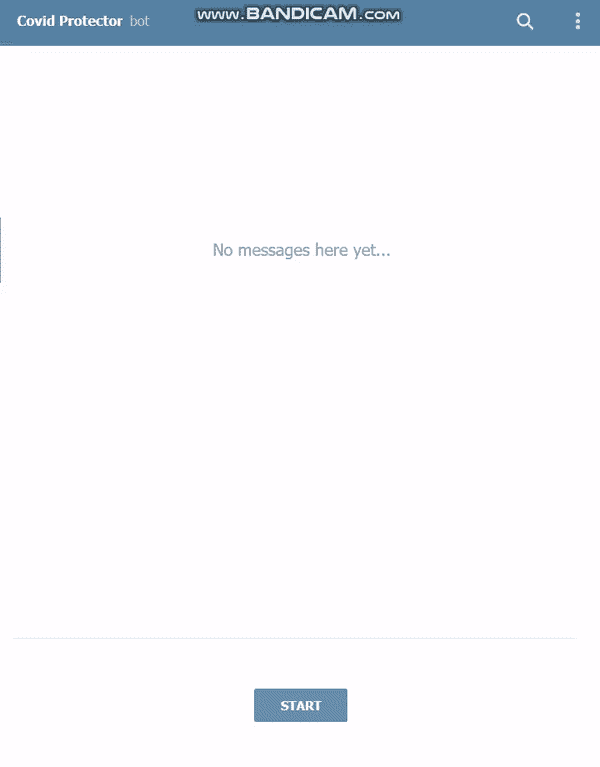

# 使用 Python 构建您的第一个聊天机器人，并将其集成到 Telegram 上

> 原文：<https://betterprogramming.pub/build-your-first-chatbot-with-python-and-integrate-it-on-telegram-39d7e058b709>

## 使用 Python 的自然语言工具包


丹尼尔·科尔派在 [Unsplash](https://unsplash.com?utm_source=medium&utm_medium=referral) 上拍摄的照片

你知道吗？

> “聊天机器人可以削减高达 30%的运营成本。电子商务聊天机器人统计数据显示，企业每年在客户请求上花费约 1.3 万亿美元。在聊天机器人的帮助下，这笔费用可以减少 30%。”——[未来就在眼前——丹妮卡·乔维奇的 37 个有趣的聊天机器人统计数据](https://www.smallbizgenius.net/by-the-numbers/chatbot-statistics/#gref)

几天前，我参加了一个来自 MAD-Alpha 的在线研讨会，在那里我了解了各种类型聊天机器人的开发和部署，如数据驱动聊天机器人、机器学习聊天机器人和通过 Rasa 框架的非常健壮的聊天机器人。在本文中，我将分享开发聊天机器人时所涉及的术语，并向您展示如何开发数据驱动的聊天机器人并将其部署在 [Telegram](https://telegram.org/) 上。

# 什么是聊天机器人？

从本质上来说，聊天机器人是一种电脑程序，它重现并形成人类对话，允许人们与计算机化的小工具合作，就像他们在与一个真实的人交谈一样。聊天机器人可以像用一行反应回答基本查询一样简单，也可以像计算机化的助理一样先进，在收集和处理数据时，它可以学习和发展以响应不断扩展的个性化水平(或者，我们可以说，是一个机器学习机器人)。

公司使用聊天机器人的一些方式有:

*   作为客户支持
*   从企业预订商品

## 聊天机器人的类型

聊天机器人主要有两种:数据驱动的聊天机器人和上下文相关的聊天机器人。

*   在数据驱动的聊天机器人中，机器人分析来自用户问题的关键词，并将关键词与预定选项进行匹配，以提供正确的响应。这些都是用 Python 中的 [NLTK](https://www.nltk.org/) (自然语言工具包)库实现的。
*   上下文聊天机器人要高级得多。它比数据驱动的聊天机器人更好地模拟了接近人类的交互，因为当用户键入一个问题时，机器人会试图学习用户查询背后的意图和情绪。这些聊天机器人利用机器学习来学习并随着时间的推移而前进。

在本文中，我们将基于 Python 中的 NLTK 库构建一个数据驱动的聊天机器人，并将其部署在 Telegram 上，以便与我们的机器人进行对话。

# 聊天机器人的先决条件和术语

## 先决条件

对于任何想做这个聊天机器人的人来说，Python 的基础知识已经足够了。

## 自然语言处理

自然语言处理帮助计算机用人们的语言与他们交流，并扩展其他与语言相关的任务。例如，NLP 使计算机理解文本、听语音和翻译它、测量结论以及找出哪些部分是重要的变得可行。通过使用 NLP，开发人员可以执行诸如文本摘要、命名实体关系、情感分析和语音识别等任务。

# NLTK

NLTK(自然语言工具包)是构建 Python 项目以处理人类语言信息的主要平台。它为超过 50 个语料库和词汇资源提供了易于使用的接口[，例如 WordNet，以及用于分类、标记化、词干化、标记、解析和语义思考的文本处理库的设置，以及工业级 NLP 库的包装器。](http://www.nltk.org/nltk_data/)

## 下载和安装 NLTK

1.  安装 NLTK:运行`pip install nltk`
2.  测试安装:运行`python`，然后键入`import nltk`
    获取特定于平台的指令，阅读[NLTK 文档](https://www.nltk.org/install.html)。

## 安装 NLTK 包

在您的 Python 解释器中，运行以下命令:
`import nltk`并运行`nltk.download()`。这将打开 NLTK downloader，您可以从中选择要下载的语料库、模型和其他数据包。你也可以一次下载所有的包，或者在`nltk.download()`中指定你需要的包作为参数。

## 使用 NLTK 进行文本预处理

文本信息的主要问题是它们都在字符串(一组文本)中。然而，机器学习计算需要一种数值元素向量来执行任务。因此，在我们开始任何 NLP 项目之前，我们必须对其进行预处理，以使其适合工作。基本的文本预处理包括:

*   将整个内容转换为大写**或小写**，目的是计算不会在不同的上下文中处理相同的单词。
*   **记号化**是将字符串的文本转换成记号列表的过程。有一个句子分词器可以用来查找句子列表，还有一个单词分词器可以用来查找字符串中的单词列表。
*   去除噪声将去除所有非标准字母或数字的东西，比如标点符号、多余的空格等。
*   去除**停用词:**停用词是常用词(如*中的*、*中的*、*中的*、中的*等)。)在根据用户查询选择匹配短语时没有什么价值。*
*   **词干化:**是将一个词的派生形式还原为其词干、词根或词根形式的过程。例如，如果我们对以下单词进行词干处理: *walks* ， *walking* ，walked，那么词干单词将是一个单词， *walk* 。
*   **词汇化**:词干的一个变换版本是*词汇化*。这两者之间的显著区别是词干处理在不知道上下文的情况下对单个单词进行操作，并且经常会创建一个不存在的单词。相比之下，在词汇化之后，我们将获得一个在字典中有意义的有效单词。词汇化是基于一个单词的词类，应该确定该词类以获得该单词的正确词汇。词汇化的一个例子是*是*,*am*,*are*是动词 *to be* 的形式；因此，他们的引理是 *be* 。

## 一袋单词

在最初的清理和处理阶段之后，我们需要将文本转换成一个有意义的数字向量(或集群)。根据杰森·布朗利对词汇袋模型的温和介绍，

> 单词包是描述单词在文档中出现的文本表示。它包括两件事:
> 
> 1.已知单词的词汇表
> 
> 2.所有已知单词存在的度量”

在单词袋模型中，文本(如句子或文档)被表示为其单词袋，不考虑语法甚至词序，但保持多样性。使用它的主要原因是检查句子的内容是否与文档相似。

假设词汇表中包含的单词:{ *知道*，*必须*，*做*，*足够* }。而我们有下面这句话:“知道是不够的；我们必须申请。”那么这个词的词包表示将会有结果向量:[1，1，0，1]。

## TF-IDF 方法

使用单词袋模型的主要缺点是，由于词汇的大尺寸，它导致高维特征向量，这导致高度稀疏的向量，因为在对应于句子中出现的单词的维度中存在非零值。

为了克服单词袋的缺点，我们对频率值进行归一化。一种新的方法，TF-IDF(术语频率-逆文档频率)，被发明用于文档搜索和相似性以及信息检索。因此，在每个文档中常见的单词(如 *this* 、 *what* 和【T4 if)排名较低，即使它们可能出现多次，因为它们对该文档没有多大意义。

**TF(词频)**:对一个词在当前文档中出现的频率进行评分。

```
TF = (Number of times term t appears in a document)/(Number of terms in the document)
```

**逆文档频率**:是对单词在文档中出现的频率的评分。

```
IDF = log(N/n), where, N is the total number of documents and n is the number of documents a term t has appeared in.
```

最后，通过取 TF 和 IDF 的乘积值，我们得到 TF-IDF 分数。

```
TF-IDF = TF * IDF
```

举个例子，我们有一个四个单词的文档，其中 *best* 出现了一次。因此，字*最佳*的 TF 为(1/4) = 0.25。
现在假设，我们有五个文档，单词 *best* 出现在其中两个文档中。则 IDF 计算为 log(5/2) = 0.39。因此，TF-IDF 是这些量的乘积:0.25 * 0.39 = 0.0975。

**余弦相似度**

我们应用 TF-IDF 将文档的文本转换成向量空间中的实值向量。我们可以获得余弦相似度来确定向量的相似程度，而不考虑它们的大小。然后，我们可以得到任何一对向量的余弦相似性，方法是取它们的点积，然后除以它们的范数的积。得出矢量间夹角的余弦值。使用下面的公式，我们可以找出任意两个文档 d1 和 d2 之间的相似性，其中 d1、d2 是两个非零向量。

```
Cosine Similarity (d1, d2) =  d1 • d2 / ||d1|| * ||d2||
```

# 聊天机器人创建

现在我们知道了一些聊天机器人创建中使用的术语，并且对自然语言处理过程有了一个大致的概念。我们将在 Telegram 中创建并部署一个聊天机器人，它将为您提供有关冠状病毒症状和预防的信息，并提供有关印度新冠肺炎病例的更新信息。

你可以在我的 [Github 库](https://github.com/ShubhamSood1406/Corona-ChatBot)中找到完整的代码。

在接下来的聊天机器人创建过程中，我使用了 [Jupyter 笔记本](https://jupyter.org/)来编写 Python 代码。我会推荐你使用 Jupyter 笔记本。如果你不想在你的机器上安装 Jupyter，你可以使用 [Google Colab](https://colab.research.google.com/notebooks/intro.ipynb#recent=true) 。

## 导入必要的库

## 文集

在 NLP 中，*语料库*指的是文本的集合。语料库包含用户查询匹配的文本，聊天机器人试图获取最可靠的句子作为对用户的响应。在我们的例子中，语料库将是来自维基百科页面的关于新冠肺炎的信息。我们将把信息存储在`[content.txt](https://github.com/ShubhamSood1406/Corona-ChatBot/blob/master/content.txt)`文件中。

## 读取数据

我们将从`content.txt`文件中读取整个文本，并应用该句子:

## 关键词匹配

我们将定义问候及其响应，以便我们的聊天机器人可以从预定义的列表中匹配它，并在开始和结束对话时适当地问候用户。

让我们举一个`sent_tokens`和`word_tokens`的例子:

```
**sent_tokens[:1]**
['COVID-19 affects different people in different ways.']**word_tokens[:7]** ['COVID-19', 'affects', 'different', 'people', 'in', 'different', 'ways']
```

## 预处理原始文本

在下面的代码片段中，函数`Normalize` 将对文本进行标记化，然后降低其大小写并删除标点符号，在该函数之后，`LemTokens` 将对每个标记进行词汇化。

## 生成响应

为了从聊天机器人生成对用户查询的响应，我们将使用文档相似性:TF-IDF 矢量器和余弦相似性。

在下面的代码片段中，`response`函数将获取从`bot_initialize`函数传递来的`user_response`，并将其附加到语料库中，以对文本进行矢量化，并找到`user_response`和语料库中的单词之间的相似性。如果`user_response`和语料库没有相似性，聊天机器人将返回`I am sorry! I don’t understand. Please rephrase your query.` ，否则将从语料库中返回与`user_response` *匹配度第二高的`cosine_similarity` 的句子。*

下面的`bot_initialize`函数将从电报中获取用户查询的输入，并开始处理它以生成可信的响应。我们还应该让我们的聊天机器人变得复杂，这样它就可以在对话开始和结束时问候用户。

到目前为止，我们让我们的聊天机器人响应用户的查询，但是机器人从哪里得到查询来做出响应呢？我们现在要将我们的聊天机器人与电报集成，这样用户就可以通过电报与我们的机器人交谈。

## 激活数据驱动的电报机器人

要在 Telegram 上激活和部署您的聊天机器人，您必须满足一些初始先决条件。

1.  首先，你要对[电报](https://telegram.org/)有个交代。
2.  在 Telegram 上创建您的帐户后，搜索[机器人父亲](https://web.telegram.org/#/im?p=@BotFather)，并按照机器人父亲的指示创建您的聊天机器人。成功创建聊天机器人后，机器人父亲会给你一个令牌来授权机器人，并向机器人 API 发送请求。你应该会得到这样的消息:`Use this token to access the HTTP API:`
    `1245993642:AAGc_EZbIoHag4SXXXXXXXXXXXXXX`。
3.  成功获得电报机器人 API 后，在`bot_initialize`函数后编写以下代码片段。

你可以复制这几行代码，让你的聊天机器人通过 Telegram 工作。您可以阅读 [Telegram Bot API 文档](https://core.telegram.org/bots/api) ，深入了解如何为您的 Telegram 聊天机器人添加更多功能。

最后，我们通过 NLTK 制作了一个聊天机器人，当 Jupyter 笔记本运行在我们的系统上时，它可以通过电报与我们交谈。



你可以在 Telegram 上看到我和聊天机器人的对话。它几乎能够找到用户响应和语料库之间的相似性，并尝试用最大相似性的句子进行回复。您还可以看到，当我发送**“okay*”**bot 无法从问候的语料库中找到任何合适的匹配；所以，它在回复，“对不起！我不理解你。请重新表述您的查询。”***

# ***结论***

***作为结论，我想说的是，上面的聊天机器人只是为了让你理解 NLP 的概念，数据驱动的聊天机器人被认为是聊天机器人的基础。此外，为了更可靠地开发聊天机器人，人们应该了解机器学习聊天机器人。你也可以为人工智能聊天机器人考虑一个类似 [Rasa](https://rasa.com/) 的框架。***