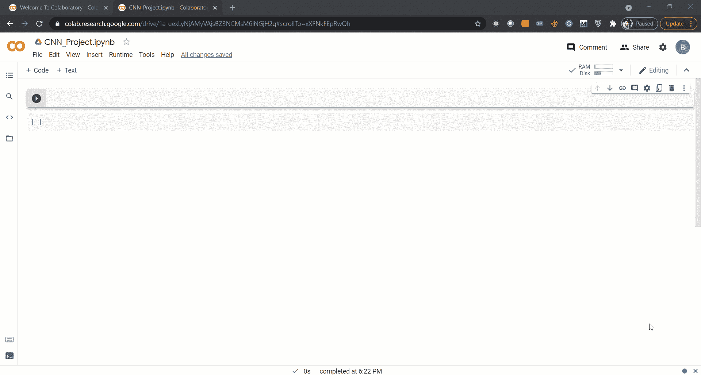

# 用 14 行 Python 代码构建您的第一个卷积神经网络

> 原文：<https://betterprogramming.pub/build-your-first-convolutional-neural-network-in-14-lines-of-python-200af0fb6b13>

## 你只需要一个浏览器就可以开始了


照片由 [**赖爷**](https://www.pexels.com/@ketut-subiyanto?utm_content=attributionCopyText&utm_medium=referral&utm_source=pexels) 发自 [**像素**](https://www.pexels.com/photo/content-asian-children-building-wooden-tower-on-floor-at-home-4473569/?utm_content=attributionCopyText&utm_medium=referral&utm_source=pexels)

当我们谈论面罩检测、自动驾驶汽车、对象分割、异常检测时，任何需要相机捕捉场景并根据相机拍摄的镜头做出主动或被动决定的事情，我们都需要一个可以处理图像的神经网络。如果我们需要一个可以处理图像的神经网络，我们需要卷积神经网络。

本文将介绍使用 Python 库 Keras 创建卷积神经网络。我们将研究如何添加不同的层来构建我们的第一个卷积神经网络。

好的一面是，你不需要一个高端系统——我们将使用 Google Colab 来构建我们的卷积神经网络。所有的库都是在 Google Colab 中预装配置的，安装部分就不用担心了。

如果你的机器里安装了 Jupyter 笔记本，你也可以跟着去那里。Google Colab 提供了 Jupyter 笔记本的托管版本。

# 启动 Google Colab

要启动 Google Colab，请在您选择的浏览器中键入以下 URL，然后使用您的任何 Google 帐户登录。要了解更多关于 Google Colab 的工作原理，请查看我的文章[。](https://towardsdatascience.com/this-free-gpu-enabled-python-ide-for-your-data-science-projects-acc50dd8d1dd)

在浏览器中键入网址[https://colab.research.google.com/](https://colab.research.google.com/)，如图所示:


# 导入库

我们将使用 Python 编程和 Keras 库来构建我们的网络。

如果你在 Google Colab 上，那么你也可以使用免费的 GPU 功能——只需点击运行时并选择 GPU，如下所示。



选择 GPU 环境后，让我们导入必要的库:

```
from tensorflow.keras import backend as K
from tensorflow.keras.models import Model
from tensorflow.keras.models import Sequential
from tensorflow.keras.layers import Input, Dropout, Flatten, Conv2D, MaxPooling2D, Dense, Activation
```

键入这些库后，按`shift+enter`运行单元。如果您在 Google Colab 上，该单元将成功执行，但如果您正在使用您的机器，您将需要安装 TensorFlow Keras。

这些库导入模型、图层类型、删除函数、展平函数以及我们将用于模型构建的激活函数。

现在，让我们从模型构建开始。

# 构建卷积神经网络

对于本文，我们将构建一个顺序模型，其中层是一个接一个添加的——一个简单的层列表。

键入以下代码行来定义我们的`Sequential`网络:

```
model=Sequential()
```

现在，我们需要在这个空模型中添加一组层来完成它。让我们添加第一个卷积层。第一层包含模型的输入。我们需要在第一层定义图像的输入尺寸。我拍摄了尺寸为 200 x 200 的照片:

```
IMAGE_SIZE=[200,200]model.add(Conv2D(16,kernel_size=(3,3),input_shape=IMAGE_SIZE + [3]))
```

好了，我们刚刚定义了第一个输入卷积层。现在，对于任何卷积神经网络，我们遵循一种称为 CRP 的模式。CRP 代表:

> 卷积 Relu 池

最佳实践是将这组图层添加到模型中的输入图层之后，这将获得最佳效果。此外，除了这些层，我们还可以使用丢弃层来解决过度拟合问题:

```
model.add(Conv2D(32, kernel_size=(3,3), activation="relu")) 
model.add(MaxPooling2D(pool_size=(2,2)))
model.add(Dropout(0.30))
```

这里，我们需要定义内核大小。内核也称为旋转窗口，负责检测不同的形状。因此，我们将定义旋转窗口的数量和旋转窗口的大小。

现在，让我们添加更多具有不同内核数的类似层。

```
model.add(Conv2D(64, kernel_size=(3,3), activation="relu"))
model.add(MaxPooling2D(pool_size=(2,2)))
model.add(Dropout(0.35))model.add(Conv2D(128, kernel_size=(3,3), activation="relu"))
model.add(BatchNormalization()) 
model.add(Dropout(0.45))
```

# 将这些点连接起来

卷积层为我们提供了像素更少的图像输出。为了得到作为类的数量的最终结果，我们需要将图像展平成一维向量。我们现在将根据要预测的类的数量为最后的层添加最终的激活函数。

```
model=Sequential()model.add(Conv2D(16,kernel_size=(3,3),input_shape=IMAGE_SIZE + [3]))model.add(Conv2D(32, kernel_size=(3,3), activation="relu")) 
model.add(MaxPooling2D(pool_size=(2,2)))
model.add(Dropout(0.30))model.add(Conv2D(64, kernel_size=(3,3), activation="relu"))
model.add(MaxPooling2D(pool_size=(2,2)))
model.add(Dropout(0.35))model.add(Conv2D(128, kernel_size=(3,3), activation="relu"))
model.add(BatchNormalization()) 
model.add(Dropout(0.45))model.add(Flatten())
model.add(Dense(64, activation="relu"))
model.add(Dense(num_classes, activation="softmax"))
```

# 结论

呜哇！我们刚刚制作了第一个卷积神经网络。好消息是，我们不需要花费不必要的时间来设置环境——这都要感谢 Google Colab。

在接下来的文章中，我将介绍训练模型的步骤，并将其与网络摄像头配合使用。

我希望你喜欢这篇文章。敬请期待下一期！

感谢阅读！